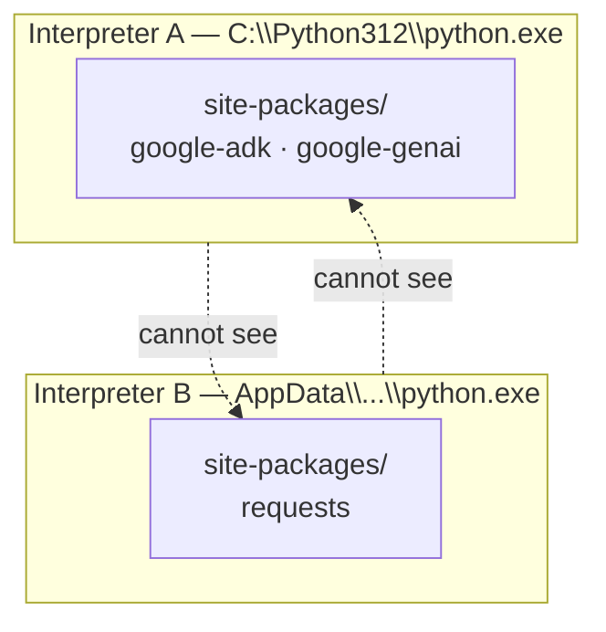

# 1.1 — Why one tool must own the environment

## One-line answer

A "Python environment" is nothing more than **one interpreter plus one folder of installed
packages**, and almost every baffling `ModuleNotFoundError` happens because the interpreter that ran
your code and the folder that received the package belonged to two different environments.

---

## The story

Someone joins a team on a Monday. Their first task is small and friendly: run a script the team has
used for a year, `report.py`, and confirm it still prints the same numbers as last week.

They open a terminal and type `python report.py`.

```text
ModuleNotFoundError: No module named 'pandas'
```

Fair enough. They install it: `pip install pandas`. A progress bar fills, and the terminal says
`Successfully installed pandas-3.0.1`. They run the script again.

```text
ModuleNotFoundError: No module named 'pandas'
```

They stare at it. They run `pip install pandas` a second time — `Requirement already satisfied`.
They can *see* the package. They open a file explorer and find the folder it went into. It is
there. It is definitely there. The script still cannot see it.

They lose the afternoon. Around five o'clock a colleague leans over, types one command, and reads
the output aloud: there are four Pythons on this laptop. One came from an installer downloaded two
years ago. One came bundled with an editor. One came from a data-science distribution nobody
remembers installing. One is the shim the operating system puts in place so that typing `python`
opens the app store.

`pip` belonged to the third. `python` was the fourth.

Nothing was broken. Nothing was misconfigured. Two words on the same keyboard were pointing at two
different machines that happened to share a disk.

That afternoon is the single most common way a first month disappears. Today exists so that it
never happens to you — not on Day 5 when you install a framework, and not on Day 71 when the thing
that fails is a browser sandbox and you have real work to lose.

---

## The idea in plain language

Let us build the vocabulary from nothing. There are three words, and once you have all three the
trap becomes obvious rather than mysterious: **interpreter**, **site-packages**, and **PATH**.

**An interpreter is a program.** `python.exe` — or `python` on macOS and Linux — is an executable
file sitting somewhere on your disk, exactly like a game or a text editor is a file sitting
somewhere on your disk. It reads a `.py` file and carries out the instructions inside it. You can
have as many of these programs on one machine as you like, in as many folders as you like, and they
neither know nor care about each other.

This is the first fact people get wrong, and it is worth saying bluntly: **"Python" is not a thing
installed on your computer. It is a file, and you can have twelve of them.**

**Every interpreter owns exactly one folder of packages, called `site-packages`.** When you install
a library — anything at all — the files land in a folder that sits next to *one specific*
interpreter. There is no global, shared, machine-wide shelf of libraries. Interpreter A cannot see
interpreter B's `site-packages`, in the same way your documents folder cannot see mine.



**`PATH` decides which one you get when you type a word.** When you type `python` and press Enter,
your shell does not search your whole disk. It walks a list of folders — that list is an
*environment variable* named `PATH` — from top to bottom, runs **the first file it finds with that
name**, and stops looking.

*(An environment variable is simply a named piece of text that your shell keeps in memory and hands
to every program it starts. `PATH` is one of them, and the text it holds is a list of folder
names.)*

Now the whole trap fits into one sentence:

> `pip` is itself a program on `PATH`, and it installs into the `site-packages` of **whichever
> interpreter that particular `pip` belongs to** — which is not necessarily the interpreter that the
> word `python` resolves to.

The person in the story had a `pip` from the third Python sitting earlier on `PATH` than the `pip`
from the fourth. Both commands succeeded perfectly. They were simply talking to different machines.

**A virtual environment** — the phrase you will meet everywhere — is the fix the Python world
settled on. It is not magic, and it is not a container. It is a *folder* holding a link to one
interpreter plus that interpreter's own private `site-packages`. "Activating" it means temporarily
putting that folder at the front of `PATH`, so that `python` and `pip` both resolve to the matched
pair inside it. One project, one folder, one interpreter, one set of packages, no crosstalk.

And that is the idea this entire day stands on: **something must own the environment.** If nothing
owns it, `PATH` does — and `PATH` is a list of accidents accumulated by every installer you have
ever run. In Sutra the owner is a single program called `uv`, which you meet in
[1.3](1.3-uv-the-one-binary.md). It creates the environment, installs into it, records exactly what
it installed, and runs your code inside it. One owner, four jobs, no ambiguity.

---

## Why Sutra needs it

This is not a Day 0 nicety that you outgrow. Four specific places where it decides whether you have
a good evening:

- **Day 5 — the first ADK agent.** That day pins `google-adk` and a specific Gemini model, and the
  whole point of pinning is reproducibility. If a second interpreter with a different ADK version is
  reachable on your machine, you will spend the evening arguing with a 1.x-versus-2.x API
  difference that does not exist in the version you *think* you are running. The plan's §5.1 lists
  four breaking changes between ADK 1.x and 2.x; every one of them is invisible until you are sure
  which version imported.
- **Day 9 — four providers, one agent.** That day installs `litellm` so the same agent can talk to
  Gemini, Groq, OpenRouter and a local model. Provider SDKs pull large dependency trees. Installing
  one into the wrong interpreter is not a five-second mistake to undo.
- **Day 23 — testing agents.** `./m check` runs `pytest`. If `pytest` and your code resolve to
  different environments, your tests import a *different copy* of your own package than the one you
  just edited — and you get a green suite for code you did not write. That failure is far worse than
  a red one, because you believe it.
- **Day 86 — the container.** The day you build a Dockerfile, the question "which interpreter runs
  this, and where did its packages go?" stops being a laptop question and becomes the difference
  between an image that starts and an image that crash-loops.

There is a bigger reason underneath all four. The plan's Principle 7 is *never invent a version
number*: exact pins, a committed lockfile, a dated row in `docs/PACKAGES.md`. **A pin is meaningless
if you cannot say which environment it applies to.** Reproducibility starts here or it does not
start.

---

## The mechanism

You are going to look at your own machine and count. Open **Git Bash** — you will install it in
[1.2](1.2-git-and-the-unix-shell.md) if you do not have it yet. On macOS or Linux, your normal
terminal is fine.

```bash
which -a python python3 pip pip3
```

**Line by line:**

- `which` — asks the shell "if I typed this word, which file would actually run?" It answers by
  walking `PATH` in exactly the order the shell would.
- `-a` — **all** matches, not just the winner. This is the flag that makes the command useful:
  without it you see the one that wins and remain blissfully unaware of the three queued behind it.
  The winner is printed **first**.
- `python python3 pip pip3` — four separate words, because on a real machine they routinely resolve
  to different places. `python3` existing while `python` does not is normal on macOS and Linux;
  `pip` pointing somewhere `python` does not is precisely the bug from the story.

On Windows there is a second, sharper tool:

```bash
py -0p
```

**Line by line:**

- `py` — the **Python launcher for Windows**, a small dispatcher installed by the python.org
  installer. Its entire job is to find Pythons for you.
- `-0` — "list the interpreters you know about". That is a zero, not a capital O.
- `p` — appended to `-0`, adds the full **p**ath of each one. `py -0` alone gives you names;
  `py -0p` gives you addresses, which is what you actually need.
- If this prints `bash: py: command not found`, you have no python.org install. That is a *cleaner*
  starting point, not a problem.

Now the decisive question. Not "is the package installed?" but "installed *where*?":

```bash
python -c "import sys; print(sys.executable); print(sys.prefix)"
```

**Line by line:**

- `python -c "<code>"` — run the string as a program and exit. No file needed. `-c` for
  **c**ommand.
- `import sys` — `sys` is the standard-library module that describes the running interpreter
  itself. Nothing to install; it is part of Python.
- `sys.executable` — the **full path of the interpreter currently running this line**. This is
  ground truth. Not what you typed, not what you assume: the actual file on disk.
- `sys.prefix` — the root of the environment this interpreter belongs to. Its `site-packages` lives
  underneath. Inside a virtual environment, `sys.prefix` points at that environment's folder;
  outside one, it points at the base installation. Comparing the two is how you tell where you are.
- The two `print` calls are separated by `;` so that a single `-c` string runs both statements.

And the same question, asked of `pip`:

```bash
pip -V
```

**Line by line:**

- `-V` — print pip's version **and**, crucially, the path it is operating from. The output ends
  with something like `from C:\...\site-packages\pip (python 3.11)`. That parenthesised version and
  that path together tell you which interpreter this `pip` installs *for*.
- Compare it against `sys.executable` above. **If those two disagree, you have just reproduced the
  story's bug on your own machine** — and you now know how to detect in ten seconds what cost
  somebody an afternoon.

---

## When it breaks

Here is the failure in full, as it actually appears:

```text
$ pip install google-genai
Requirement already satisfied: google-genai in c:\users\me\appdata\roaming\python\python311\site-packages (2.19.0)

$ python check.py
Traceback (most recent call last):
  File "check.py", line 1, in <module>
    from google import genai
ModuleNotFoundError: No module named 'google'
```

**What the traceback is telling you.** Read the two paths, not the words. `pip` reported success
into a `python311` folder. Now ask `python` who it is:

```text
$ python -c "import sys; print(sys.executable)"
C:\Users\me\AppData\Local\Programs\Python\Python312\python.exe
```

`311` versus `312`. Two interpreters. `pip` did its job perfectly and `python` did its job
perfectly; they were simply not the same environment.

**`ModuleNotFoundError` almost never means "the package is missing from your computer". It means
"the package is missing from *this* interpreter."** Those are very different sentences, and only one
of them tells you what to do next.

**The smallest fix**, and the one to reach for any time you are unsure:

```text
$ python -m pip install google-genai
```

`python -m pip` means "ask *this specific interpreter* to run its own pip module". It removes the
`PATH` lottery entirely, because the interpreter is named explicitly and pip is found *through* it
rather than *beside* it. If you take exactly one habit from this part: **never type bare `pip`
again.**

In Sutra you will not type either, because `uv` handles installation itself
([1.3](1.3-uv-the-one-binary.md)) — but you will meet machines that are not this project, and this
is the twenty-second diagnosis for all of them.

---

## In production

This stops being a laptop annoyance and becomes an outage the moment code leaves your machine.

**The same bug, wearing a suit.** A service works locally and crashes on deploy with
`ModuleNotFoundError`. The Dockerfile ran `pip install -r requirements.txt` as `root`, and the
container starts the app as an unprivileged user with a different `PATH` — or the base image ships
its own system Python and the app runs under a second one it installed later. Identical mechanism,
different building. The production version of `which -a python` is:

```text
$ docker run --rm sutra:latest python -c "import sys; print(sys.executable)"
```

and it is the first thing to run when a container claims a module is missing. You will build that
image on **Day 86**, and this is the diagnostic you will want.

**Why professionals never install into the system Python.** On Linux distributions the operating
system is itself written partly in Python, and the package manager depends on specific versions of
specific libraries in the system interpreter's `site-packages`. A `sudo pip install` into it can
upgrade a dependency out from under the package manager and leave a machine that can no longer
install software. Modern Python refuses by default and prints
`error: externally-managed-environment` — a guard rail added precisely because so many people broke
their machines this way. **The rule: the system Python belongs to the operating system. Your project
gets its own.**

**What the professional's version looks like.** In a serious codebase the environment is never
described in prose ("install the ADK and the Gemini SDK"). It is *declared in a file and locked*: a
manifest listing direct dependencies with exact versions, and a lockfile pinning the full transitive
tree with hashes. Anyone, anywhere, on any machine materialises the identical environment from those
two files. That is what you build in [2.4](../02-repo-skeleton/2.4-pyproject-and-the-lockfile.md), and it is why
Principle 7 exists.

**What degrades at scale.** With one project, ambiguity costs an afternoon. With forty services, an
unowned environment costs you the ability to answer *"what is actually running in production right
now?"* — and that question arrives during incidents, during security audits (which version has the
CVE?), and during compliance reviews. The whole supply-chain-security discipline rests on a
machine-readable, exact answer, and a `PATH` accident cannot give one. Sutra meets this directly on
**Day 92**, the hardening pass before the repo goes public.

**The review comment a senior engineer leaves.** On a pull request containing `pip install foo` in a
CI script or a Dockerfile: *"Pin this and install it through the project's lockfile — an unpinned
install means CI can pass today and fail tomorrow with no commit in between."* The unstated point is
that an unpinned build is not reproducible, and a build you cannot reproduce is one you cannot roll
back to.

**The interview question.** *"A developer tells you `pip install requests` succeeded but their
script still raises `ModuleNotFoundError`. Walk me through your diagnosis."* Nobody is testing
whether you know the word "virtualenv". They want to hear you (1) ask what `sys.executable` prints,
(2) ask what path `pip -V` reports, (3) name the mismatch, (4) reach for `python -m pip` — and
ideally (5) say that the real fix is for the project to own its environment rather than relying on
`PATH`. Answering with the mechanism instead of the incantation is the entire difference between
sounding junior and sounding senior.

---

## Check yourself

Run this now, **before** installing anything:

```bash
which -a python python3 pip pip3 2>/dev/null; echo "---"; py -0p 2>/dev/null || echo "no py launcher"
```

Write the answer down somewhere outside this repo. You want to know what your machine looked like
*before* today, so that if something is strange on Day 40 you can tell what changed.

**Answer out loud, without scrolling up:**

> I type `pip install google-genai` and it succeeds. I type `python` and `from google import genai`
> fails. Explain exactly what happened, using the words *interpreter*, *site-packages* and *PATH* —
> then give the one command that would have avoided it.

If you cannot say it in your own words yet, read *The idea in plain language* again. The next
sixteen parts all stand on this one.

---

**Next:** [1.2 — Git, and why a Unix shell on a Windows machine](1.2-git-and-the-unix-shell.md)
