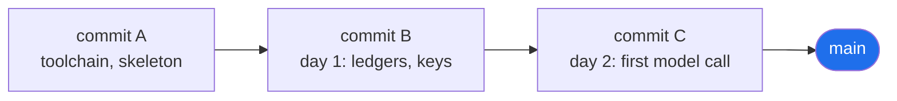

# 1.2 — Git, and why a Unix shell on a Windows machine

## One-line answer

Git is a machine that records **snapshots of a folder and the links between them**, and installing
it on Windows also hands you **Git Bash** — a Unix shell — which is why every command in these
ninety-seven days can be written once and run everywhere.

---

## The story

A team of three is building something over a weekend. On Saturday evening one of them gets it
working, and messages the group: *"done, sending the folder"*. A zip arrives named
`project_final.zip`. On Sunday morning a second person fixes a bug and sends back
`project_final_v2.zip`. By Sunday afternoon there is a `project_final_v2_FIXED.zip`, a
`project_final_v2_FIXED_use_this_one.zip`, and a long argument about which of them contains the
change to the config file.

Nobody is being careless. Every one of those zips was a reasonable act. The problem is that a zip
file records **a state** and nothing else: it cannot tell you what changed, who changed it, why, or
what it was based on. Three people each holding a different state, with no way to reconcile them, is
not a version control problem — it is a *lack* of one.

Now watch the other version of Sunday afternoon. Each person types `git commit` when a piece works.
Each commit records the whole folder plus a pointer to the commit it came from and a sentence saying
what it is. When two people change the same file, the tool shows both changes side by side and asks
which one wins. Nothing is lost, nothing is guessed at, and the argument becomes a two-minute
conversation with the evidence on screen.

That is the whole of git. Everything else — branches, remotes, the commands you have not met yet —
is bookkeeping on top of *snapshots plus links*.

---

## The idea in plain language

**Git is a version control system.** A *version control system* is a program that records the state
of a folder over time and lets you move between those states. That is the whole category.

Git records three things, and the vocabulary is worth having exactly right, because most confusion
with git is vocabulary confusion:

- **A repository** — often shortened to *repo* — is a folder that git is watching, plus a hidden
  sub-folder called `.git` where git keeps its records. Delete `.git` and you have an ordinary
  folder again with no history. Nothing is stored on anyone else's computer unless you deliberately
  push it there. You will look inside `.git` in [2.3](../02-repo-skeleton/2.3-git-init-and-what-a-repo-is.md).
- **A commit** is one snapshot: the full content of every tracked file at one moment, plus who made
  it, when, a message saying what it is, and — this is the important part — **a pointer to the
  commit that came before it**. Those pointers chain the snapshots into a history you can walk
  backwards.
- **A branch** is nothing but a movable *name* pointing at one commit. `main` is a branch. Making a
  new branch does not copy your files; it writes down a second name pointing at the same commit.
  This is why branching in git is instant, and why people who learned version control before git
  find it suspicious.



One more piece of vocabulary, because it is the one that trips people: a file in a git repo is in
one of three states. **Untracked** — git can see it but has never been told to care. **Tracked and
modified** — git knows it and notices it has changed. **Staged** — you have said "this change goes
in the next commit". `git add` moves a change into the staged pile; `git commit` turns the staged
pile into a snapshot. The staging step exists so you can commit *half* of what you did, which is
occasionally exactly what you want.

### Now the second half: why a Unix shell

A **shell** is the program that reads what you type and runs it. It is not the window — the window
is a *terminal*. The terminal draws the text; the shell interprets it. You can run different shells
in the same terminal window, which is why "open a terminal" is a slightly incomplete instruction
and "open Git Bash" is a complete one.

Windows ships two shells of its own: `cmd.exe` and PowerShell. They are perfectly good. They are
also **grammatically different from the shell that essentially all technical documentation is
written for**, which is `bash` or something close to it. Not slightly different — different in ways
that make a copied command silently fail:

| What you want | Git Bash (used in every document here) | PowerShell |
| --- | --- | --- |
| make nested folders | `mkdir -p a/b/c` | `New-Item -ItemType Directory -Force a/b/c` |
| create an empty file | `touch f.py` | `if (-not (Test-Path f.py)) { New-Item -ItemType File f.py }` |
| run B only if A succeeded | `cmd1 && cmd2` | `cmd1; if ($?) { cmd2 }` |
| an environment variable | `$GOOGLE_API_KEY` | `$env:GOOGLE_API_KEY` |
| set one for a single command | `KEY=v cmd` | *(no equivalent — set it first)* |
| discard output | `2>/dev/null` | `2>$null` |
| delete a folder tree | `rm -rf folder` | `Remove-Item -Recurse -Force folder` |

`mkdir -p a/b/c` in PowerShell does not create three nested folders. Depending on the version it
creates a folder literally named `-p`, or errors. That is the shape of the problem: not a loud
failure, a quiet wrong thing.

**Git Bash is the way out, and it arrives free.** The Windows installer for git bundles a small
Unix-like environment — bash itself, plus `grep`, `sed`, `find`, `curl`, `ssh` and the rest of the
standard toolkit. Install git and you have both the version control system and the shell that every
command in these documents assumes. That is why this part covers two subjects that sound unrelated:
on Windows they are one download.

> 💡 **The mental model:** the *terminal* is the window; the *shell* is the language spoken in it.
> Git Bash lets a Windows machine speak the same language as the documentation, the CI runner, and
> the container Sutra will eventually ship in.

---

## Why Sutra needs it

- **Every day from Day 1 onward ends in a commit.** Principle 2 is *one day, one document, one
  commit* — the history is the record of the curriculum, and `./m done N`
  ([3.4](../03-the-m-driver/3.4-the-done-gate.md)) refuses to run until the day's checklist is ticked and then
  commits for you. Without git there is no "done".
- **Principle 9: secrets never touch git**, because in **Phase 14 (Day 93) this repository goes
  public.** That is not a hypothetical. Every `.gitignore` decision you make in
  [2.2](../02-repo-skeleton/2.2-gitignore-before-secrets-exist.md) is a decision about what a stranger will be
  able to read.
- **`./m` is a bash script.** Everything in [section 3](../03-the-m-driver/3.1-set-euo-pipefail.md) —
  `set -euo pipefail`, the `case` dispatcher, the gates — is bash. On Windows that runs under Git
  Bash and nowhere else.
- **Day 86 builds a container.** The commands inside a `Dockerfile` run in a Linux shell. Practising
  in Git Bash for eighty-six days means the day you write `RUN mkdir -p /app/data` you already know
  what it does.
- **The repo is the memory, not the chat.** The plan's second commitment only works if the history
  is honest and complete — a stranger, or you six months from now, should be able to read
  `git log` alongside `docs/PROGRESS.md` and reconstruct the whole path.

---

## The mechanism

### Install git

Download the installer from the official site — `https://git-scm.com/downloads` — and run it. The
installer asks a lot of questions; three of them matter, and the defaults for those three are
correct:

- **"Adjusting your PATH environment"** → *Git from the command line and also from 3rd-party
  software*. This is the middle option and the default. It puts `git` on `PATH`
  ([1.1](1.1-why-one-tool-owns-the-environment.md)) without dragging the whole Unix toolkit into
  every other program's `PATH`.
- **"Configuring the line ending conversions"** → *Checkout Windows-style, commit Unix-style line
  endings*. Text files on Windows end lines with two invisible characters (`\r\n`); everywhere else
  uses one (`\n`). This setting stores the one-character version in git and hands you the
  two-character version on disk, so your commits look identical to a colleague's on Linux.
- **"Choosing the default behavior of `git pull`"** → *fast-forward or merge* (the default). You
  will not pull anything for a while; leave it.

When the installer finishes, open **Git Bash** from the Start menu — not Command Prompt, not
PowerShell. You should get a window with a prompt ending in `$`.

### Confirm it, and tell git who you are

```bash
git --version
git config --global user.name "Your Name"
git config --global user.email "you@example.com"
git config --global init.defaultBranch main
```

**Line by line:**

- `git --version` — prints the version and, more importantly, proves that the word `git` resolves to
  something inside *this* shell. It printed `git version 2.54.0.windows.1` on the machine this
  document was written on; yours may differ and that is fine — git is stable across versions in
  everything this curriculum does.
- `git config --global user.name` — every commit is stamped with a name and an email. This is not
  authentication; it is a label. Git refuses to commit without them, which is a good refusal: an
  unattributed history is much less useful than an attributed one.
- `user.email` — same. If you would rather not publish a personal address in a public repo, use the
  no-reply address your git host offers; the setting is a label, and any string is accepted.
- `--global` — writes to `~/.gitconfig`, your user-level settings, rather than to this one
  repository. Omit it later if a specific repo needs a different identity.
- `init.defaultBranch main` — the name git gives the first branch in a new repository. Setting it
  explicitly means `git init` in [2.3](../02-repo-skeleton/2.3-git-init-and-what-a-repo-is.md) will not print a
  paragraph of advice at you about the default, and it matches what every host expects.

### Confirm the shell is actually bash

```bash
echo "$SHELL"; echo "$BASH_VERSION"; uname -s
```

**Line by line:**

- `echo "$SHELL"` — `$SHELL` is an environment variable holding the path of your login shell.
  Inside Git Bash it prints something ending in `/usr/bin/bash`. The quotes matter: they keep the
  value as one word even if it contains spaces, which is a habit worth building now rather than
  after it bites.
- `echo "$BASH_VERSION"` — set only by bash itself. If this line prints an empty line, you are not
  in bash, whatever the window is called.
- `uname -s` — prints the kernel name. In Git Bash you get something beginning `MINGW64_NT`, which
  is the name of the small Unix-compatibility layer git ships. Seeing `MINGW64` is the confirmation
  you want: it means Unix-shaped commands will behave Unix-shaped.

### Prove the difference is real

```bash
mkdir -p demo/a/b/c && find demo -type d && rm -rf demo
```

**Line by line:**

- `mkdir -p demo/a/b/c` — `-p` means *make parent directories as needed*, and do not complain if
  they already exist. This is the flag that lets a document say "create this whole tree" in one
  line.
- `&&` — run the next command **only if the previous one succeeded**. Bash's `&&` chains on
  success; a plain `;` would chain regardless. Using `&&` in a document means a failure stops the
  sequence instead of running the next step against a broken state.
- `find demo -type d` — walk the tree and print only the directories, so you can see all four levels
  were created. `-type d` filters to directories; `-type f` would give files.
- `rm -rf demo` — clean up. `-r` recurses into the folder, `-f` does not ask for confirmation.
  Treat this pair with respect; it is the command with the shortest distance between a typo and a
  bad afternoon.

---

## When it breaks

**Wrong shell.** You copy a command from a day document into PowerShell:

```text
PS C:\Users\me\sutra> mkdir -p sutra/agents

    Directory: C:\Users\me\sutra

Mode                 LastWriteTime         Length Name
----                 -------------   ------ ----
d----          23-08-2026    01:14                -p
```

Read the last line. PowerShell created a folder **named `-p`**, and did not create
`sutra/agents` at all. `mkdir` in PowerShell is an alias for `New-Item -ItemType Directory`, which
has no `-p` flag and treated it as a name. Nothing errored. You have a junk folder and a missing
folder, and the next command will fail somewhere unrelated. **The fix: open Git Bash.** Remove the
junk with `Remove-Item -Recurse -Force .\-p` if you are still in PowerShell.

**Git without an identity.** The very first commit on a fresh machine:

```text
$ git commit -m "day-00: toolchain, skeleton, ./m"
Author identity unknown

*** Please tell me who you are.

Run

  git config --global user.email "you@example.com"
  git config --global user.name "Your Name"

to set your account's default identity.
Omit --global to set the identity only in this repository.

fatal: unable to auto-detect email address (got 'me@LAPTOP.(none)')
```

This one is friendly — it tells you the fix. Run the two lines it printed. The reason git refuses
rather than guessing is that a commit's author is part of the commit's identity; inventing one would
silently pollute a permanent record.

**`git` not found in Git Bash.** If `git --version` prints `bash: git: command not found` *inside
Git Bash*, the installation is broken rather than a `PATH` problem — Git Bash comes *from* git, so
the shell existing without the command means an interrupted install. Reinstall.

---

## In production

**Commit messages are the interface to your history.** `git log --oneline` is read far more often
than any individual diff, and a log full of `fix`, `wip`, `update` is a log nobody can use. Sutra's
convention is fixed by the plan's §17.5: `day NN: <title> — closes <IDs>`. That is deliberate — six
months from now, "which day introduced the quota router?" is answerable with
`git log --oneline --grep OPS-12` instead of a manual search. A commit message is documentation with
a permanent address; treat it as such.

**A secret committed once is committed forever.** Deleting a file in a later commit does not remove
it from history — the earlier snapshot still contains it, and anyone who clones the repository gets
the whole chain. This is why [2.2](../02-repo-skeleton/2.2-gitignore-before-secrets-exist.md) writes `.gitignore`
**before** any key exists, rather than after, and why the professional response to a leaked
credential is always *rotate it*, never *delete the file*. History rewriting tools exist, but they
change every commit hash after the leak, which breaks everyone else's clone.

**Line endings are a real production problem, not a curiosity.** A shell script committed with
Windows line endings fails inside a Linux container with an error that names a line number and looks
like a syntax error:

```text
/app/entrypoint.sh: line 2: $'\r': command not found
```

The `\r` is the invisible second character. That is why the installer setting above matters, and why
serious repositories add a `.gitattributes` file forcing `* text=auto` and `*.sh text eol=lf`. You
will meet this on **Day 86** if `./m` ever goes into a container image.

**What a senior engineer says in review.** On a pull request with one enormous commit touching
forty files: *"Split this — I can't review it, and neither can `git bisect`."* `git bisect` is a
binary search over history for the commit that introduced a bug; it only works if commits are small
enough that "this one" is a useful answer. Principle 2's *one day, one commit* is not tidiness for
its own sake — it is the granularity that makes history *searchable*.

**What changes at scale.** On a team, the shell question becomes a policy question: CI runs bash, so
any script that only works in PowerShell cannot be tested automatically, and any script that only
works in Git Bash cannot be run by a colleague on macOS without care. The professional answer is to
put the logic in *one* place that runs everywhere — which is exactly what `./m` is
([3.2](../03-the-m-driver/3.2-the-case-dispatcher.md)), and exactly why `make` was not used: `make` is not
installed on Windows, and a gate nobody can run is not a gate.

**The interview question.** *"What actually is a git branch?"* The answer that separates people who
have used git from people who have memorised git: **a branch is a movable pointer to a commit — a
file containing a hash — and creating one copies nothing.** If you can then explain that this is why
branching is instant, and that a *detached HEAD* is simply the state of pointing at a commit with no
branch name attached, you have demonstrated that you understand the data structure rather than the
command list.

---

## Check yourself

```bash
git --version && \
  echo "name: $(git config --global user.name)" && \
  echo "mail: $(git config --global user.email)" && \
  echo "branch: $(git config --global init.defaultBranch)" && \
  echo "shell: $BASH_VERSION on $(uname -s)"
```

All five lines must print a real value. An empty `name:` or `mail:` means the first commit will
refuse; an empty `shell:` means you are not in Git Bash.

**Answer out loud, without scrolling up:**

> What is the difference between a *terminal* and a *shell*? And why does this project write every
> command for Git Bash rather than for PowerShell, when the machine is a Windows machine?

---

**Next:** [1.3 — uv, the one binary that owns the environment](1.3-uv-the-one-binary.md)
