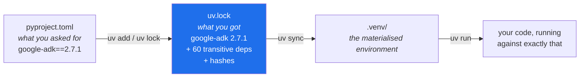

# 1.3 — uv, the one binary that owns the environment

## One-line answer

`uv` is a single program that does the four jobs which used to need four programs — **install the
interpreter, create the environment, resolve and lock the dependencies, run your code inside it** —
and giving all four to one owner is what makes [1.1](1.1-why-one-tool-owns-the-environment.md)'s
ambiguity impossible rather than merely unlikely.

---

## The story

Two engineers are pairing on a bug that only happens on one of their laptops. They have the same
git commit. They have the same operating system. The code is byte-identical.

They start comparing. Same Python version? Yes — both `3.12`. Same packages? They read their
`requirements.txt`, which says `google-genai>=2.0`. One of them installed it in March and got
`2.11`. The other installed it last week and got `2.19`. Between those two releases a default
changed, and the bug lives in the difference.

Nobody wrote anything down wrong. The file said `>=2.0`, and both installs honoured it perfectly.
The file simply described a *range* of possible worlds, and the two engineers were living in
different ones.

They fix it by pinning the exact version. Three weeks later it happens again — this time it is not a
package they named at all, but a package that one of *their* packages depends on, which released a
new version overnight. Their file pins what they asked for. It says nothing about the forty things
that came along.

The lesson is not "pin harder". It is that **an environment described by a wish list is not
reproducible**, and that reproducibility requires recording the entire resolved tree, not just the
top of it. That record is called a lockfile, and producing one is the third of `uv`'s four jobs.

---

## The idea in plain language

Historically, working on a Python project meant assembling a small committee of tools:

| Job | The old way |
| --- | --- |
| Get an interpreter of the right version | download an installer, or `pyenv` |
| Make an isolated environment | `python -m venv .venv`, then *activate* it |
| Install packages into it | `pip install` |
| Record what was installed, exactly | `pip freeze > requirements.txt`, or `pip-tools`, or `poetry` |
| Run your code in that environment | activate first, then `python` |

Five jobs, four tools, and a state you have to remember to be in ("did I activate?"). Every seam
between those tools is a place where [1.1](1.1-why-one-tool-owns-the-environment.md)'s bug can
appear.

**`uv` collapses the committee into one binary.** It is a single executable, written in Rust, that
performs all five jobs and keeps them consistent with each other by construction:

- `uv python install 3.12` — downloads and manages **interpreters**. You no longer need a separate
  installer, and the interpreter it manages is *not* on your `PATH`, so it cannot join the crowd
  from the story in 1.1.
- `uv init` — creates the project's declaration file, `pyproject.toml`.
- `uv add <pkg>==<version>` — resolves the dependency, **writes the pin into `pyproject.toml`
  *and* the full resolved tree into `uv.lock`**, and installs it. One command, three effects, no way
  for them to drift apart.
- `uv sync` — reads `uv.lock` and makes the environment match it exactly. This is how a colleague,
  a CI runner, or you-on-a-new-laptop materialise the identical world.
- `uv run <command>` — runs the command **inside the project's environment**, without you activating
  anything. This is the one that quietly removes an entire class of mistake, and it gets its own
  part: [2.5](../02-repo-skeleton/2.5-the-venv-you-never-activate.md).

Two words are worth defining properly, because the difference between them is the whole point of
the story above:

**A manifest** is what you *asked for*. In Python that is `pyproject.toml`: a short, human-edited
list of direct dependencies. `google-adk==2.7.1` is a manifest line.

**A lockfile** is what you *got*. `uv.lock` records every package that ended up installed —
including the ones you never named, the dependencies of your dependencies — at exact versions, with
cryptographic hashes of the files. It is machine-written, never hand-edited, and always committed.



> 💡 **The mental model:** the manifest is the shopping list; the lockfile is the receipt. You write
> the list. The tool writes the receipt. **You commit both**, because only the receipt can rebuild
> the exact basket.

---

## Why Sutra needs it

The plan's Principle 7 says *never invent a version number — look it up live, or leave a `TODO` with
the exact lookup command, and record every pin in `docs/PACKAGES.md` with the date.* That principle
has teeth only if there is a mechanism that makes the pin real. `uv` is the mechanism.

- **Day 2 installs `google-genai`; Day 5 installs `google-adk`.** ADK 2.x differs from 1.x in four
  ways that the plan's §5.1 lists explicitly — the node model, event field names, yield-versus-append,
  and exception handling. Every tutorial older than the 2.0 release teaches the 1.x shape. If your
  environment is ambiguous about which major version is installed, you cannot tell whether a piece of
  code is wrong or merely *from a different era*.
- **Day 9 puts four providers behind one agent** via LiteLLM. Four provider SDKs mean a deep and
  interlocking dependency tree; the lockfile is what stops one of them quietly upgrading a shared
  dependency and breaking another.
- **Day 31 is the quality gate.** `./m check` must produce the same answer on your laptop today as
  it does in six weeks. That is a statement about the environment, not about the code.
- **Day 86 containerises Sutra.** The Dockerfile's job becomes almost trivial — copy `pyproject.toml`
  and `uv.lock`, run `uv sync --frozen`, done — precisely because the lockfile makes "the
  environment" a portable artifact rather than a sequence of hopeful commands.
- **Day 92 is the hardening pass before the repo goes public.** "Which version of which package is
  actually in there, and does any of them have a known vulnerability?" is a question a lockfile
  answers exactly and a wish list cannot answer at all.

---

## The mechanism

### Install uv

The official installer, in Git Bash:

```bash
curl -LsSf https://astral.sh/uv/install.sh | sh
```

**Line by line:**

- `curl` — a command-line HTTP client, bundled with Git Bash. It fetches a URL and prints the
  response.
- `-L` — **follow redirects**. `astral.sh/uv/install.sh` redirects to the real file; without `-L`
  you would pipe the redirect notice into your shell, which does nothing useful.
- `-s` — **silent**: no progress meter, so only the script itself reaches the pipe.
- `-S` — **show errors anyway**. `-s` alone silences failures too, which is exactly the wrong thing
  when you are about to execute the output. `-sS` together means "quiet on success, loud on
  failure".
- `-f` — **fail on HTTP errors**. Without it, a 404 page's HTML would be piped into `sh` and
  executed as a shell script. With it, curl exits non-zero and the pipe produces nothing.
- `| sh` — pipe the downloaded script into a shell to run it. Read the note in *In production*
  before you make a habit of this pattern.

On Windows you may instead prefer PowerShell's official one-liner, which is equivalent:

```text
powershell -ExecutionPolicy ByPass -c "irm https://astral.sh/uv/install.ps1 | iex"
```

**Then close Git Bash and open it again.** The installer adds `uv` to your `PATH`, and a shell reads
`PATH` when it starts — an already-open shell will keep insisting `uv` does not exist, which is the
most common five minutes lost on this page.

### Confirm it

```bash
uv --version
```

**Line by line:**

- Prints the version and proves the word resolves inside *this* shell. It printed `uv 0.12.3` on the
  machine this document was written on. Yours will likely be newer; `uv` moves fast and is
  backwards-compatible in everything used here.
- Whatever it prints, **write it into `docs/PACKAGES.md`** with today's date. That is Principle 7 in
  its smallest form: the tool that guarantees your pins is itself a pinned fact.

### See all four jobs at once

Do this in a scratch folder, *not* in your project — you will build the real one in
[section 2](../02-repo-skeleton/2.1-the-folder-skeleton.md). The point here is to watch the machine work.

```bash
mkdir -p /tmp/uvdemo && cd /tmp/uvdemo
uv init --python 3.12
uv add "httpx==0.28.1"
uv run python -c "import httpx, sys; print(httpx.__version__); print(sys.executable)"
```

**Line by line:**

- `mkdir -p /tmp/uvdemo && cd /tmp/uvdemo` — a throwaway directory. In Git Bash `/tmp` is a real
  temporary location that gets cleaned up, which is what you want for something you are about to
  delete.
- `uv init --python 3.12` — creates `pyproject.toml` (the manifest) and records that this project
  wants Python 3.12. It does *not* install anything yet. It also creates a `.python-version` file
  naming the interpreter, which is how the choice survives being forgotten.
- `uv add "httpx==0.28.1"` — the interesting line. It resolves `httpx` and everything `httpx`
  depends on, creates `.venv/` if it does not exist, installs the resolved set, writes
  `httpx==0.28.1` into `pyproject.toml`, and writes the **entire resolved tree with hashes** into
  `uv.lock`. The quotes protect `==` from the shell, which is a habit worth keeping — some version
  specifiers contain characters bash would otherwise interpret.
- `uv run python -c "..."` — runs `python` **inside** the project environment. Note what is absent:
  no `source .venv/bin/activate`, no remembering which state your shell is in. `uv run` puts the
  environment in place for exactly the duration of that one command.
- The two `print` calls make the guarantee visible: the version you pinned, and the interpreter path
  — which is inside `.venv`, not one of the four Pythons from
  [1.1](1.1-why-one-tool-owns-the-environment.md).

Now look at what it wrote:

```bash
cat pyproject.toml
head -20 uv.lock
```

**Line by line:**

- `cat pyproject.toml` — the manifest: a handful of lines, one of them `"httpx==0.28.1"`. This is the
  file *you* edit.
- `head -20 uv.lock` — the first twenty lines of the receipt. You will see a format version, the
  required Python range, and the beginning of a long list of `[[package]]` blocks. `httpx` did not
  arrive alone; it brought `httpcore`, `h11`, `certifi`, `idna`, `anyio` and `sniffio`. **You named
  one package and got seven.** That gap is exactly what the lockfile exists to record, and exactly
  what the story at the top of this page was about.

Clean up:

```bash
cd ~ && rm -rf /tmp/uvdemo
```

**Line by line:**

- `cd ~` — leave the directory before deleting it; `rm -rf` on the directory you are standing in
  leaves your shell in a folder that no longer exists, which produces confusing errors afterwards.
- `rm -rf /tmp/uvdemo` — remove it. Nothing here is precious; the real project starts in
  [2.1](../02-repo-skeleton/2.1-the-folder-skeleton.md).

---

## When it breaks

**`uv` not found, immediately after installing it:**

```text
$ uv --version
bash: uv: command not found
```

The installer wrote `uv` into `~/.local/bin` and appended that folder to your shell's startup file.
A shell reads `PATH` **when it starts**. Your currently-open shell started before the change, so it
is working from the old list. **The fix: close Git Bash and open it again.** If it still fails,
check the folder actually has the binary:

```text
$ ls ~/.local/bin/
uv  uvx
```

If they are there and `uv` still is not found, add the folder to `PATH` for this session with
`export PATH="$HOME/.local/bin:$PATH"` and investigate your shell startup file afterwards.

**A pin that cannot be satisfied:**

```text
$ uv add "google-adk==99.0.0"
  × No solution found when resolving dependencies:
  ╰─▶ Because there is no version of google-adk==99.0.0 and your project depends on
      google-adk==99.0.0, we can conclude that your project's requirements are unsatisfiable.
```

Read the shape of that message rather than the words. `uv`'s resolver explains its reasoning as a
chain — *because X, and because Y, we conclude Z*. When a real conflict happens (two packages
needing incompatible versions of a third), the same format tells you exactly which two, which is
far more useful than a bare failure. **The fix here is Principle 7: look the version up rather than
inventing it.**

```bash
curl -s https://pypi.org/pypi/google-adk/json | python -c "import sys,json; print(json.load(sys.stdin)['info']['version'])"
```

**Line by line:**

- `curl -s https://pypi.org/pypi/<pkg>/json` — PyPI's public metadata endpoint. `-s` silences the
  progress meter so only JSON reaches the pipe.
- `python -c "...['info']['version']"` — `info.version` is the **latest non-yanked release**. This
  is the authoritative answer. A blog post is not, and neither is your memory.
- Whatever it prints goes into `docs/PACKAGES.md` with the date. That is the row Principle 7 asks
  for.

**A network that blocks the resolver:**

```text
error: Failed to fetch: `https://pypi.org/simple/google-adk/`
  Caused by: Request failed after 3 retries
  Caused by: error sending request for url (https://pypi.org/simple/google-adk/)
```

Corporate proxies and captive Wi-Fi cause this. `uv` respects the standard `HTTPS_PROXY`
environment variable, and `uv add --offline` will work from its local cache if the package has been
fetched before. It is worth knowing that `uv` caches aggressively, which is why the second install
of anything is nearly instant.

---

## In production

**`curl | sh` deserves a second thought.** Piping a downloaded script straight into a shell is
convenient and is what the official documentation recommends, but it does mean executing code you
have not read, fetched over a channel you are trusting. In a personal setup that is a reasonable
trade. In a corporate or production environment the professional pattern is to download first,
inspect, then run — `curl -LsSf https://astral.sh/uv/install.sh -o install.sh`, read it,
`sh install.sh` — or to install from your organisation's package mirror. The general principle is
worth carrying: **`| sh` is a decision, not a formality.** It is the same instinct that Principle 13
("blast radius before capability") will make explicit on Day 16, when Sutra first gets a tool that
can execute code.

**`uv sync --frozen` is the production verb.** On your laptop, `uv add` and `uv sync` may *update*
the lockfile if something has drifted. In CI and in a container image, that is exactly wrong — a
build that can silently re-resolve is a build that can differ from the one you tested.

```text
uv sync --frozen        # fail if uv.lock does not already satisfy pyproject.toml
uv sync --locked        # same guarantee, newer spelling
```

A Dockerfile that runs `uv sync --frozen` and an image tag both refer to a single, reproducible
world. That is what makes Day 86's container *worth* building rather than merely built.

**Commit the lockfile. Always.** For an application — which Sutra is — the lockfile is committed,
because you want every machine to be identical. (Libraries, which are *consumed* by other projects,
conventionally do not commit one, since their whole job is to be flexible about their surroundings.
Sutra is an application. Commit it.)

**What degrades at scale.** A 60-package tree resolves in a second. A 400-package machine-learning
tree with conflicting constraints is where resolvers earn their keep, and where the difference
between "no solution found" and *"no solution found, here is the exact pair of constraints that
conflict"* is an afternoon. It is also where the hashes matter: a lockfile with hashes means an
install can *verify* it received the same bytes the lock recorded, which is the base layer of
supply-chain security. Day 92 asks that question of Sutra directly.

**The review comment a senior engineer leaves.** On a pull request adding `google-adk` to
`pyproject.toml` without the lockfile: *"`uv.lock` isn't in this diff — did you run `uv add`, or
hand-edit the manifest? If the lock doesn't move with the manifest, `uv sync --frozen` fails in
CI."* The point behind the comment is that a manifest and a lockfile are **one artifact in two
files**; changing one without the other is a half-committed change.

**The interview question.** *"What's the difference between `requirements.txt` and a lockfile, and
why does it matter?"* The answer they are listening for names the transitive tree: a requirements
file typically records what you *asked for*, a lockfile records the complete resolved set including
dependencies-of-dependencies, at exact versions, ideally with hashes. The follow-up is usually
*"so why does that matter?"* — and the strong answer is a story like the one at the top of this
page: two identical checkouts, two different worlds, one bug that only reproduces on one laptop.

---

## Check yourself

```bash
uv --version && uv python list | head -5
```

The first line proves `uv` is on `PATH` in this shell. The second lists the interpreters `uv` knows
about — which is the subject of [1.4](1.4-python-3-12-under-uv.md), and which may be empty right
now. Both outcomes are fine; you just want the command to run.

Then add the row to your notes for Day 0's ledger:

```text
| uv | <the version you saw> | <today> | 0 | One binary owns the environment: install, lock, run. |
```

**Answer out loud, without scrolling up:**

> What is the difference between `pyproject.toml` and `uv.lock`, which one do you edit by hand, and
> which one would you need in order to rebuild an environment exactly as it was six months ago?

---

**Next:** [1.4 — Python 3.12 under uv, and why not the newest](1.4-python-3-12-under-uv.md)
