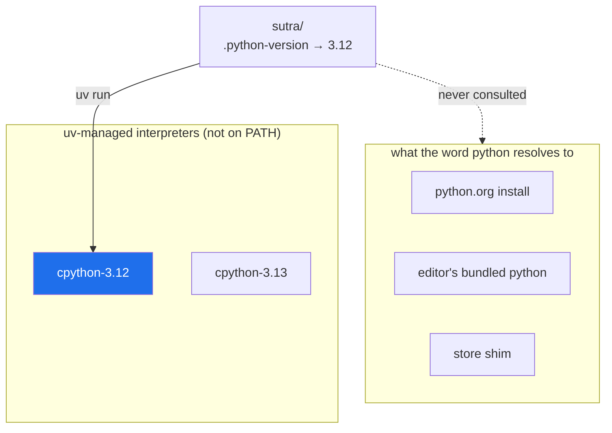

# 1.4 — Python 3.12 under uv, and why not the newest

## One-line answer

Sutra pins **Python 3.12** — not the newest release — because a version is only usable when
*everything you depend on* supports it, and `uv` will fetch and manage that exact interpreter for
you without it ever joining the crowd on your `PATH`.

---

## The story

An engineer sets up a new machine on a Friday. The download page offers the latest Python, which is
several versions newer than the one the team uses. Newer is better, so they take it.

Monday's first task needs a scientific library. `uv add` fails. They read the error: no compatible
release. They check the project's page: the newest version supports up to the previous Python
release, and support for the new one is "planned".

This is not neglect. That library ships **compiled** components — C code built against the specific
internal shape of one Python version. Every new Python release changes that shape a little, so every
such package has to be rebuilt and re-tested and re-published for each new version. There is a
sequence: Python releases, then the compiled ecosystem catches up over the following months, then
the pure-Python packages that depend on *those* catch up, and only then is the new version
comfortable.

The engineer had installed the front of the parade and needed the middle of it.

They spend the morning uninstalling and reinstalling — and, because uninstalling Python on Windows
rarely removes every trace, they leave behind exactly the kind of half-present interpreter that
[1.1](1.1-why-one-tool-owns-the-environment.md) is about. The bug they hit in three weeks' time will
have started that Monday.

---

## The idea in plain language

**A Python version is not a preference. It is a compatibility window.**

Every package declares which Python versions it supports, in a field called `requires-python`. When
you ask a resolver to install several packages at once, the version you can actually use is the
**intersection** of all of their windows. Pick a Python outside that intersection and there is no
solution — not a slow install, not a warning: no solution.

Two facts make the intersection narrower than beginners expect:

**Packages with compiled parts lag behind.** A *pure-Python* package is text; it usually works on a
new Python the day it ships. A package with compiled components ships pre-built binaries — called
*wheels* — for each Python version and each operating system. Those have to be built and published
per version. Until they are, installing on the new Python means either failing, or falling back to
compiling from source on your machine, which needs a compiler toolchain you probably do not have.

**Frameworks cap the top of the window, not just the bottom.** It is easy to remember that something
needs *at least* 3.10. It is easy to forget that something else supports *at most* 3.13. The
intersection has two edges.

For Sutra, the plan's §5 states the window and the choice:

| | Value |
| --- | --- |
| ADK's supported window | Python 3.10 – 3.14 |
| **Sutra's pin** | **3.12** |
| Why | The stability pick. Comfortably inside the window, old enough that the compiled ecosystem has fully caught up, new enough for the modern syntax this project uses. |

> 💡 **The mental model:** you are not choosing the newest Python. You are choosing the **oldest
> Python that everything you need already agrees on** — because that is the version with the most
> tested code behind it.

### The second half: how uv holds the interpreter

Here is the part that changes the habit. `uv` can **download and manage interpreters itself**, and
the ones it manages are deliberately *not* placed on your `PATH`.

That sounds like a limitation. It is the entire benefit. An interpreter on `PATH` is one more
candidate for the word `python` to resolve to — one more entry in the queue from
[1.1](1.1-why-one-tool-owns-the-environment.md). A `uv`-managed interpreter is a resource that a
project *asks for by version*, and receives, and nobody else on the machine is affected.



The project states its wish in a file called `.python-version`. `uv` reads it, uses the matching
managed interpreter, and creates `.venv` from that. The wish is committed to git, so a colleague
running `uv sync` gets the same interpreter without a conversation about it.

---

## Why Sutra needs it

- **Day 5 installs `google-adk`.** ADK is the framework the next ninety-one days are built on. If
  your interpreter is outside its window, Day 5 does not start — and diagnosing that on Day 5,
  under the impression that you are debugging your first agent, is much worse than settling it on
  Day 0.
- **Day 9 installs LiteLLM and four provider paths.** A wider dependency tree means a narrower
  intersection. The more providers Sutra speaks to, the more the "oldest version everyone agrees on"
  logic matters.
- **Day 49 builds a local embedding index** over the ticket archive. Embedding models run through
  compiled numerical libraries — exactly the category that lags behind new Python releases. This is
  the day a too-new interpreter would have bitten hardest.
- **Day 86 containerises Sutra.** The base image will be chosen by version — a `python:3.12` image,
  or a `uv` image told to fetch 3.12. `.python-version` is what makes that choice already decided
  rather than re-litigated inside a Dockerfile.
- **Principle 7, again.** "Never invent a version number" applies to the language itself. The
  interpreter version is the first pin, and every other pin sits on top of it.

---

## The mechanism

### See what uv already knows about

```bash
uv python list
```

**Line by line:**

- Lists every interpreter `uv` can see: the ones it manages, the ones already on your system, and
  the ones it could download. Each row is a *key* like `cpython-3.12.13-windows-x86_64-none`
  followed by either a path (installed) or `<download available>`.
- Read the key: implementation (`cpython`), version, platform, architecture, and variant. `graalpy`
  and `pypy` rows are alternative implementations — interesting, irrelevant here.
- Rows showing a path under `AppData\Roaming\uv\python\...` are **uv-managed**. Rows showing a path
  under `Program Files` or `AppData\Local\Programs\Python` are **system** interpreters `uv` found —
  the same crowd `which -a python` showed you in
  [1.1](1.1-why-one-tool-owns-the-environment.md).

### Install 3.12

```bash
uv python install 3.12
```

**Line by line:**

- Downloads a standalone CPython 3.12 build and stores it in `uv`'s own directory. It does **not**
  run a Windows installer, does not touch the registry, does not add anything to `PATH`, and does
  not disturb any Python you already have. If it is already present, the command says so and exits
  — it is safe to re-run.
- `3.12` without a patch number means *the newest 3.12.x `uv` offers*. You can pin a patch —
  `uv python install 3.12.13` — if you ever need to reproduce a build down to the patch level;
  Sutra does not.

Confirm:

```bash
uv python list | grep "3\.12"
```

**Line by line:**

- `grep "3\.12"` — filter the list to the lines you care about. The backslash escapes the dot,
  which in a regular expression otherwise means "any character". Without the escape this would also
  match `3812`, which is harmless here but a bad habit to build.
- You want at least one row showing a real path rather than `<download available>`. That row is the
  interpreter Sutra will use.

### Pin it for the project

You will do this for real inside the project in
[2.4](../02-repo-skeleton/2.4-pyproject-and-the-lockfile.md). What `uv init --python 3.12` writes is a one-line
file:

```bash
cat .python-version
```

**Line by line:**

- The file contains exactly `3.12` and nothing else. It is read by `uv` — and by several other
  tools that follow the same convention — to decide which interpreter this directory wants.
- It is **committed to git**, which is what makes the choice travel. A colleague cloning the repo
  does not need to be told which Python to use; the repo says so.
- `pyproject.toml` states the same fact in the stricter language a resolver understands:
  `requires-python = "==3.12.*"`. The two files agree on purpose — one is a *request* for a local
  interpreter, the other is a *constraint* the dependency resolver must honour.

### Prove which interpreter you actually got

```bash
uv run python -c "import sys; print(sys.version); print(sys.executable)"
```

**Line by line:**

- `uv run python` — run `python` inside the project's environment.
  ([2.5](../02-repo-skeleton/2.5-the-venv-you-never-activate.md) is entirely about why this replaces "activate
  first".)
- `sys.version` — the full version string, including the build date and compiler. The first three
  numbers must start `3.12`.
- `sys.executable` — the path of the running interpreter. It should point **inside the project's
  `.venv`**, not into `Program Files` and not into `AppData\Local\Programs`. That is the visible
  proof that the environment is owned rather than inherited.

---

## When it breaks

**Asking for a Python nothing supports.** Suppose a future you sets `requires-python` to a version
one of the dependencies has not reached:

```text
$ uv sync
  × No solution found when resolving dependencies:
  ╰─▶ Because the current Python version (3.14.0) does not satisfy Python>=3.10,<3.14
      and google-adk==2.7.1 depends on Python>=3.10,<3.14, we can conclude that
      google-adk==2.7.1 cannot be used.
      And because your project depends on google-adk==2.7.1, we can conclude that your
      project's requirements are unsatisfiable.
```

**What it is telling you.** Read the chain backwards: your project needs the framework, the
framework's window has an upper edge, your interpreter is above it. Nothing is broken; you are
standing outside the intersection. **The smallest fix** is to move the interpreter, not the pin:

```text
$ uv python install 3.12
$ uv sync --python 3.12
```

**A version that exists but has no pre-built wheel.** This one is nastier because it does not stop —
it tries:

```text
$ uv add some-compiled-package
  × Failed to build `some-compiled-package==1.4.0`
  ├─▶ The build backend returned an error
  ╰─▶ error: Microsoft Visual C++ 14.0 or greater is required. Get it with
      "Microsoft C++ Build Tools": https://visualstudio.microsoft.com/visual-cpp-build-tools/
```

**What it means.** There was no ready-made binary for your Python-and-platform combination, so `uv`
fell back to building from source, and building from source needs a C++ compiler you do not have.
The correct reading is almost never "install a compiler". It is **"I am on a Python version this
package has not shipped a wheel for yet"** — and the fix is to move to the version that has one.
This is the story from the top of this page, arriving as a stack trace.

**A stale `.python-version`.** If the file names a version that is not installed:

```text
$ uv run python -V
error: No interpreter found for Python 3.12 in managed installations or search path
```

Clear and honest. `uv python install 3.12` and try again.

---

## In production

**The version is an artifact, not a preference.** In a serious codebase the Python version appears
in at least four places that must agree: `.python-version`, `requires-python` in `pyproject.toml`,
the base image in the `Dockerfile`, and the version matrix in CI. When they drift, the symptom is
the worst kind — code that passes CI and fails in production, or vice versa, because the two ran on
different interpreters. Sutra's Day 86 Dockerfile and its `.python-version` will name the same
number for exactly this reason.

**Upgrading Python is a project, not a command.** The professional sequence is: check every direct
dependency's `requires-python` for the new version; check that pre-built wheels exist for your
platform; run the full test suite on the new version *in CI, next to the old one*, not instead of
it; then move the pin, the image and the lockfile in one commit. For Sutra that commit would touch
`.python-version`, `pyproject.toml`, `uv.lock` and the Dockerfile together — and, per Principle 14,
would be preceded by an amendment rather than done silently.

**"Latest" is a smell in production.** A base image tagged `python:latest`, or a CI job that
installs "the newest 3.x", means your build can change without a commit. The whole point of
Principle 7 is that a build is a function of what is committed. A floating interpreter breaks that
in the most fundamental way possible, because everything else is built on top of it.

**What degrades at scale.** With one service, a Python bump is an afternoon. With forty services and
a shared internal library, the library has to support the union of every service's Python version
during the migration — which is why organisations run *supported version windows* rather than
individual choices, and why the phrase "we're a 3.12 shop" is a real engineering position rather
than an aesthetic one.

**The review comment a senior engineer leaves.** On a pull request bumping the Dockerfile to a newer
Python without touching anything else: *"`.python-version` and `requires-python` still say 3.12 —
now CI and the image disagree. Move all three, or none."* The unstated point is that these files are
one decision recorded in several places, and a partial move is worse than no move: it converts a
clear constraint into an inconsistency nobody will notice until it fails.

**The interview question.** *"How do you choose which Python version a project targets?"* A junior
answer is "the latest stable". A strong answer names the intersection: the newest version supported
by *every* dependency, with pre-built wheels available for your platforms, and — if you publish a
library rather than an application — old enough that your consumers can actually use it. Mentioning
that compiled packages lag new releases by months, and that this is why "newest" is often the wrong
default, is the detail that shows you have lived through it.

---

## Check yourself

```bash
uv python list | grep -c "3\.12" && uv python list | grep "3\.12" | head -3
```

The first number must be at least 1, and at least one of the printed rows must show a real path
rather than `<download available>`.

Add the row to your Day 0 ledger notes:

```text
| python | <the 3.12.x you installed> | <today> | 0 | Runtime — 3.12 per plan §5, the stability pick inside ADK's 3.10–3.14 window. |
```

**Answer out loud, without scrolling up:**

> Why does Sutra pin 3.12 rather than the newest Python? Name the two edges of the compatibility
> window, and say what a `uv`-managed interpreter does differently from one you install from
> python.org.

---

**Next:** [1.5 — The editor, and the interpreter trap](1.5-the-editor-and-the-interpreter-trap.md)
