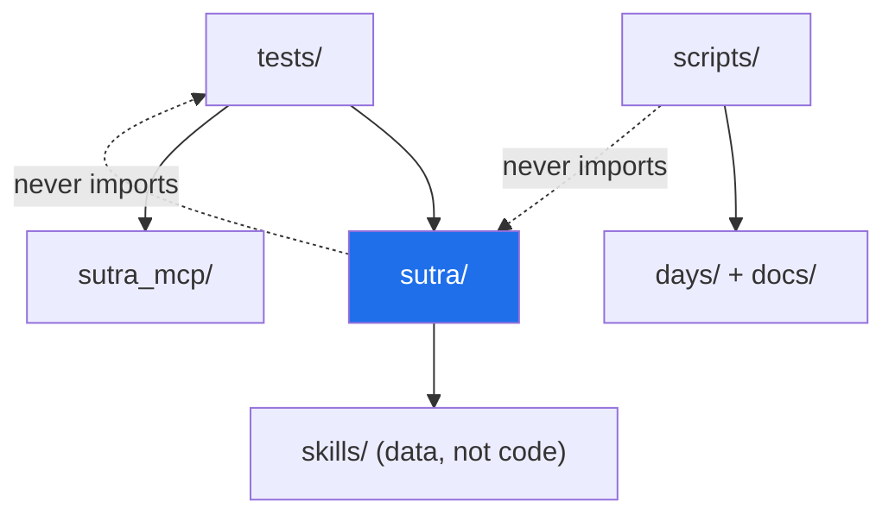

# 2.1 — The folder skeleton, and why every folder earns its place

## One-line answer

A project's folder layout is a **set of decisions about what is allowed to depend on what**, made
once at the start when it is free, instead of later when it costs a refactor.

---

## The story

A project starts as one file. `main.py`. It works.

Then it needs a helper, so a function moves to `utils.py`. Then it needs to read a config, so
`config.py` appears. Then a test — but where do tests go? Next to the code, for now. Then a
notebook to explore something, saved in the root because that is where the terminal was. Then a
CSV, downloaded to the root for the same reason. Then a second CSV, this one *generated* by the
first — which nobody can tell apart six weeks later, because they sit side by side with similar
names.

Eight months on, the root directory has forty-one entries. Somebody new joins and asks the question
that has no good answer: *"where does a new thing go?"* There is no rule, so they make a reasonable
guess, and the guess adds a forty-second entry that follows a different logic from the other
forty-one.

The problem was never any single file being in the wrong place. It is that **there was never a rule
that made a place wrong**, so every location was equally defensible, and the layout stopped carrying
information.

Notice the second cost, which is worse. In that project, `utils.py` imports from `main.py`, and
`main.py` imports from `utils.py`. Nobody planned that; it happened one convenience at a time.
Now neither can be tested without the other, neither can be reused, and the "quick script" at the
top of the file runs every time anything imports anything.

---

## The idea in plain language

A folder layout answers three questions, and a good one answers them without being consulted:

1. **Where does a new file go?** If two reasonable engineers would put it in two different places,
   the layout is under-specified.
2. **What is allowed to import what?** Directories are the cheapest way to express a dependency
   rule. `tests/` may import `sutra/`; `sutra/` may never import `tests/`.
3. **What is precious, and what is regenerable?** Anything that can be rebuilt from committed code
   should be recognisable as such — because that is what tells you what to back up, what to
   `.gitignore`, and what you may safely delete when disk space runs out.

Here is Sutra's skeleton. Every entry has a sentence explaining why it exists as its own folder
rather than living inside another one:

```text
sutra/
├── m                 # the driver script — one entry point for every repeated command
├── Makefile          # a two-line shim so `make check` still reaches ./m check
├── CLAUDE.md         # the standing contract for the agent that generates day documents
├── README.md         # what this is, for a stranger who arrives with no context
├── pyproject.toml    # the manifest — what this project asks for
├── uv.lock           # the receipt — what it actually got, exactly
├── .gitignore        # what git must never see
├── .env.example      # the NAMES of the secrets. Never the values.
│
├── sutra/            # the product package: agents, tools, the triage graph
├── sutra_mcp/        # Sutra's own MCP server(s) — a separate package on purpose
├── skills/           # Agent Skills: spec-compliant folders, not Python modules
├── scripts/          # repo tooling that operates on the repo, not on tickets
├── tests/            # pytest; mirrors the package structure
│
├── days/             # the teaching: one folder per day
├── docs/             # the plan, the addenda, the ledgers, the ADRs
└── legacy/           # the previous run of this project. Read-only.
```

**Why `sutra/` and `sutra_mcp/` are two packages, not one.** This is the first real architectural
decision in the project, and it is made on Day 0 by making a folder. `sutra/` is the *agent system*:
it decides things. `sutra_mcp/` is the *data boundary*: it exposes tools and data over a protocol,
and by Day 43 it must be **stateless** — any instance able to answer any request, because that is
what lets it be deployed as several replicas. Those two things have genuinely different constraints:
one holds conversation state, the other must not. Separating them now means that on Day 42, when
Sutra's own agents become servable over MCP, the boundary already exists as a directory instead of
needing to be carved out of a tangle.

**Why `skills/` is not inside `sutra/`.** An Agent Skill is not Python. It is a folder containing a
`SKILL.md` file and its resources, following an open specification, and it is deliberately portable
— the same skill folder should work in a different agent runtime. Putting it inside the Python
package would tempt you to import it, which would quietly couple a portable artifact to one runtime.
Day 25 opens this properly.

**Why `scripts/` and not `tools/`.** Sutra will have *tools* in the agent sense from Day 4 — functions
an agent can call. `scripts/` holds programs that operate on the **repository**: the depth check, the
tracker, the traceability generator. Two meanings of one word in one repo is a small thing that
causes a surprising number of misunderstandings, so the words are kept apart.

**Why `tests/` is a sibling of the package, not a child of it.** Two reasons. It expresses the
dependency rule — tests import the package, never the reverse — and it keeps tests out of the
installed artifact, so that shipping Sutra does not ship its test suite.

**Why `days/` is at the top level rather than under `docs/`.** Because it is not documentation
*about* the project; it **is** the project's other half. The plan's §17 makes a day a folder of many
files; burying that two levels deep would make the thing you open every session harder to reach than
the thing you open twice a year.



That diagram is the point of the whole part: `scripts/` reads the *documents*, not the product;
`tests/` reads the product; the product reads nothing above it. Arrows only ever point one way.

---

## Why Sutra needs it

- **Day 1** creates the ledgers and `scripts/trace.py`, which reads `days/*/LESSON.md` and writes
  `docs/TRACEABILITY.md`. That script only makes sense if days and docs are where it expects them.
- **Day 5** puts the first agent in `sutra/`. From then on the package grows every single day, which
  is precisely why its boundaries are set before anything is in it.
- **Day 23** adds the first tests. `tests/` mirroring `sutra/` means the answer to "where does the
  test for this go?" is mechanical, forever.
- **Day 25** puts the first Agent Skill in `skills/`, and **Day 29** starts recording third-party
  skills in `docs/SKILL_PROVENANCE.md` before they are ever run. A skill being *data in a folder*
  rather than *code in a package* is what makes auditing it a meaningful act.
- **Day 34** builds `sutra_mcp/`, and **Day 43** makes it stateless and deploy-shaped. The
  separation made today is the reason that day is a focused piece of work rather than an extraction.
- **Day 86** containerises. A Dockerfile copies *directories*. A layout where the runtime artifact
  is a small set of clearly-named folders makes a small image; a layout where everything is at the
  root makes a large one that also ships your notebooks.

---

## The mechanism

Choose where the project lives, then create it. Avoid folders that a cloud service synchronises in
the background if you can — sync clients occasionally lock files mid-write, which produces genuinely
baffling git errors.

```bash
mkdir -p ~/Projects && cd ~/Projects
mkdir -p sutra && cd sutra
```

**Line by line:**

- `mkdir -p ~/Projects` — `~` is your home directory; `-p` means "create parents as needed, and do
  not complain if it already exists" ([1.2](../01-toolchain/1.2-git-and-the-unix-shell.md)). Safe to re-run.
- `cd sutra` — everything from here to the end of Day 0 happens inside this folder. If a later
  command fails oddly, `pwd` is the first thing to check.

Now the skeleton, in one command:

```bash
mkdir -p sutra sutra_mcp skills scripts tests days docs/adr
```

**Line by line:**

- One `mkdir -p` with several arguments creates them all. There is no ordering requirement — these
  are siblings, except `docs/adr` where `-p` creates `docs` on the way through.
- `docs/adr` — Architecture Decision Records. Every phase gate produces one (Principle 10:
  *interview-ready artifacts*), and an ADR is a document you could hand to a hiring panel. Day 0's
  own decision to adopt this format is already recorded there as `ADR-0003`.
- Deliberately **not** created: `.venv` (uv makes it), `legacy` (it already exists from the previous
  run), and `days/day-00-toolchain-skeleton-driver/lab` (`./m scaffold 0` makes it, and only if you want a scratch folder).

Python needs one more thing to treat a folder as an importable package:

```bash
touch sutra/__init__.py sutra_mcp/__init__.py tests/__init__.py
```

**Line by line:**

- `touch` — create an empty file, or update its timestamp if it exists. Doing nothing when the file
  already exists is what makes it safe in a setup script.
- `__init__.py` — the file that marks a directory as a Python *package*, so `from sutra.agent import
  ...` can work. Modern Python can import from directories without it, but the behaviour differs in
  ways that surprise people, and an explicit marker is worth two seconds.
- **These files stay empty**, and that is a rule rather than an accident. Code in `__init__.py` runs
  the moment anything imports anything from the package — including your tests, including `./m
  check`, including a container's health check. A package that does work at import time is a package
  that cannot be imported cheaply. This is the smallest, earliest expression of Principle 13, *blast
  radius before capability*.

Git will not track an empty directory — it tracks files, and a folder with nothing in it simply does
not exist as far as git is concerned. `skills/` needs a placeholder so the structure survives a
clone:

```bash
touch skills/.gitkeep
```

**Line by line:**

- `.gitkeep` is not a git feature. It is a **convention**: an empty file whose only purpose is to
  give git something to track so the folder comes along. Any filename would do; this one is
  universally understood to mean "intentionally empty for now".
- `scripts/`, `tests/`, `days/` and `docs/` do not need one — they will each hold a real file before
  the first commit.

Look at what you built:

```bash
find . -type d -not -path "./.git/*" -not -path "./legacy/*" | sort
```

**Line by line:**

- `find . -type d` — every directory beneath the current one.
- `-not -path "./.git/*"` — exclude git's internal storage, which contains dozens of folders you did
  not create and do not care about.
- `-not -path "./legacy/*"` — exclude the previous run's archive for the same reason.
- `| sort` — alphabetical, so the output is stable and comparable between runs.

---

## When it breaks

**Running the commands from the wrong place.** This is the most common Day 0 mistake, and it is
silent:

```text
$ pwd
/c/Users/me/Projects
$ mkdir -p sutra sutra_mcp skills scripts tests days docs/adr
$ ls
sutra/  sutra_mcp/  skills/  scripts/  tests/  days/  docs/
```

Nothing errored. But `pwd` says `Projects`, not `Projects/sutra` — the skeleton was created one
level too high, as siblings of the project rather than inside it. **Always check `pwd` before a
`mkdir` that creates several things.** To recover, `cd sutra` and run it again; then remove the
strays from `Projects/` once you are certain which is which.

**Importing a package that has no marker file:**

```text
$ uv run python -c "from sutra_mcp import server"
Traceback (most recent call last):
  File "<string>", line 1, in <module>
ModuleNotFoundError: No module named 'sutra_mcp'
```

Compare it with [1.1](../01-toolchain/1.1-why-one-tool-owns-the-environment.md)'s version of this error, which
had the same text and a completely different cause. There, the package was installed into a
different interpreter. Here, the folder exists but Python does not consider it importable from where
you are standing. **The same error message, two different worlds** — which is why the diagnosis is
always *"which interpreter, and what does it consider importable?"* rather than *"what does the
message say?"*

**An `__init__.py` that does work.** This one has no error message at all, which is what makes it
worth naming. If `sutra/__init__.py` were to contain, say, a line that reads configuration or
creates a client, then *every* import of *anything* in the package would do that work — including
`pytest` collecting tests, including `ruff` analysing imports, including a container's startup probe.
The symptom is not a crash; it is a project that gets mysteriously slower and harder to test as it
grows. Keep them empty.

---

## In production

**The layout is an architecture diagram that cannot go stale.** A drawing in a wiki drifts from
reality within a quarter. Directories cannot: if `sutra_mcp/` imports from `sutra/`, that is visible
in the import statement and reviewable in a diff. This is why the first thing an experienced
engineer does in an unfamiliar repository is `ls` the root and read the top-level names. **A layout
that answers "what is this?" in ten seconds is a real feature.**

**`src/` layouts, and why Sutra does not use one.** A common professional convention puts packages
under `src/` — `src/sutra/` rather than `sutra/`. The reason is genuinely good: with a `src/`
layout, the project root is *not* importable, so your tests are forced to import the **installed**
package rather than accidentally picking up the source directory. That catches packaging bugs, like
a data file you forgot to include, before your users do. Sutra keeps the flatter layout because the
package name and the repo name match and the day documents refer to `sutra/` constantly, and because
the packaging surface here is small. **The point is that this is a decision with a reason, not a
default** — and knowing the trade-off is the part an interviewer will ask about.

**What degrades at scale.** A layout that works for one package strains at ten. Teams reach for
workspaces — several packages under one lockfile, with explicit inter-package dependencies — because
the alternative is either one enormous package or ten repositories that must be released in lockstep.
`uv` supports workspaces directly. Sutra will not need one, but the moment `sutra_mcp/` needed its
own release cadence, that is the door you would walk through, and it is open precisely because the
boundary was drawn on Day 0.

**The review comment a senior engineer leaves.** On a pull request adding a file to the repository
root: *"Why is this at the top level? Everything here is either the entry point, config, or a
directory — a new file at the root needs a reason, because the root is the first thing anyone reads."*
The unstated point is that the root directory is the project's table of contents, and every entry
added to it costs every future reader a small amount of attention.

**The interview question.** *"Walk me through how you'd lay out a new Python service."* They are not
checking whether you can recite `src/`. They are listening for whether you can name the *reasons*:
one importable package with a clear boundary, tests as a sibling that may import the package but
never the reverse, no work at import time, generated data separated from downloaded data, and a
single entry point for the commands everyone runs. If you can also say what you would do *differently*
for a library than for an application, you have demonstrated that you understand layouts as
decisions rather than as templates.

---

## Check yourself

```bash
pwd && find . -maxdepth 1 -type d -not -name ".*" | sort && ls sutra/ sutra_mcp/ tests/ skills/
```

`pwd` must end in `/sutra`. The directory list must show exactly the folders above, and the four
`ls` results must show the three `__init__.py` files and one `.gitkeep`.

**Answer out loud, without scrolling up:**

> Why do `sutra/` and `sutra_mcp/` exist as two separate packages instead of one? And why must
> `__init__.py` stay empty — what breaks, and when would you notice?

---

**Next:** [2.2 — `.gitignore`, written before any secret exists](2.2-gitignore-before-secrets-exist.md)
