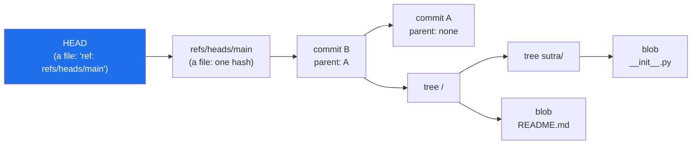
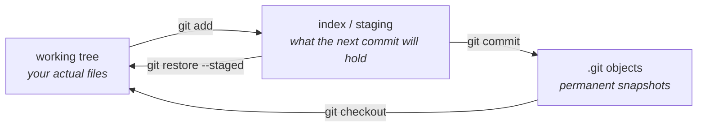

# 2.3 — `git init`, and what a repository actually is

## One-line answer

`git init` creates one hidden folder, `.git`, containing a **content-addressed database of
snapshots** plus a handful of pointers into it — and once you have seen what is inside, every git
command stops being an incantation and becomes an obvious operation on that database.

---

## The story

Two people are learning git from the same tutorial. Both can commit. Both can branch.

Then something goes wrong — a merge produces a mess, or a command is typed in the wrong order — and
the two of them diverge completely.

The first person searches for the error message, finds a command on a forum, and runs it. It seems to
work. They keep the command in a note file titled "git fixes", which by the end of the year has
eleven entries, several of which are `--force` variants of each other. They are not incompetent.
They have simply never been shown what git *is*, so every problem is a new problem with no
transferable shape.

The second person opens `.git` and looks. They notice `HEAD` is a text file containing one line.
They notice `refs/heads/main` is a text file containing a forty-character hash. They notice a folder
called `objects` full of files named after hashes. It takes twenty minutes.

From then on, "detached HEAD" is not a scary phrase — it is the obvious consequence of `HEAD`
containing a hash instead of a branch name. "Undo my last commit" is not one of eleven memorised
commands — it is "move the branch pointer back one, and decide what to do with the files". They have
not memorised more git. They have stopped needing to.

The difference between those two people is a twenty-minute look inside a folder. This part is that
folder.

---

## The idea in plain language

Everything git does rests on **four kinds of object** stored in one database, addressed by the hash
of their own contents.

*Content-addressed* means the name of a thing **is** a fingerprint of what is inside it. Change one
byte and the fingerprint changes completely, so it is impossible for two different contents to share
a name, and impossible to alter something without its name changing. That single property is what
makes git's history tamper-evident.

The four objects:

| Object | What it holds |
| --- | --- |
| **blob** | the contents of one file. Just bytes — no name, no path, no permissions. |
| **tree** | a directory listing: names, modes, and the hash of the blob or tree each name points to. |
| **commit** | one tree hash (the whole project at that moment), the hash of the parent commit, an author, a date, and a message. |
| **tag** | a named, usually annotated pointer at a commit. Sutra will not need these for a while. |

Notice what a **blob** does not contain: its own filename. A file's name lives in the *tree* that
points at it. This is why git can detect that you renamed a file without you telling it — the blob's
hash did not change, only the name in the tree did, so git can spot the same content under a new
name. Rename detection is not a feature bolted on; it falls out of the design.

And notice that a **commit points at its parent**. That is the chain from
[1.2](../01-toolchain/1.2-git-and-the-unix-shell.md), and it means history is a graph you can walk. When two
commits share a parent, you have a branch; when a commit has two parents, you have a merge.



Then there are the **pointers**, which are ordinary text files:

- **`HEAD`** — where you are *right now*. It normally contains `ref: refs/heads/main`, meaning "I am
  on the branch called main". If it instead contains a raw hash, you are in a **detached HEAD**
  state, which is exactly as dramatic as it sounds: nothing, you are just pointing at a commit
  directly, with no branch name that will move when you commit.
- **`refs/heads/<branch>`** — one file per branch, containing one hash. This is the whole of what a
  branch is. Creating a branch writes a forty-one-byte file; that is why it is instant.
- **The index** (also called the *staging area*) — a binary file recording what the next commit will
  contain. `git add` writes here; `git commit` turns it into a tree and a commit object.

That gives the three-place model that explains most of git's commands:



> 💡 **The mental model:** git is a small key–value store of immutable snapshots, plus some text
> files pointing into it. Every command you will ever learn either adds an object, or moves a
> pointer, or copies between the three places above.

---

## Why Sutra needs it

- **Principle 2 — one day, one document, one commit.** The commit *is* the unit of progress, and
  `./m done N` ([3.4](../03-the-m-driver/3.4-the-done-gate.md)) makes it for you. Understanding what a commit is
  makes the ritual meaningful rather than superstitious.
- **The repo is the memory, not the chat.** This is the plan's second commitment and it depends
  entirely on history being complete and readable. A stranger — or you, six months on, or a
  different CLI agent — reconstructs the path from `git log` plus `docs/PROGRESS.md`.
- **Day 92, the hardening pass**, audits everything ever committed before the repo goes public. That
  audit is a question *about the object database*, not about the current files, which is only a
  sensible question if you know that the two are different things.
- **Day 60 covers durable execution — resume, replay, idempotency** (AG-22, ADK-43). It is worth
  meeting the ideas *content-addressed*, *append-only* and *immutable snapshot* here, in a tool you
  can open with `cat`, before meeting them in a distributed agent runtime you cannot.
- **Every phase gate produces an ADR** in `docs/adr/`. An ADR is a decision with a date attached;
  git is what makes that date verifiable rather than asserted.

---

## The mechanism

You are in the project folder from [2.1](2.1-the-folder-skeleton.md), with `.gitignore` already
written by [2.2](2.2-gitignore-before-secrets-exist.md). That order is deliberate: git is about to
start noticing things, and the rules for what it must not notice are already in place.

```bash
git init
```

**Line by line:**

- Creates `.git/` in the current directory and nothing else. It does not commit anything, does not
  contact any server, and does not touch your files. If you run it in the wrong folder, the fix is
  `rm -rf .git` and no harm is done — but check `pwd` first, because running it in your home
  directory and not noticing is a genuinely confusing afternoon.
- It prints `Initialized empty Git repository in .../sutra/.git/` and, if you set
  `init.defaultBranch` in [1.2](../01-toolchain/1.2-git-and-the-unix-shell.md), it prints no advice about
  branch names.

Now look inside, which is the actual point of this part:

```bash
ls -A .git
```

**Line by line:**

- `-A` — list entries starting with a dot, but not `.` and `..` themselves. Without `-A` you would
  see nothing useful here.
- You get roughly: `HEAD`, `config`, `description`, `hooks/`, `info/`, `objects/`, `refs/`. Seven
  entries. **This is all of git.**

Read the two files that matter:

```bash
cat .git/HEAD
ls -R .git/refs
```

**Line by line:**

- `cat .git/HEAD` prints `ref: refs/heads/main`. One line of text. It says "I am on the branch called
  main" — and notice that the branch does not exist yet, because there is no commit for it to point
  at. HEAD is allowed to point at a branch that has not been born; that state is called an *unborn
  branch*, and it is why a fresh repository reports `No commits yet`.
- `ls -R .git/refs` shows `heads/` and `tags/`, both empty. After your first commit,
  `.git/refs/heads/main` will exist as a file containing a single hash. **You will be able to `cat`
  your branch.**

Watch the object database gain its first entry:

```bash
git hash-object -w .gitignore
```

**Line by line:**

- `git hash-object` — compute the hash git *would* give this file's contents. This is a low-level
  command; you will never need it in normal work, and running it once makes the model concrete.
- `-w` — actually **w**rite the resulting blob into the object database, rather than only printing
  the hash.
- It prints a forty-character hexadecimal string. That string is now the file's permanent address.

Now read it back out of the database by its address:

```bash
git cat-file -t $(git hash-object .gitignore)
git cat-file -p $(git hash-object .gitignore) | head -3
```

**Line by line:**

- `$( ... )` — **command substitution**: run the inner command and paste its output into the outer
  one. Here it computes the hash and hands it straight to `cat-file`, so you do not have to copy a
  forty-character string by hand.
- `git cat-file -t` — print the **t**ype of the object at that address. It says `blob`.
- `git cat-file -p` — **p**retty-print the contents. Your `.gitignore` comes back out. **The
  database round-tripped**: you stored bytes, got an address, and retrieved the bytes from the
  address.
- `| head -3` — only the first three lines, since you already know what the file says.

One last look, at the piece people find most surprising:

```bash
git status --short
```

**Line by line:**

- `--short` — one line per file, with a two-character status code.
- Everything you created in [2.1](2.1-the-folder-skeleton.md) shows as `??` — **untracked**. Git can
  see the files but has never been told to care about them.
- **`.env` does not appear**, because [2.2](2.2-gitignore-before-secrets-exist.md) ran first. That
  absence is the whole reason the order of these two parts is what it is.

---

## When it breaks

**`git init` in the wrong directory.** Nothing errors, which is what makes it a problem:

```text
$ pwd
/c/Users/me
$ git init
Initialized empty Git repository in C:/Users/me/.git/
$ git status --short | wc -l
28417
```

You have just made your entire home directory a repository, and git is now trying to track every
file you own. **The fix** is immediate and safe, because nothing has been committed:

```text
$ rm -rf ~/.git
```

Nothing else is touched — `.git` is the only thing `git init` created.

**A repository inside a repository.** If you run `git init` in a folder that is already inside one:

```text
$ cd sutra/sutra
$ git init
Initialized empty Git repository in .../sutra/sutra/.git/
$ cd ..
$ git status --short
?? sutra/
```

The outer repository now sees the inner folder as a single opaque `sutra/` entry rather than as its
files, because git will not descend into a directory containing its own `.git`. (This is *nearly* a
submodule, without any of the machinery that makes submodules work.) **The fix** is to remove the
inner one: `rm -rf sutra/sutra/.git`.

**Committing with nothing staged:**

```text
$ git commit -m "day-00"
On branch main

No commits yet

Untracked files:
  (use "git add <file>..." to include in what will be committed)
        .gitignore
        README.md
        sutra/

nothing added to commit but untracked files present (use "git add" to track)
```

**What it means:** git will not guess. Untracked files are *offered*, not assumed. The staging step
exists precisely so that "everything in the folder" is never the automatic answer — which, in a
folder that might contain a `.env`, is a refusal worth being grateful for.

**Detached HEAD, since you now know what it is:**

```text
$ git checkout 9c1f0aa
Note: switching to '9c1f0aa'.

You are in 'detached HEAD' state. You can look around, make experimental
changes and commit them, and you can discard any commits you make in this
state without impacting any branches by switching back to a branch.
```

Read it against the model: `HEAD` now contains a raw hash instead of `ref: refs/heads/main`. Commits
you make here have a parent but **no branch name follows them**, so when you switch away, nothing
points at them and they eventually get garbage-collected. That is all "detached" means. `git switch
-` returns you, and `git switch -c experiment` gives the commits a name so they survive.

---

## In production

**History is a communication medium.** On a real team, `git log` is read far more often than any
particular diff — during incidents ("what changed on Tuesday?"), during onboarding ("how did this
get like this?"), and during review. A history of `wip`, `fix`, `fix again` is a history nobody can
use. Sutra's fixed message format from the plan's §17.5 — `day NN: <title> — closes <IDs>` — makes
the log queryable:

```text
$ git log --oneline --grep "OPS-12"
```

That returns the day the quota router arrived, without anyone having to remember. **A commit message
is documentation with a permanent address.**

**`git bisect` is why small commits matter.** When a bug appears and nobody knows when, `git bisect`
does a binary search over history, checking out midpoints until it finds the commit that introduced
it. Over 97 commits that is about seven steps. It only works if commits are *small and individually
valid* — a commit that does five things gives you an answer you then have to search again by hand.
Principle 2's *one day, one commit* is not tidiness; it is what makes this tool usable.

**Blame is a search tool, not an accusation.** `git blame <file>` shows, for every line, the commit
that last changed it. Its real use is archaeology: you find a line that looks wrong, blame it, read
that commit's message, and discover the reason — which is usually a reason. This is the strongest
practical argument for writing commit messages that say **why** rather than what; the diff already
says what.

**What degrades at scale.** Content-addressing is beautiful and has one hard edge: git stores every
version of every file forever. Text compresses and deduplicates superbly, so a decade of source code
stays small. **Binaries do not.** A 50 MB model checkpoint committed weekly becomes an
ever-growing repository that every clone must download in full, forever, even after the file is
deleted. This is why [2.2](2.2-gitignore-before-secrets-exist.md) ignores generated artifacts, why
large-file extensions exist, and why Sutra's Day 49 embedding index will be *built*, never
committed.

**The review comment a senior engineer leaves.** On a pull request with one commit titled `updates`
touching thirty files: *"Please split this and write real messages. If this breaks something in
three months, `git bisect` lands on this commit and tells us nothing."* The unstated point: history
is infrastructure for future debugging, and this commit removed a capability the team relies on.

**The interview question.** *"What is a git branch, really?"* The strong answer is one sentence — **a
file containing a commit hash** — followed by the two consequences: creating one copies nothing, so
branching is instant; and a *detached HEAD* is just the state of pointing at a commit directly, with
no name to advance. If you can add that a commit points at its parent, so history is a directed
graph rather than a list, you have described the data structure, and the command list stops being
something you memorise.

---

## Check yourself

```bash
cat .git/HEAD && \
  echo "objects: $(find .git/objects -type f | wc -l)" && \
  git status --short | grep -c "^??" && \
  git check-ignore -v .env
```

`HEAD` must read `ref: refs/heads/main`. The object count is at least 1 (the blob you wrote by
hand). The `??` count is your untracked skeleton. And `.env` must still report as ignored — the rule
from [2.2](2.2-gitignore-before-secrets-exist.md) survived `git init`, because it was written first.

**Answer out loud, without scrolling up:**

> Name the four kinds of git object, and say which one holds a filename. Then explain what
> "detached HEAD" means in terms of the contents of one file.

---

**Next:** [2.4 — `uv init`, `pyproject.toml` and the lockfile](2.4-pyproject-and-the-lockfile.md)
