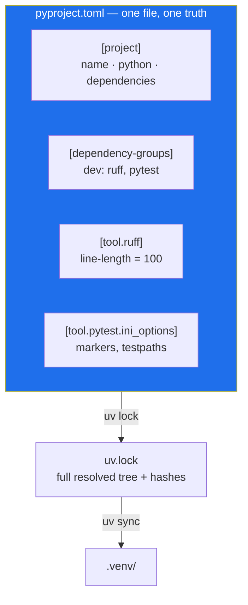

# 2.4 — `uv init`, `pyproject.toml` and the lockfile

## One-line answer

`pyproject.toml` is the one file that describes what this project **is** — its name, its Python
version, its dependencies and the configuration of every tool it uses — and `uv.lock` is the
machine-written record of what those descriptions **resolved to**, which is the only artifact that
can rebuild the environment exactly.

---

## The story

A project accumulates configuration the way a coat accumulates receipts.

The linter needs settings, so a `.flake8` file appears. The formatter disagrees about line length,
so a `setup.cfg` gains a section for it. The test runner needs a marker registered, so a `pytest.ini`
arrives. The import sorter has its own file. The type checker has another. None of these decisions
was wrong when it was made.

Six months later someone changes the line length in one of them and half the tools disagree with the
other half. The formatter reformats a file; the linter rejects the result. Neither is broken. They
are reading different files, both of which are true, and nobody can hold all six in their head at
once.

The failure has the same shape as [1.1](../01-toolchain/1.1-why-one-tool-owns-the-environment.md): **when
several places can be the source of truth, the source of truth is nowhere.** There, it was `PATH`
deciding which Python you got. Here, it is six config files deciding what "correct code" means.

The Python ecosystem converged on a fix, and it is a good one: **one file**. `pyproject.toml` holds
the project's identity, its dependencies, and a section per tool. One line length, one place, no
committee.

---

## The idea in plain language

### TOML, briefly

`pyproject.toml` is written in **TOML** — a small configuration format designed to be obvious.
Three constructs cover everything you will meet:

```text
key = "value"                  # a key and a string
numbers = [1, 2, 3]            # a list
[section]                      # a table: everything below belongs to it
[tool.ruff.lint]               # a nested table, three levels deep
```

**Reading it:**

- `key = "value"` — strings are quoted. TOML is stricter than YAML about this, which is a feature:
  there is no version where `yes` silently becomes a boolean.
- `numbers = [1, 2, 3]` — a list. It may span lines with a trailing comma, which is how dependency
  lists are usually written.
- `[section]` — a *table*. Everything after this line, until the next `[...]`, belongs to it.
- `[tool.ruff.lint]` — the dotted name is nesting: `tool` contains `ruff` contains `lint`. That
  `[tool.*]` prefix is reserved by the packaging standard for exactly this — **each tool gets its own
  namespace inside the one file**, which is what makes the "one file" answer possible at all.

### The three jobs `pyproject.toml` does

| Section | Answers |
| --- | --- |
| `[project]` | What is this? Name, version, description, Python version, dependencies. |
| `[dependency-groups]` | What do I need to *develop* it, but not to *run* it? |
| `[build-system]` and `[tool.*]` | How is it packaged, and how is each tool configured? |

The distinction in the middle row is worth being precise about. **Runtime dependencies** are what
the code needs to execute — for Sutra, eventually, the ADK and the provider SDKs. **Development
dependencies** are what you need to *work on* it — the linter, the test runner. A container shipping
Sutra needs the first group and not the second, and keeping them apart is what makes that possible.

Sutra's Day 0 has an unusual and deliberate answer to the first: **`dependencies = []`, an empty
list.** Nothing is installed at runtime yet, because nothing has been written yet. Packages arrive
**on the day they are first used** — `google-genai` on Day 2, `google-adk` on Day 5, `litellm` on
Day 9 — each with a dated row in `docs/PACKAGES.md`. That is Principle 7 expressed as a habit rather
than a slogan: a dependency you cannot name a reason and a date for is a dependency you have not
decided on.

### The manifest and the receipt, again

[1.3](../01-toolchain/1.3-uv-the-one-binary.md) introduced the pair; this is where you write them.

- **`pyproject.toml`** — hand-edited, short, human. What you asked for.
- **`uv.lock`** — machine-written, long, never hand-edited. What you got: the full transitive tree at
  exact versions, with hashes.

**Both are committed.** The manifest without the lock is a wish; the lock without the manifest is a
receipt with no shopping list.



---

## Why Sutra needs it

- **Principle 7 — never invent a version number.** `pyproject.toml` is where a pin becomes real, and
  `docs/PACKAGES.md` is where it becomes *dated*. The two together mean any pin in this repository
  can be traced to a day and a lookup.
- **Day 2 adds `google-genai`, Day 5 adds `google-adk`.** ADK 2.x differs from 1.x in four documented
  ways (plan §5.1). An exact pin is what lets you say with certainty which one you are running when
  a tutorial disagrees with your code.
- **Day 9 adds LiteLLM and four providers.** The widest dependency tree in the project, and the day
  the lockfile stops being theoretical.
- **Day 31 is the quality gate** (SK-20, OPS-08): `./m check` grows lint, tests, a skills lint, and a
  lint that every `openrouter/` model string ends in `:free`. Ruff's configuration lives in
  `[tool.ruff]` in this file, so today's `line-length` is the one that day enforces.
- **Day 86 containerises Sutra.** The Dockerfile copies two files, runs `uv sync --frozen`, and is
  done — but only because those two files are a complete description of the environment.
- **Day 92, the hardening pass**, asks "which exact versions are in there, and does any of them have
  a known vulnerability?" `uv.lock` is the only file in the repository that can answer.

---

## The mechanism

You are in the project folder, with `.gitignore` written and `git init` run.

```bash
uv init --python 3.12 --no-readme --vcs none
```

**Line by line:**

- `uv init` — creates `pyproject.toml` and `.python-version`. It does not install anything and does
  not create `.venv` yet.
- `--python 3.12` — records the interpreter choice from
  [1.4](../01-toolchain/1.4-python-3-12-under-uv.md) into `.python-version`.
- `--no-readme` — do not generate a placeholder `README.md`. You will write a real one in
  [4.1](../04-repo-memory/4.1-the-readme-that-a-stranger-reads.md), and a generated stub would only be in the
  way.
- `--vcs none` — do not run `git init` or write a `.gitignore`. You already did both, deliberately
  and in the right order ([2.2](2.2-gitignore-before-secrets-exist.md),
  [2.3](2.3-git-init-and-what-a-repo-is.md)). **This flag is the one that protects your work**:
  without it, `uv` would write its own generic `.gitignore` over the careful one you wrote, and the
  `.env` rule would silently become whatever `uv` ships by default.

Now replace the generated `pyproject.toml` with Sutra's:

```toml
[project]
name = "sutra"
version = "0.1.0"
description = "An autonomous support-ticket triage desk, built one day at a time with Google ADK 2.x, MCP, Agent Skills and A2A."
readme = "README.md"
requires-python = "==3.12.*"
# Principle 7: packages arrive on the day they are first used, pinned with ==, and every pin
# gets a dated row in docs/PACKAGES.md. Day 0 adds no runtime dependency at all.
dependencies = []

[dependency-groups]
dev = [
    "ruff==0.16.4",
    "pytest==9.1.1",
]

[build-system]
requires = ["hatchling"]
build-backend = "hatchling.build"

[tool.hatch.build.targets.wheel]
packages = ["sutra", "sutra_mcp"]

[tool.ruff]
line-length = 100
target-version = "py312"
extend-exclude = ["legacy", "days/*/lab"]

[tool.ruff.lint]
select = ["E", "F", "I", "UP", "B", "SIM"]

[tool.pytest.ini_options]
addopts = "-q --strict-markers"
testpaths = ["tests"]
markers = [
    "live: hits a real API, model or database - skipped by default, never run in CI",
    "slow: takes more than a few seconds",
]
```

**Line by line:**

- `name = "sutra"` — the distribution name. It matches the package directory from
  [2.1](2.1-the-folder-skeleton.md), which is one less thing to think about.
- `version = "0.1.0"` — required by the packaging standard. Sutra is not published anywhere, so it
  simply sits there.
- `requires-python = "==3.12.*"` — the constraint a *resolver* reads.
  [1.4](../01-toolchain/1.4-python-3-12-under-uv.md) explained the window; this is where it becomes
  enforceable. The `.*` accepts any patch release of 3.12 while refusing 3.11 and 3.13 — patch
  releases are bug fixes, so pinning tighter would buy nothing and break often.
- `dependencies = []` — empty on purpose, with the comment explaining why. An empty list with a
  reason is a decision; an empty list without one is an oversight.
- `[dependency-groups] dev` — the modern standard location for development-only dependencies. `uv`
  installs these by default on your machine and skips them when you ask for a runtime-only
  environment.
- `"ruff==0.16.4"` — the linter *and* formatter, one tool. **The exact `==` matters more for a
  formatter than for almost anything else**: two versions can format the same file differently, and
  a floating formatter means every colleague's save produces a diff. This version was resolved
  against PyPI on 2026-08-23; re-verify with the lookup command in *Check yourself*.
- `"pytest==9.1.1"` — the test runner. Read live from `pypi.org/pypi/pytest/json` on 2026-08-23.
- `[build-system]` — how the project is turned into an installable artifact. `hatchling` is the
  backend; you will not interact with it directly, but it is what allows `uv` to install your own
  code into `.venv` so `from sutra import ...` works from anywhere.
- `[tool.hatch.build.targets.wheel] packages` — names **both** top-level packages. Without
  `sutra_mcp` listed, only `sutra` would be installed, and the MCP server would be importable while
  you are standing in the project root and mysteriously not importable anywhere else.
- `[tool.ruff] line-length = 100` — wider than the 79-character default, narrower than unlimited.
  Chosen once, here, for everyone and every tool.
- `target-version = "py312"` — tells Ruff which syntax is legal, so its modernisation rules suggest
  3.12-appropriate code rather than something that will not parse.
- `extend-exclude` — Ruff must not lint `legacy/` (the previous run, frozen and read-only, see
  `legacy/README.md`) or `days/*/lab` (your scratch code, which is allowed to be messy — that is
  what scratch means).
- `[tool.ruff.lint] select` — which rule families are on. `E` and `F` are the classic style and logic
  checks; `I` sorts imports; `UP` rewrites outdated syntax; `B` catches likely bugs; `SIM` suggests
  simplifications. Six families is a deliberate middle: strict enough to be useful, quiet enough not
  to be ignored.
- `addopts = "-q --strict-markers"` — `-q` for quiet output, and `--strict-markers` so that a
  **typo'd marker fails loudly** instead of silently matching nothing. Without it, `-m "not live"`
  with a misspelled marker would run the live tests and spend real quota.
- `testpaths = ["tests"]` — where to look, so `pytest` does not wander into `days/` or `legacy/`.
- `markers` — every marker is declared, which is what `--strict-markers` enforces. The `live` marker
  is the one that matters for Principle 15: tests touching a real API are excluded by default and
  never run in CI, so no automated run can spend a free-tier quota.

Now install the development tools:

```bash
uv add --dev "ruff==0.16.4" "pytest==9.1.1"
```

**Line by line:**

- `uv add --dev` — resolve, install, and record into `[dependency-groups] dev`. Since the versions
  are already written above, this reconciles the file with reality and, crucially, **writes
  `uv.lock`**.
- The quotes protect `==` from the shell — a habit worth keeping, since some version specifiers
  contain characters bash would interpret.
- This is also the command that creates `.venv/`, which is [2.5](2.5-the-venv-you-never-activate.md)'s
  subject.

Look at what was written:

```bash
grep -c "\[\[package\]\]" uv.lock && head -12 uv.lock
```

**Line by line:**

- `grep -c "\[\[package\]\]"` — count the `[[package]]` blocks. Each is one resolved package. You
  asked for two and the number will be larger — `pytest` brings its own dependencies. That gap is
  what the lockfile exists to record.
- The backslashes escape the square brackets, which are otherwise a character class in a regular
  expression.
- `head -12` — the lockfile opens with a format version and the required Python range, then begins
  the package list. You never edit this file; you read it when you need to answer "what exactly is
  installed?"

---

## When it breaks

**`uv init` overwrites your `.gitignore`.** This is the trap the `--vcs none` flag exists for, and
it is silent:

```text
$ uv init --python 3.12
Initialized project `sutra`
$ cat .gitignore
# Python-generated files
__pycache__/
*.py[oc]
build/
dist/
wheels/
*.egg-info

# Virtual environments
.venv
```

Your careful file from [2.2](2.2-gitignore-before-secrets-exist.md) is gone, and with it the `.env`
rule — **and nothing warned you**. The next time you `git add -A` with a real key on disk, it goes
in. **The fix:** `git checkout .gitignore` if it was already committed, or rewrite it from
[2.2](2.2-gitignore-before-secrets-exist.md). **The prevention** is `--vcs none`, which is why the
flag is in the command above rather than left to a footnote.

**Malformed TOML:**

```text
$ uv sync
error: Failed to parse `pyproject.toml`
  Caused by: TOML parse error at line 12, column 1
     |
  12 | dependencies = [
     | ^
  invalid array
  expected `]`
```

**How to read it:** the line and column are exact, and the message names the construct. Here a list
was opened and never closed — almost always a missing `]` or a stray comma after removing the last
entry. TOML errors are refreshingly precise; trust the line number.

**A marker that does not exist, caught by `--strict-markers`:**

```text
$ uv run python -m pytest -m "not liv"
ERROR: Unknown pytest.mark.liv - is this a typo? You can register custom marks
to avoid this warning - for details, see
https://docs.pytest.org/en/stable/how-to/mark.html
```

This is the setting earning its place. Without `--strict-markers` that typo would have matched
nothing, silently included the live tests, and spent real quota against a free tier — a failure with
no error message at all. **An error you can see beats a behaviour you cannot.**

**A package that does not exist at that version.** The resolver's explanation, from
[1.3](../01-toolchain/1.3-uv-the-one-binary.md):

```text
$ uv add "ruff==0.99.0"
  × No solution found when resolving dependencies:
  ╰─▶ Because there is no version of ruff==0.99.0 and your project depends on ruff==0.99.0,
      we can conclude that your project's requirements are unsatisfiable.
```

The fix is Principle 7, always: look it up rather than remember it.

---

## In production

**The `--frozen` flag is the difference between a build and a hope.** On your laptop, `uv sync` may
update the lockfile if the manifest has drifted. In CI and in a container image, that is exactly
wrong: a build that can silently re-resolve is a build that can differ from the one you tested.

```text
uv sync --frozen        # fail if uv.lock does not already satisfy pyproject.toml
```

Day 86's Dockerfile will use it, and the failure mode it prevents — "works in CI, different in
production, no commit in between" — is one of the more expensive ones to diagnose because there is
nothing to look at.

**Dependency groups are why images stay small.** Shipping `ruff` and `pytest` into a production
container adds size and, more importantly, adds *attack surface* for no benefit. Separating them in
`[dependency-groups]` means the container build asks for runtime dependencies only. On Day 92's
hardening pass, "what is in the image that does not need to be?" is a question with a real answer
because the split was made today.

**Configuration in one file is a team decision, not a personal one.** The moment two people
disagree about line length, the disagreement should be settled in `pyproject.toml` and then be over
— not re-litigated per file, per editor, per review. This is why
[1.5](../01-toolchain/1.5-the-editor-and-the-interpreter-trap.md) pointed the editor's formatter at the same
pinned Ruff: **the gate and the editor must agree, or every save creates a diff the gate rejects.**

**What degrades at scale.** One `pyproject.toml` per repository works beautifully up to the point
where you have several packages that release independently. Then you reach for a *workspace*: one
lockfile, several manifests, explicit inter-package dependencies. `uv` supports this directly. The
signal that you need one is when `sutra_mcp` starts wanting a different release cadence than `sutra`
— which is a real possibility for a data boundary that other systems consume, and which the
directory split in [2.1](2.1-the-folder-skeleton.md) already prepared for.

**The review comment a senior engineer leaves.** On a pull request that adds a dependency to
`pyproject.toml` but does not touch `uv.lock`: *"The lock isn't in this diff. Either you hand-edited
the manifest, or you ran with `--no-sync` — either way `uv sync --frozen` will fail in CI. Run
`uv add` and commit both."* The principle behind it: **the manifest and the lockfile are one
artifact stored in two files**, and a change to one without the other is a half-committed change.

**The interview question.** *"Walk me through how you'd make a Python project reproducible."* The
answer builds a chain and names why each link matters: pin the interpreter version, declare direct
dependencies with exact versions, commit a lockfile with the full transitive tree and hashes,
install with a flag that refuses to re-resolve, and put every tool's configuration in one file so
that "correct" means one thing. A strong candidate adds the failure each link prevents — the story
from [1.3](../01-toolchain/1.3-uv-the-one-binary.md), where two identical checkouts produced two different
worlds because a `>=` constraint was honoured perfectly by both.

---

## Check yourself

Re-verify the two pins live, exactly as Principle 7 requires, and compare with the file:

```bash
for p in ruff pytest; do \
  printf "%-8s " "$p"; \
  curl -s "https://pypi.org/pypi/$p/json" | uv run python -c "import sys,json; print(json.load(sys.stdin)['info']['version'])"; \
done; grep -E "ruff|pytest" pyproject.toml
```

If PyPI now reports a newer version than the file pins, that is **not** a bug — a pin is a frozen
fact, not a promise to be current. The freshness check at each phase gate (plan §15) is where you
decide to move it, and moving it means a new dated row in `docs/PACKAGES.md`.

Then record today's rows in your Day 0 notes:

```text
| ruff   | 0.16.4 | <today> | 0 | Lint + format, one tool. Dev dependency. |
| pytest | 9.1.1  | <today> | 0 | The test runner behind ./m check. Dev dependency. |
```

**Answer out loud, without scrolling up:**

> Which of `pyproject.toml` and `uv.lock` do you edit by hand, and which one would you need to
> rebuild this environment exactly six months from now? And why does `uv init` get the `--vcs none`
> flag in this project?

---

**Next:** [2.5 — The virtual environment you never activate](2.5-the-venv-you-never-activate.md)
