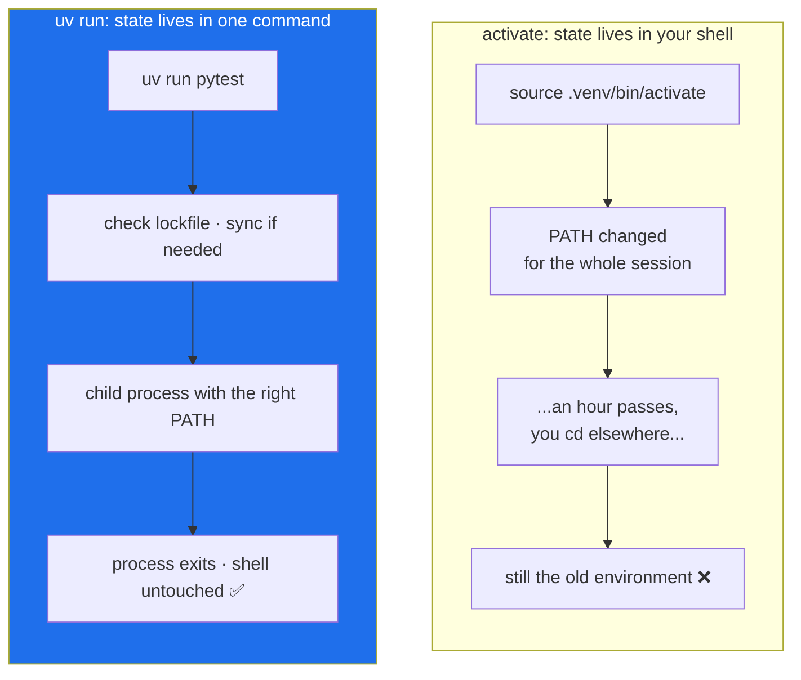

# 2.5 — The virtual environment you never activate

## One-line answer

`uv run <command>` puts the project's environment in place for exactly the duration of that one
command — which means there is **no shell state to remember, get wrong, or forget you are in**, and
that is the whole reason Sutra never types `activate`.

---

## The story

Someone is working on two projects in one afternoon. Both are Python. Both have their own
environment.

They open a terminal, activate the first project's environment, and work. Then a message arrives
about the second project, so they change directory and start working there. They run the tests. Two
of them fail with an import error.

They spend twenty minutes on it. The package is definitely installed — they can see it in the second
project's lockfile. They reinstall it. Same failure.

Eventually they look at their prompt, which has been quietly showing the name of the *first*
project's environment in brackets this entire time. Changing directory does not change the
environment. Activation is a property of **the shell**, not of the folder you are standing in. They
had walked into a different room and taken the first room's lighting with them.

Now the second version. In the other timeline, the same person never activates anything. They type
`uv run pytest` in the first project and `uv run pytest` in the second. Each command looks at the
directory it was run in, finds that project's environment, and uses it. The same eleven characters
do the right thing in both places, because the answer is derived from **where the command runs**
rather than from **what the shell remembers**.

The bug in the first timeline is not carelessness. It is that activation puts a piece of invisible
state into your session and then relies on you tracking it, across hours, across tabs, across the
one time you switched projects while thinking about something else.

---

## The idea in plain language

### What a virtual environment is, concretely

From [1.1](../01-toolchain/1.1-why-one-tool-owns-the-environment.md): an environment is one interpreter plus
one `site-packages`. A **virtual environment** is that pair, in a folder inside your project.

```text
.venv/
├── pyvenv.cfg          # a text file naming the base interpreter this was built from
├── Scripts/            # (bin/ on macOS and Linux)
│   ├── python.exe      # the interpreter for this project
│   ├── ruff.exe        # console scripts from installed packages land here too
│   └── pytest.exe
└── Lib/site-packages/  # (lib/pythonX.Y/site-packages/ elsewhere)
    └── ...             # every installed package
```

There is no magic in it. It is a folder with an interpreter and its packages, plus a small config
file recording which base interpreter it came from.

### What "activation" actually does

Activation is a shell script. It does three things and nothing more:

1. Puts `.venv/Scripts` (or `.venv/bin`) at the **front of `PATH`**, so that typing `python`,
   `pytest` or `ruff` finds the ones inside the environment first.
2. Sets an environment variable, `VIRTUAL_ENV`, pointing at the folder.
3. Changes your prompt to show the environment's name, so you can tell.

That is it. It is a `PATH` manipulation with a cosmetic reminder attached. And read it against
[1.1](../01-toolchain/1.1-why-one-tool-owns-the-environment.md) again: **activation is the same `PATH` lottery
as before, merely one you are deliberately rigging.** It works when you remember. It is a *state you
are in*, and every state you have to remember being in is a state you will eventually be in by
accident.

### What `uv run` does instead

```text
uv run pytest
```

`uv run` performs the same `PATH` arrangement — for the lifetime of one command, in a child process,
and then it is gone. Your shell is never modified, so there is nothing to leave behind. Before
running, it also checks that the environment matches `uv.lock` and syncs it if not, which means the
command *cannot* run against a stale environment.



> 💡 **The mental model:** activation is *entering a room*. `uv run` is *reaching through a window*.
> You cannot forget you are in a room you never entered.

**Sutra's rule, from here to Day 96:** every command that touches Python is `uv run ...`. The driver
script in [section 3](../03-the-m-driver/3.1-set-euo-pipefail.md) does this for you, which is why `./m check`
works the same way in your terminal, in your editor's terminal, and in CI — none of which share a
shell.

---

## Why Sutra needs it

- **`./m` is a script, and scripts have no shell to activate in.** A script runs in its own
  process; whatever you activated is not reliably there, and relying on it would mean `./m check`
  behaves differently depending on what you did ten minutes ago. Every Python line in
  [3.3](../03-the-m-driver/3.3-the-check-gate.md) is `uv run` for that reason.
- **Day 23 introduces tests**, and Day 31 makes `./m check` the gate. A test suite that passes only
  when your shell is in the right state is not a gate — it is a coincidence you have grown attached
  to.
- **Day 73 builds the nightly ambient job** — re-index, run the full evalset, post a digest. It is
  launched by a scheduler, not by you, with no interactive shell anywhere in the picture. Code that
  assumes activation cannot be automated.
- **Day 86 containerises Sutra.** A container's entry point runs one command in a fresh process. The
  habit you build here is the one that survives.
- **The four-Pythons problem from [1.1](../01-toolchain/1.1-why-one-tool-owns-the-environment.md) never fully
  goes away**; it is only ever *managed*. `uv run` manages it per command instead of per session,
  which is the smaller and safer unit.

---

## The mechanism

If you ran `uv add --dev` in [2.4](2.4-pyproject-and-the-lockfile.md), `.venv/` already exists. If
not, create it now:

```bash
uv sync
```

**Line by line:**

- Reads `uv.lock`, creates `.venv/` if missing, and installs exactly the locked set — no more, no
  less. If the environment already matches, it does almost nothing and says so.
- This is the command a colleague runs after cloning, and the one you run on a new machine. It is
  the moment the receipt from [1.3](../01-toolchain/1.3-uv-the-one-binary.md) becomes a working environment.

Look at what it made:

```bash
cat .venv/pyvenv.cfg
```

**Line by line:**

- A handful of `key = value` lines. `home` names the **base interpreter** this environment was built
  from — it should point at the `uv`-managed 3.12 from
  [1.4](../01-toolchain/1.4-python-3-12-under-uv.md), not at a system Python.
- `version` confirms the Python version, so you can check the environment matches
  `.python-version` without running anything.
- `include-system-site-packages = false` — the line that makes it *isolated*. If this were `true`,
  the environment could see the base interpreter's packages too, and you would be back to
  [1.1](../01-toolchain/1.1-why-one-tool-owns-the-environment.md)'s ambiguity with extra steps.

Now prove the two paths differ:

```bash
python -c "import sys; print('bare   :', sys.executable)" 2>/dev/null || echo "bare   : no python on PATH"
uv run python -c "import sys; print('uv run :', sys.executable)"
```

**Line by line:**

- The first line asks **whatever `PATH` decides** — one of the interpreters you counted in
  [1.1](../01-toolchain/1.1-why-one-tool-owns-the-environment.md), or none at all.
- `2>/dev/null || echo ...` — if there is no `python` on `PATH`, discard the error and print a
  readable message instead. `||` runs the right-hand side only when the left-hand side fails, which
  is the mirror of the `&&` from [1.2](../01-toolchain/1.2-git-and-the-unix-shell.md).
- The second line asks **the project**. It prints a path inside `.venv`.
- **Those two lines being different is the entire point of this part.** The first is a lottery; the
  second is an answer.

Console scripts work the same way:

```bash
uv run ruff --version
uv run python -m pytest --version
```

**Line by line:**

- `uv run ruff` — installed packages that ship a command-line entry point put it in
  `.venv/Scripts`, and `uv run` finds it there. You never need to know the path.
- `uv run python -m pytest` — the `-m` form asks **the interpreter** to run the module, which
  removes any remaining ambiguity about which pytest you got. It is the same
  belt-and-braces reasoning as `python -m pip` from
  [1.1](../01-toolchain/1.1-why-one-tool-owns-the-environment.md), and it is what
  [3.3](../03-the-m-driver/3.3-the-check-gate.md) uses.

One more, because it is genuinely useful and almost unknown:

```bash
uv run --with rich python -c "from rich import print; print('[bold cyan]hello[/]')"
```

**Line by line:**

- `--with rich` — install `rich` into a **temporary** overlay for this one command only. It is not
  added to `pyproject.toml`, not written to `uv.lock`, and not left in `.venv`.
- This is how you try a package without committing to it. Under Principle 7 — every dependency gets
  a dated row and a reason — being able to *experiment* without adding a dependency is what keeps
  the manifest honest.

---

## When it breaks

**The story's bug, reproduced.** Two projects, one activated shell:

```text
$ source ~/Projects/other/.venv/Scripts/activate
(other) $ cd ~/Projects/sutra
(other) $ python -m pytest
ModuleNotFoundError: No module named 'pytest'
```

**How to read it.** The `(other)` in the prompt is the clue, and it is the *only* clue — the
directory is right, the command is right, the project is fine. `cd` does not change the environment.
**The immediate fix** is `deactivate`. **The permanent fix** is to stop activating:

```text
$ deactivate
$ uv run python -m pytest
```

**A stale environment after switching branches.** You check out a branch that adds a dependency:

```text
$ git switch feature/day-09-providers
$ uv run python -c "import litellm"
```

Nothing fails, because `uv run` noticed `uv.lock` had changed and synced before running. **Compare
that with the activated workflow**, where the same move would give you a `ModuleNotFoundError` until
you remembered to reinstall. This is the quiet benefit that does not announce itself: `uv run`
checks the lockfile every time, so "I forgot to reinstall after pulling" stops being a category of
bug.

**A `.venv` built from the wrong base:**

```text
$ uv run python -V
Python 3.11.9
$ cat .python-version
3.12
```

The environment was created before the interpreter was pinned, and `uv sync` reuses an existing
`.venv` rather than second-guessing you. **The fix is to delete and rebuild** — the environment is
disposable by design, which is the point of never committing it:

```text
$ rm -rf .venv && uv sync
```

**Committing `.venv` by accident.** If it ever appears in `git status`, the ignore rule from
[2.2](2.2-gitignore-before-secrets-exist.md) is missing or the folder was tracked before the rule
existed. Check with the tool that explains itself:

```text
$ git check-ignore -v .venv/pyvenv.cfg
.gitignore:16:.venv/    .venv/pyvenv.cfg
```

If that prints nothing, the rule is not matching. If the folder is already tracked,
`git rm -r --cached .venv` removes it from the index while leaving it on disk — the same shape of
fix as the `.env` case, and a reminder that `.gitignore` never applies retroactively.

---

## In production

**Nothing activates anything in production, ever.** A container runs one process. A scheduler
launches a job. A CI runner executes a script. None of these has an interactive shell to hold
state, which means any workflow that depends on activation simply cannot be automated. If your local
habit is `uv run`, the transition to all three is *nothing* — the same command works. If your local
habit is activation, every automation is a translation exercise, and translation is where bugs live.

**Containers are the interesting exception, and worth understanding.** A Docker image often installs
into a virtual environment and then puts its `bin` directory on `PATH` in the image itself:

```text
ENV PATH="/app/.venv/bin:$PATH"
```

That looks like permanent activation, and it is — but it is *declared in a file, baked into an
image, and identical for every run*. It is not a state a human entered and might forget. **The
distinction that matters is not "activated versus not"; it is "state a human remembers versus state
an artifact declares."** Day 86's Dockerfile will do exactly this.

**What degrades at scale.** `uv run` re-checks the lockfile on every invocation. For one command
that is imperceptible. For a script running it in a tight loop, that check repeats needlessly — the
professional answer is either to do the work inside one `uv run` invocation, or, in CI where the
environment is built once and known good, to `uv sync --frozen` up front and then invoke the
`.venv` binaries directly. Note the shape of that trade-off: you give up the per-command safety
check in exchange for speed, in a context where a separate step has already provided the guarantee.
That is a reasonable trade. Doing it on your laptop, where nothing has provided the guarantee, is
not.

**`uv run --with` versus a real dependency.** The temporary overlay is excellent for exploration and
wrong for anything that ships. A script in `scripts/` that only works when someone remembers
`--with` is a script with an undeclared dependency — which is exactly the class of problem
`pyproject.toml` exists to eliminate. **The rule: if it runs twice, it belongs in the manifest, with
a dated row in `docs/PACKAGES.md`.**

**The review comment a senior engineer leaves.** On a pull request adding a CI step that runs
`pip install -r requirements.txt && pytest`: *"This installs into whatever Python the runner
happens to expose and ignores the lockfile. Use `uv sync --frozen` and `uv run`, so CI tests the
same environment we do."* The point behind it is that **CI's job is to reproduce your environment,
not to approximate it** — a green build against a different set of packages is worse than no build,
because you believe it.

**The interview question.** *"What does activating a virtual environment actually do?"* This is a
good screening question because the honest answer is unglamorous: it prepends a directory to `PATH`,
sets `VIRTUAL_ENV`, and changes the prompt. Candidates who think it is more magical than that
usually cannot debug it when it goes wrong. The follow-up worth volunteering: *"which is why I
prefer per-command execution — the state lives in the command instead of in my shell, so it works
identically in CI and in a container."*

---

## Check yourself

```bash
uv run python -c "import sys, pathlib; p = pathlib.Path(sys.executable); \
  print('interpreter:', p); \
  print('inside project:', pathlib.Path.cwd() in p.parents)"
```

The interpreter path must be inside your project's `.venv`, and the second line must print `True`.
If it prints `False`, `uv run` is finding a different project — check `pwd`.

**Answer out loud, without scrolling up:**

> Name the three things `activate` does. Then explain why `./m check` uses `uv run` even though you
> could have activated the environment first — and what would break if it did not.

---

**Section 2 is done.** You have a repository that cannot see a secret, a manifest and a lockfile
that describe the environment exactly, and an environment you never have to remember being in.
Section 3 builds the single entry point that ties them together.

**Next:** [3.1 — `set -euo pipefail`, the four words that make a script honest](../03-the-m-driver/3.1-set-euo-pipefail.md)
