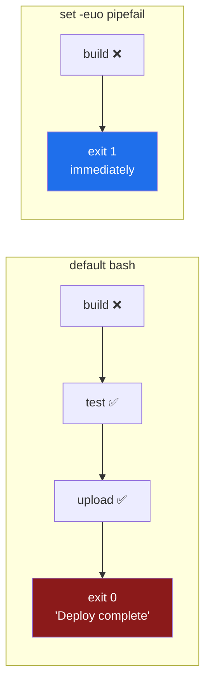

# 3.1 — `set -euo pipefail`, the four words that make a script honest

## One-line answer

By default a shell script **keeps going after a command fails**, treats a misspelled variable as an
empty string, and reports success for a pipeline whose first command died — and one line at the top
turns off all three, which is the difference between a gate you can trust and a gate that lies.

---

## The story

A deployment script has four steps: build the artifact, run the tests, upload it, restart the
service. It has run every week for a year.

One Tuesday the build fails. Something small — a disk full, a missing file, it hardly matters. The
build command prints an error and exits with a failure code.

The script does not stop. Nothing told it to. It moves to step two and runs the tests, which pass,
because they are testing yesterday's artifact — the new one was never built. It moves to step three
and uploads yesterday's artifact. It moves to step four and restarts the service.

The script prints `Deploy complete.` and exits successfully. Every dashboard is green. The change
that was supposed to ship did not ship, the tests that were supposed to guard it tested the wrong
thing, and the only evidence that anything went wrong is an error message scrolled off the top of a
log nobody will read.

Somebody finds it on Thursday, when a bug report describes behaviour that was supposedly fixed on
Tuesday.

**Nothing malfunctioned.** The shell did precisely what a shell does by default: it ran each line in
turn and did not concern itself with how the previous one felt about it. The script never said it
cared.

---

## The idea in plain language

Every command a shell runs returns an **exit status**: a number, where `0` means success and
anything else means failure. This is the opposite of what most programming makes you expect — zero
is truth here — and the reason is practical: there is one way to succeed and many ways to fail, so
the non-zero values carry the detail.

By default, bash reads that number and *does nothing with it*. Three specific gaps follow, and
`set -euo pipefail` closes all three. It is four settings in one line:

| Flag | Turns on | Without it |
| --- | --- | --- |
| `-e` | exit as soon as any command fails | the script carries on, as in the story |
| `-u` | treat an unset variable as an error | a typo silently becomes an empty string |
| `-o pipefail` | a pipeline fails if **any** stage fails | only the last stage's status counts |
| *(the `o` in `-euo`)* | is the option-name flag that `pipefail` needs | — |

### `-e` — stop at the first failure

Without it, the story happens. With it, the script exits the moment the build command returns
non-zero, and the exit status of the *script* is that failure, which means whatever ran the script
also learns about it.

`-e` has deliberate exceptions, and knowing them is what stops it from being surprising:

- A command in an `if` condition may fail — that is the whole point of testing it.
- A command followed by `||` may fail, because you have said what to do instead.
- Every command in a `&&` chain except the last may fail without exiting, because the chain itself
  is the test.

So `-e` does not mean "no command may ever fail". It means **"a failure you did not explicitly
handle stops everything"**, which is exactly the right default.

### `-u` — a typo is an error, not an empty string

```text
rm -rf "$BUILD_DIR/"
```

If `BUILD_DIR` is misspelled — or set somewhere that did not run — bash expands it to nothing, and
the command becomes `rm -rf "/"`. That is not a hypothetical; it is one of the most famous classes
of shell accident there is. With `-u`, bash refuses:
`BUILD_DIR: unbound variable`, and stops.

### `-o pipefail` — the whole pipeline counts

```text
generate_report | tee report.txt
```

A pipeline's exit status is, by default, the status of the **last** command. `tee` almost always
succeeds. So if `generate_report` dies halfway, the pipeline still reports success, you get a
truncated `report.txt`, and nothing complains. `pipefail` changes the rule: the pipeline's status
is that of the **rightmost command that failed**, so a failure anywhere is visible.



> 💡 **The mental model:** by default a shell script is a *list of suggestions*. `set -euo pipefail`
> makes it a *procedure*.

---

## Why Sutra needs it

`./m` is the gate. Every day ends by running it, and `./m done N`
([3.4](3.4-the-done-gate.md)) will not commit until it is green. **A gate that reports success after
a failed step is worse than no gate**, because it converts "I don't know if this works" into "I
believe this works", and the second one stops you looking.

- **[3.3](3.3-the-check-gate.md), `./m check`,** chains lint, format, tests, the depth contract and
  traceability. Without `-e`, a lint failure would be printed and then overwritten by four more
  steps, and the script would end by printing `OK all green`. That single line would be a lie, and
  it is the line you would trust.
- **Principle 10 — fail honestly.** The plan applies this to agents: *errors surface, escalate, and
  are logged; never fabricate a result to cover an error.* Then it adds, in parentheses, *"this
  applies to the human too"*. This line is that principle, written in bash, on the first script the
  project owns. It would be strange to demand honesty from a language model in an error path you
  have not demanded from your own tooling.
- **Day 21 — surface, don't swallow** (ADK-23, SEC-02), the fourth of the 1.x → 2.x traps in plan
  §5.1: ADK 1.x habits caught tool and model errors and returned them as strings, hiding failures;
  2.x surfaces exceptions through the runtime so callbacks and plugins can act on them. **`-e` is
  the same idea in a different language,** and meeting it here first means Day 21 is a recognition
  rather than an introduction.
- **Day 72 — backoff with honesty** (SEC-15, OPS-13): respect `retry-after`, back off, escalate
  after N tries, never invent a result. Same principle again, at the network layer.
- **Day 82 puts evals in CI.** A CI step's only output is an exit status. A script that always exits
  `0` makes a green build meaningless.

---

## The mechanism

Every script in this repository starts the same way. Create `m` in the project root:

```bash
cat > m <<'EOF'
#!/usr/bin/env bash
# Project Sutra daily driver. Replaces `make` (which is not installed on Windows).
set -euo pipefail
EOF
chmod +x m
```

**Line by line:**

- `cat > m <<'EOF'` — the heredoc from [2.2](../02-repo-skeleton/2.2-gitignore-before-secrets-exist.md). The
  quoted `'EOF'` keeps the body literal, which matters here because the file is full of `$`.
- `#!/usr/bin/env bash` — the **shebang**. The first two bytes, `#!`, tell the operating system that
  this file should be handed to an interpreter, and the rest of the line names it. Using
  `/usr/bin/env bash` rather than a hard-coded `/bin/bash` asks `env` to find bash **on `PATH`** —
  which matters because bash lives in different places on different systems, and on macOS the one at
  `/bin/bash` is an ancient version missing features this script uses.
- `set -euo pipefail` — the subject of this part. It goes on the line immediately after the shebang
  and the description, before anything can fail.
- `chmod +x m` — mark the file **executable**, so `./m` runs it. Without this you get
  `bash: ./m: Permission denied`, and would have to type `bash m` every time. The `+x` bit is stored
  by git, so it survives a clone.

Now watch each flag work. In a scratch file, not in `m`:

```bash
cat > /tmp/demo.sh <<'EOF'
echo "step 1"
false
echo "step 3 — should this run?"
EOF
bash /tmp/demo.sh; echo "exit status: $?"
```

**Line by line:**

- `false` — a real command whose entire job is to exit with status 1. Its counterpart `true` exits
  0. They exist for exactly this kind of demonstration.
- `bash /tmp/demo.sh` — run it without the shebang mattering, since bash is named explicitly.
- `echo "exit status: $?"` — `$?` holds the exit status of the previous command. This is how you ask
  bash "did that work?"
- **You will see all three lines print, and `exit status: 0`.** The script contained a failure and
  reported success. That is the default, and that is the story.

Now add the line:

```bash
cat > /tmp/demo.sh <<'EOF'
set -euo pipefail
echo "step 1"
false
echo "step 3 — should this run?"
EOF
bash /tmp/demo.sh; echo "exit status: $?"
```

**Line by line:**

- The only change is the first line.
- **You will see `step 1`, then nothing, then `exit status: 1`.** The script stopped at the failure
  and reported it. Note that bash prints no message of its own — `-e` is silent, and the failing
  command's own error output is what you read. That is why a script under `-e` should let its
  commands speak.

`-u`, which is the one that prevents accidents rather than mere confusion:

```bash
bash -c 'set -u; TARGET="/tmp/demo_dir"; echo "would remove: ${TARGE}/"'
```

**Line by line:**

- `bash -c '...'` — run the quoted string as a script, so nothing has to be saved to a file.
- `TARGET=` is set; `${TARGE}` is the typo. One letter.
- With `set -u` you get `bash: TARGE: unbound variable` and a non-zero exit. **Without it, that line
  would have printed `would remove: /`** — and if `echo` had been `rm -rf`, the typo would have been
  the last thing that script ever did politely.

And `pipefail`:

```bash
bash -c 'set -e;              false | true; echo "without pipefail: $?"'
bash -c 'set -e -o pipefail;  false | true; echo "with pipefail:    (never reached)"'
```

**Line by line:**

- `false | true` — a two-stage pipeline whose first stage fails and second stage succeeds. It is the
  minimal version of `generate_report | tee report.txt`.
- The first line prints `without pipefail: 0`. Even with `-e` active, the pipeline is considered
  successful, because only the last stage's status counted — **`-e` alone does not save you here.**
- The second line prints nothing at all: with `pipefail` the pipeline fails, `-e` sees it, and the
  script exits before reaching the `echo`.

Clean up:

```bash
rm -f /tmp/demo.sh
```

**Line by line:**

- `-f` — do not complain if the file is already gone, which keeps the command safe to re-run.

---

## When it breaks

**The strictness catches something you meant.** `grep` exits non-zero when it finds no match, which
is a *result*, not an error:

```text
$ ./m check
+ grep -q "TODO" README.md
$ echo $?
1
```

Under `-e`, "no TODOs found" would terminate your script. **The fix is to say you handled it**:

```bash
if grep -q "TODO" README.md; then
  echo "TODOs remain"
fi

# or, when you genuinely do not care either way:
grep -q "TODO" README.md || true
```

**Line by line:**

- `if grep -q ...` — a command in an `if` condition is exempt from `-e` by design. This is the
  clearest way to express "I am testing this, not requiring it".
- `|| true` — run `true` if `grep` fails, so the overall status is 0. Use it sparingly and only
  where the failure genuinely does not matter: **`|| true` is how you switch `-e` off for one line,
  and every use of it is a small promise that you thought about it.**

**`-u` and a variable that is legitimately optional.** `./m` takes an optional day number:

```text
$ ./m check
./m: line 6: $2: unbound variable
```

`$2` is the second argument, and `./m check` has only one. **The fix** is the default-value
expansion:

```bash
DAY="${2:-}"
```

**Line by line:**

- `${2:-}` — "the value of `$2`, or, if it is unset or empty, this empty string instead". The `:-`
  is the default-value operator, and everything after it is the default.
- `${2:-0}` would default to `0`; `${SUTRA_ENV:-dev}` is the common pattern for optional
  configuration. This is how you keep `-u` on while still having optional inputs — you declare the
  optionality instead of relying on silence.

**The shebang that is not found:**

```text
$ ./m check
bash: ./m: /usr/bin/env^M: bad interpreter: No such file or directory
```

Look at the `^M`. That is a carriage return — the invisible extra character Windows puts at the end
of each line ([1.2](../01-toolchain/1.2-git-and-the-unix-shell.md)). The system is looking for an interpreter
literally named `env\r`, which does not exist. **The fix** is the git line-ending setting from the
installer, or explicitly:

```text
$ git config core.autocrlf input      # commit LF, check out LF for this repo
$ dos2unix m                          # or: sed -i 's/\r$//' m
```

This is worth recognising instantly, because it will happen again on Day 86 when a script goes into
a Linux container, and the error there looks like a syntax error rather than a file-not-found.

**Permission denied:**

```text
$ ./m check
bash: ./m: Permission denied
```

The executable bit is missing. `chmod +x m`, and commit — git tracks that bit, so a colleague's
clone inherits it.

---

## In production

**`set -euo pipefail` is the first line of essentially every professional shell script**, and its
absence in a code review is a comment every time. It is so standard that some teams enforce it with
a linter — `shellcheck` is the usual one, and it catches this along with quoting bugs that are much
harder to see.

**Quoting is the fourth member of the family.** `-euo pipefail` does not protect you from an unquoted
variable containing a space:

```bash
rm -rf $BUILD_DIR      # if BUILD_DIR="/tmp/my project", this is two arguments
rm -rf "$BUILD_DIR"    # one argument, always
```

**Line by line:**

- `$BUILD_DIR` unquoted — bash performs *word splitting* on the result, so a value containing a
  space becomes two separate arguments. `rm -rf /tmp/my project` tries to remove `/tmp/my` and
  `project`, and the first of those may well exist.
- `"$BUILD_DIR"` quoted — the expansion stays one argument no matter what is inside it. This is why
  the quotes are not stylistic: they change how many arguments the command receives.

**The rule: quote every variable expansion unless you have a specific reason not to.** `shellcheck`
will tell you when you forget, which is why serious repositories run it in CI next to their other
linters.

**Where this stops being enough.** Bash is excellent up to about a hundred lines and increasingly
painful after that — error handling has no structure beyond `-e` and `trap`, data structures are
thin, and testing is awkward. The professional signal to switch languages is when your script starts
needing to *parse* things or *branch on data* rather than orchestrate commands. Sutra's `./m` stays
firmly on the right side of that line: it dispatches to Python for anything with logic
([3.2](3.2-the-case-dispatcher.md)), which is why the driver is under a hundred lines and the depth
check is a Python program.

**`trap` is what you reach for next.** When a script creates something that must be cleaned up
regardless of outcome, `-e` alone is not enough — it exits *before* your cleanup line:

```bash
tmp="$(mktemp -d)"
trap 'rm -rf "$tmp"' EXIT
```

**Line by line:**

- `mktemp -d` — create a uniquely-named temporary directory, safely, without guessing a name that
  might already exist.
- `trap '<command>' EXIT` — register a command to run when the script exits **for any reason**:
  success, failure under `-e`, or an interrupt. This is bash's version of a `finally` block, and it
  is the correct way to guarantee cleanup in a script that can exit at any line.

**What degrades at scale.** In CI, a script that exits non-zero fails the job — which is the whole
point, and also the thing that makes a missing `set -e` genuinely dangerous rather than merely
sloppy: it turns a red build green. In an orchestrator, a container's exit status decides whether it
is restarted or marked failed. **The exit status is the only thing the outside world can see**, so a
script that gets it wrong is invisible from every monitoring tool you own.

**The review comment a senior engineer leaves.** On a new shell script without the line: *"Add
`set -euo pipefail` — right now a failure in step 2 still exits 0, so CI will pass on a broken
build."* And on a script that has it but uses `|| true` in five places: *"Each of these switches off
the safety for one line. Are all five deliberate?"* The second comment is the more interesting one:
the flags are cheap, and the discipline is in not quietly undoing them.

**The interview question.** *"What does `set -euo pipefail` do, and what does `-e` **not** protect
you from?"* The first half is recall. The second half is the one that separates people who have
written scripts from people who have debugged them: `-e` does not fire inside `if` conditions, or
before `||` and `&&`, or — critically — for a failure in the middle of a pipeline unless `pipefail`
is also set. Adding that unquoted variables and missing `trap` cleanup are the two remaining common
bugs shows you have been bitten by this rather than read about it.

---

## Check yourself

```bash
head -3 m && bash -c 'set -euo pipefail; false; echo "unreachable"' ; echo "exit: $?"
```

The first three lines of `m` must be the shebang, the comment, and `set -euo pipefail`. The second
command must print **no** `unreachable` and report `exit: 1`.

**Answer out loud, without scrolling up:**

> Name what each of `-e`, `-u` and `pipefail` prevents, with an example of the bug each one catches.
> Then name two situations where `-e` deliberately does **not** stop the script.

---

**Next:** [3.2 — The `case` dispatcher: one script, one entry point](3.2-the-case-dispatcher.md)
