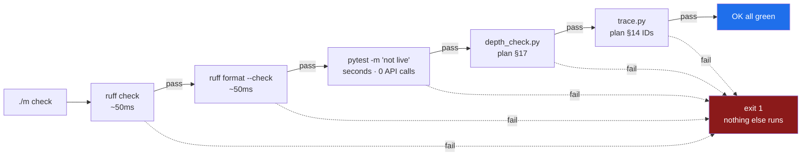

# 3.3 — `./m check`, the whole-project gate, and why its order matters

## One-line answer

`./m check` is the single sentence *"is this repository healthy?"* turned into a command — five
steps chained so that **the fastest, most-likely-to-fail step runs first**, and so that any one
failure stops the whole thing with a non-zero exit status.

---

## The story

A developer pushes a change at the end of the day. CI takes eleven minutes and comes back red: a
formatting violation on line 340 of a file they touched.

They fix the whitespace, push again, and wait eleven minutes. Red again — this time an unused import
the linter caught, in the same file, which the first run never reached because it stopped at the
formatter.

They fix that, push again, wait eleven minutes. Red again: a test fails.

An hour has gone. Three of those eleven-minute waits were spent discovering things a tool on their
own laptop could have told them in under two seconds — and the reason they did not know is not
laziness. It is that "run the checks" was four separate commands they would have had to remember in
the right order, and CI was the only place that knew the full list.

Two things went wrong, and they are different problems.

**The first** is that the list of checks lived in CI instead of in the repository. That is
[3.2](3.2-the-case-dispatcher.md)'s problem, and one entry point solves it.

**The second** is the one this part is about: even with one entry point, a gate that runs an
eleven-minute test suite before a two-second formatter check is *teaching you slowly*. The order of
steps in a gate is not cosmetic. It decides how quickly you find out you were wrong, and that
interval is the thing that determines whether people run the gate at all.

---

## The idea in plain language

A gate answers one question — **is this repository in a state I am willing to commit?** — by running
several checks and failing if any of them fails.

Two design rules make it useful rather than merely present.

**Rule 1: fail fast, cheapest first.** Order the steps by *time to run*, ascending, and by
*likelihood of failing*, descending. Formatting takes milliseconds and is violated constantly, so it
goes first. A test suite takes seconds to minutes, so it goes later. There is no value in learning
about a missing newline after a two-minute wait, and every time that happens people trust the gate a
little less.

**Rule 2: every step must be able to fail, and the failure must propagate.** A step that cannot go
red is decoration. A step that goes red without failing the script is worse than decoration, because
it is a red line in a log above a green summary. `set -euo pipefail`
([3.1](3.1-set-euo-pipefail.md)) is what makes propagation automatic.

### Sutra's five steps, in order

| # | Step | Catches | Speed |
| --- | --- | --- | --- |
| 1 | `ruff check .` | unused imports, undefined names, unsorted imports, likely bugs | milliseconds |
| 2 | `ruff format --check .` | formatting that differs from the pinned formatter | milliseconds |
| 3 | `pytest -m "not live"` | broken behaviour — **offline tests only** | seconds |
| 4 | `depth_check.py` | a day document that violates plan §17 | milliseconds |
| 5 | `trace.py` | an ID claimed that the plan never assigned, or a green day missing one | milliseconds |

Steps 4 and 5 are what make this gate specific to Sutra rather than generic. **This project's
deliverable is half code and half documents**, so a gate that only checks the code is checking half
the repository. `depth_check.py` reads every written day and refuses a missing *In production*
section, a code block nobody explained, a numbering gap, or a smuggled-in time estimate. `trace.py`
cross-checks the IDs each day claims against the plan's §14.

### The one flag that matters most: `-m "not live"`

```text
uv run python -m pytest -q -m "not live"
```

`-m` selects tests by **marker**. Sutra registers two markers in `pyproject.toml`
([2.4](../02-repo-skeleton/2.4-pyproject-and-the-lockfile.md)), and `live` means *this test hits a real API, model
or database*.

`not live` excludes them. That single expression is Principle 15 — *zero budget is a feature* —
enforced mechanically:

- **`./m check` must be runnable constantly**, dozens of times a day. If it spent free-tier quota,
  you would run it less, and a gate you avoid is not a gate.
- **CI must never spend quota.** No key is present in CI, no offline test asks for one, and so a red
  build always means you broke something rather than that a rate limit was hit.
- **A test that requires a network is not a unit test.** It is an integration test, and mixing the
  two makes the fast suite as unreliable as the slow one.

`--strict-markers` in `pyproject.toml` is the companion setting that makes this safe: a typo in a
marker name is an error rather than a filter that silently matches nothing and runs the live tests
anyway.



> 💡 **The mental model:** `./m check` is a **claim**, not a report. When it prints `OK all green`,
> the repository is asserting something about itself — and every step you add is a promise the
> project is now making.

---

## Why Sutra needs it

- **Principle 6 — verify the whole project after every step.** *"Each day ends with the full check
  suite green, not just today's snippet."* That is this command, and the word *whole* is why the
  gate covers documents as well as code.
- **Principle 11 — evals are tests.** From Day 23 the suite grows unit tests; from Day 79 it grows
  evalsets; from Day 82 evals run in CI. The gate is the container all of that arrives into, so it
  is built on Day 0 with room to grow.
- **Day 31 is the quality gate** (SK-20, OPS-08). It adds a skills lint and a lint asserting every
  `openrouter/` model string ends in `:free` — because a missing `:free` suffix silently selects a
  **paid** model (Addendum 02 §7). That is a lint whose absence costs money, and it lands here.
- **Day 92, the hardening pass**, is a review of everything before the repo goes public. A gate that
  has been green every day for ninety-two days is a much shorter review than one introduced at the
  end.
- **`./m done N` refuses to commit until this passes** ([3.4](3.4-the-done-gate.md)). The gate is
  what gives the word "done" a definition.

---

## The mechanism

Add the branch to `m`, after the verbs from [3.2](3.2-the-case-dispatcher.md):

```bash
  check)
    uv run ruff check .
    uv run ruff format --check .
    # pytest exits 5 for "no tests collected". Before Day 23 there are none, and an empty suite
    # is not a failure - so 0 and 5 pass and everything else stops the gate.
    uv run python -m pytest -q -m "not live" || [ $? -eq 5 ]
    uv run python scripts/depth_check.py
    uv run python scripts/trace.py
    echo "OK all green"
    ;;
```

**Line by line:**

- **No `&&` between the lines, and none is needed.** `set -euo pipefail` from
  [3.1](3.1-set-euo-pipefail.md) already exits on the first non-zero status. Writing `&&` here would
  be redundant, and — more importantly — it would suggest that the safety comes from the chaining
  rather than from the flag, which is the wrong thing to learn.
- `uv run ruff check .` — the linter, over the whole repository. The `.` is the path; Ruff reads its
  configuration from `[tool.ruff]` in `pyproject.toml`, including `extend-exclude`, so `legacy/` and
  `days/*/lab` are skipped ([2.4](../02-repo-skeleton/2.4-pyproject-and-the-lockfile.md)).
- `uv run ruff format --check .` — the formatter in **check mode**: report files that would change,
  change nothing. In a gate this is the only correct mode. A gate that *modifies* your files is a
  gate that can turn a red state green without you seeing what it did, and it will eventually
  reformat something during a commit and confuse everyone.
- `uv run python -m pytest` — the `-m` module form, which asks the interpreter to run pytest rather
  than trusting a `pytest` on `PATH` ([2.5](../02-repo-skeleton/2.5-the-venv-you-never-activate.md)). Belt and
  braces, and the belt is free.
- `-q` — quiet. A gate that prints forty lines on success trains you to skip its output, and then
  you skip it on the day it says something.
- `-m "not live"` — the marker filter. Zero API calls, zero quota, zero dollars.
- `|| [ $? -eq 5 ]` — the one piece of this gate that is not obvious, and you will hit it on Day 0.
  **pytest exits `5` when it collected no tests at all**, and under `set -e`
  ([3.1](3.1-set-euo-pipefail.md)) that non-zero status would stop the gate — so a repository with
  no tests yet could never be green. `[ $? -eq 5 ]` tests the exit status and succeeds only for that
  one value, so `0` (passed) and `5` (nothing to run) both continue and every other status still
  stops. Note that `$?` here is pytest's status, because `||` runs its right-hand side immediately
  after the left-hand side fails.
- **Why not just `|| true`?** Because that would swallow a *real* test failure as well, which is
  precisely the "switch off the check" move that [3.1](3.1-set-euo-pipefail.md) warns about. The
  narrow test says exactly what is being permitted: an empty suite, and nothing else. From Day 23
  there are tests, so `5` stops occurring and the branch becomes dead — harmless, and honest about
  what it was for.
- `uv run python scripts/depth_check.py` — with no day number it checks every day that has a
  `parts/` directory, so an old day cannot silently rot while you write a new one.
- `uv run python scripts/trace.py` — regenerates `docs/TRACEABILITY.md` and
  `docs/CURRICULUM_INDEX.md`, and **exits non-zero if it found a problem** — a day claiming an ID
  the plan never gave it, or a completed day whose hub does not claim an ID it should.
- `echo "OK all green"` — the claim. It is the last line for a reason: under `-e`, reaching it means
  every step above succeeded.

Run it:

```bash
./m check
```

**Line by line:**

- The first run installs the development tools if `.venv` is not yet populated — `uv run` syncs
  before running ([2.5](../02-repo-skeleton/2.5-the-venv-you-never-activate.md)), so there is no separate setup
  step to forget.
- With no tests written yet, pytest reports `no tests ran`. **That is a pass, not a failure**, and it
  is worth noticing now: an empty suite is green. This is why Principle 11 insists on a test that
  *can* go red — a suite that cannot fail proves nothing, and an empty one is the limiting case of
  that.

Now the part that matters more than running it: **break it on purpose, and watch each step fail.**

```bash
printf 'import os\nx=1\n' > tests/test_scratch.py
./m check; echo "exit: $?"
```

**Line by line:**

- `printf 'import os\nx=1\n'` — deliberately bad on two counts: `os` is imported and never used, and
  `x=1` has no spaces around the `=`. `printf` is used rather than `echo` because its handling of
  `\n` is consistent across shells.
- You should see Ruff report `F401 [*] os imported but unused` and stop. **`exit: 1`.** Steps two
  through five never ran — that is fail-fast working.

Fix the lint error but leave the formatting one:

```bash
printf 'x=1\n' > tests/test_scratch.py
./m check; echo "exit: $?"
```

**Line by line:**

- Now `ruff check` passes and `ruff format --check` fails, reporting that the file *would be*
  reformatted. Notice the wording — it did not reformat it.
- To see what it wanted: `uv run ruff format --diff tests/test_scratch.py`, which prints the change
  without applying it. To accept: `uv run ruff format .`, which is the command you run *before* the
  gate, never inside it.

Clean up:

```bash
rm tests/test_scratch.py && ./m check
```

**Line by line:**

- Back to green. **You have now seen the gate go red twice and recover**, which is the only way to
  know it works. A gate you have never seen fail is a gate you are trusting on faith.

---

## When it breaks

**Ruff's lint failure, in full:**

```text
F401 [*] `os` imported but unused
 --> tests/test_scratch.py:1:8
  |
1 | import os
  |        ^^
2 | x=1
  |
help: Remove unused import: `os`

Found 1 error.
[*] 1 fixable with the `--fix` option.
```

**How to read it.** `F401` is the rule code — `F` is the pyflakes family, enabled by `select` in
`pyproject.toml`. The `[*]` means Ruff can fix it automatically. The caret points at the exact
token. **The fix** is `uv run ruff check --fix .` for the mechanical ones, and reading the code for
the rest — `--fix` is deliberately *not* in the gate, because a gate that edits your files is a gate
that can hide what it changed.

**The formatter's failure, which is quieter:**

```text
Would reformat: tests/test_scratch.py
1 file would be reformatted, 30 files already formatted
```

No line numbers, no rule code — the formatter has no opinions to explain, only a canonical output.
`uv run ruff format --diff <file>` shows the change; `uv run ruff format .` applies it.

**The depth contract refusing a day:**

```text
FAIL day   0  3 problems
       - parts/02-repo-skeleton/2.2-gitignore-before-secrets-exist.md: missing required section: in production
       - parts/03-the-m-driver/3.1-set-euo-pipefail.md: code block at line 118 has no 'Line by line' walkthrough
       - LESSON.md: §2 map does not link parts/04-repo-memory/4.3-the-first-commit-and-breaking-it.md

depth contract: 0/1 days pass
```

**How to read it.** Each line names a file and one violation of plan §17. The first says a part
stopped at the working example and never reached production — the failure §17.8 exists to prevent.
The second says a code block was shown without explaining it, which the plan calls *a bug in the
doc*. The third says a part exists on disk but is unreachable from the hub, so a reader following
the map would never find it. **None of these is a style preference.** Each one is a specific way a
document fails a reader, encoded so it can be caught before the reader meets it.

**Traceability catching a mismatch:**

```text
traceability: 4/199 closed, 1 problem(s); index: 199 IDs

## 🐛 Problems
- day 5 claims IDs not assigned by the plan: ['ADK-11']
```

**What it means.** The plan's §14 assigns `ADK-11` to Day 10. Day 5's hub claims it. Either the day
document is wrong, or reality has diverged from the plan — and per Principle 14, if it is the
latter, **the plan is amended first**, with an entry in `docs/CHANGELOG_PLAN.md`. What you must not
do is quietly change the number to make the error go away.

**The gate stopping silently after the formatter** — the Day 0 bug, if you omit the exit-5 branch:

```text
$ ./m check
All checks passed!
49 files already formatted
$ echo $?
5
```

Read what is *missing*: the depth check and the traceability line never printed, and there is no
error message. pytest collected no tests, exited `5`, and `set -e` stopped the script there. **A
failure with no output is the worst kind**, because the terminal looks like a successful run that
happened to be short. `|| [ $? -eq 5 ]` in the branch above is the fix, and this is why it is there
rather than in a footnote.

**pytest passing suspiciously fast:**

```text
no tests ran in 0.01s
```

Green, and meaningless. On Day 0 that is expected. From Day 23, if you see it after writing tests,
check `testpaths` in `pyproject.toml` and that your files are named `test_*.py` — pytest only
collects files matching that pattern, and a file named `tests_thing.py` is invisible to it.

---

## In production

**A gate is a contract about what a green build means.** The most damaging failure mode is not a
gate that is too strict; it is a gate that is green when the repository is broken. Every step you
*remove* to make the gate faster is a promise you stop making. Every step you add that cannot
actually fail is a promise you are pretending to make. Both are worse than an honest, smaller gate.

**Local and CI must run the same command.** CI's job is to reproduce your environment, not to
approximate it, and CI running its own list of steps is how you get the eleven-minute loop from the
story. A CI configuration for this project is three lines: check out, install `uv`, run `./m check`.
If CI needs to do something extra, that something belongs in `./m check` so you can run it too.

**Speed is a feature of a gate, not a luxury.** There is a threshold — somewhere around ten seconds
— above which people stop running a check before pushing and start using CI as their linter. Once
that happens the feedback loop is minutes instead of milliseconds, and the gate has failed at its
actual job even though it still works. **This is why cheapest-first ordering matters:** it keeps the
common case fast, because the common case is a formatting slip caught in fifty milliseconds.

**What degrades at scale.** As a test suite grows past a few minutes, teams split the gate: a fast
`check` on every commit, and a slower `check-all` nightly or on the main branch — which is exactly
what Sutra will do on **Day 82**, when the full evalset moves to the Day 73 nightly job while a small
subset stays in the fast path. **The split is a real trade-off**, not a free optimisation: you buy
speed by accepting that some failures are discovered later, so what goes in the fast path should be
what fails most often.

**Auto-fixing belongs before the gate, never inside it.** Some teams run `ruff format` (no `--check`)
in a pre-commit hook, so files are formatted as they are staged, and `--check` in CI as the
backstop. That is a reasonable pattern. What is not reasonable is a *gate* that fixes: the point of a
gate is to make a statement about the repository as it stands, and a gate that changes the
repository has answered a different question than the one you asked.

**The review comment a senior engineer leaves.** On a pull request adding `|| true` to a gate step
that keeps failing: *"This doesn't fix the check, it deletes it. If the step is wrong, remove it and
say why in the commit; if it's right, fix the code."* The principle: **a check that cannot fail is
not a check**, and disabling one silently is worse than never having added it, because the log still
shows a line that looks like verification.

**The interview question.** *"What runs in your CI, and why in that order?"* Weak answers list tools.
Strong answers explain the ordering as a feedback-loop decision — cheapest and most-likely-to-fail
first, so the common case is fast — and mention what is deliberately *excluded* from the fast path
and where it runs instead. If you can add that your CI runs the same entry point developers run, so
a green build and a green terminal are the same statement, you have described a system rather than a
tool list.

---

## Check yourself

Break it, watch it fail, fix it — the full cycle in one command:

```bash
printf 'import os\n' > tests/test_scratch.py && \
  { ./m check || echo ">>> gate correctly refused, exit $?"; } && \
  rm tests/test_scratch.py && ./m check
```

You must see Ruff report `F401`, then the `>>>` line, then `OK all green`. If the gate printed
`OK all green` on the first run, something is wrong — most likely `set -euo pipefail` is missing
from `m` ([3.1](3.1-set-euo-pipefail.md)).

**Answer out loud, without scrolling up:**

> Why does `ruff format --check` appear in the gate rather than plain `ruff format`? And what
> exactly does `-m "not live"` protect, given that no test in this repository hits an API yet?

---

**Next:** [3.4 — `./m done`, a gate that refuses you](3.4-the-done-gate.md)
