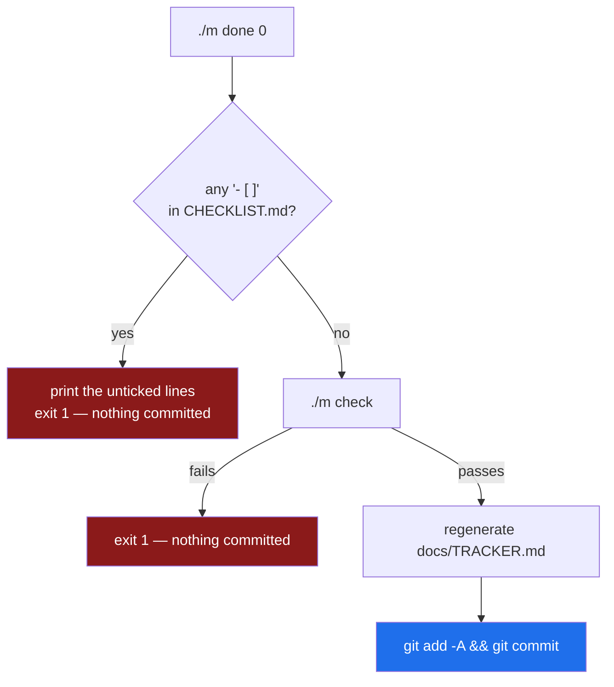

# 3.4 — `./m done`, a gate that refuses you

## One-line answer

`./m done N` will not commit a day while its `CHECKLIST.md` still has an unticked box — which turns
"done" from **a feeling you have at 11pm** into a condition the repository can check.

---

## The story

Somebody is working through a long technical course. They are three months in and doing well.

On a Tuesday they reach a topic that is genuinely hard. They read the material twice. The second
reading is better than the first, but there is a section — the one about how the pieces interact
under failure — that they follow *while reading* and could not reproduce afterwards.

It is late. The next day looks more interesting. And there is a quiet, entirely reasonable thought
available: *I've read it. I'll come back to that bit.*

They mark it complete and move on.

Six weeks later something breaks in a way that only makes sense if you understand how the pieces
interact under failure. They spend two days on it. The two days are not the cost of a hard bug; they
are the deferred cost of a Tuesday evening, collected with interest, at a moment when there is also
something else to do.

**Nobody was dishonest.** "Done" had no definition, so it defaulted to *"I have stopped working on
it"* — which is a fact about the clock, not about the learner. And when the only thing standing
between you and the next topic is your own judgement at the end of a long day, your own judgement is
being asked to arbitrate a case it is not neutral in.

The fix is not more willpower. It is to write down what done means **while you are fresh**, at the
start, and then to have something that is not you check it at the end.

---

## The idea in plain language

**A definition of done is a list of conditions, written before the work, checked after it.**

The key property is the *before*. A checklist written at the start of a day is written by someone
with no stake in finishing early. A checklist written at the end is a description of what you
happened to do. Sutra's day documents ship `CHECKLIST.md` alongside the hub for exactly this reason:
the standard arrives with the day, not after it.

`./m done N` makes that list binding in the simplest possible way:

1. Look at `days/day-NN/CHECKLIST.md`.
2. If any line starts with `- [ ]` — an unticked Markdown checkbox — **print the offending lines and
   refuse.**
3. Otherwise run `./m check` ([3.3](3.3-the-check-gate.md)).
4. Regenerate the tracker.
5. Commit.

That is the whole mechanism. It is deliberately unsophisticated, because a gate you could not
implement in fifteen lines is a gate you will eventually work around.

### What a checkbox actually asserts

Sutra's checklists mix four kinds of box, and they are not the same kind of claim:

| Kind | Example | Who verifies |
| --- | --- | --- |
| **Mechanical** | `uv --version` prints a version | the command, when you run it |
| **Per-part** | read `2.2`, ran its check-yourself, answered its question out loud | you |
| **Behavioural** | broke the gate on purpose, watched it go red, fixed it | you, having seen it |
| **Understanding** | can explain why `.gitignore` came before `.env` | you, out loud |

Only the first kind can be automatically verified, and that is fine — **the gate is not a lie
detector.** Its job is to make the act of skipping something *explicit*. Ticking a box you did not
do is a decision you have to make, on the record, rather than a thought you have at the end of a
long evening. That distinction is small and it is most of the value.

The *"answer out loud"* instruction in every part's **Check yourself** is not a quirk. Reading
produces a strong feeling of understanding; explaining produces evidence. The gap between the two is
where the story above lives, and speaking is the cheapest instrument that measures it.

### What the gate must never become

Two failure modes, both worth naming before you build it:

- **A gate on the clock.** Nothing in `./m done` looks at elapsed time, and nothing ever will. That
  is Principle 17 — *a day is a unit of subject, not a unit of time* — and it is why no day document
  in this project carries a time estimate. `./m depth` fails the day if one appears
  ([3.3](3.3-the-check-gate.md)).
- **A gate you routinely bypass.** `git commit` still exists; `./m done` is not a lock. **A gate's
  authority comes from being cheap to satisfy honestly**, not from being impossible to circumvent.
  If you find yourself bypassing it regularly, the checklist is wrong — fix the checklist, and say
  so in the commit.



> 💡 **The mental model:** `./m check` asks *"is the repository healthy?"* `./m done` asks *"is this
> day finished?"* — and those are different questions, which is why they are different commands.

---

## Why Sutra needs it

- **Principle 2 — one day, one document, one commit.** This command is where that ritual is
  enforced. Ninety-seven days, ninety-seven commits, each one meaning the same thing.
- **Plan §15: a phase is green only when every day in it has a row in `docs/PROGRESS.md` with gates
  green.** `./m done` is what produces those rows honestly, and `scripts/trace.py` treats a day with
  a `PROGRESS.md` row as *closed* — so a dishonest tick propagates into the traceability report.
  The ledger is only as good as this gate.
- **Day 31, the quality gate** (SK-20, OPS-08), and every phase gate after it, depend on the days
  beneath them actually being finished. A phase gate is a claim about seven days; if any of those
  seven was ticked at 11pm on faith, the phase gate inherits the debt.
- **Day 62 to 65 build human-in-the-loop approval gates** (AG-23, ADK-46, SEC-05, ADK-47): an agent
  that wants to write something externally stops and waits for a person. **`./m done` is the same
  shape, with the roles reversed** — here the *machine* is the checkpoint and *you* are the process
  being gated. Having lived on the receiving end of a refusal for sixty-two days makes those days
  much easier to design well.
- **Principle 10 — fail honestly**, with the plan's own parenthesis: *"this applies to the human
  too."* This part is that parenthesis.

---

## The mechanism

Add the final branch to `m`:

```bash
  done)
    [ -z "$DAY" ] && { echo "usage: ./m done <day>"; exit 1; }
    D="$(daydir "$DAY")"
    [ -n "$D" ] || { echo "no day folder for $DAY"; exit 1; }
    C="$D/CHECKLIST.md"
    [ -f "$C" ] || { echo "FAIL no $C"; exit 1; }
    if grep -q '^- \[ \]' "$C"; then
      echo "FAIL unticked boxes remain in $C"; grep -n '^- \[ \]' "$C"; exit 1
    fi
    "$0" check
    uv run python scripts/tracker.py
    git add -A && git commit -m "day-$(pad "$DAY"): complete"
    echo "OK day $DAY committed"
    ;;
```

**Line by line:**

- `[ -z "$DAY" ] && { ...; exit 1; }` — the day number is required here, unlike `./m depth` where it
  is optional. "Finish everything" is not a coherent request.
- `C="$D/CHECKLIST.md"` — name it once, use it four times. A path repeated four times is a path that
  will eventually be typed differently once.
- `[ -f "$C" ] || { echo "FAIL no $C"; exit 1; }` — a day with no checklist has **no definition of
  done**, so the honest answer is to refuse rather than to invent one.
- `grep -q '^- \[ \]' "$C"` — the heart of it. `^` anchors to the start of a line, so a checkbox
  mentioned mid-sentence in prose is not matched. `\[` and `\]` escape the brackets, which are a
  character class in a regular expression otherwise. `-q` is **quiet**: produce no output, just an
  exit status, because here you only want the yes-or-no.
- The single quotes around the pattern stop bash from touching the backslashes before `grep` sees
  them.
- `if grep -q ...; then` — a command in an `if` condition is exempt from `-e`
  ([3.1](3.1-set-euo-pipefail.md)), which is exactly what you need: `grep` failing to find a match is
  the *success* case here.
- `grep -n '^- \[ \]' "$C"` — inside the failure branch, run it again **with** `-n` to print the
  line numbers and the text. The gate does not merely refuse; it tells you precisely what is
  outstanding. **A gate that says "no" without saying "why" gets bypassed.**
- `exit 1` — non-zero, so a wrapping script or CI job also learns this failed.
- `"$0" check` — `$0` is the path this script was invoked as, so the script calls **itself**. That
  guarantees `done` runs exactly the same gate as `./m check`, forever, even after
  [3.3](3.3-the-check-gate.md)'s list grows on Day 31. Copying the five steps here instead would
  reintroduce the drift problem from [3.2](3.2-the-case-dispatcher.md), inside a single file.
- `uv run python scripts/tracker.py` — regenerate `docs/TRACKER.md` **before** committing, so the
  progress table is part of the same commit as the day it describes. A tracker updated in a separate
  commit is a tracker that is briefly wrong, and briefly-wrong generated files are how people learn
  to distrust them.
- `git add -A` — stage everything, including deletions. This is safe **only because of
  [2.2](../02-repo-skeleton/2.2-gitignore-before-secrets-exist.md)**: `.env` is ignored, so "everything" cannot
  include a key. That ordering — the ignore rule written on Day 0, before any secret existed — is
  what makes a blanket `add -A` an acceptable thing to automate.
- `git commit -m "day-$(pad "$DAY"): complete"` — a uniform message with a zero-padded number, so
  `git log --oneline` sorts and reads cleanly across ninety-seven entries.
- `echo "OK day $DAY committed"` — under `-e`, reaching this line means everything above succeeded.

Now **watch it refuse you**, which is the point of this part. Create a checklist with one unticked
box:

```bash
mkdir -p days/day-00
cat > days/day-00-toolchain-skeleton-driver/CHECKLIST.md <<'EOF'
# Day 0 — CHECKLIST (temporary, for testing the gate)

- [x] uv installed
- [ ] this box is deliberately unticked
EOF
./m done 0; echo "exit: $?"
```

**Line by line:**

- Two boxes: one ticked with `[x]`, one unticked with `[ ]`. The space inside the brackets is the
  entire difference, which is why the `grep` pattern has to be exact.
- You should see:

```text
FAIL unticked boxes remain in days/day-00-toolchain-skeleton-driver/CHECKLIST.md
4:- [ ] this box is deliberately unticked
exit: 1
```

- **Nothing was committed.** `git log` is unchanged. The gate refused before it ran a single check,
  which is correct — there is no point verifying a repository for a day that is not finished.

Now tick it and watch the gate proceed:

```bash
sed -i 's/^- \[ \] this box/- [x] this box/' days/day-00-toolchain-skeleton-driver/CHECKLIST.md
./m done 0; echo "exit: $?"
```

**Line by line:**

- `sed -i` — edit the file **i**n place. `s/old/new/` is substitute; the `^` anchors to the line
  start so only the checkbox is touched.
- Now the checklist passes and `./m check` runs. On Day 0, before the hub exists, `depth_check.py`
  will refuse — *"LESSON.md: missing"* — and the commit will not happen. **That is the gate working
  twice in one command**: the checklist was satisfied, and the repository still was not ready.

Remove the temporary file; the real one arrives with the day:

```bash
rm days/day-00-toolchain-skeleton-driver/CHECKLIST.md
```

**Line by line:**

- The checklist you keep is the one shipped with the finished day. This one existed only so that you
  have now *seen* the refusal rather than trusting that it happens.

---

## When it breaks

**A box that looks ticked and is not:**

```text
$ ./m done 0
FAIL unticked boxes remain in days/day-00-toolchain-skeleton-driver/CHECKLIST.md
17:- [ ]  Read part 2.2 and answered its question out loud
```

You are certain you ticked it. Look closely: `- [ ]` with *two* spaces after it is still unticked —
the marker is the bracket pair, not the spacing. Similarly `- [X]` with a capital X **is** accepted
by this gate (the pattern only matches an empty box), but some Markdown renderers display it
differently, so lower-case `x` is the safer habit.

**A tick that does not match because of the prefix:**

```text
  - [ ] an indented sub-item
```

The pattern is anchored with `^-`, so an **indented** checkbox is invisible to the gate. That is a
real limitation of the fifteen-line implementation, and worth knowing rather than discovering: keep
checklist boxes at the left margin, or the gate silently ignores them. *(Loosening the pattern to
`^\s*- \[ \]` would fix it — a deliberate choice not made here, because a flat checklist is easier
to scan and nested done-conditions usually want to be separate items anyway.)*

**The gate passes but the day is not finished.** No error, no message — this is the failure mode
that has no output:

```text
$ ./m done 0
OK all green
OK day 0 committed
```

…and you know you ticked two boxes without doing them. **The tool cannot detect this and is not
trying to.** What it did do is make you type an `x` for each one, deliberately, in a file that is
now in git history with your name on it. If that is not enough, nothing mechanical will be. **The
honest response is to un-tick them, commit the correction, and do the work** — which is a two-minute
act on Tuesday and a two-day act in six weeks.

**Committing when there is nothing to commit:**

```text
$ ./m done 0
On branch main
nothing to commit, working tree clean
```

`git commit` exits non-zero when there is nothing staged, so under `-e` the script stops here and
never prints `OK day 0 committed`. That is correct: `./m done` on an already-committed day should
not create an empty commit. If you meant to re-run the checks, `./m check` is the command.

---

## In production

**This is a *quality gate*, and every serious system has them.** A pull request that cannot merge
until CI is green. A deploy that will not proceed until a health check passes. A release that
requires a signed-off checklist. The pattern is identical: **a machine-checkable condition standing
between an intention and an irreversible action.**

**The interesting design question is always the same: how easy should the bypass be?** Too hard and
people route around the system entirely — they stop using the tool, which removes both the gate and
the visibility. Too easy and the gate becomes advisory, which is a synonym for absent. The
professional answer is usually *easy to bypass, impossible to bypass quietly*: `git commit --no-verify`
exists, and it is recorded, and someone can ask about it in review. Sutra's `./m done` sits in the
same place — `git commit` still works, and choosing it is a choice you made rather than a step you
skipped.

**Generated files belong in the same commit as their cause.** `./m done` regenerates `TRACKER.md`
before committing so the tracker and the day arrive together. On a team this matters more, because a
generated file updated in a *separate* commit produces a window where the repository contradicts
itself — and once people have seen a generated file be wrong, they check the source instead, which
is the moment the generated file stopped having a purpose.

**`git add -A` is safe here because of a decision made much earlier.** In a repository without a
`.gitignore` written before secrets existed, automating `add -A` would be reckless — it is precisely
the command that sweeps up a stray `.env`. This is worth noticing as a pattern:
**automation is only as safe as the invariants underneath it**, and
[2.2](../02-repo-skeleton/2.2-gitignore-before-secrets-exist.md) is what makes this line acceptable. Change that
invariant and this line becomes a bug.

**What degrades at scale.** On a team, "did you actually do it?" cannot rest on self-report, so the
checklist becomes a pull-request template and the verifier becomes a reviewer. The mechanism changes
completely; the principle does not. And the thing that survives from a solo project to a team is the
habit of writing the definition of done *before* the work — which is also, not coincidentally, what
makes a good ticket, a good ADR, and a good acceptance criterion.

**The review comment a senior engineer leaves.** On a pull request where the checklist is fully
ticked but the tests are unchanged: *"Every box is ticked and the diff has no test for the new
branch. Which box covered that?"* The point is not the missing test — it is that a checklist whose
boxes are ticked without corresponding evidence has stopped being a gate and become a formality, and
formalities are worse than nothing because they consume the trust that a real gate would have earned.

**The interview question.** *"How do you know when a piece of work is done?"* Weak answers describe a
feeling or a deadline. Strong answers describe a *written, checkable condition agreed before the
work started* — and then, honestly, discuss what to do about the parts that cannot be automatically
verified. Saying "we write the acceptance criteria into the ticket before we pick it up, and the
things a machine can check are checked in CI, and the rest is a review conversation" describes an
engineer who has thought about where the boundary is rather than one who believes CI is the whole
answer.

---

## Check yourself

Make the gate refuse you once, deliberately:

```bash
mkdir -p days/day-00 && printf '# temp\n\n- [ ] not done\n' > days/day-00-toolchain-skeleton-driver/CHECKLIST.md && \
  { ./m done 0 || echo ">>> refused with exit $?"; } && \
  rm days/day-00-toolchain-skeleton-driver/CHECKLIST.md && git log --oneline -1
```

You must see the `FAIL unticked boxes` message, the `>>>` line, and a `git log` that is **unchanged**
— proving nothing was committed.

**Answer out loud, without scrolling up:**

> Why does the `done` branch call `"$0" check` instead of listing the five check steps again? And
> why is `git add -A` an acceptable thing to automate in *this* repository, when in general it is a
> risky command?

---

**Section 3 is done.** The project now has one entry point, a gate that tells you the truth about
the repository, and a gate that tells you the truth about the day. Section 4 makes the repository
readable by somebody who is not you.

**Next:** [4.1 — The README a stranger reads](../04-repo-memory/4.1-the-readme-that-a-stranger-reads.md)
