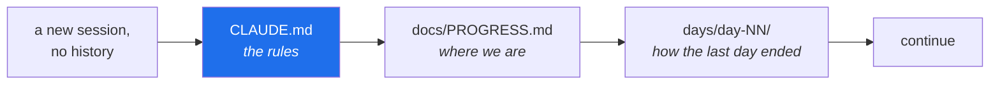

# 4.2 — `CLAUDE.md`, the contract that makes the repo the memory

## One-line answer

`CLAUDE.md` is a file of standing instructions that a CLI coding agent reads at the start of **every**
session — which is what lets a project's conventions survive across sessions, across machines, and
across a change of agent, instead of living in a conversation that ends.

---

## The story

Somebody spends an afternoon working with a coding agent on a project. It goes well. Over those
hours they establish a lot: use exact version pins, never invent an API signature, put tests in a
mirrored path, don't refactor code you weren't asked to touch. Each of those was a small correction
at the time — *"actually, pin that"* — and by the end the agent is producing exactly the right shape
of work.

The next morning they open a new session and ask for the next piece.

It arrives with a floating version constraint, an invented method name, and a drive-by refactor of a
neighbouring file.

Nothing has gone wrong, in the sense that nothing malfunctioned. The corrections lived in a
conversation, and the conversation is over. Every session starts from the same place the first one
did, and the afternoon's work — the *understanding*, not the code — did not persist.

The person's instinct is to re-explain. That works, and costs the same afternoon again, and works
until the next session. The thing that actually fixes it is to notice that **the corrections were
always project facts, not conversation facts.** "Pin exact versions" is true of this repository
regardless of who is asking or when. It belongs in the repository.

---

## The idea in plain language

**A CLI coding agent reads certain files automatically at the start of a session.** For Claude Code
that file is `CLAUDE.md` in the project root; other agents use their own name for the same idea, and
several also read a shared `AGENTS.md`. The mechanism is the same everywhere: a file of standing
instructions, loaded before the first request, that shapes everything after it.

That turns a class of problem inside out. Anything you would otherwise have to say at the start of
every session is instead **written once, committed, and versioned with the code it governs.**

### What belongs in it

The test is simple: **is this true of the project, or true of this conversation?**

| Belongs in `CLAUDE.md` | Belongs in the conversation |
| --- | --- |
| Exact pins; never invent a version | "Use 2.7.1 here" |
| Read the plan's §17 before writing a day | "Write day 5 now" |
| Tests mirror the package structure | "Fix this failing test" |
| Zero-budget rules: free tiers only, handle 429 | "Try the Groq lane for this one" |
| Where the ledgers live and what updates them | "Update PROGRESS.md" |
| The definition of done: `./m check` green | "Is it done?" |

A project fact is worth writing down once. A conversation fact is worth saying once. Putting the
second kind in `CLAUDE.md` makes the file long, and **a long instruction file is a weak one** —
everything in it competes for attention, so every line that does not need to be there weakens the
lines that do.

### Sutra's version has an unusual job

For most projects, `CLAUDE.md` is a convenience: it saves repetition. For Sutra it is
**load-bearing**, because of the plan's second commitment:

> **The repo is the memory, not the chat.** Ledgers plus day documents mean any capable CLI agent —
> Claude Code today, any other tomorrow — can pick up exactly where the last one stopped.

That is a strong claim, and `CLAUDE.md` is one of the three things that make it true:



Read those three in order and you know the standard, the position, and the immediate context — with
no conversation to inherit. Addendum 02 §8 makes the point sharply: if the driver agent itself
becomes unavailable, the workflow survives unchanged with a different one, because the memory was
never in the agent.

### The file is a contract, so it states precedence

Sutra's `CLAUDE.md` opens by naming the plan as the single source of truth and then stating what wins
when documents disagree — the zero-budget addendum wins on model choice; the gaps addendum wins on
MCP. **A rule set that does not say what beats what is a rule set that produces confident, wrong
answers at every conflict,** because whoever is reading has to guess and will guess consistently in
one direction.

It ends with a section it did not have to include: general coding posture — simplicity first,
surgical changes, state your assumptions, no confident bullshit. That material is not
Sutra-specific, and including it is a judgement call. It earns its place because the *default*
behaviour it corrects — plausible-looking work delivered with unearned confidence — is precisely the
failure mode that costs the most to unwind later.

---

## Why Sutra needs it

- **Every day from Day 1 is generated by an agent reading this file.** The day documents are the
  deliverable; `CLAUDE.md` is what makes them consistent across ninety-six of them rather than
  drifting with whoever wrote which one.
- **Principle 7 and 8 — never invent a version, never invent an API.** These are the two rules most
  at risk from a model producing something plausible, and they are stated in `CLAUDE.md` precisely
  because they cannot be enforced by a linter. A wrong-but-plausible ADK method name passes every
  automated check in this repository until someone runs it.
- **The plan's §5.1 lists four 1.x → 2.x traps.** The internet is full of ADK 1.x tutorials, which
  means it is full of 1.x-shaped training data. Stating the traps in the standing instructions is a
  standing correction against exactly that.
- **Principle 15 and Addendum 02 — zero budget.** The rule that every `openrouter/` model string must
  end in `:free` is in `CLAUDE.md` *and* becomes a lint on Day 31. Both, deliberately: the file
  prevents it being written, the lint catches it if it is.
- **Day 93 makes this repository public.** `CLAUDE.md` will be read by strangers as a statement of
  how this project is built. That is a good reason to write it as a contract rather than as notes.

---

## The mechanism

`CLAUDE.md` goes in the project root, next to `README.md`, and is committed. Its structure matters
more than its length — an agent reading it needs to find the binding rules quickly.

````bash
cat > CLAUDE.md <<'EOF'
# Project Sutra — Claude Code operating rules

You are the daily instructor and pair-programmer for a **97-day Agentic AI Engineering
curriculum** built around **Google ADK 2.x · MCP · Agent Skills · A2A**.

The single source of truth is `docs/00_MASTER_PLAN.md` ("the plan"), currently **v2.0.0**.

**Read in this order before doing anything:**

1. `docs/00_MASTER_PLAN.md` — the contract. **§17 is the depth contract; read it before
   writing a single line of any day.**
2. `docs/PROGRESS.md` — the last row is where we actually are.
3. `docs/TRACEABILITY.md` — any open ID from a completed phase is a bug.
4. `days/day-<last>/LESSON.md` — how the previous day ended.

**Precedence.** `docs/02_ADDENDUM_ZERO_BUDGET_MODELS.md` wins over the plan on model choice
and paid services. `docs/01_MASTER_PLAN_ADDENDUM_GAPS.md` wins on MCP and the ADK deltas.

## Non-negotiable rules

- **Never invent a version number** (P7). Look it up live, or leave a `TODO` with the exact
  lookup command. Every pin gets a dated row in `docs/PACKAGES.md`.
- **Never invent an API** (P8). Every ADK symbol verified against adk.dev **on the day it is
  used**, and the document names the page checked.
- **No clocks** (P17). Never a time estimate, anywhere.
- ... (the full list is in the repository's CLAUDE.md)

## Environment

```bash
# whole-project gate  → ./m check
# finish a day        → ./m done N
```
EOF
````

**Line by line:**

- The four-backtick outer fence again, so the three-backtick block inside survives
  ([4.1](4.1-the-readme-that-a-stranger-reads.md)).
- **The opening sentence assigns a role.** "You are the daily instructor and pair-programmer for a
  97-day curriculum" is doing more work than it looks: it establishes what kind of output is wanted
  — teaching documents, not application code — before any specific rule.
- **"The single source of truth is..."** — one named document, so there is never a question about
  what governs.
- **The numbered read order** is the most important block in the file. It is what converts *"the repo
  is the memory"* from an aspiration into a procedure a fresh session can execute.
- **"Precedence"** — stated explicitly, because three documents can disagree and a rule set that does
  not resolve conflicts produces confident wrong answers.
- **The rules carry their principle number** — `(P7)`, `(P8)`, `(P17)`. That is a link back to the
  plan rather than a restatement of it, which means the rule and its reasoning cannot drift apart.
- **"Look it up live, or leave a `TODO` with the exact lookup command"** — notice the shape. It does
  not say "be careful about versions"; it names the *acceptable alternative* to knowing. **A rule
  that forbids something without providing an out gets violated silently**, because the work still
  has to get done.
- **The environment block gives commands, not descriptions** — `./m check`, not "run the checks".
  One name, defined once ([3.2](../03-the-m-driver/3.2-the-case-dispatcher.md)).

Then verify the file agrees with reality:

```bash
grep -oE '`[a-z_./]+\.(md|py|toml)`' CLAUDE.md | tr -d '`' | sort -u | while read -r f; do
  [ -e "$f" ] && echo "ok      $f" || echo "MISSING $f"
done
```

**Line by line:**

- `grep -oE '`[a-z_./]+\.(md|py|toml)`'` — pull out every backticked filename. `-o` prints only the
  match ([4.1](4.1-the-readme-that-a-stranger-reads.md)); the character class allows lowercase
  letters, underscores, dots and slashes, which covers every path this file names.
- `tr -d '`'` — delete the backticks, leaving bare paths. `tr -d` removes every instance of the given
  characters.
- `sort -u` — unique, sorted, so each path is checked once.
- `while read -r f; do ... done` — loop over the paths one line at a time. `-r` stops `read` from
  interpreting backslashes, which is the correct default for filenames.
- `[ -e "$f" ] && echo ... || echo ...` — `-e` tests existence for files *and* directories, unlike
  `-f` which is files only. The quoted `"$f"` handles paths with spaces
  ([3.2](../03-the-m-driver/3.2-the-case-dispatcher.md)).
- **An instruction file that references a file which does not exist is worse than one that omits
  it**, because a reader — human or agent — will go looking, fail, and then start doubting the rest
  of the document.

---

## When it breaks

**Instructions that contradict each other.** The most damaging failure has no error message. Suppose
one section says *"add packages as you need them"* and another says *"declare all dependencies up
front"*. Both are reasonable; together they are noise. Whoever reads the file will pick one,
consistently, and you will not find out which until you see the output. **The fix is precedence**,
stated explicitly, which is why Sutra's file names which addendum wins on which subject rather than
hoping they never overlap.

**A rule with no escape hatch gets violated silently.** *"Never invent a version number"* on its own
is unfollowable: sometimes a lookup fails, and the work still has to happen. The rule as written
gives the alternative — `TODO(<the exact lookup command>)` — which converts an impossible instruction
into a followable one. **When you find a rule being ignored, check whether it left anywhere to go.**

**The file that grew too long to be read.** No error, and the symptom is subtle: instructions from
the middle stop being followed while the ones at the top and bottom hold. Everything in an
instruction file competes for attention, so each line dilutes the others. **The fix is to delete**,
not to add emphasis — a rule that has never been violated and is not load-bearing is a rule that can
go.

**Stale references.** After a refactor:

```text
MISSING docs/days/progress.md
ok      docs/00_MASTER_PLAN.md
```

The ledgers moved from `docs/days/` to `docs/` when the day format changed, and `CLAUDE.md` still
names the old path. An agent following it will look, fail, and then have to guess — and a guess is
exactly what the file exists to prevent. **Run the check above whenever a path changes**, and treat a
`MISSING` line as a broken build rather than a typo.

**Assuming the file is loaded.** If `CLAUDE.md` is gitignored — some projects do this — a colleague's
clone has no rules at all, and their agent's output will differ from yours for reasons neither of you
can see. Sutra **commits** `CLAUDE.md` deliberately: the conventions are part of the project, and
Day 93 makes them public along with everything else.

---

## In production

**This is configuration-as-code applied to a tool that reads natural language.** The same argument
that puts linter settings in `pyproject.toml` rather than in each developer's editor
([2.4](../02-repo-skeleton/2.4-pyproject-and-the-lockfile.md)) puts agent instructions in a committed file rather
than in each person's conversation: **shared conventions belong in the repository, versioned with
the code they govern**, so that a change to the convention is reviewable and a colleague inherits it
automatically.

**The layering is worth understanding.** Instructions typically compose from several levels — a
user-level file for personal preferences, a project-level `CLAUDE.md` for project rules, and
directory-level files for subsystem-specific ones. The project file is the one that belongs in git,
because it is the one that is true for everyone. A personal preference committed into a shared file
is a small act of imposition that someone will have to undo.

**Instruction files are a prompt-injection surface, and this matters more as agents gain tools.**
An agent reads a lot of text — files, tool output, retrieved documents, web pages — and text it reads
can contain instructions. This is Sutra's **Day 66** subject: prompt injection and the *lethal
trifecta* (SEC-06, SEC-07) — an agent that has access to private data, exposure to untrusted content,
and the ability to communicate externally. `CLAUDE.md` is on the trusted side of that boundary
because it is committed and reviewed. **The habit worth forming now: a file that steers an agent is
a file that goes through review, exactly like code that gets deployed.**

**What degrades at scale.** In a large repository, one instruction file cannot carry every
subsystem's conventions without becoming the diluted document described above. The scaled answer is
directory-scoped files — rules for the service you are working in — plus a short root file holding
what is genuinely universal. The signal that you need the split is when people start adding "if you
are working on X..." conditionals to the root file.

**The review comment a senior engineer leaves.** On a pull request adding four paragraphs to
`CLAUDE.md`: *"Two of these are about this one task, not about the project — say them in the request
instead. The other two are good, but they contradict the pinning rule above; which wins?"* Both
halves matter: **the file is for project facts, and it has to be internally consistent** or it
produces confident wrong answers rather than confused ones.

**The interview question.** *"How do you keep an AI coding assistant producing code that matches your
team's standards?"* This is a genuinely current question and most answers are vague. A strong one is
concrete: standards live in a committed instruction file, versioned and reviewed like code; anything
mechanically checkable is *also* enforced by a linter or a test, because an instruction is a
prevention and a gate is a guarantee; and the file states precedence, because rules that conflict
produce confident errors. The sentence that lands is **"the conventions are in the repository, not
in anyone's chat history"** — which is the same principle as a lockfile, applied to a different kind
of drift.

---

## Check yourself

```bash
head -20 CLAUDE.md && echo "--- referenced paths ---" && \
  grep -oE '`[a-z_./]+\.(md|py|toml)`' CLAUDE.md | tr -d '`' | sort -u | \
  while read -r f; do [ -e "$f" ] && echo "ok      $f" || echo "MISSING $f"; done
```

The first twenty lines must name the source of truth and give the read order. Every referenced path
must print `ok` — a `MISSING` line is a broken instruction, not a cosmetic slip.

**Answer out loud, without scrolling up:**

> What is the test for whether something belongs in `CLAUDE.md` rather than in the conversation?
> And why does the file state *precedence* between the plan and its addenda instead of just listing
> all three?

---

**Next:** [4.3 — The first commit, and trying to leak a key on purpose](4.3-the-first-commit-and-breaking-it.md)
