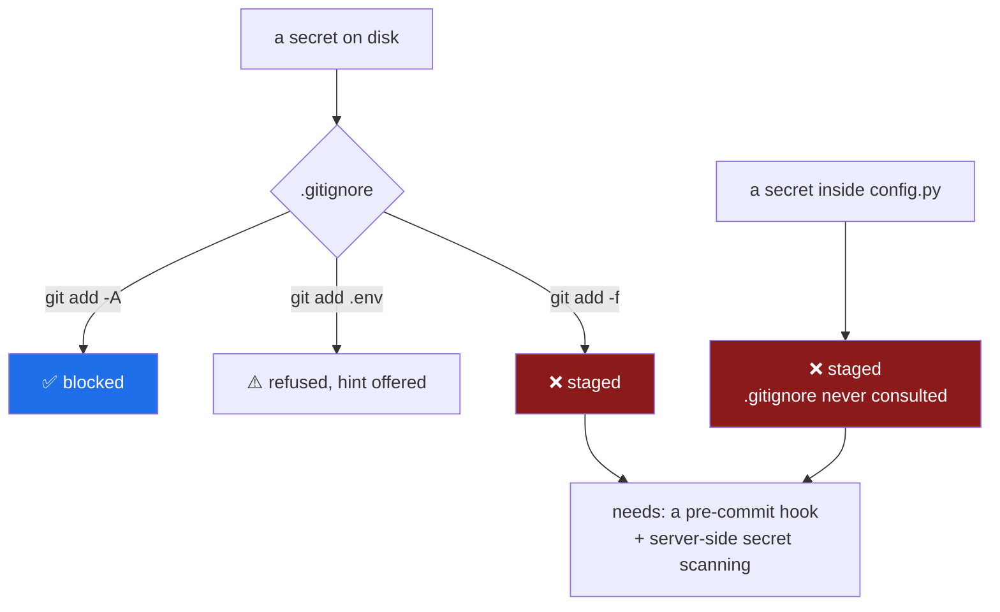

# 4.3 — The first commit, and trying to leak a key on purpose

## One-line answer

Before you trust a safety net, **you attack it** — so this part deliberately tries to commit a
secret four different ways, watches which attempts the repository stops and which it does not, and
only then makes the first commit.

---

## The story

A team installs a smoke alarm in a server room. It is a good alarm. They wire it correctly. They
tick the box on the compliance checklist and move on.

Eighteen months later there is a small fire, and the alarm does not sound. The battery had died
about a year earlier. Nobody noticed, because **nothing looks different between a working alarm and
a dead one** — both are a plastic disc on a ceiling with a light that you stop seeing after the first
week.

The failure was not the battery. Batteries die; that is what batteries do. The failure was that the
alarm's status was **assumed rather than observed** for eighteen months, and there was no moment in
that period where anyone would have found out.

Now the version that matters here. You wrote `.gitignore` in [2.2](../02-repo-skeleton/2.2-gitignore-before-secrets-exist.md)
before `.env` existed. You have good reasons to believe it works. But *believing a protection works*
and *having watched it refuse you* are different states of knowledge, and the gap between them is
exactly the gap the server room had.

There is a test. It takes four minutes, it costs nothing, and after it you will know rather than
assume.

---

## The idea in plain language

**A control you have never seen fire is a control you are trusting on faith.** This is a general
engineering principle with several familiar names — chaos engineering, fire drills, restore-testing
your backups — and one shared insight: *the only evidence a safety mechanism works is that you have
watched it work.*

Which brings the uncomfortable corollary: **you must attack your own defences, on purpose, while it
is safe.** Not once it matters. Now, with a fake key, in a repository with no remote, where being
wrong costs a `git reset`.

There is a second reason to do it that is less obvious and more valuable. Testing a control teaches
you **where its edges are** — the cases it does *not* cover — and those edges are where the real
incident will happen. A protection you understand the limits of is worth far more than one you
believe is total.

### The four attacks

| # | Attack | Expected |
| --- | --- | --- |
| 1 | `git add -A` with a `.env` on disk | ✅ ignored, not staged |
| 2 | `git add .env` — naming it explicitly | ⚠️ **refused, with a hint that overrides it** |
| 3 | `git add -f .env` — forcing it | ❌ **staged. The rule does not stop this.** |
| 4 | a key pasted into a normal `.py` file | ❌ **staged. `.gitignore` has no opinion at all.** |

Attacks 3 and 4 are the point of this part. `.gitignore` protects against **the accident** — the
sweep-up-everything commit, which is by far the most common way a key leaks. It does nothing about
**intent**, and nothing whatsoever about a secret in a file that is supposed to be committed.

That is not a flaw. It is the boundary of one control, and knowing where a control ends is what tells
you which *other* control you need. Attack 4 is exactly what secret scanning and pre-commit hooks
exist for, and Sutra meets them on **Day 92**, the hardening pass before the repository goes public.



> 💡 **The mental model:** `.gitignore` is a **guard rail**, not a **lock**. It stops you falling off
> the road. It does not stop you driving off it deliberately, and it is not on the footpath at all.

---

## Why Sutra needs it

- **Day 1 puts three real API keys in `.env`** (OPS-02) — Gemini, Groq, OpenRouter. Tomorrow the
  target is real. Today it is a string that says `not-a-real-key`. **This is the only day on which
  this test is free.**
- **Day 93 makes this repository public** (plan §14). Everything ever committed becomes readable by
  anyone, including automated scanners whose entire purpose is finding credential-shaped strings in
  public history.
- **Principle 13 — blast radius before capability.** *"Before any tool or agent gets write access,
  name what it can destroy and shrink that."* You are applying it to yourself first, which is the
  right order: it is much easier to design an approval gate on **Day 63** for an agent if you have
  been on the receiving end of one.
- **Day 59 is a failure lab** — runaway agents and containment (AG-21, SEC-04). **Day 71** puts a
  browser agent in a sandbox. Both days are this same method at a larger scale: build the
  containment, then attack it, then believe it.
- **`./m done` runs `git add -A`** ([3.4](../03-the-m-driver/3.4-the-done-gate.md)). Automating that command is
  only defensible if attack 1 reliably fails. This part is where you find out.

---

## The mechanism

### Attack 1 — the accidental sweep

```bash
echo "GOOGLE_API_KEY=not-a-real-key-4f2a" > .env
git add -A
git status --short | grep -E "\.env" || echo "PASS: .env was not staged"
```

**Line by line:**

- `echo ... > .env` — a fake key with a realistic shape. **Never use a real key for this test**, even
  in a repository with no remote: the whole point is that you are about to try to commit it, and one
  of the four attempts is going to succeed.
- `git add -A` — stage **everything**: new files, modifications and deletions. This is the exact
  command `./m done` runs, which is why it is attack number one.
- `git status --short | grep -E "\.env"` — look for any staged path containing `.env`.
- `|| echo "PASS: ..."` — `grep` exits non-zero when it finds nothing
  ([3.1](../03-the-m-driver/3.1-set-euo-pipefail.md)), so **no match is the success case** and `||` is what turns
  that silence into a readable line.
- Expected: `PASS`. The guard rail held against the accident.

### Attack 2 — naming it explicitly

```bash
git add .env
```

**Line by line:**

- No `-A`, no wildcard: you are pointing directly at the ignored file. Git treats this as a probable
  mistake and refuses, but read its refusal carefully — it is more interesting than a plain error.

```text
The following paths are ignored by one of your .gitignore files:
.env
hint: Use -f if you really want to add them.
hint: Turn this message off by running
hint: "git config advice.addIgnoredFile false"
```

**How to read it.** Git tells you *why* it refused and, in the same breath, **tells you the flag that
overrides it**. That is a deliberate design choice — git assumes you may have a legitimate reason —
and it is precisely why this control is a guard rail rather than a lock. Note it, because it is the
answer to the question in *Check yourself*.

### Attack 3 — forcing it

```bash
git add -f .env
git status --short | grep "\.env"
```

**Line by line:**

- `-f` is `--force`: ignore the ignore rules. Git did not hide this from you; it recommended it two
  lines ago.
- Expected output: `A  .env`. **The `A` means added — staged, and one `git commit` away from being
  permanent.**
- **This is the attack that succeeds**, and it is the most important line in this part. `.gitignore`
  stops the accident and does not stop the intent.

Undo it immediately:

```bash
git rm --cached .env
git status --short | grep -E "\.env" || echo "PASS: unstaged again"
```

**Line by line:**

- `git rm --cached` — remove from the **index** only, leaving the file on disk
  ([2.2](../02-repo-skeleton/2.2-gitignore-before-secrets-exist.md)). Without `--cached` this deletes your file,
  which for a real key would turn a test into an incident.
- Nothing was committed, so nothing entered history. Had you committed first, `git rm --cached`
  would **not** have been enough — the key would live in that commit forever, and the only honest
  response would be to rotate it at the provider.

### Attack 4 — the one `.gitignore` cannot see

```bash
printf 'API_KEY = "not-a-real-key-9c31"\n' > sutra/settings_demo.py
git add -A
git status --short | grep "settings_demo"
```

**Line by line:**

- A key inside an ordinary `.py` file — a file that *should* be committed, in a directory that
  *should* be tracked.
- Expected output: `A  sutra/settings_demo.py`. **Staged, with no warning of any kind.**
- `.gitignore` was never consulted, because nothing about this path matches any rule. **This is how
  secrets actually leak in practice** — far more often than through a stray `.env`, because a
  hard-coded value in a source file looks exactly like every other line around it.

Clean up:

```bash
git rm --cached sutra/settings_demo.py && rm sutra/settings_demo.py && rm .env
```

**Line by line:**

- `git rm --cached` first — unstage it before deleting, so git does not record a deletion of a file
  it was told about moments ago.
- `rm sutra/settings_demo.py` — remove the file itself.
- `rm .env` — remove the fake key. Day 1 creates the real one, and by then you will have watched the
  guard rail hold against the accident that actually happens.

### Now make the first commit

```bash
git add -A
git status --short
```

**Line by line:**

- Stage everything. After four attacks and four cleanups, look at what is actually there before you
  make it permanent.
- **Read every line of that output.** This is the last cheap moment: after the commit, the contents
  are in history. You should see your skeleton, the driver, the configuration, the two documents, and
  the day folder — and **nothing** matching `.env`, `.venv`, or `settings_demo`.

```bash
git commit -m "day-00: toolchain, skeleton, and the ./m driver"
git log --oneline
git ls-files | grep -cE "^\.env$|\.venv/" || echo "PASS: no secret and no venv in the repository"
```

**Line by line:**

- `git commit -m "day-00: ..."` — the message format from the plan's §17.5. Day 0 closes no
  curriculum IDs, so there is no `— closes ...` clause; every day from Day 1 will have one.
- `git log --oneline` — one line, your commit. The chain from
  [2.3](../02-repo-skeleton/2.3-git-init-and-what-a-repo-is.md) now has its first link, and
  `.git/refs/heads/main` now exists as a file containing its hash.
- `git ls-files` — list every file git **tracks**, which is a different and more useful question than
  "what is in this folder". `grep -c` counts matches; `||` catches the zero-match case and prints the
  pass line.
- **This is the check to run before any repository goes public**, and it is worth remembering long
  after Day 0.

---

## When it breaks

**Attack 1 fails — `.env` gets staged:**

```text
$ git add -A && git status --short | grep "\.env"
A  .env
```

The guard rail is not there. Two likely causes: `.gitignore` was written *after* `.env` was first
committed — in which case the rule has no effect on an already-tracked file
([2.2](../02-repo-skeleton/2.2-gitignore-before-secrets-exist.md)) — or `uv init` overwrote it without the
`--vcs none` flag ([2.4](../02-repo-skeleton/2.4-pyproject-and-the-lockfile.md)). Ask git which:

```text
$ git check-ignore -v .env
$ echo $?
1
```

Silence and exit 1 mean **no rule matches**, so the file was overwritten. If a rule *is* printed but
the file still stages, it was already tracked: `git rm --cached .env` and commit that removal.

**You committed the fake key by accident during the test:**

```text
$ git log --oneline
3f8c1a2 day-00: toolchain, skeleton, and the ./m driver
```

…and `git show --stat HEAD` lists `.env`. **On Day 0 with a fake key and no remote, this is
genuinely cheap to fix:**

```text
$ git reset --soft HEAD~1
$ git rm --cached .env
$ git commit -m "day-00: toolchain, skeleton, and the ./m driver"
```

`--soft` moves the branch pointer back one commit and **keeps your staged changes**, so you can
restage and recommit ([2.3](../02-repo-skeleton/2.3-git-init-and-what-a-repo-is.md) — a branch is a movable
pointer). This works **only** because nothing has been pushed. With a real key, or with a remote,
the correct first action is not a git command at all: **revoke the key at the provider, then
rotate it.**

**The first commit refuses:**

```text
$ git commit -m "day-00: toolchain, skeleton, and the ./m driver"
Author identity unknown

*** Please tell me who you are.
```

The identity from [1.2](../01-toolchain/1.2-git-and-the-unix-shell.md) was never set. Run the two `git config`
lines it prints. Git refuses rather than inventing an author, which is the right refusal — a commit's
author is part of its permanent identity.

**Line endings on the driver:**

```text
$ ./m check
./m: line 4: $'\r': command not found
```

Carriage returns ([1.2](../01-toolchain/1.2-git-and-the-unix-shell.md), [3.1](../03-the-m-driver/3.1-set-euo-pipefail.md)).
Fix with `sed -i 's/\r$//' m`, and prevent recurrence with `git config core.autocrlf input`. Worth
fixing **before** the commit so the file enters history clean.

---

## In production

**"Test your controls" is a discipline with a name, and it scales.** Restoring from a backup you have
never restored from is the classic example: an untested backup is a *belief* about a backup. The same
logic runs through failover drills, incident game days, and chaos engineering. **Sutra applies it
twice more, deliberately** — Day 59's failure lab on runaway agents (AG-21, SEC-04) and Day 71's
computer-use sandbox (SEC-14) — because an agent's containment story is worth exactly as much as the
last time somebody tried to break it.

**Layer the controls, because each one has an edge you just found.** For secrets, the professional
stack is four deep:

1. **`.gitignore`** — stops the accident. Attack 1. Costs nothing.
2. **A pre-commit hook** running a secret scanner over staged changes — catches attack 4, the key
   hard-coded in a source file, which is the one that actually happens.
3. **Server-side secret scanning** on the host — catches what reaches the remote, and several
   providers participate in automatic revocation, so a pushed key can be dead within minutes.
4. **A written incident runbook** — because during an incident nobody invents a good process.
   **Revoke first**, rotate second, then assess what the credential could reach while it was live,
   then decide whether history needs rewriting.

Notice that step 4 is the only one that works when the first three have failed, and that revocation
is the only step that actually stops the bleeding. **A key is compromised the moment it is pushed,
regardless of what you do to the file afterwards.**

**The blast-radius question is the one that reduces risk most.** Principle 13 says name what a
capability can destroy before granting it. For Sutra's free-tier keys the honest answer is
comfortable: no billing account, scoped to one project, rate-limited. **A leaked free-tier key costs
you quota and embarrassment, not money** — which is a genuinely useful property of the zero-budget
constraint, and precisely the reason to build the discipline *now*, on a target where being wrong is
survivable. The habit is what transfers to the repository where the key is attached to a card.

**What degrades at scale.** With one repository, "did anyone commit a secret?" is a question you can
answer by looking. With four hundred, it is a scanning problem, an alerting problem, and a rotation
problem — which is why organisations centralise on a secret manager and short-lived credentials
rather than long-lived keys in files at all. **The direction of travel is always toward secrets that
expire on their own**, because a credential that dies in an hour makes a leak an inconvenience
rather than an incident.

**The review comment a senior engineer leaves.** On a pull request adding `.gitignore` entries after
a key was found in the diff: *"Add the ignore rule, yes — but has this key been rotated? It's in the
branch history now, and the branch has been pushed."* The reviewer is separating **fixing the file**
from **containing the exposure**, because those are different jobs and only one of them is urgent.

**The interview question.** *"How do you keep secrets out of your repositories?"* A weak answer is
`.gitignore` and stops. A strong answer names the layers and, crucially, **names what each layer does
not cover** — `.gitignore` stops the accidental sweep and does nothing about a key hard-coded in a
tracked file; a pre-commit hook catches that but is local and can be bypassed; server-side scanning
catches what reaches the remote but only after it has arrived. The sentence that lands is: *"and if
one is ever committed, the first action is revocation, not a git command — the file is not the
problem, the credential is."*

---

## Check yourself

Run all four attacks and the final audit in one pass:

```bash
echo "K=not-a-real-key" > .env && git add -A && \
  { git status --short | grep -q "\.env" && echo "FAIL attack 1" || echo "PASS attack 1"; } && \
  { git add .env 2>/dev/null && echo "FAIL attack 2" || echo "PASS attack 2 (refused)"; } && \
  git add -f .env && \
  { git status --short | grep -q "\.env" && echo "NOTED attack 3: -f staged it, as expected"; } && \
  git rm --cached -q .env && rm .env && \
  echo "--- tracked files that should not exist ---" && \
  { git ls-files | grep -E "^\.env$|\.venv/" || echo "none — repository is clean"; }
```

You must see `PASS`, `PASS`, `NOTED`, and `none`. If attack 1 or 2 says `FAIL`, stop and fix
`.gitignore` before Day 1 puts real keys on disk.

**Answer out loud, without scrolling up:**

> Which two of the four attacks succeeded, and why is that *not* a bug in `.gitignore`? Then name
> the control that would have caught attack 4, and say what your first action would be if a real key
> had been pushed.

---

**Day 0's teaching is complete.** Seventeen parts: an environment with one owner, a repository that
cannot leak a key by accident — and that you have now personally tried to make leak — a driver with
two gates, and a repository a stranger can read.

**Next:** go back to the hub's [§10 Done when](../../LESSON.md), work through
[`CHECKLIST.md`](../../CHECKLIST.md), and finish with `./m done 0`.
