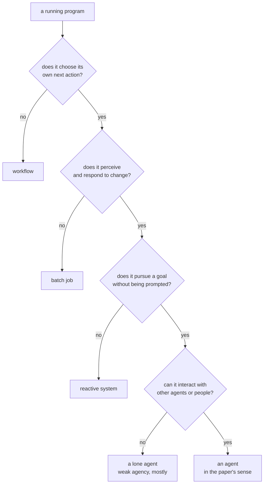

# *Intelligent agents: theory and practice* — where the word came from

## One-line answer

Thirty years before anyone called a language model "agentic", a survey paper drew the line this
curriculum still uses — a program becomes an **agent** when it is **autonomous, reactive,
pro-active and social** — and the half of that paper the field kept is exactly the half you
hand-rolled in [1.1](../parts/01-what-is-an-agent/1.1-who-decides-the-next-step.md).

---

## The story

Picture a research field in the mid-1990s with a word problem.

Everyone has started calling their software an "agent". A program that filters email is an agent. A
program that books a meeting room is an agent. A robot arm is an agent. A screensaver with a
cartoon face is, according to its brochure, an agent. The word has become a compliment rather than
a description, and it is attached to almost anything.

This is not a harmless naming squabble. Two research groups sit down to compare results and
discover halfway through that they have not been studying the same kind of thing at all. One built
something that decides for itself what to do next. The other built something that runs a fixed
sequence of steps and has a friendly face on the front. Both papers say "agent" in the title.
Neither is lying. There is simply no agreed test.

So somebody writes the survey that stops the argument. Not by inventing a new system — by doing
something much less glamorous and much more useful: **collecting what everyone already meant, and
writing down the shortest list of properties that separates the two piles.**

That list is thirty years old, it fits in one sentence, and it is why the word "agentic" in a
2026 job description still means something specific.

---

## The idea in plain language

Before this paper, "agent" was a mood. After it, "agent" was a checklist.

The paper's central move is to split the word in two.

**The weak notion of agency** is the practical one. A system is an agent when it has four
properties:

| Property | In plain words | The question it answers |
| --- | --- | --- |
| **Autonomy** | It operates without step-by-step instructions and has some control over its own actions and internal state. | *Who decides the next step?* |
| **Reactivity** | It perceives its environment and responds to changes in it. | *What happens when something unexpected occurs?* |
| **Pro-activeness** | It does not only respond — it takes initiative in pursuit of a goal. | *Does it want anything?* |
| **Social ability** | It interacts with other agents, or with people, through some kind of shared language. | *Can it work with anyone but itself?* |

The claim is that all four together are what people actually mean by "agent", and that a system
missing any one of them belongs in the other pile.

**The strong notion of agency** is the ambitious one. Beyond the four properties, a strong agent is
described using **mentalistic** terms — words normally reserved for people. It has *beliefs* (what
it takes to be true), *desires* (what it wants), and *intentions* (what it has committed to doing).
The paper surveys a large body of work on formalising these in logic so a system's beliefs and
intentions could be reasoned about mathematically.

Hold on to that split. It is the whole reason this part is worth reading in 2026, because the two
halves had completely different fates — and the section *In production* below is about which.

> **Jargon check.** *Mentalistic* simply means "described using words about minds". Saying a
> thermostat "wants" the room at 21 degrees is a mentalistic description of a very simple machine.
> The paper's argument is that this is sometimes a *useful* description, not that the thermostat
> has feelings.

---

## Why Sutra needs it

[Part 1.1](../parts/01-what-is-an-agent/1.1-who-decides-the-next-step.md) opened Day 1 with a single
sentence: *a system is agentic when the model, not the programmer, decides what happens next.* That
is this paper's **autonomy** property, restated for a world that has language models in it.

[Part 1.2](../parts/01-what-is-an-agent/1.2-goal-tools-loop-stop.md) then broke an agent into goal, tools,
loop and stop condition. The **goal** is pro-activeness. The **loop** is what makes reactivity
possible — a program that runs once cannot respond to a change that happens afterwards.

And [part 1.3](../parts/01-what-is-an-agent/1.3-when-an-agent-is-the-wrong-answer.md) argued that
autonomy has a cost and is not always worth buying. That argument only makes sense if autonomy is a
*property you can choose to leave out* — which is precisely what a checklist definition gives you
and a mood does not.

You are not being handed a citation as decoration. You are being shown that the dividing line
Day 1 draws is not this project's opinion. It is the field's oldest agreed answer, and you will
meet its four words again on Day 53 when several agents have to talk to each other and **social
ability** stops being the property nobody thinks about.

---

## The mechanism

The paper's method is a **definition by discrimination**: it is built to sort systems into two
piles, so the way to understand it is to run a system past the four properties and watch where it
fails.

Take three programs and ask the four questions.

| System | Autonomy | Reactivity | Pro-activeness | Social ability | Verdict |
| --- | --- | --- | --- | --- | --- |
| A nightly backup script | ✗ every step is fixed | ✗ ignores the world | ✗ no goal of its own | ✗ talks to nobody | **not an agent** |
| A thermostat | ~ chooses on/off | ✓ senses temperature | ~ holds a set point | ✗ | **borderline — and the paper says so** |
| Sutra's ticket triager | ✓ picks its own next tool | ✓ reads what came back | ✓ pursues "resolve the ticket" | ✓ calls other agents and a person | **an agent** |

The thermostat row is not a joke. The paper is explicit that the weak notion is *deliberately*
permissive — it admits simple control systems — and that this is a feature of a definition meant to
sort a whole field, not a bug. What the thermostat lacks is the fourth property and any meaningful
sense of the third.

Here is the sorting rule as a machine, because the four properties are checked in a fixed order and
the first failure decides the pile:



The important structural point: **the four properties are not a score.** The paper does not say "an
agent is a system with three out of four". They are a conjunction — which is what makes the
definition able to say *no*, and a definition that can never say no is a mood again.

---

## The paper in one demo

Two files. The only thing they demonstrate is the first property — **autonomy** — with the other
three riding along, and a switch that turns it off.

The world is a room that loses heat. Something happens in it that nobody told the controller about:
at step 3, a window opens.

```text
lab/papers/intelligent-agents/
├── room.py    the world, which changes whether or not anybody is watching
└── run.py     the controller, and the switch that removes its autonomy
```

**Line by line:** two files and no more, because the paper's claim needs exactly two things — a
world that can surprise you, and something deciding what to do about it. There is no model call
here at all: this paper is about what makes a system an agent, and that question is older than
language models. The request budget for this demo is **zero**.

```python
"""The world the controller lives in - and it changes whether or not anybody is watching."""


class Room:
    """A room that loses heat, gains it from a heater, and sometimes has a window opened."""

    def __init__(self, temperature: float = 18.0) -> None:
        self.temperature = temperature
        self.heater_on = False
        self.window_open = False

    def tick(self, step: int) -> None:
        """Advance the world one step. Nobody asked the controller's permission."""
        if step == 3:
            self.window_open = True
        drift = 1.5 if self.heater_on else -0.5
        if self.window_open:
            drift -= 2.5
        self.temperature = round(self.temperature + drift, 1)
```

**Line by line:**

- `class Room` — the **environment**, in the paper's vocabulary. It is a separate object from the
  controller on purpose: an agent is defined by its relationship to something it does not control.
- `self.temperature`, `self.heater_on`, `self.window_open` — the complete state of the world. Small
  enough to print, which is the point of a demo.
- `def tick(self, step)` — one step of the world advancing. The controller does not call this;
  `main` does. That separation is what makes **reactivity** testable, because the world moves on
  its own schedule.
- `if step == 3: self.window_open = True` — **the unannounced event.** This is the entire
  experiment. Nothing tells the controller it is coming, and nothing in the scripted plan accounts
  for it.
- `drift = 1.5 if self.heater_on else -0.5` — the room warms with the heater on and cools without
  it. Numbers chosen so the effect is visible in eight steps and not one more.
- `if self.window_open: drift -= 2.5` — the open window overwhelms the heater. It has to, or the
  scripted controller would stumble into being right by accident and the demo would prove nothing.
- `round(..., 1)` — floats print badly otherwise, and an unreadable table is a demo nobody checks.

```python
"""The weak notion of agency, and the ablation switch that turns it off."""

from room import Room

AUTONOMY = True
GOAL = 21.0
STEPS = 8

SCRIPT = ["heat", "heat", "heat", "off", "wait", "wait", "wait", "wait"]


def scripted(step: int, room: Room) -> str:
    """No autonomy: every action was chosen before the room was ever looked at."""
    return SCRIPT[step]


def autonomous(step: int, room: Room) -> str:
    """Autonomy: perceive the room, then choose - reactive to events, pro-active about the goal."""
    if room.window_open:
        return "close_window"
    if room.temperature < GOAL:
        return "heat"
    return "off"


def apply(action: str, room: Room) -> None:
    if action == "heat":
        room.heater_on = True
    elif action == "off":
        room.heater_on = False
    elif action == "close_window":
        room.window_open = False


def main() -> None:
    room = Room()
    decide = autonomous if AUTONOMY else scripted
    print(f"AUTONOMY = {AUTONOMY}   goal = {GOAL} degrees")
    print("step  temp  window  action")
    for step in range(STEPS):
        action = decide(step, room)
        apply(action, room)
        room.tick(step)
        window = "open" if room.window_open else "shut"
        print(f"{step:>4}  {room.temperature:>4}  {window:>6}  {action}")
    held = abs(room.temperature - GOAL) <= 1.5
    print(f"final {room.temperature} degrees - goal {'held' if held else 'LOST'}")


if __name__ == "__main__":
    main()
```

**Line by line:**

- `AUTONOMY = True` — **the ablation switch.** One name, one line, one edit. Everything else in the
  file is identical between the two runs, which is what makes the comparison below evidence rather
  than illustration.
- `GOAL = 21.0` — **pro-activeness made concrete.** The scripted controller has no goal anywhere in
  it; it has a list of moves. That is the difference the paper is pointing at, expressed as the
  presence or absence of one constant.
- `SCRIPT = [...]` — the plan, decided in advance. Read it and notice that it is *not stupid*: heat
  three times, switch off, hold. Against the room as described at the moment it was written, it is
  correct. It is defeated only by a change nobody predicted, which is the honest version of how
  workflows fail in production.
- `def scripted(step, room)` — it takes `room` and **ignores it**. The unused parameter is
  deliberate and is the whole ablation: same interface, no perception.
- `def autonomous(step, room)` — takes `room` and **reads it**. Three lines, in priority order.
- `if room.window_open: return "close_window"` — **reactivity**: respond to what the environment
  did, before anything else.
- `if room.temperature < GOAL: return "heat"` — **pro-activeness**: pursue the goal rather than
  waiting to be told.
- `return "off"` — the goal is met, so stop acting. A controller that only ever heats would reach
  21 degrees and sail past it, which is a different failure and not the one under test.
- `decide = autonomous if AUTONOMY else scripted` — the switch resolved to a function once, outside
  the loop. Both branches have the identical signature, so nothing else in `main` knows which one it
  got — the sort of seam you will build deliberately on Day 3.
- `apply(action, room)` — the agent's action changes the world, then `room.tick(step)` lets the
  world change on its own. That ordering is the loop of every agent in this curriculum:
  **act, then observe.**
- `held = abs(...) <= 1.5` — a verdict the run prints itself, so nobody has to squint at the table
  to decide who won. This is the smallest possible eval that can go RED (Principle 11).

Run it as it stands:

```bash
cd lab/papers/intelligent-agents && uv run python run.py
```

**Line by line:** `uv run` rather than a bare `python`, because `uv` resolves the project's pinned
interpreter and virtual environment before executing — the habit
[Day 0 part 1.5](../../day-00-toolchain-skeleton-driver/parts/01-toolchain/1.5-the-editor-and-the-interpreter-trap.md)
exists to build. The `cd` matters too: `run.py` imports `room` as a top-level module, so the
directory holding both files has to be the one you are standing in.

```text
AUTONOMY = True   goal = 21.0 degrees
step  temp  window  action
   0  19.5    shut  heat
   1  21.0    shut  heat
   2  20.5    shut  off
   3  19.5    open  heat
   4  21.0    shut  close_window
   5  20.5    shut  off
   6  22.0    shut  heat
   7  21.5    shut  off
final 21.5 degrees - goal held
```

Now the ablation. Change one line — `AUTONOMY = False` — and change nothing else:

```text
AUTONOMY = False   goal = 21.0 degrees
step  temp  window  action
   0  19.5    shut  heat
   1  21.0    shut  heat
   2  22.5    shut  heat
   3  19.5    open  off
   4  16.5    open  wait
   5  13.5    open  wait
   6  10.5    open  wait
   7   7.5    open  wait
final 7.5 degrees - goal LOST
```

Read the two tables against each other and the paper's claim is sitting in the `window` column.
Both controllers behave **identically** for the first three steps — the script really was a good
plan. At step 3 the window opens. The autonomous controller sees `open`, closes it, and is back on
goal by step 4. The scripted controller cannot see the word `open`, because it never looks; it
keeps executing a plan that stopped matching reality, and the room ends at **7.5 degrees**.

That gap — 21.5 against 7.5, from one changed line — is the weak notion of agency, and it is why
the paper bothered to write the properties down.

---

## When it breaks

A paper part's *when it breaks* is not a traceback. It is **where the claim stops holding**, and
this claim has three known edges.

**1 — The weak notion is permissive on purpose, so it lets a thermostat in.** By the four
properties, a thermostat is autonomous (it chooses on or off), reactive (it senses temperature),
arguably pro-active (it holds a set point), and merely fails on social ability. That has been the
standard objection for three decades, and the honest answer is that the paper knows: the weak notion
was written to sort a *field*, not to certify a product. If you use it as a marketing bar, everything
with an `if` statement clears it. **This is exactly why part 1.1 states the line as "the model, not
the programmer, decides" rather than reciting the four properties** — the LLM-era restatement is
narrower on purpose.

**2 — The strong notion assumed the mental states were *inspectable*.** The formal work surveyed
here reasons about an agent's beliefs and intentions as logical structures you can write down,
query and verify. A language model's "intention" is a phrase in a token stream. You cannot query it,
you cannot verify it, and — as [Day 3's honest failure](../../day-03-loop-hand-rolled/parts/04-running-the-loop/4.3-the-honest-failure.md)
will show you first-hand — the stated reason and the actual next action can simply disagree. The
formalisms did not fail; the substrate changed underneath them.

**3 — The demo's own edge.** Delete the `close_window` branch from `autonomous` and re-run. The
controller still perceives the room and still pursues the goal, but it has no action that addresses
the actual problem, so it heats into an open window forever:

```text
   7  15.5    open  heat
final 15.5 degrees - goal LOST
```

That is worth sitting with, because it is a real production failure mode with a comforting
appearance. The system **is** autonomous, **is** reactive, **is** pro-active — all three properties
hold — and it is still useless, because perception without a matching capability is just a
better-informed way to fail. The four properties are necessary. They were never claimed to be
sufficient, and a system can pass all four and be worthless.

---

## In production

**What survived: the four properties, almost word for word.**

Read a 2026 job description for an "agentic AI engineer" and you will find autonomy and
pro-activeness described in different vocabulary — "the model plans its own steps", "goal-directed",
"decides which tool to call". Reactivity is now called *observing tool results*. Social ability
became an entire protocol layer: A2A, the agent-to-agent surface this curriculum reaches on Day 89,
is the fourth property with a wire format.

More precisely, the weak notion survived because it is **operational**. It asks questions you can
answer by reading code, which is why it can still sort a system in 2026 that its authors could not
have imagined.

**What did not survive: nearly all of the strong notion.**

The paper devotes substantial space to logics for reasoning formally about belief, desire and
intention. Almost none of that machinery is in a shipping LLM agent. Nobody model-checks their
agent's intentions. The industry's actual answer to "what does this agent believe" is: *read the
context window*, which is a transcript, not a logic. What replaced formal verification is
**observability and evals** — Day 79 onwards — which is a much weaker guarantee traded for the
ability to build the thing at all.

The vocabulary survived where the formalism did not. "Belief" persists as *state*, "desire" as the
*goal in the system prompt*, "intention" as *the tool call the model just emitted*. Day 17's work on
state is the modern, unglamorous descendant of a research programme that wanted something far more
rigorous.

**What a senior engineer says in review.** When someone calls a pull request "an agent", the useful
challenge is the paper's, restated: *"which of the four does it actually have, and which one are we
paying for?"* Most systems described as agents are reactive and social but not autonomous — and
that is often the correct engineering choice, exactly as
[part 1.3](../parts/01-what-is-an-agent/1.3-when-an-agent-is-the-wrong-answer.md) argues. The review
comment is not "this isn't an agent". It is **"you are paying the price of autonomy and taking a
fixed path anyway"**, which is the expensive mistake.

**What an interviewer probes.** "Is a `for` loop calling an LLM an agent?" There is no right answer,
which is the point of the question — they are watching whether you reach for a property list or a
vibe. The strong answer names autonomy, checks who chooses the next action, and then says the thing
that shows you have shipped one: *it depends on whether the loop's next step is decided by the model
or by the code, and in most production systems it is deliberately the code.*

---

## Check yourself

Run the ablation and read the `window` column of both tables:

```bash
cd lab/papers/intelligent-agents && uv run python run.py
```

Then, without scrolling up, answer out loud:

1. **What did this paper actually claim?** Name the four properties and say which one the
   backup script on your own machine fails first.
2. **What do we do differently now?** Name one half of the paper the field kept and one half it
   dropped — and say what took the dropped half's place.
3. The demo's scripted controller was a *good plan*. Say in one sentence why that makes the result
   more convincing than if the script had been a bad one.
