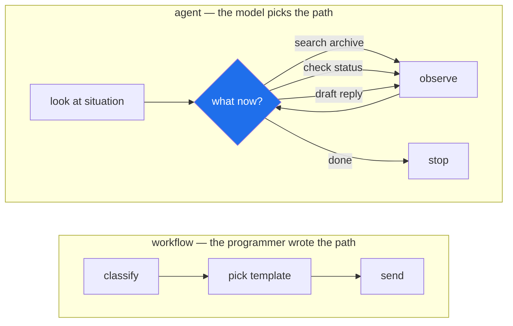

# 1.1 — Who decides the next step

## One-line answer

A system is **agentic** when the model, not the programmer, decides what happens next — and that
single sentence is the whole definition, with everything else in this curriculum being a consequence
of it.

---

## The story

A support ticket arrives at a company. It says: *"I can't log in. It just keeps sending me back to
the login page over and over."*

Imagine three different people receiving it.

**The first person** reads it and replies straight away, from what they already know: *"Please try
clearing your browser cookies and cache, then log in again."* It is decent advice. They did not
open the ticket archive, did not check whether anything is currently broken, did not look at the
customer's account. One message out, and they are done.

**The second person** works from a laminated card taped to their desk. Somebody wrote it last year,
and it says: read the ticket, decide which of six categories it falls into, look up the matching
template, send it. They do exactly that, quickly and correctly, and they will do it correctly a
thousand times in a row. Then a ticket arrives that is not one of the six categories — and they stop.
Not because they are unwilling. Because the card does not have a step for it, and the card is what
they have.

**The third person** reads the ticket and thinks about *this particular one*. "A loop, not a
rejection — so the password is probably fine and something is bouncing them. Let me search the
archive for 'redirect loop'… there is one from March, an authentication bug after a deploy. Was
there a deploy? Let me check the status page. Yes — one two hours ago. Right: I will reply saying we
have found it, link the March ticket, and flag this to engineering."

Nobody wrote those steps down. Nobody could have, because they depend on what the archive turned out
to contain and what the status page happened to say. The third person **chose the steps while
working**, and they would have chosen different steps for a different ticket.

That third person is the only one of the three doing something an agent does. And notice what made
the difference: not intelligence, not effort, not how good the reply was. **Who decided what to do
next.**

---

## The idea in plain language

Let us build the vocabulary from nothing, because almost every word in this field is used loosely
somewhere.

**A model** — in this curriculum, a *large language model* — is a program that takes text in and
produces text out. That is genuinely all it does. It has no memory of previous conversations unless
you hand them back to it, it cannot look anything up, and it cannot do anything to the world. Text
in, text out.

**A tool** is a function the model can ask to have run. Searching a ticket archive is a tool.
Fetching a status page is a tool. Sending a reply is a tool. The model does not run the tool itself
— it *asks*, by producing text that names a tool and its arguments, and your program runs it and
hands the result back. Day 4 builds this by hand.

**A loop** is what turns one request into a sequence: give the model the situation, let it ask for a
tool, run the tool, give it the result, and ask again — until it says it is finished. Day 3 builds
this by hand, before any framework is allowed near it.

Now the three people from the story, as three kinds of system:

| | Who decides the steps? | What happens to ticket #4521 |
| --- | --- | --- |
| **Chatbot** | Nobody. It answers from what it already knows. | Generic advice about cookies. One turn. No lookup, no action. |
| **Workflow** | **The programmer**, in advance. | Runs the fixed pipeline: classify → pick template → send. Correct a thousand times, then jams on the ticket that fits no branch. |
| **Agent** | **The model**, at runtime. | Searches the archive, finds the March redirect bug, checks the status page, sees the deploy, drafts a reply citing both — because it judged those steps were needed. |

**The dividing line is not capability. It is authorship of the plan.**

This is worth being stubborn about, because the word "agent" is used for all three in ordinary
conversation and in marketing. A workflow that calls a language model at three of its steps is still
a workflow — the *sequence* was written by a person, and the model is filling in blanks. That is
often the right design. It is simply not an agent, and calling it one makes it impossible to reason
about what will happen when something unexpected arrives.

Look at the two diagrams and notice the honest difference: the workflow's shape is **fixed and
knowable before it runs**. The agent's shape is **decided while it runs**, so you cannot draw the
real one in advance — only the machinery that produces it.

That is the trade in one picture. The workflow is predictable and brittle. The agent is flexible and
unpredictable. Neither of those is a compliment or an insult; they are the two halves of the same
coin, and [1.3](1.3-when-an-agent-is-the-wrong-answer.md) is entirely about when you want which.

> 💡 **The mental model:** a workflow is a **railway** — fast, safe, and it goes exactly where the
> track goes. An agent is a **taxi** — it goes wherever the situation demands, which is precisely
> why it needs brakes, a meter, and a record of where it has been.

Sutra is a taxi fleet with unusually good brakes. Most of this curriculum is about earning the
autonomy safely: capability and containment always arrive on the same day (Principle 13).

---

## Why Sutra needs it

This is not a definition you learn once and file away. It is the question you will be answering
about your own system on almost every remaining day.

- **Day 3 hand-rolls the loop** (AG-03) with no framework at all — because the loop *is* the
  mechanism by which the model gets to decide, and you cannot judge a framework's version of it
  until you have written one.
- **Day 16 gives Sutra its first tool that can execute code** (ADK-18, AG-07, AG-32, SEC-01). The
  moment the model decides, the blast radius of a wrong decision becomes a real question rather than
  an abstract one.
- **Day 53 introduces the graph Workflow Runtime** (ADK-32..34) — and the name is a trap worth being
  ready for. It is a *graph*, which is workflow-shaped, and an *agent* sits at some of its nodes.
  Knowing exactly which parts of that graph a person authored and which parts the model decides is
  what stops the distinction collapsing the moment a framework blurs it.
- **Day 59 is a failure lab on runaway agents** (AG-21, SEC-04). A runaway is a direct consequence
  of this definition: if the model decides what happens next, one of the things it can decide is *to
  keep going*.
- **Day 63 designs approval gates** (SEC-05, ADK-47) — the explicit answer to "which decisions is
  the model *not* allowed to make on its own?" You cannot draw that line before you can say where
  the model's authority begins.

And the plainest reason: **Day 95 is an interview drill.** "What makes a system agentic?" is the
single most common opening question in this field, and the difference between a fluent answer and a
vague one is whether you can name *who decides*.

---

## The paper behind it

> **Intelligent agents: theory and practice**
> `doi:10.1017/S0269888900008122` · *The Knowledge Engineering Review* 10(2), 1995
> <https://doi.org/10.1017/S0269888900008122>

It claimed that the word "agent" means one specific thing — a system that is **autonomous,
reactive, pro-active and social** — and that a program missing any one of those four belongs in a
different pile.

The dividing line this part opens with — *the model, not the programmer, decides what happens next* — is that paper's **autonomy** property, restated for a world that has language models in it.

**Taught in full in [*Intelligent agents: theory and practice*](../../papers/01-intelligent-agents.md)**, in this
day's `papers/` directory, including which half of the paper the field kept and which half it quietly dropped.

---

## The mechanism

There is no code today — the loop arrives on Day 3, and the first model call on Day 2. The mechanism
here is a way of examining a system and getting a definite answer. Three questions, in order.

**Question 1: could you draw the full sequence of steps before it runs?**

If yes, it is a workflow. Not a criticism — being able to draw it is exactly why workflows are
easy to test, easy to monitor, and easy to explain to a regulator. If you *cannot* draw it, because
the steps depend on what the previous step returned, you are looking at something agentic.

**Question 2: what is the model choosing between?**

Be specific. A model choosing *which of six categories this ticket is* is doing classification — the
programmer already decided what happens with each category. A model choosing *whether to search the
archive next, or check the status page, or stop and answer* is choosing the next action, which is a
different kind of authority entirely.

**Question 3: what makes it stop?**

Every agent needs a stop condition, and the answer reveals how much authority it really has. If it
stops because the model said it was finished, the model holds the authority. If it stops after at
most five tool calls, or when a budget runs out, the *programmer* holds a hard limit and the model
holds the rest. That second arrangement is what almost every real system does, and
[1.2](1.2-goal-tools-loop-stop.md) is about why.

Apply the three questions to the ticket desk you are going to build:

| Sutra's part | Draw it in advance? | Model chooses between | Stops when |
| --- | --- | --- | --- |
| Intake | Yes — fixed | nothing | the ticket is stored |
| Classifier | Yes — fixed | six categories (a *classification*) | one label is produced |
| Researcher | **No** | search archive · fetch status page · stop | it judges it has enough evidence, **or** hits a call cap |
| Writer ↔ Critic | Partly | revise again · accept | the Critic accepts, **or** three rounds elapse |
| Any external write | Yes — fixed | nothing | **a human approves** |

Read that table carefully, because it is the honest answer to "is Sutra an agent?": **parts of it
are.** The intake is a workflow. The classifier is a model doing classification inside a workflow.
The Researcher is genuinely agentic. The external writes are deliberately not agentic at all,
because that is where the blast radius is (Principle 12: humans gate writes).

**A real system is almost never entirely one thing.** The useful skill is not labelling the whole
system — it is being able to point at each part and say who decides there.

---

## When it breaks

There is no error message here, which is exactly why this part exists. The failure is a *category
error*, and it shows up as a conversation rather than a traceback.

**The first failure: calling a workflow an agent.**

> "Our agent handles support tickets automatically."
>
> — *"What does it do when a ticket doesn't match any of your categories?"*
>
> "…it picks the closest one."

That system is a workflow with a language model in it. There is nothing wrong with that, and it may
well be the correct design. But describing it as an agent means nobody in the room can reason about
its failure modes, because they are the failure modes of a *different kind of system*. A workflow
fails by jamming or by forcing a bad fit. An agent fails by looping, by choosing a bad action, or by
convincing itself it is finished when it is not. **You cannot debug a failure whose category you
have misnamed.**

**The second failure, which is more expensive: building an agent where a workflow was wanted.**

You will meet this one in a code review, and it sounds like this:

> *"This is a fixed three-step process — classify, look up the SLA, apply it. Why is a model deciding
> the order? Now I can't tell you what it will do, I can't test it exhaustively, and every run costs
> three model calls instead of one. What did the autonomy buy us here?"*

That is a real and correct objection, and [1.3](1.3-when-an-agent-is-the-wrong-answer.md) is
entirely about the answer. The short version: **autonomy is a purchase, not an upgrade**, and if the
sequence is genuinely fixed then you have paid for flexibility you cannot use.

**The third failure: assuming "agentic" means "good".**

The third person in the story wrote a better reply than the first two. That was not because they
were an agent — it was because they had access to an archive and a status page, and they used them.
Give the workflow those same tools at fixed steps and it would produce a very similar reply, more
cheaply and more predictably, for every ticket that fits its shape.

**The agent's advantage appears only on the inputs the workflow did not anticipate.** If your inputs
are all anticipated, the agent is a more expensive way to be equally right.

---

## In production

**Where this distinction actually bites: predictability is a requirement, not a preference.** In a
production system somebody has to answer questions like *how many external calls can one ticket
trigger?*, *what is the worst thing this can do?*, and *if it did the wrong thing, can we explain
why?* For a workflow, all three have exact answers you can read off the code. For an agent, the
answers are statistical — and that changes what you must build alongside it: budgets, caps, traces,
evals, and approval gates. **Every one of those is a real engineering cost that the workflow version
does not pay.** Sutra spends Days 24, 60–65, 66–72, 79–83 and 84 paying it.

**The professional's version of the design decision** is not "agent or workflow" for the whole
system. It is drawing the boundary per component, exactly as the table above does — a fixed
skeleton, with agentic behaviour confined to the parts where the input genuinely varies, and hard
limits around those parts. The industry name for this is often *constrained autonomy*, and its
practical form is simple: **the model chooses within a set of options that a person defined, up to a
limit that a person set, and anything irreversible waits for a person.**

**What degrades at scale.** One agent handling one ticket is easy to reason about. A thousand a day
turns every property you did not bound into a distribution: a loop that usually takes two tool calls
and occasionally takes forty; a cost that is usually small and occasionally is not; a failure that
happens in one run per thousand and is therefore happening constantly. This is why the caps in the
table above are not training wheels to be removed later — at volume, **the cap is the only thing
standing between an unusual input and an incident**, and it is also the number that makes capacity
planning possible at all.

**The failure that only appears with real data.** In testing, the Researcher searches the archive
once and stops. In production it meets a ticket where every search returns something *slightly*
relevant, so it keeps going — each step individually reasonable, the sequence as a whole absurd. No
single decision is wrong, and there is no error to catch. **This is the characteristic agent failure
and it has no analogue in a workflow**, which is why Day 59's failure lab exists and why the stop
condition is not an afterthought.

**The review comment a senior engineer leaves.** On a pull request introducing an agent loop into a
previously fixed pipeline: *"What is the model deciding here that we couldn't decide at build time?
If the answer is 'which of these three tools to call', and the answer is almost always the same one,
we've bought unpredictability and paid for it in latency and calls. Convince me with a case the
fixed version gets wrong."* The reviewer is not anti-agent. They are asking you to name the input
the flexibility is *for* — and if you cannot name one, that is the answer.

**The interview question.** *"What makes a system agentic?"* The answer that lands is short: **the
model decides what happens next, rather than the programmer deciding in advance.** Then, without
being asked, give the trade — autonomy buys you the ability to handle inputs you did not anticipate,
and costs you predictability, testability and a bounded call count, which is why real systems
constrain it. If you can finish by pointing at a system you built and saying *"this part is agentic
and this part deliberately is not, and here is why the line is there"*, you have demonstrated
judgement rather than vocabulary — and judgement is what the question is actually testing.

---

## Check yourself

There is no command to run today; this one is on paper, and it is worth doing properly.

Take three systems you have used — an email spam filter, a search engine's answer box, and a
navigation app rerouting you around traffic. For each, answer the three questions from *The
mechanism*: could you draw the steps in advance, what is the model choosing between, and what makes
it stop? Write one line each. At least one of the three is genuinely harder to classify than it
looks, and noticing *which* is the point of the exercise.

**Answer out loud, without scrolling up:**

> Define an agentic system in one sentence, without using the words "autonomous", "intelligent" or
> "AI". Then name what that property costs you, and one thing you must build to pay for it.

---

**Next:** [1.2 — Goal, tools, loop, stop condition](1.2-goal-tools-loop-stop.md)
