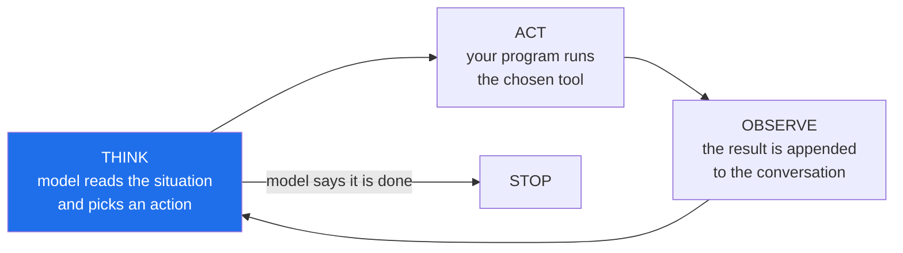

# 1.2 — Goal, tools, loop, stop condition: the anatomy of deciding

## One-line answer

An agent is built from exactly four parts — a **goal**, a set of **tools**, a **loop**, and a **stop
condition** — and three of them are obvious while the fourth is the one that decides whether you have
a system or an incident.

---

## The story

A new employee is given a task on their first morning: *"find out why customers in Germany are
complaining about delivery times, and write it up."*

They are competent. They have access to the ticket system, the shipping dashboard, and the archive.
And they get to work: read some tickets, notice a pattern, check the dashboard, find a carrier whose
times slipped, search the archive for previous carrier problems, find one, read it, notice it
mentions a different region, check that region too, find something mildly interesting there, follow
it…

At six o'clock their manager asks how it is going. They have thirty browser tabs open, a genuinely
interesting body of knowledge about European logistics, and no write-up.

Nothing they did was wrong. Every single step was a reasonable next step given the step before it.
They had a goal, they had tools, and they had a loop — read, think, look something up, repeat. What
they did not have was **any sense of when the task was finished**, and without that the loop simply
does not terminate. It is not that they were lazy or distracted. It is that "find out why" has no
edge, and a loop with no edge runs until something outside it intervenes.

The manager intervening at six o'clock was the stop condition. It just was not part of the design.

---

## The idea in plain language

Every agent, in every framework, in every language, is these four things. Learn them here and you
will recognise them under any amount of library-specific vocabulary later.

### 1. The goal

**What you want, in words, given to the model.** Not a sequence of steps — a description of the
finished state.

*"Triage this ticket: decide its category and urgency, gather evidence for your decision, and draft
a reply the customer could actually receive."*

The goal is the thing the model is reasoning towards. Its wording matters enormously, and Day 6
(ADK-03, AG-05) is entirely about instruction and persona design. For now the important property is
this: **a goal with no describable finished state cannot be completed**, only abandoned. That is the
story above.

### 2. The tools

**The set of actions available.** Each is a function with a name, a description, and typed
parameters. The model cannot invent new ones — it can only choose among the ones you gave it, which
is the first and most important limit on what it can do.

For Sutra's Researcher: `search_archive(query)`, `fetch_status_page(vendor)`,
`get_ticket(ticket_id)`. Notice all three only *read*. That is deliberate and it is
Principle 11 — **read-only by default** — and it means the worst outcome of a wrong choice is a
wasted call rather than a wrong action in the world.

The tool *descriptions* are part of the prompt. The model chooses between tools by reading what you
wrote about them, which makes tool description a design activity rather than documentation. Day 11
(AG-06) is about this.

### 3. The loop

**The cycle that lets one decision follow another.** It has three beats, and every agent framework
in existence is an elaboration of them:



**Think** — the model receives the goal, the tool list, and everything that has happened so far, and
produces either a tool request or a final answer. **Act** — your program runs the requested tool.
**Observe** — the result is appended to the conversation, so the next Think has it.

The critical detail, and the one that surprises people: **the model has no memory between turns.**
Each pass hands it the entire history again. What looks like the agent "remembering" what it found
is your loop re-sending it. Day 2 (AG-02) makes this concrete, and it is why Days 19–20 are about
context engineering — the history grows every turn, and the window does not.

### 4. The stop condition

And here is the one that separates a demo from a system.

The obvious stop is **the model says it is finished** — it returns an answer instead of a tool
request. Necessary, and not sufficient, because it depends entirely on the model's judgement of a
goal that may have no edge.

So every real agent carries **stops the model does not control**:

| Stop | Who holds it | Guards against |
| --- | --- | --- |
| Model returns a final answer | the model | the normal case |
| Maximum iterations (say, 8) | **you** | the loop that never converges |
| Maximum tool calls | **you** | the agent that searches forever |
| Token or quota budget | **you** | the run that eats your daily allowance |
| Wall-clock deadline | **you** | the run that hangs on a slow tool |
| Repeated identical call | **you** | the loop that asks the same thing twice |
| An error the loop chooses not to swallow | **you** | failing honestly (Principle 10) |

**Every row after the first is a limit the programmer sets**, and this is where
[1.1](1.1-who-decides-the-next-step.md)'s definition gets its real shape. The model decides *what
happens next*; the programmer decides *how long it is allowed to keep deciding*. That is not a
contradiction — it is the arrangement that makes agents usable.

> 💡 **The mental model:** the goal is the destination, the tools are the roads, the loop is driving,
> and the stop condition is the fuel gauge, the odometer limit, and the passenger who says "that's
> enough, take me home." **A taxi without any of those three is not more autonomous. It is lost.**

---

## Why Sutra needs it

These four parts are the skeleton of the entire remaining curriculum. Almost every later day adds
capability to one of them.

- **Day 3 hand-rolls this loop** (AG-03) in plain Python with no framework — think, act, observe,
  and a `for` loop with a cap. That cap is the fourth part, and Day 3 exists so you have written it
  yourself before a library writes it for you.
- **Day 4 builds tools by hand** (AG-04): the JSON schema, the tool-result turn, the round trip.
  Part 2 of the four, made real.
- **Day 6 is instruction and persona design** (ADK-03, AG-05). Part 1.
- **Day 19–20 are context engineering** (AG-08..10, ADK-22): what earns a place in the window, and
  what to do when the history outgrows it. This is the direct consequence of "the model has no
  memory between turns".
- **Day 24 is token accounting and budgets** (OPS-07, AG-11) — denominated in RPM/RPD per provider,
  not dollars. A stop condition with a number attached.
- **Day 59's failure lab** (AG-21, SEC-04) is what happens when the stop condition is missing or too
  loose. It is the story at the top of this page, running on your machine and spending your quota.
- **Day 72 is backoff with honesty** (SEC-15, OPS-13): `retry-after`, 1→2→4→8s, escalate after N,
  never invent a result. A stop condition for the failure path.

---

## The paper behind it

> **Intelligent agents: theory and practice**
> `doi:10.1017/S0269888900008122` · *The Knowledge Engineering Review* 10(2), 1995
> <https://doi.org/10.1017/S0269888900008122>

It claimed that the word "agent" means one specific thing — a system that is **autonomous,
reactive, pro-active and social** — and that a program missing any one of those four belongs in a
different pile.

Three of the four anatomy pieces map straight onto it: the **goal** is pro-activeness, the **loop** is what makes reactivity possible, and the **stop condition** is the part the paper never had to worry about, because a 1995 agent did not bill you per step.

**Taught in full in [*Intelligent agents: theory and practice*](../../papers/01-intelligent-agents.md)**, in this
day's `papers/` directory, including which half of the paper the field kept and which half it quietly dropped.

---

## The mechanism

No framework today, and no model call — Day 2 makes the first one. What you can do now is read the
shape, because you will write it on Day 3 and then recognise it inside every library afterwards.

Here is the loop as pseudocode. It is not runnable — it names a `model` and tools that do not exist
yet — and it is deliberately short, because the whole point is that the skeleton is small:

```python
def run_agent(goal: str, tools: dict, max_steps: int = 8) -> str:
    """Think -> act -> observe, until the model finishes or we stop it."""
    history = [system_prompt(tools), user_message(goal)]

    for step in range(max_steps):  # <- the stop condition YOU hold
        reply = model.generate(history)  # THINK
        history.append(reply)

        if reply.is_final_answer:  # <- the stop condition the MODEL holds
            return reply.text

        result = tools[reply.tool_name](**reply.tool_args)  # ACT
        history.append(tool_result(reply.tool_name, result))  # OBSERVE

    raise BudgetExhausted(f"no answer after {max_steps} steps")  # fail honestly
```

**Line by line:**

- `def run_agent(goal, tools, max_steps=8)` — the four parts are literally the signature. `goal` is
  part 1, `tools` is part 2, the function body is part 3, and `max_steps` is part 4. If you ever
  cannot find one of the four in a piece of agent code, it is missing, not implicit.
- `history = [system_prompt(tools), user_message(goal)]` — the conversation starts with the tool
  descriptions and the goal. **The tool list is part of the prompt**, which is why tool descriptions
  are a design surface and not documentation.
- `for step in range(max_steps)` — the programmer's stop, and it is a `for` rather than a `while` on
  purpose. A `while` loop with a break condition can fail to break; a `for` over a fixed range
  **cannot run more times than the range**, so the bound is structural rather than conditional. That
  is the same instinct as `.gitignore` before the secret exists (Day 0,
  [2.2](../../../day-00-toolchain-skeleton-driver/parts/02-repo-skeleton/2.2-gitignore-before-secrets-exist.md)): prevention as structure,
  not as memory.
- `reply = model.generate(history)` — THINK. Note that the **entire** history goes in every time.
  The model is stateless; the loop is what makes it look otherwise.
- `history.append(reply)` — the model's own turn is appended before anything else happens. Skip this
  and the next Think has no idea it just asked for a tool, so it asks again — a two-line bug that
  produces an infinite loop of identical calls.
- `if reply.is_final_answer: return reply.text` — the model's stop. It comes *first* in the body
  because a final answer must not be treated as a tool request.
- `tools[reply.tool_name](**reply.tool_args)` — ACT. The dictionary lookup is the guard: a tool name
  the model invented raises `KeyError` rather than executing anything. **The model can only choose
  among what you gave it**, and this line is where that limit physically lives.
- `history.append(tool_result(...))` — OBSERVE. The result re-enters the conversation, which is the
  only way the next Think can use it.
- `raise BudgetExhausted(...)` — falling out of the loop is a **failure**, not a quiet return of
  whatever was last said. Principle 10: errors surface, escalate, and are logged; never fabricate a
  result to cover one. Returning `history[-1].text` here would look tidier and would be a lie.

Now count the parts in the story from the top of this page. The new employee had a goal ("find out
why"), tools (ticket system, dashboard, archive), and a loop (read, think, look up, repeat). Three
of four. **The missing one is the one that turned a competent morning into a wasted day**, and it is
the only one of the four that a beginner reliably forgets — because in a demo, the model always
finishes.

---

## When it breaks

**The loop that never ends**, which is the story made mechanical:

```text
step 1: search_archive("germany delivery complaints")   -> 12 results
step 2: search_archive("germany delivery carrier")      -> 9 results
step 3: search_archive("carrier delays 2026")           -> 15 results
step 4: search_archive("delays europe")                 -> 21 results
...
step 47: search_archive("logistics")                    -> 340 results
```

**What is happening.** Every individual step is reasonable, the goal has no describable finished
state, and each result suggests another query. There is no error and nothing has malfunctioned —
which is exactly why this is dangerous. With `max_steps=8` the run ends at step 8 with a
`BudgetExhausted`, which is a *bad result you can see*. Without it, the run ends when your quota
does.

**The smallest fix is not a better prompt.** It is the cap. A better goal helps — *"produce a
one-paragraph summary citing at most three tickets"* has an edge that *"find out why"* does not —
but a goal is a request and a cap is a guarantee. **Build the guarantee; improve the request.**

**The model that invents a tool:**

```text
Traceback (most recent call last):
  File "sutra/loop.py", line 24, in run_agent
    result = tools[reply.tool_name](**reply.tool_args)
             ~~~~~^^^^^^^^^^^^^^^^^
KeyError: 'send_email'
```

**What it means.** The model asked for a tool that does not exist. It was given three read-only
tools and it decided the task needed an email sent, so it asked for one. **Read that failure
carefully, because it is good news**: the `KeyError` is the dictionary lookup refusing, and nothing
was sent. Had you written a permissive dispatcher that tried to be helpful, this would have been the
moment your read-only agent did something.

The fix is not to add `send_email`. It is to catch the `KeyError`, append a tool result saying *"no
such tool; available tools are: …"*, and let the loop continue — the model then re-plans with
accurate information. **Feeding the error back is almost always better than crashing**, because the
model can recover from an observation and cannot recover from a traceback.

**The forgotten append:**

```text
step 1: search_archive("redirect loop")  -> 3 results
step 2: search_archive("redirect loop")  -> 3 results
step 3: search_archive("redirect loop")  -> 3 results
```

Identical calls, forever, until the cap. **The bug is one missing line**: either the model's turn or
the tool result was not appended to `history`, so every Think sees the same conversation and makes
the same decision. Deterministic input, deterministic output. This is the most common loop bug there
is, and the "repeated identical call" row in the stop-condition table exists to catch it in
production even after you have fixed it in development.

---

## In production

**The cap is not a training wheel.** New engineers often treat `max_steps` as scaffolding to be
removed once the agent "works properly". It is the opposite: at volume it is the only thing standing
between an unusual input and an unbounded cost, and it is also what makes capacity planning possible
at all. *"Each ticket costs at most 8 model calls and at most 6 tool calls"* is a sentence you can
build a budget on. *"Usually about three"* is not.

**Professionals hold several stops at once, and they are layered deliberately.** A production loop
typically carries an iteration cap, a wall-clock deadline, a token budget, and a duplicate-call
detector — because each catches a different failure. The iteration cap catches the loop that
converges slowly; the deadline catches the tool that hangs; the token budget catches the run whose
history grew until each call was enormous; the duplicate detector catches the missing-append bug and
the model that has genuinely got stuck. **Any one of them alone leaves a gap the others cover.**

**What degrades at scale — the distribution, not the average.** In development you run the agent
twenty times and it takes two or three steps. In production you run it ten thousand times and
discover the tail: most runs take three steps, a few take eight, and a handful hit every cap you
set. Those handful are not anomalies to be explained away — they are the runs that define your cost
ceiling, your latency SLO, and your on-call load. **The average tells you nothing useful about an
agent; the 99th percentile tells you what it will cost you.** This is why Day 84's tracing (ADK-63,
ADK-74, OPS-16) records every node, tool call and model call: without the distribution you are
budgeting from an anecdote.

**The failure that only appears with real data.** Under test, the archive returns three tidy results
or nothing. In production it returns *slightly* relevant results for every query, forever, because
real archives are large and real queries are fuzzy. The agent never gets a clean "nothing found"
signal to stop on, so it keeps going — each step defensible, the sequence absurd. **A tool that
never returns "no" is a tool that removes a natural stop**, and tool design (Day 11, AG-06) is
partly about making sure your tools can say no clearly.

**The review comment a senior engineer leaves.** On a pull request adding an agent loop with no cap:
*"There's no bound on this loop. What's the maximum number of model calls one request can trigger,
and what happens when we hit it? I want a number I can put in a budget and an error I can alert on
— not a `while True` and a hope."* The unstated point is that **an unbounded loop is not a
performance problem, it is a reliability and cost problem**, and both belong in the design rather
than in a later incident.

**The interview question.** *"How do you stop an agent from looping forever?"* A weak answer says
"prompt it better". A strong answer separates the two kinds of stop: the model's own judgement that
it is finished, which you should improve but must never rely on, and the programmer's hard limits —
iteration cap, deadline, budget, duplicate detection — which are guarantees rather than requests.
The detail that marks experience is saying what happens **when a cap is hit**: it must fail loudly
and escalate, never quietly return the last thing the model said, because a fabricated result is
worse than an error you can see.

---

## Check yourself

Take the four parts and write them down for Sutra's Researcher agent — the one you will build on
Day 58. One line each:

```text
GOAL:  ...
TOOLS: ...
LOOP:  think -> act -> observe
STOP:  model finishes  OR  ...  OR  ...  OR  ...
```

Fill the `STOP` line with at least three limits **you** hold, with actual numbers. If you cannot put
a number on one, that is the one you have not decided yet.

**Answer out loud, without scrolling up:**

> Name the four parts of an agent. Then explain why the *stop condition* is the one that separates a
> demo from a system — and say what must happen when a cap is hit, and why returning the model's
> last message instead would be a lie.

---

**Next:** [1.3 — When an agent is the wrong answer](1.3-when-an-agent-is-the-wrong-answer.md)
