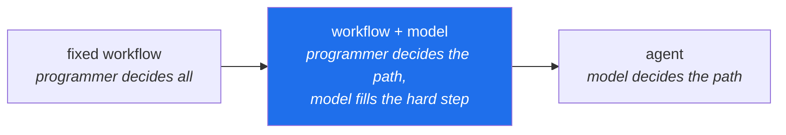

# 1.3 — When an agent is the wrong answer

## One-line answer

Autonomy is a **purchase**, not an upgrade: you pay in predictability, testability, latency and
quota, and you should only pay when the input genuinely varies in ways you cannot enumerate.

---

## The story

A team automates a small, dull process: when a refund request arrives, check whether the order is
inside the return window, check whether the item is in the non-returnable category, and either
approve or route it to a human.

It is three lookups and two comparisons. The old version was forty lines of Python, ran in
milliseconds, and had a test for each branch.

The new version is an agent. It has three tools — `get_order`, `get_policy`, `route_to_human` — and
a goal that describes the policy in words. It works. In the demo it works beautifully: you can ask
it about an edge case in plain English and it reasons about it out loud, and everyone in the room
can see what it is thinking.

Three months later the team is having a different set of conversations.

The finance lead wants to know why refund processing costs went from nothing to a real line item.
The answer is four model calls per request, times a few thousand requests a day.

The support lead wants to know why some refunds take eleven seconds. The answer is four sequential
model calls, and sometimes a retry.

And an auditor asks the question that actually hurts: *"Show me that order #88213 was correctly
refused."* The old system could answer that in one line — the order was outside the window, here is
the branch that fired. The new one produces a paragraph of reasoning that is *usually* right, was
right in this case, and cannot be shown to be right in general.

Nothing failed. The agent is doing its job. It is simply that the team bought flexibility for a
process whose inputs never varied, and paid for it in three currencies they had not budgeted.

---

## The idea in plain language

[1.1](1.1-who-decides-the-next-step.md) said the model decides what happens next.
[1.2](1.2-goal-tools-loop-stop.md) said you bound how long it gets to keep deciding. This part is
the question that comes before both: **should the model be deciding here at all?**

The honest framing is a trade, with four things on each side.

**What autonomy buys you**

- **Inputs you did not anticipate.** The one real advantage, and everything else follows from it. If
  a ticket arrives in a shape nobody imagined, an agent can still make a reasonable attempt; a
  workflow jams or forces a bad fit.
- **Fewer branches to write.** The combinatorial explosion of "what if it's this *and* that" lives
  in the model's reasoning instead of in your code.
- **Graceful degradation on partial information.** A missing field is something to reason around
  rather than a `KeyError`.
- **Change without redeployment.** Adjusting behaviour is sometimes a prompt edit rather than a code
  change — which is a genuine benefit and also, as [1.4](1.4-sutra-on-the-spectrum.md) will note, a
  genuine hazard.

**What autonomy costs you**

- **Predictability.** You cannot say in advance what it will do. For some systems that is fine; for
  a refund decision it is a compliance problem.
- **Testability.** A workflow with five branches is tested by five tests. An agent is tested by
  *evaluation* — a set of cases scored against a rubric, giving you a percentage rather than a
  guarantee. That is a whole discipline (Days 79–83), and it is more expensive than `pytest`.
- **Latency and quota.** Every decision is a model call. Four calls is four round trips, and on a
  free tier it is four requests against a limit measured in tens per minute.
- **Explainability.** "Why did it do that?" has an exact answer for a workflow and a probabilistic
  one for an agent.

Now the practical test. Ask these five questions, and be honest about the answers:

| Question | If **yes** → workflow | If **no** → maybe an agent |
| --- | --- | --- |
| Can you enumerate the inputs? | The branches are writable. Write them. | Enumeration is where agents earn their keep. |
| Is the sequence of steps the same every time? | Nothing is being decided. | Varying sequence is the definition of the job. |
| Must you explain every decision exactly? | Determinism is a requirement, not a preference. | A rubric and a trace may be enough. |
| Is the action irreversible or expensive? | Put a human or a fixed rule in front of it. | Read-only actions are cheap to get wrong. |
| Does it run at high volume with tight latency? | The call cost dominates. | A slower, richer decision is affordable. |

**The rule of thumb, and it survives contact with reality: use the least autonomy that solves the
problem.** Not because agents are bad, but because every unit of autonomy is a unit of
unpredictability you now have to manage — with budgets, traces, evals and gates, all of which are
real engineering you would not otherwise be doing.

> 💡 **The mental model:** autonomy is like **variable interest**. You take it on when the
> flexibility genuinely pays for itself, and you should be able to say out loud what you are buying.
> "It felt more modern" is not a rate you want to be paying at volume.

There is a third option that people skip, and it is usually the right one:



**The middle box is where most production value lives.** A fixed pipeline where one step — the
classification, the summarisation, the extraction — is done by a model. You keep the predictable
skeleton, the exact call count, and the testable branches, and you get the model's judgement exactly
where the judgement was actually needed. The refund system in the story wanted the middle box and
built the right one.

---

## Why Sutra needs it

Sutra is an agent system, so it would be easy to skip this part. Skipping it is exactly how you end
up with the refund system.

- **Day 53 introduces the graph Workflow Runtime** (ADK-32..34) — the 2.x composition model, and the
  first of the four 1.x → 2.x traps in plan §5.1. It is a **graph**: nodes, edges, and a path that a
  person drew. Agents sit at *some* of its nodes. That design is this part's conclusion made
  structural, and if you arrive at Day 53 believing "agent" means "no fixed structure", the whole
  runtime will look like a betrayal instead of the point.
- **Day 58 builds the triage graph v1** (ADK-41, ADK-42): intake → classify → research → draft →
  review. Four of those five steps are fixed. Only *research* is genuinely agentic, and
  [1.4](1.4-sutra-on-the-spectrum.md) is about why the line sits there.
- **Day 56 covers planning patterns** (AG-17, AG-18) — plan-and-execute, replanning. A plan-and-
  execute agent is a deliberate move *back* along the spectrum: let the model decide the sequence
  once, then execute it predictably, so you get one unpredictable decision instead of many.
- **Day 63 designs approval gates** (SEC-05, ADK-47). The irreversible-action row of the table
  above, built.
- **Day 79 begins evals** (AG-26, ADK-58, ADK-59) — the testing discipline that autonomy forces on
  you. The cost side of the trade, arriving as five days of work.

---

## The mechanism

No code today. The mechanism is a decision you make deliberately and write down, and there is a
concrete procedure for it.

**Step 1 — describe the process as steps, honestly.**

Write the steps you would give a new colleague. If you can write them all, and the list does not
contain "…and use your judgement", the process is a workflow. The refund system's list was:

```text
1. fetch the order
2. is order_date within the return window?      -> no  : refuse, cite the window
3. is the item in the non-returnable category?  -> yes : refuse, cite the category
4. otherwise                                    -> approve
```

**Line by line:**

- Four steps, no judgement, every branch enumerable. That is a decision *table*, not a decision
  *process* — and a decision table is code.
- The `-> no` / `-> yes` arrows are the tell: each is a comparison with an exact answer, which means
  a test can assert it. Nothing here needs a model.
- If a fifth line had said *"if the customer's explanation suggests the item was faulty, treat it as
  a warranty claim instead"*, that line — and only that line — is a judgement, and it is the middle
  box: a model call inside a fixed pipeline.

**Step 2 — count what the agent version costs.**

Be concrete, in the currencies that matter on a free tier (Principle 15 — quota is the currency):

| | Workflow | Agent |
| --- | --- | --- |
| Model calls per request | 0 (or 1 for the judgement step) | 3–6, unbounded without a cap |
| Latency | milliseconds | seconds, times the number of calls |
| Tests needed | one per branch | an evalset plus a rubric |
| "Why did it decide that?" | the branch that fired | a trace and a probability |
| Free-tier requests/day it consumes | ~0 | volume × calls |

That last row is the one that decides it at zero budget. Gemini's free tier is measured in tens of
requests per minute; if a process runs a thousand times a day, an agent version does not fit and a
workflow version costs nothing.

**Step 3 — write it down as a decision, not a default.**

This is what an ADR is for ([2.3](../02-repo-as-memory/2.3-the-adr-that-survives-a-cold-read.md)), and it is why
Day 1 includes writing one. The record should say what you chose, what you were buying, and — most
importantly — **what would change your mind**:

```text
Decision: the classifier is a single model call inside a fixed pipeline, not an agent.
Because: the six categories are enumerable and the sequence never varies.
Changes our mind: if >5% of tickets are routed to "other" in a month, the categories
  are no longer enumerable and the classifier should be revisited.
```

**Line by line:**

- `Decision:` — states the position, and names the middle box explicitly rather than saying "not an
  agent", which would leave the reader guessing what it *is*.
- `Because:` — the reason maps directly to two rows of the five-question table. A reason that does
  not map to a row is usually an aesthetic preference wearing a reason's clothes.
- `Changes our mind:` — **a threshold with a number**. "If it stops working well" is not a
  falsifiable condition and will never fire. *">5% routed to other in a month"* is something a
  dashboard can tell you, which means the decision has an expiry check rather than sitting
  unexamined until an incident.

---

## When it breaks

This failure has no traceback, which is why it survives so long. It surfaces in four conversations,
and each one is a symptom of the same purchase.

**The cost conversation:**

```text
Free tier: 429 Too Many Requests
{
  "error": {
    "code": 429,
    "message": "You exceeded your current quota, please check your plan and billing details.",
    "status": "RESOURCE_EXHAUSTED"
  }
}
```

**What it means here.** Not that the code is wrong — that the *design* consumes more requests than
the tier allows. The workflow version of this process would have made zero calls. **The smallest fix
is not backoff** (Day 72 covers that, and it does not create quota); it is moving the deterministic
steps out of the model's hands so that the model is called once, for the step that needed judgement.

**The latency conversation.** Four sequential model calls at roughly a second each is four seconds
before anything happens, and a retry makes it seven. There is no error to catch; the system is
merely slow in a way its fixed-pipeline ancestor was not. **The fix is architectural**: fewer
decisions, or decisions made in parallel, or a plan-and-execute shape (Day 56) that makes one
decision instead of four.

**The audit conversation**, which is the one with no technical fix:

> *"Show me that order #88213 was correctly refused."*

For a workflow: *"line 14, the order date was outside the window, here is the test that covers it."*
For an agent: a trace showing the tools it called and the text it produced. That may be enough. In a
regulated context it is often not, and **no amount of prompt engineering converts a probabilistic
process into a deterministic one**. If the answer must be provable, the decision must be code.

**The testing conversation.** The team writes `test_refund_outside_window_is_refused`, runs it, and
it passes. They run it again and it passes. They run it a hundred times and it fails twice, because
the model phrased a refusal in a way the assertion did not match. **A flaky test is what a
non-deterministic system looks like from inside a deterministic test framework** — and the correct
response is not to loosen the assertion until it stops failing, but to recognise that this behaviour
needs an evalset and a rubric (Day 79–83), which is a strictly larger amount of work than the five
tests the workflow needed.

---

## In production

**The bias of the field runs the wrong way, and knowing that is professionally useful.** Agents are
new, interesting, and demo extremely well — a system that reasons out loud is far more impressive in
a meeting than forty lines of correct branching. That bias produces agents in places where a
workflow was wanted, and the bill arrives a quarter later in latency, cost and unexplainable
decisions. **The engineer who can say "this doesn't need an agent" is more valuable than the one who
can build one**, because the second skill is now common and the first is still rare.

**The strongest production pattern is a fixed skeleton with agentic pockets.** Not "is this system
an agent?" but "which *parts* of this system need judgement?" — a deterministic graph where most
nodes are code, a few nodes are single model calls, and one or two are genuinely agentic loops with
hard caps. You get an exact call count for most of the flow, tests for the deterministic parts, and
the model's judgement exactly where the input actually varies. This is what Sutra's Day 58 triage
graph is, and it is why the plan reaches for a *graph* runtime rather than an agent tree.

**Plan-and-execute is the underrated middle.** Let the model produce a plan once — a list of steps —
then execute that list deterministically, with the plan logged. You get one unpredictable decision
instead of N, a plan a human can inspect *before* anything runs, and an exact cost. It is less
impressive in a demo and considerably better in production, and Day 56 covers it (AG-17, AG-18).

**What degrades at scale.** At ten requests a day, an agent's unpredictability is a curiosity; you
can read every trace. At ten thousand, the tail becomes the story: the 1% of runs that hit every cap
define your cost, your latency SLO and your on-call load, and the "usually about three calls"
average tells you nothing about any of them. **Autonomy's costs are superlinear in volume while its
benefits are not** — the flexibility helps on the unusual input whether you run ten or ten thousand,
but the unpredictability compounds.

**The failure that only appears with real data.** In development, inputs are the ones you thought of
— which is precisely the condition under which a workflow is sufficient and an agent looks like
overkill. In production, inputs include the ones you did not think of, which is where the agent
earns its keep. **This is why the decision is genuinely hard**: the development environment
systematically understates the case for autonomy, and the demo systematically overstates it. The
only honest way through is to look at real input variety before deciding, which usually means
shipping the workflow first and letting the "other" bucket tell you whether you need more.

**The review comment a senior engineer leaves.** On a pull request replacing a deterministic
function with an agent: *"What input does the current version get wrong? If you can't name one,
we're adding four model calls, several seconds of latency and an evalset to replace something with
complete test coverage. If you can name one, let's put a single model call at that step instead of
making the whole path dynamic."* Notice the reviewer offers the middle box rather than refusing —
they are separating *the step that needs judgement* from *the path*, which is the whole skill.

**The interview question.** *"When would you not use an agent?"* This is a seniority filter, and
enthusiasm is the wrong answer. A strong response names the conditions — enumerable inputs, a fixed
sequence, a requirement to explain every decision exactly, irreversible actions, high volume with
tight latency — and then names the middle option, because a candidate who only sees "workflow or
agent" has missed where most production value actually is. The sentence that lands: **"use the least
autonomy that solves the problem, because every unit of autonomy is a unit of unpredictability you
then have to pay to manage."**

---

## Check yourself

Take Sutra's five stages — intake, classify, research, draft, review — and run the five-question
table over each one. Write `workflow`, `workflow + model`, or `agent` next to each, with one line of
reason.

```bash
grep -n "triage graph\|intake→classify\|Writer↔Critic" docs/00_MASTER_PLAN.md | head -5
```

That prints the plan's own description of the pipeline you are classifying. Compare your five
answers with [1.4](1.4-sutra-on-the-spectrum.md) once you have written them down — **write first,
then compare**, because agreeing with an answer you have already seen teaches nothing.

**Answer out loud, without scrolling up:**

> Name three things autonomy costs you. Then describe the option between "fixed workflow" and
> "agent", and say why it is where most production systems should sit.

---

**Next:** [1.4 — Sutra on the spectrum](1.4-sutra-on-the-spectrum.md)
