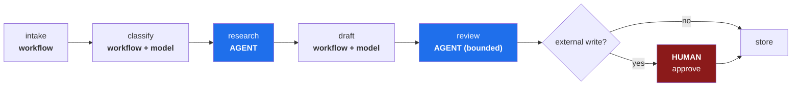

# 1.4 — Sutra on the spectrum: where the model decides, and where it never will

## One-line answer

Sutra is a **fixed pipeline with two agentic pockets and a human gate** — and being able to point at
each of its five stages and say who decides there is the difference between having read about agent
design and having done it.

---

## The story

A team ships an agent that handles customer refunds end to end. It is genuinely good: it reads the
request, checks the order, applies the policy, and issues the refund.

For five weeks it is the best thing they have built.

In week six a request arrives that is unusual in a way nobody had considered — a customer asking
about an order that had already been refunded once, using wording that made it sound like a
duplicate charge rather than a second request. The agent reasoned about it, decided a refund was
warranted, and issued one.

It was wrong. It was also entirely defensible as a chain of reasoning; reading the trace afterwards,
every step follows from the one before. The agent did not malfunction. It made a judgement call on
an input nobody had anticipated, which is precisely the thing it was built to do.

The money went out. That is the part that matters. Not that the judgement was wrong — judgements are
sometimes wrong, and a human would have got some of these wrong too — but that a wrong judgement
**reached the outside world without anyone seeing it.**

The team's fix was not a better model or a better prompt. They kept the agent's reasoning exactly as
it was, and moved one thing: the refund tool stopped issuing refunds and started *proposing* them.
A person clicks approve. The agent still does all the thinking; it no longer does the last inch.

Throughput dropped by a few seconds per request. The category of incident disappeared entirely.

---

## The idea in plain language

[1.1](1.1-who-decides-the-next-step.md) gave the definition, [1.2](1.2-goal-tools-loop-stop.md) the
anatomy, [1.3](1.3-when-an-agent-is-the-wrong-answer.md) the trade. This part applies all three to
the system you are about to spend ninety-five days building, because a principle you have not
applied to something concrete is a principle you will misapply later.

**Sutra is an autonomous support-ticket triage desk.** A ticket arrives; it gets classified,
researched, answered and reviewed; anything that touches the outside world waits for a person.

Here is the whole thing, with the boundary drawn:



Five stages. **Two of them are genuinely agentic.** One is a human. Two are not agentic at all. That
ratio is not timidity — it is the design.

| Stage | Who decides | Why the line is there |
| --- | --- | --- |
| **Intake** | Nobody — fixed code | Receiving and storing a ticket has no judgement in it. A model here would add cost and a failure mode for nothing. |
| **Classify** | The model, choosing **one label from a fixed set** | Genuine judgement — the wording varies endlessly — but the *outcome space* is enumerated by a person. One call, one label, testable against a labelled set. |
| **Research** | **The model, choosing its own next action** | The only stage where the sequence genuinely cannot be written in advance: what to look up depends on what the last lookup returned. Tools are **read-only**; a wrong choice wastes a call. |
| **Draft** | The model, producing prose in a fixed slot | The pipeline decides that a draft happens; the model decides what it says. |
| **Review** | **Writer ↔ Critic, looping** | Agentic, but *bounded*: at most three rounds, then it escalates. The Critic decides whether to accept — a judgement — but not how long to keep deciding. |
| **Any external write** | **A human** | Irreversible and visible to a customer. Principle 12: humans gate writes, until the graduated-autonomy review on Day 236 of a much longer road. |

Read the *Research* and *Review* rows together, because they show the two different ways to bound an
agent. Research is bounded by **what it can do** — every tool is read-only, so the worst outcome is
a wasted request. Review is bounded by **how long it can do it** — three rounds and out. Those are
the two levers, and real systems pull both.

And the *external write* row is the story from the top of this page, built in from Day 1 rather than
retrofitted in week six.

> 💡 **The mental model:** Sutra is a **hospital**, not a lone doctor. Triage nurses follow a
> protocol. A specialist investigates freely, because that is what investigation is. And nothing
> goes into a patient without a signature — no matter how confident the specialist is.

### The property this buys you

Because only two stages are agentic and both are bounded, you can say true, precise things about
Sutra that you cannot say about the refund system in the story:

- **Maximum model calls per ticket** is a number you can compute: 1 classify + up to 6 research + 1
  draft + up to 3 review rounds. Not "usually about four".
- **Maximum external effect** of a run with no human present is **zero**. Not "low risk".
- **Every deterministic stage is unit-testable**, so the evalset (Days 79–83) only has to cover the
  parts that genuinely need scoring.

Those three sentences are what "production-ready" actually means for an agent system, and all three
are consequences of where the lines were drawn — not of how good the model is.

---

## Why Sutra needs it

This is not a preview of later days. It is the specification they implement.

- **Day 58 builds the triage graph v1** (ADK-41, ADK-42): intake → classify → research → draft →
  review, end to end. The diagram above is that day's target, and the day will be a matter of
  assembling agreed pieces rather than deciding architecture under time pressure.
- **Day 53's graph Workflow Runtime** (ADK-32..34) is the 2.x composition model and the first of the
  four 1.x → 2.x traps (plan §5.1). The runtime is a **graph** because the design is a graph: a
  fixed skeleton with agents at some nodes. If you arrive believing "agent" means "no fixed
  structure", the runtime will feel like a betrayal instead of the point.
- **Day 57 builds the Writer ↔ Critic pair** (AG-19, AG-20, ADK-40) — the bounded loop in the Review
  row, including the round cap.
- **Days 62–65 build human-in-the-loop and approval gates** (AG-23, ADK-46, SEC-05, ADK-47,
  ADK-48, ADK-76). The red box in the diagram, made real, with durable pause and resume.
- **Day 66's threat model** (SEC-06, SEC-07) names the **lethal trifecta**: access to private data,
  exposure to untrusted content, and the ability to communicate externally. Look at the diagram
  again — Research reads private data *and* reads untrusted ticket text, so the only leg missing is
  external communication. **The human gate is what keeps the third leg off.** That is why it is in
  the design on Day 1 rather than added on Day 66.
- **Day 71 is computer use in a sandbox** (AG-31, SEC-14, ADK-50) — the one place Sutra's tools stop
  being read-only, which is exactly why it arrives inside a sandbox and inside the safety phase.

---

## The mechanism

The mechanism today is a written specification, and writing it is the rep. There is no framework
involved — this shape must be decidable in plain text before Day 53 offers you a runtime for it,
because a runtime will happily execute a bad design.

Write this out for yourself, one stage per line. Fill in the numbers; they are decisions, and
leaving one blank is how you find the one you have not made:

```text
STAGE      DECIDER            OUTCOME SPACE          BOUND                     BLAST RADIUS
intake     code               —                      —                          none (local write)
classify   model, 1 call      6 fixed categories     1 call                     a wrong label
research   model, looping     3 read-only tools      max 6 tool calls           a wasted request
draft      model, 1 call      free text              1 call                     a bad draft
review     Writer<->Critic    accept | revise        max 3 rounds               a bad draft, twice
write      HUMAN              approve | reject       —                          customer-visible
```

**Line by line:**

- `DECIDER` — the column [1.1](1.1-who-decides-the-next-step.md) is about. Three distinct values
  appear, and a design where every row says the same thing is a design that has not been thought
  about.
- `OUTCOME SPACE` — what the decider is choosing *between*. `6 fixed categories` is a person's
  enumeration; `3 read-only tools` is a person's list; `free text` is unbounded and is why the draft
  needs a review stage after it. **Narrowing the outcome space is the cheapest safety measure there
  is**, and it costs nothing at runtime.
- `BOUND` — [1.2](1.2-goal-tools-loop-stop.md)'s stop condition, per stage, with a number. `max 6
  tool calls` is a guarantee; "until it has enough" is a hope. Note that `intake` and `write` have no
  bound because neither loops.
- `BLAST RADIUS` — Principle 13: *name what it can destroy before granting the capability.* Read
  down this column and notice the shape — everything is `none`, `wasted`, or `a bad draft` until the
  last row, where it becomes `customer-visible`. **That is the whole safety argument in one column**,
  and the human gate sits on precisely the row where the column changes.
- The `write` row's decider being `HUMAN` is not a placeholder to be replaced when the system is
  "mature enough". It is Principle 12, and Sutra ships with it.

Now check the design against [1.3](1.3-when-an-agent-is-the-wrong-answer.md)'s five questions, for
the one stage that is fully agentic:

```text
research: can you enumerate the inputs?           no  — every ticket differs
          is the sequence the same every time?    no  — depends on what search returns
          must you explain every decision?        no  — a trace is enough; nothing acts on it
          irreversible or expensive?              no  — read-only tools, capped
          high volume, tight latency?             no  — one ticket at a time, seconds are fine
```

**Line by line:**

- Five `no` answers. That is what an agentic stage looks like when the choice is justified rather
  than fashionable — **and it is the only stage in Sutra that scores this way.**
- Run the same five questions against `intake` and every answer flips, which is why intake is code.
  If you cannot produce that contrast for your own system, you have not drawn a boundary; you have
  applied a default.
- The third row is doing quiet work: *"nothing acts on it"* is only true because the write is gated.
  **Change the gate and the explainability requirement changes with it** — the rows are not
  independent, and that coupling is the thing most designs miss.

---

## When it breaks

**The boundary that drifts.** Nothing announces this one. Someone adds a tool to the Researcher — a
small one, `update_ticket_status`, so the agent can mark tickets it has looked at:

```text
research tools:
  search_archive(query)          read
  fetch_status_page(vendor)      read
  get_ticket(ticket_id)          read
  update_ticket_status(id, s)    WRITE   <- added Tuesday, seemed harmless
```

**What has just happened.** The Researcher's blast radius changed from *a wasted request* to *state
change in the ticket system*, and the `BLAST RADIUS` column now has a write in a row that had none.
No test fails. No error appears. The stage is still called "research". **The design drifted and the
document did not**, which is exactly how the refund system in the story came to exist — not by
decision, but by accumulation.

The fix is process, not code: the specification above is a **committed artifact**
([2.3](../02-repo-as-memory/2.3-the-adr-that-survives-a-cold-read.md)), and adding a write tool to a read-only
stage is a change to it. Day 68 (SEC-10, SEC-11, least-privilege tool permissions) is where this
becomes mechanical.

**The bound that was never a number:**

```text
Traceback (most recent call last):
  File "sutra/graph.py", line 88, in review_loop
    raise BudgetExhausted("critic never accepted after 3 rounds")
sutra.errors.BudgetExhausted: critic never accepted after 3 rounds
```

**This is the system working**, and it is worth recognising as such. The Critic and Writer disagreed
three times, the cap fired, and the run failed loudly instead of looping. What must *not* happen is
the tempting fix — raising the cap to five, then ten, then removing it — because each raise trades a
visible failure for an invisible cost. **A cap that keeps firing is information about the prompt or
the task, not about the cap.**

**The human gate that becomes a rubber stamp.** No error text for this one either, and it is the
most common way an approval gate fails in practice: a person approving forty drafts an hour clicks
approve forty times. The gate is present, the review is not. The countermeasures are design
questions — show a diff rather than a wall of text, escalate only the cases that need judgement,
sample-audit the approvals — and Day 62 (AG-23, ADK-46) treats them as the real subject they are.
**A gate nobody reads is a gate that has been removed without anyone deciding to remove it.**

---

## In production

**Writing the boundary down is what makes it survivable.** Every real agent system drifts toward
more autonomy, one small reasonable change at a time, because each individual change is
*genuinely* reasonable. The only defence that works is an artifact that says where the line is and
why — so that moving it is a decision somebody makes, with a reason, in a diff, rather than an
accumulation nobody noticed. That is what an ADR is for, and it is why Day 1 writes one.

**Blast radius is the column that should drive the design.** Notice the ordering of the argument in
*The mechanism*: the human gate is not on the last stage because it is last, but because that is the
row where `BLAST RADIUS` changes from *wasted effort* to *customer-visible*. **Put gates where the
column changes, not where the diagram ends.** A system where the risky action is in the middle needs
the gate in the middle, and plenty of designs get this wrong by defaulting to a final approval step
that sits after the damage.

**The lethal trifecta is the framing to carry into every design review.** Day 66 names it properly
(SEC-06, SEC-07), but the shape is worth holding from Day 1: **private data access + untrusted
content + external communication**. Any two are usually manageable. All three together mean a
malicious instruction hidden in a ticket can reach a customer. Sutra's Researcher holds two legs by
design — it reads the private archive and it reads attacker-supplied ticket text — and the human
gate is the deliberate absence of the third. **When someone proposes letting an agent send a reply
directly, that is not a convenience change; it is completing the trifecta.**

**What degrades at scale.** The gate is the bottleneck, and that is not a flaw to be engineered
away — it is the price of the guarantee. At ten tickets a day a person reviews everything. At ten
thousand, the honest design is *tiered*: high-confidence, low-risk categories flow through with
sampled auditing; everything else is reviewed. That is graduated autonomy, and it is earned with
evidence — an evalset showing the agreement rate between the agent and the human on the category you
are about to release. **Autonomy should be granted against data, not against confidence**, and
Sutra's Days 79–83 exist to produce that data.

**The failure that only appears with real data.** In development, the Researcher's tools return
clean results or nothing. In production, tickets contain quoted email threads, pasted logs, other
customers' words — and, occasionally, text that is trying to instruct the model. This is prompt
injection (Day 66), and it arrives specifically through the stage that reads untrusted content.
**The read-only tool constraint is what makes it survivable**: an injected instruction that
successfully hijacks the Researcher can still only *read*, and still cannot reach a customer without
a human. The boundary drawn today is the reason a Day 66 attack is contained rather than an
incident.

**The review comment a senior engineer leaves.** On a pull request adding a write tool to the
Researcher: *"This changes the blast radius of that stage from 'wasted request' to 'state change',
and the spec says the stage is read-only. If the agent needs to record what it looked at, have it
return that in its result and let the pipeline write it — the pipeline is deterministic and the
agent isn't."* Notice the alternative offered: **move the side effect to the deterministic part**,
which is the standard move and preserves the boundary rather than arguing about it.

**The interview question.** *"Walk me through the architecture of an agent system you've built."* The
answer that separates people is not the diagram — it is being able to point at each stage and say
who decides there and why. If you can say *"these two stages are agentic, these three are not, the
Researcher's tools are read-only so a wrong decision costs a request, the Critic loop caps at three
rounds, and nothing reaches a customer without a human — and here's the ADR that says so"*, you have
described a system somebody thought about. If the answer is *"it's an agent, it handles the whole
flow"*, the follow-up question is going to be about the refund that went out in week six.

---

## Check yourself

Write out the six-row table from *The mechanism* from memory, then compare with this page. The
column you should check hardest is `BLAST RADIUS` — it is the one that determines where the gates
go.

```bash
grep -n "Triage graph v1\|Writer↔Critic\|Approval gates" docs/00_MASTER_PLAN.md
```

That prints the days that build each part of the diagram — Day 57, Day 58, Days 63–64. You now know
what those days are *for* before you reach them.

**Answer out loud, without scrolling up:**

> Name the two stages of Sutra that are genuinely agentic, and say how each one is bounded — one by
> *what it can do*, one by *how long it can do it*. Then explain why the human gate sits where it
> does, in terms of blast radius rather than in terms of the diagram's shape.

---

**Section 1 is done.** You can now say what makes a system agentic, name its four parts, argue for
*less* autonomy where less is right, and point at Sutra's own boundary. Section 2 is about the
repository that has to remember all of this.

**Next:** [2.1 — What Sutra actually is](../02-repo-as-memory/2.1-what-sutra-actually-is.md)
