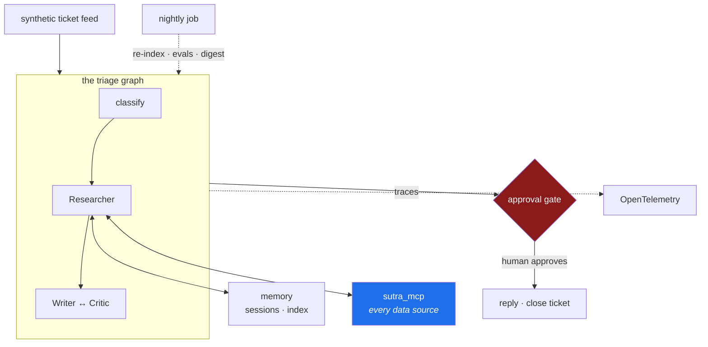

# 2.1 — What Sutra actually is

## One-line answer

Sutra is **one system, built once, that every concept in this curriculum lands in** — an autonomous
support-ticket triage desk — and the reason it is one system rather than ninety-six exercises is
that a concept you cannot bolt onto something real is a concept you have not learned.

---

## The story

Two people finish the same course.

The first has a folder of ninety-six small programs. Each one demonstrates a concept cleanly. There
is a script that calls a model, a script that uses a tool, a script that stores a conversation, a
script that runs two models against each other. Every one of them works.

The second has one repository containing one system that does something.

At an interview, the first person is asked: *"you've used sessions — what happens when two tickets
for the same customer arrive while the first is still being worked?"* They know what a session is.
They have never had two at once, because their session script had one. They give a reasonable
theoretical answer and both people in the room can hear that it is theoretical.

The second person is asked the same question and says: *"we key sessions by ticket, not by customer,
and I found out why on the day I keyed them by customer — the second ticket inherited the first
one's research context and the draft cited the wrong order number. There's an ADR about it."*

The difference is not knowledge. Both of them know what a session is. The difference is that one of
them has **had a concept collide with a neighbouring concept**, which is the only place the
interesting problems live and the only thing a demo cannot produce.

That collision is what a single, continuous system buys you. It is also why the plan's Principle 5
says: **if removing a concept would not break Sutra, it does not get a day.**

---

## The idea in plain language

**Sutra is an autonomous support-ticket triage desk for a fictional software company.**

A *ticket* is a customer's message asking for help. *Triage* is the medical word for deciding what
each arrival needs and in what order. A *desk* is the thing that does it continuously, rather than
once for a demo.

Here is what it does when finished, stage by stage. You met the decision boundary in
[1.4](../01-what-is-an-agent/1.4-sutra-on-the-spectrum.md); this is what the boxes actually contain.

**Intake.** Tickets arrive from a synthetic feed — data invented for this project, never real
customer data. Day 91 surveys Slack-shaped intake as the realistic version.

**The triage graph.** A classifier routes each ticket. A **Researcher** agent gathers evidence:
grounded web search, the ticket archive via retrieval, vendor status pages. A **Writer** drafts a
reply and a **Critic** reviews it, and they go round until the Critic accepts or the round cap
fires.

**Action with brakes.** Every tool that *writes* anything — closes a ticket, posts a reply — sits
behind an approval gate with human-in-the-loop resumption. You can kill the process mid-run; it
resumes where it stopped.

**Memory.** The desk remembers: session state within a run, cross-session memory between runs, and
an embedding index over the ticket archive so it can answer *"has anything like this happened
before?"*

**The data boundary is MCP.** Every data source Sutra touches is exposed through an **MCP server**
— a standard protocol for connecting tools and data to agents. Sutra's own agents are in turn
*servable* over MCP and peerable over A2A, so other systems can use them.

**Skills.** Recurring procedures are packaged as Agent Skills — spec-compliant folders — audited and
version-pinned before they run.

**Ambient.** A nightly job re-indexes, runs the full evalset, and posts a digest. A voice agent
reports the queue state at standup.

**Operable.** Traced end to end with OpenTelemetry, evals running in CI, and a deploy story that
runs on a laptop and would run in a cloud unchanged.



### Why a ticket desk, specifically

The choice is not arbitrary, and the reasoning is worth having because you will one day choose a
project of your own.

A support desk is the smallest realistic system that **genuinely needs every concept in the plan**:

| It needs | Because |
| --- | --- |
| An agent loop | tickets vary in ways you cannot enumerate |
| Tools | the answer depends on data the model does not have |
| Memory | "has this happened before?" is the desk's most valuable question |
| Retrieval | the archive is too large for any context window |
| Multi-agent | drafting and reviewing are genuinely different jobs |
| A protocol boundary | the data lives in systems the agent does not own |
| Human gates | replies reach customers, and that is irreversible |
| Evals | "is the classifier still good?" has no other answer |
| Tracing | "why did it say that?" gets asked by a real person |
| Deployment | a desk that only runs on your laptop is not a desk |

**Nothing on that list is bolted on to justify a lesson.** Each one is load-bearing, which is
Principle 5, and it is what makes the difference between a portfolio project and a tutorial
collection.

There is a second reason, quieter and more practical: **support tickets are synthetic-friendly.**
You can invent a thousand plausible ones without touching anyone's real data — which matters
enormously here, because the free tiers this project runs on may use prompts to improve the
provider's products. Principle 15 and Addendum 02 §7 both say it: **never feed real personal or
employer data through a free endpoint.** A domain where synthetic data is genuinely representative
is a domain you can learn in at zero budget and zero risk.

> 💡 **The mental model:** the ninety-six days are not ninety-six lessons. They are ninety-six
> **changes to one system** — and the system is the thing you can point at afterwards.

---

## Why Sutra needs it

This part is the specification the rest of the curriculum implements, so "why Sutra needs it" is
almost the whole day map. The most direct dependencies:

- **Day 5 puts the first agent in `sutra/`** (ADK-01, ADK-02, ADK-73), and every subsequent day adds
  to the same package rather than starting a new folder.
- **Day 34 builds `sutra_mcp/`** (MCP-04..06) — the data boundary in the diagram. It is a separate
  package because it has a different constraint: by **Day 43** it must be stateless, so that any
  instance can answer any request.
- **Day 49 builds the embedding index** over the ticket archive (AG-33, ADK-30) — the "has this
  happened before?" question, answered locally at $0 because embeddings never leave your machine.
- **Day 58 assembles the triage graph** (ADK-41, ADK-42), which is the middle of the diagram.
- **Day 65 is the durability gate** (OPS-11): kill it mid-run, watch it resume, with a human having
  approved the write.
- **Day 73 builds the nightly job** (AG-24, ADK-51) — the ambient box.
- **Days 94–96 are the capstone**: the whole system run cold, a demo script, and an audit. They only
  work because every day fed the same system.

And the honest one: **Day 95 is an interview drill over every ADR.** The story at the top of this
page is that day, arriving.

---

## The mechanism

There is nothing to run yet — Sutra's first line of product code arrives on Day 5. What exists today
is the **shape**, and the mechanism is checking that the shape you have matches the shape the plan
describes, so that Day 5 has somewhere to land.

Day 0 created the folders. Confirm each one has an owner in the system above:

```bash
ls -d sutra sutra_mcp skills scripts tests days docs && echo "---" && ls sutra/ sutra_mcp/
```

**Line by line:**

- `ls -d <names>` — `-d` lists the directories *themselves* rather than their contents, so you get a
  seven-line confirmation instead of a screen of files.
- `sutra/` — the agent system: the classifier, the Researcher, the Writer, the Critic, the graph.
  Everything in the middle of the diagram.
- `sutra_mcp/` — the data boundary. Separate because Day 43 makes it stateless and deploy-shaped,
  which is a different constraint from the agents that hold conversation state.
- `skills/` — Agent Skills, which are *folders with a `SKILL.md`*, not Python modules. Day 25.
- `scripts/` — tooling that operates on the repository, not on tickets. The word "tools" is reserved
  for the agent sense from Day 4 onward.
- `tests/` and `days/` and `docs/` — the suite, the teaching, and the memory.
- The second `ls` should show only `__init__.py` in each package. **Empty is correct today**, and
  it should stay empty at import time forever (Day 0,
  [2.1](../../../day-00-toolchain-skeleton-driver/parts/02-repo-skeleton/2.1-the-folder-skeleton.md)).

Now read the plan's own description of the product and compare it against the diagram above:

```bash
sed -n '/^## 3 · /,/^## 4 · /p' docs/00_MASTER_PLAN.md | head -40
```

**Line by line:**

- `sed -n '/start/,/end/p'` — print only the lines between two patterns. `-n` suppresses the default
  "print everything", so `p` is the only thing that emits.
- `/^## 3 · /` — the plan's §3, *The Product — what Sutra actually is*. The `^` anchors to the start
  of a line so a mention of "## 3" inside prose cannot match.
- `head -40` — the first forty lines, which is the product description before the repo layout.
- **Read it against the diagram.** If they disagree, one of them is wrong and finding out which is
  worth more than either document — that is Principle 14 in miniature: reality and the plan
  disagreeing is an event, not a nuisance.

The rep for today is not a command. It is to write the system down in your own words, because the
version you can reconstruct is the version you actually hold:

```text
Sutra is _______________________________________________.
It takes ______________ and produces ______________.
The part that genuinely needs an agent is ______________, because ______________.
The part that must never be autonomous is ______________, because ______________.
```

**Line by line:**

- Line 1 must be one sentence with concrete nouns. If it contains "flexible", "powerful" or
  "AI-driven", write it again — those words describe an aspiration, not a system.
- Line 2 forces you to name the input and the output, which is the thing most project descriptions
  skip and the first thing an interviewer asks.
- Lines 3 and 4 are [1.3](../01-what-is-an-agent/1.3-when-an-agent-is-the-wrong-answer.md) and
  [1.4](../01-what-is-an-agent/1.4-sutra-on-the-spectrum.md) applied. **If you cannot fill line 4, you have not
  drawn a boundary** — every real system has something that must not be autonomous, and being
  unable to name it means you have not looked.

---

## When it breaks

The failure here is not a traceback. It is a project that stops being one project, and it happens
gradually.

**Symptom one: the folder of demos.** You reach Day 20 and notice that `sutra/` contains
`context_demo.py`, `compaction_test.py` and `scratch_summarize.py`, none of which the triage graph
imports. Each was written to understand that day's concept, which is legitimate — but they were
written *beside* the system rather than *into* it.

**The fix is structural and Day 0 already built it:** experiments go in `days/day-NN/lab/`, which is
gitignored, and anything worth keeping graduates into `sutra/` with a test the same day. `./m
scaffold N` creates the lab folder for exactly this reason. **The scratchpad is not the
deliverable.**

**Symptom two: the concept that has nowhere to land.** You reach a day and cannot see where it goes
in the system. This is genuinely useful information and there are two possible causes, which need
opposite responses:

- The concept is **parked** — marked 🅿️ in the plan, awareness-level by design. Day 87's Agent
  Engine walkthrough is one: you write the config and read the docs, you do not deploy. Nothing is
  wrong.
- The concept is **not parked and still has nowhere to go.** That is a real signal, and Principle 14
  applies: *if reality changes, the plan is amended first.* Stop, say so, and propose an amendment
  in `docs/CHANGELOG_PLAN.md`. **Do not silently invent a use for it** — a concept bolted on to
  justify a lesson is exactly what Principle 5 exists to prevent.

**Symptom three: real data.** Somebody — possibly you, on a busy evening — pastes a real support
ticket, a real email, or a real internal document into a prompt to see how the desk handles it.

There is no error message. The data has left your machine, gone to a free-tier endpoint, and may be
used to improve the provider's products (Addendum 02 §7). It cannot be recalled.

**The rule is absolute and structural: Sutra's company data is synthetic, always.** Not "mostly
synthetic", not "synthetic in production". The reason the fictional company exists at all is so that
the answer to "can I test with this?" is always no, without a judgement call at 11pm. Day 69
(SEC-12, SEC-13) makes it a formal boundary.

---

## In production

**The single-system constraint is a hiring signal, and it is one of the few that survives
inflation.** Anyone can produce ninety-six working scripts now; generating them is a solved problem.
What is not solved is a system whose parts have had to live with each other — where the session
design constrains the memory design, which constrains the retrieval design, which is why there is an
ADR explaining a compromise. **Constraints leave fingerprints, and fingerprints are what an
experienced interviewer looks for**, because they cannot be produced by anything except having done
it.

**The professional version of "one system" is called a walking skeleton.** Build a thin path
end-to-end first — intake to output, however crude — then thicken it. The alternative, building each
component fully before connecting anything, hides integration problems until the end, which is
precisely when they are most expensive. Sutra follows this: the graph appears at Day 58 in a rough
v1, and Days 59 onward thicken it.

**Synthetic data is not a limitation here; it is the professional default for a whole class of
work.** Real production teams build synthetic fixtures for exactly the reasons this project does —
you cannot put customer data in a test suite, you cannot reproduce a bug from a record you are not
allowed to keep, and you cannot share a dataset that contains personal information. **The skill of
generating representative synthetic data is a real one**, and the free-tier constraint forces you to
practise it from Day 1 rather than discovering it at a compliance review.

**What degrades at scale.** A single-repository, single-system design is right for one person and
ninety-six days. It stops being right when several teams need to release parts independently —
at which point the boundary that survives is the one drawn earliest, which for Sutra is
`sutra/` versus `sutra_mcp/`. **That boundary was chosen on Day 0 precisely because it is the one
most likely to become a service boundary later**, and a boundary you can extract cheaply is the only
kind worth drawing in advance.

**The failure that only shows with real traffic.** Every stage in the diagram works fine on one
ticket. The interesting failures are all *between* stages and only appear under concurrency: two
tickets for the same customer, a research step whose index is being rebuilt by the nightly job, an
approval that arrives after the process restarted. **None of those can occur in a folder of demos**,
which is the deepest reason the plan insists on one system — not pedagogy, but that the bugs worth
learning from are emergent.

**The review comment a senior engineer leaves.** On a pull request adding a standalone script to
`sutra/`: *"What imports this? If nothing does, it belongs in `days/NN/lab/`. If something should,
wire it in and add the test — a module in the package that nothing calls is a module nobody will
maintain and everybody will be afraid to delete."* The unstated point: **an unreferenced file in a
package is future confusion**, and the cost of it lands on whoever arrives next.

**The interview question.** *"Tell me about a project you've built."* The answer that separates
candidates is not the feature list. It is being able to say what the system *does*, in one sentence
with concrete nouns, and then — without being prompted — name a place where two parts of it
constrained each other and what you decided. **A project with no tensions in it is a project that
was never integrated**, and an interviewer who has built things will find that out in two questions.

---

## Check yourself

```bash
ls -d sutra sutra_mcp skills scripts tests days docs && \
  sed -n '/^## 3 · /,/^## 4 · /p' docs/00_MASTER_PLAN.md | head -20
```

Every folder must exist, and the plan's §3 must describe the system you drew above.

Then fill in the four-line template from *The mechanism*, in a scratch file or on paper. Keep it —
[2.3](2.3-the-adr-that-survives-a-cold-read.md) will ask you to turn one of those lines into a
recorded decision, and Day 95 will ask you to say it out loud.

**Answer out loud, without scrolling up:**

> Describe Sutra in one sentence using concrete nouns. Then name one concept from the plan and say
> exactly which part of the system would break without it — and if you cannot, say what that tells
> you about the concept.

---

**Next:** [2.2 — The docs tree, and which document wins](2.2-the-docs-tree-and-precedence.md)
