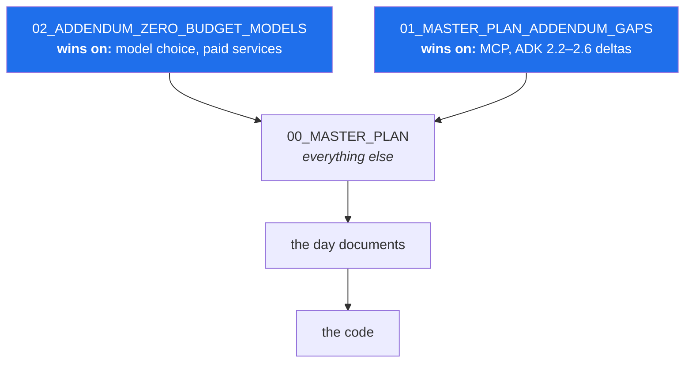

# 2.2 — The docs tree, and which document wins

## One-line answer

A project with several governing documents needs a **stated precedence order**, because documents
written at different times will eventually disagree — and a rule set that does not say what beats
what produces confident wrong answers rather than visible confusion.

---

## The story

A company has a policy document. It is good, and it is thorough, and it was written three years ago.

Since then, reality has moved four times. Each time, somebody wrote a memo: *"further to the policy,
from now on we will…"*. Each memo was correct on the day it was written, and each was circulated
properly.

A new employee is asked to do something the policy covers. They read the policy. They do what it
says. They are told they did it wrong — there was a memo.

So they read the memos. There are four, they were written in different years, and two of them touch
the same paragraph of the policy in ways that do not obviously agree. The employee now has five
documents, all official, all still in circulation, and no statement anywhere about which one wins.

They do the reasonable thing: they pick. And because they are consistent, they pick the same way
every time, which means they are now reliably wrong in one specific direction — and nobody notices
for a while, because being consistently wrong looks exactly like being right until the case comes up
that makes it visible.

**Nobody was careless.** The policy was good, the memos were correct, and the employee was
conscientious. The missing thing was one sentence: *when these disagree, this one wins.*

---

## The idea in plain language

Sutra has five kinds of governing document, and they have genuinely different jobs. Confusing them
is how you end up with the memo problem.

| Document | What it is | Changes when |
| --- | --- | --- |
| **The plan** — `docs/00_MASTER_PLAN.md` | The contract. What is built, in what order, under what principles. | Only by amendment, recorded in the changelog. |
| **Addenda** — `docs/NN_MASTER_PLAN_ADDENDUM_*.md` | Corrections to the plan, made after it was written, when reality moved. | When reality moves again. |
| **ADRs** — `docs/adr/ADR-NNNN-*.md` | One decision each, with its reasoning and what would reverse it. | Never. A superseded ADR is marked superseded, not edited. |
| **Ledgers** — `PROGRESS`, `PACKAGES`, `SKILL_PROVENANCE`, `CHANGELOG_PLAN` | Append-only history: what happened, and when. | Every day, by adding a row. |
| **Generated** — `TRACEABILITY.md`, `TRACKER.md`, `CURRICULUM_INDEX.md` | Computed from the others. | Every time a script runs. Never by hand. |

The distinction between the last two is the subject of [4.1](../04-ledgers/4.1-the-diary-and-the-scoreboard.md).
The distinction between the first three is this part's subject, and it comes down to one question:
**when two of them disagree, which one is right?**

### Sutra's precedence order

The plan is called "the single source of truth", and that is *almost* true. It has two exceptions,
both stated explicitly, both for the same reason: the addenda were written **after** the plan, when
reality had already moved.



Read the arrows as "beats". Concretely:

- **On model choice and anything costing money, Addendum 02 wins.** The plan was written when
  `gemini-2.5-flash` looked like a safe default. It was not — it closed to new accounts, and the
  repin is recorded in the changelog. Addendum 02 also replaced dollar budgets with quota budgets
  and rewrote the deployment days to run on a laptop.
- **On MCP and the ADK 2.2–2.6 feature deltas, Addendum 01 wins.** The MCP specification revised
  itself two weeks before this project started, which is why the plan's Principle 14 exists at all.
- **On everything else, the plan wins**, including over any day document. If a day document
  contradicts the plan, the day document is wrong.
- **The code never wins.** Principle 1 is *doc-first*: the day document is written before the code,
  and the code follows. If they disagree, that is a bug in the code — or, if reality has genuinely
  changed, a trigger to amend rather than to adapt silently.

**Why not just edit the plan and delete the addenda?** Because the addenda carry something the
edited plan would lose: **the date, and the reason.** "We use Flash-class models" is a rule. "We use
Flash-class models *because Pro went behind billing on this date, verified against the provider's
page*" is a rule you can re-examine when the situation changes. Principle 14 says amend first, and
an amendment that erases its own trigger is a rule that will be obeyed long after it stopped making
sense.

> 💡 **The mental model:** the plan is the **constitution**, the addenda are **amendments to it**,
> the ADRs are **case law**, and the ledgers are the **court record**. Amendments beat the original
> text on the specific matter they address, and nothing beats them silently.

---

## Why Sutra needs it

This is not administrative tidiness. Every one of these is a real collision waiting on a specific
day:

- **Day 5 pins the model** (ADK-73). The plan's §14 says `gemini-3.5-flash`; Addendum 02 §3's
  baseline table, dated 2026-08-12, still says `gemini-2.5-flash`. **They disagree.** The changelog
  entry for 2026-08-13 resolves it — and the standing rule underneath resolves it permanently: look
  up the provider's current free list *that day*, and record what you found. **Neither document
  beats a live lookup**, which is Principle 7 outranking both.
- **Day 9 benchmarks four providers** (ADK-08, ADK-09). The plan's original text imagined Gemini,
  Claude, OpenAI and Ollama. Addendum 02 §5 replaced that with four *free* providers and made
  Claude and OpenAI 🅿️ reading. The addendum wins, and a day document following the plan's original
  wording would spend money.
- **Days 32–38 are MCP** (MCP-01..12, 26..32). Addendum 01 Part 2 is titled "CRITICAL: The MCP
  2026-07-28 specification" and lists the plan rows that now teach deprecated behaviour. Following
  the plan there would teach a protocol that no longer exists.
- **Days 86–88 are deployment** (ADK-66..69, OPS-17, OPS-18). The plan says Cloud Run, Agent Engine,
  GKE. Addendum 02 §5 says docker compose, a documented walkthrough, and kind/k3d. **All three of
  the plan's targets require a billing account**, so the addendum is the only version that can
  actually be done.
- **Every phase gate runs a freshness check** (plan §15), one line of which is: *MCP spec revision
  changed? → re-read Addendum 01 Part 2.* The precedence is not a one-time reading; it is checked
  at every gate.

---

## The mechanism

The docs tree exists from Day 0; today you populate it and confirm the precedence is stated where a
reader will actually meet it.

```bash
ls docs/ && echo "--- adr ---" && ls docs/adr/
```

**Line by line:**

- You should see the plan, two addenda, the four hand-written ledgers, the three generated files,
  and `adr/`.
- `docs/adr/` holds three records already: **ADR-0001** (the plan was lost and reconstructed),
  **ADR-0002** (the deployment implementation track), **ADR-0003** (the depth contract, which is why
  the day you are reading is shaped like this). **You inherited decisions**, and reading them is how
  you find out what the project already committed to.

Now read the precedence statement in the plan itself:

```bash
sed -n '/^> Where `02_ADDENDUM/,/^---$/p' docs/00_MASTER_PLAN.md
```

**Line by line:**

- `sed -n '/start/,/end/p'` — print the range between two patterns
  ([2.1](2.1-what-sutra-actually-is.md)).
- The backtick in the pattern is literal here; `sed` treats it as an ordinary character, which is
  why no escaping is needed.
- The block it prints is the plan's own statement of what beats it. **A document that names its own
  exceptions is doing the one thing the policy in the story never did.**

And confirm the same statement exists where an agent will read it, since a rule that only lives in a
document nobody loads is not in force:

```bash
grep -n -A3 "^\*\*Precedence" CLAUDE.md
```

**Line by line:**

- `grep -n` — show line numbers, so you can find and edit it later.
- `-A3` — print three lines **A**fter each match, which is enough to see the whole rule.
- `^\*\*Precedence` — anchored to a line starting with the bold heading. The backslashes escape the
  asterisks, which are otherwise "zero or more of the previous character" in a regular expression.
- **The same precedence appears in two places on purpose**: the plan states it for a human reader,
  and `CLAUDE.md` states it for the agent that generates day documents (Day 0,
  [4.2](../../../day-00-toolchain-skeleton-driver/parts/04-repo-memory/4.2-claude-md-the-standing-contract.md)). Duplication is normally a
  smell; here it is the difference between a rule and a rule that is enforced.

**The rep for today** is to resolve a real collision by hand, because reading about precedence and
applying it are different skills:

```bash
grep -n "gemini-2.5-flash" docs/02_ADDENDUM_ZERO_BUDGET_MODELS.md | head -3
grep -n "gemini-3.5-flash" docs/00_MASTER_PLAN.md | head -3
grep -n "Model repin" docs/CHANGELOG_PLAN.md
```

**Line by line:**

- The first command shows the addendum naming `gemini-2.5-flash`, dated 2026-08-12.
- The second shows the plan's §14 Day 5 row naming `gemini-3.5-flash`.
- The third shows the changelog entry that explains why: a live call returned a 404 saying the model
  is no longer available to new users, *even though it still appeared in the docs and in
  `models.list()`*.
- **Now answer the question yourself:** which do you follow on Day 5? The addendum wins on model
  choice — but the addendum is a *dated baseline*, and its own §3 states the standing rule that
  overrides it: look up the provider's current free list before pinning anything. So the answer is
  neither document. **The answer is a lookup, recorded with today's date in `docs/PACKAGES.md`.**
- That is the shape of every version and model question in this project, and it is why Principle 7
  outranks the precedence order entirely.

---

## When it breaks

**The collision, unresolved.** No error message — a day document that quietly follows the wrong
document, and produces something that fails much later:

```text
$ uv run python -c "from google import genai; genai.Client().models.generate_content(
    model='gemini-2.5-flash', contents='hi')"
google.genai.errors.ClientError: 404 NOT_FOUND. {'error': {'code': 404,
  'message': 'models/gemini-2.5-flash is not found for API version v1beta,
  or is not supported for generateContent. ... no longer available to new users',
  'status': 'NOT_FOUND'}}
```

**How to read it.** The model name was valid documentation and invalid reality. Note the specific
cruelty: it appears in the docs and in `models.list()`, so every check short of *actually calling
it* says the name is fine. **This is why Principle 7 says look it up live rather than read it
somewhere**, and it is the exact failure that produced the changelog entry you just read. You will
meet this on Day 2.

**The precedence that was never stated.** This is the story's failure, and its symptom is a
question that has no answer:

> *"The plan says Cloud Run and the addendum says docker compose. Which are we doing?"*

If the project has not written down which wins, the answer depends on who is asked and when.
Worse — because people are consistent, the wrong choice gets made the same way repeatedly, which
looks exactly like a decision until the day it does not. **The fix is one sentence in the governing
document, and it costs nothing to write and a great deal to omit.**

**The plan edited in place.** Somebody notices the plan says `gemini-2.5-flash` in one spot and
"fixes" it to `gemini-3.5-flash`.

Nothing breaks. The document is now more accurate. And the *reason* is gone: no future reader can
tell whether 3.5 was chosen deliberately or was always there, whether the 2.5 line was wrong or
merely old, or what would justify moving again. **An amendment that erases its own trigger converts
a decision into a folk belief.** The correct move is the changelog entry — which is what actually
happened here, and why you can reconstruct the reasoning three sections up.

**A day document that contradicts the plan.** `scripts/trace.py` catches the ID version of this
mechanically:

```text
traceability: 4/199 closed, 1 problem(s); index: 199 IDs

## 🐛 Problems
- day 5 claims IDs not assigned by the plan: ['ADK-11']
```

**What it means.** The plan's §14 gives `ADK-11` to Day 10; Day 5's hub claims it. The plan wins, so
either the day document is wrong, or reality has diverged and Principle 14 applies — amend first,
then continue. **What you must not do is edit the number to make the message go away**, which
silences the check without resolving the disagreement.

---

## In production

**Every real system has this problem, and the mature ones have solved it with a sentence.** A
service has an API contract, a set of RFCs or design docs, and a wiki. They will disagree — not
because anyone is careless but because they are written at different times by different people
against different realities. The organisations where this is not painful are the ones that stated
precedence early: *the OpenAPI spec is authoritative for request shapes; the design doc is
authoritative for intent; the wiki is a convenience and is authoritative for nothing.*

**Append-and-supersede beats edit-in-place for anything that carries a reason.** This is the same
instinct as an immutable git history (Day 0,
[2.3](../../../day-00-toolchain-skeleton-driver/parts/02-repo-skeleton/2.3-git-init-and-what-a-repo-is.md)) and the same instinct as an
append-only ledger ([4.1](../04-ledgers/4.1-the-diary-and-the-scoreboard.md)). The value is not tidiness —
it is that **you can reconstruct why a decision was made, which is the thing you need when deciding
whether it still holds.** A cleanly edited document is a document that has lost its own history.

**What degrades at scale.** Two governing documents are manageable. Ten are not, and the failure is
predictable: nobody reads all ten, so people read the one nearest to hand, and the system develops
regional dialects. The professional responses are consolidation on a schedule — periodically folding
addenda into the base document *and keeping the changelog that explains each fold* — and making the
generated artifacts authoritative wherever possible, because a computed answer cannot drift from
its source. Sutra does both: the addenda will eventually fold in, and `TRACEABILITY.md` is computed
rather than asserted.

**The failure that only shows with real traffic — here, with real time.** A precedence rule is
easy to hold in your head for a week. The failure arrives at month six, when you have forgotten that
Addendum 02 exists and confidently follow the plan's deployment section into a billing account.
**This is why the rule is duplicated into `CLAUDE.md`**: the document you actually load every
session is the one that has to carry it, not the one you read once.

**The review comment a senior engineer leaves.** On a pull request that edits the plan directly to
correct a model name: *"Don't edit the plan for this — add the changelog entry and let the addendum
carry the correction. If we silently fix the text, the next person can't tell whether this was
always true or whether we changed our minds, and they'll have no idea what would make us change
back."* The principle underneath: **a document's history is part of its content** when the document
governs decisions.

**The interview question.** *"How do you keep documentation from going stale?"* Most answers are
about discipline, which does not scale. A strong answer is structural: state precedence explicitly
so that stale text is *outranked* rather than merely wrong; make anything computable a generated
artifact so it cannot drift; record amendments with their trigger and date so a rule can be
re-examined rather than merely obeyed; and put the rules that must be followed in the file your
tooling actually loads. **"We accept that documents go stale, so we made staleness harmless"** is a
better answer than "we review them quarterly", because the second one is a promise and the first one
is a design.

---

## Check yourself

```bash
sed -n '/^> Where `02_ADDENDUM/,/^---$/p' docs/00_MASTER_PLAN.md && \
  grep -n -A3 "^\*\*Precedence" CLAUDE.md && ls docs/adr/
```

The precedence rule must appear in **both** the plan and `CLAUDE.md`, and `docs/adr/` must list the
three decisions you inherited.

Then open `docs/adr/ADR-0003-depth-contract.md` and read it. It is the decision that made the
document you are reading right now have seventeen siblings — and
[2.3](2.3-the-adr-that-survives-a-cold-read.md) is about what makes a record like that useful a year
later.

**Answer out loud, without scrolling up:**

> Name the two subjects on which an addendum beats the plan, and say why the plan was not simply
> edited to match. Then answer this: the plan says one model name and the addendum says another —
> which do you use on Day 5, and why is the honest answer neither?

---

**Next:** [2.3 — The ADR that survives a cold read](2.3-the-adr-that-survives-a-cold-read.md)
