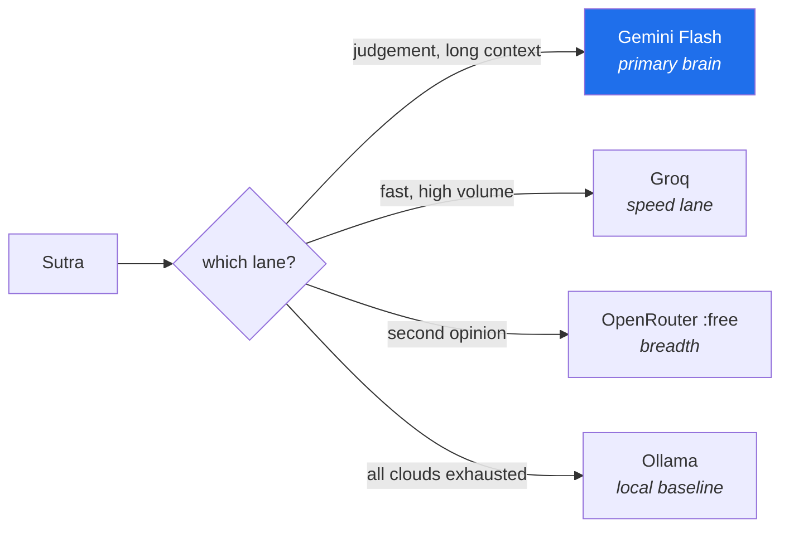

# 3.1 — The three free doors, and what each one is for

## One-line answer

Three organisations will give you a key that costs nothing, and they are **not interchangeable** —
each has a different shape of generosity, and knowing which is which is what turns "I have free
access" into a routing policy you can defend.

---

## The story

Someone building a side project gets a free API key and starts using it. It works beautifully.

Two weeks later they add a feature that makes a few extra calls per request. Still fine in testing —
they test one request at a time. They ship it, tell a handful of people, and go to bed.

In the morning nothing works. Every call returns the same thing:

```text
429 RESOURCE_EXHAUSTED
```

They read it as a bill they cannot pay, panic slightly, and then realise it is stranger than that:
there is no bill. There is no card on file. Nothing has been charged, nothing can be charged, and
the service is simply refusing to answer them until tomorrow.

They spend the day unable to do anything about it, because the one thing you cannot do with an
exhausted daily quota is wait less.

Here is what they had not understood, and it is the whole point of this part: **on a free tier, the
scarce resource is not money — it is requests, measured per minute and per day, and it resets on a
schedule you do not control.** Every instinct they had from paid services was wrong. You cannot buy
your way out, you cannot scale horizontally, and retrying harder makes it worse: retries against a
per-minute limit consume the per-day limit, which is how a two-minute problem becomes a
twenty-four-hour one.

They also had one key. Had they had three, from three organisations with three separate quota pools,
the morning would have been an inconvenience rather than an outage.

---

## The idea in plain language

Sutra runs on **$0** — no card on file, ever (Principle 15). That constraint has a reputation as a
limitation, and the plan's position is the opposite: **rate limits force the exact engineering that
separates a demo from a product**, and paid users usually skip it until production teaches them
expensively.

Some vocabulary first, because these acronyms appear on every provider's page and are rarely
defined:

- **RPM — requests per minute.** A short window, refilling constantly. Hitting it is a
  *thirty-second* problem.
- **RPD — requests per day.** A long window, usually resetting at midnight in some timezone. Hitting
  it is a *tomorrow* problem, and it is the one that ends your evening.
- **TPM — tokens per minute.** A budget on the *volume* of text, not the number of calls. A token is
  roughly three-quarters of a word; Day 2 (AG-02) makes this concrete. A single enormous prompt can
  exhaust TPM while using one request.
- **429** — the HTTP status meaning *too many requests*. It is not an error in your code. It is the
  service correctly telling you to slow down.
- **`retry-after`** — a header on many 429 responses saying how long to wait. Ignoring it is how the
  story's morning happens.

### The three doors, and their different shapes

**All verified on the providers' own pages, 2026-08-23.** Free tiers move — Addendum 02 §3's
standing rule is to look them up on the day you use them, and record what you found.

| | **Gemini** (AI Studio) | **Groq** | **OpenRouter** |
| --- | --- | --- | --- |
| What it really is | Google's own developer free tier | an inference company running **open-weight** models on custom hardware | an aggregator: one API in front of many providers |
| Env var | `GOOGLE_API_KEY` | `GROQ_API_KEY` | `OPENROUTER_API_KEY` |
| Free limits (observed) | **not published in the docs** — per *project*, read from your AI Studio dashboard | 30 RPM; RPD and TPM **vary per model**; limits are **per organization** | 20 RPM; **50 RPD** on the free floor, 1000 RPD once ≥$10 credit has ever been bought |
| Strength | largest context, native to ADK, no adapter needed | very fast — the same open models, much lower latency | breadth: model families the other two do not have |
| Weakness | tightest published-quota uncertainty; Pro-class effectively behind billing | smaller context; per-model limits require checking each one | lowest daily allowance by a wide margin |
| Sutra's role | **primary brain** | **speed lane** | **breadth / second opinion** |

Three things on that table are worth dwelling on.

**Gemini's limits are not in the documentation.** The rate-limits page says limits depend on your
usage tier and directs you to your own dashboard. That is not an omission — it is the honest
statement that **the limit is a property of your project, not of the product.** You cannot learn
your quota by reading; you have to look at your account. This is exactly the shape of Principle 7,
arriving on Day 1.

**Groq's limits are per model and per organization.** Not per key. Creating a second key does not
create a second allowance, which forecloses the obvious cheat and is also why Addendum 02 §7 states
it explicitly: **no quota evasion.** Multiple accounts violate provider terms, and the metering
defeats it anyway. The legitimate version of the same idea is routing across *different
organisations* — which is precisely why three doors, not three keys.

**OpenRouter's `:free` suffix is load-bearing.** A model id ending in `:free` costs nothing; the
same model without the suffix is a paid model. **One missing suffix is the difference between $0 and
a charge**, which is why Addendum 02 §7 makes it a lint rule that arrives on Day 31, and why
`CLAUDE.md` carries it as a standing instruction.

And a fourth door with no key at all:

**Ollama** runs models on your own machine. No key, no limit, no network, no cost — and lower
quality, because what fits in your RAM is smaller than what fits in a data centre. It is the
provider-outage branch and the privacy lane, and Sutra uses it as the honest baseline (ADK-08).



> 💡 **The mental model:** three doors into three *separate* buildings. A crowd at one does not
> block the others — which is the entire reason to hold three keys rather than one, and the reason
> the story's morning was survivable in principle.

**One warning that is not about quota.** Free-tier prompts may be used to improve the provider's
products. That is a normal condition of free access and it is stated in the terms. It is also why
Sutra's company data is **synthetic, always** — never real personal or employer data through a free
endpoint (Addendum 02 §7, and Day 69's SEC-12/SEC-13). The constraint and the domain choice from
[2.1](../02-repo-as-memory/2.1-what-sutra-actually-is.md) are the same decision.

---

## Why Sutra needs it

- **Day 2 makes the first model call** (AG-02) using `GOOGLE_API_KEY`. The key must exist and be
  loadable before that day starts, which is why today gets it.
- **Day 5 pins a model explicitly** (ADK-73) — and the reason it is an ID at all is that ADK 2.2
  changed its *default* model to a preview model with tighter free quota. **An implicit default is a
  silent bug**, and this is one of the four 1.x → 2.x traps' quieter cousins.
- **Day 9 benchmarks all four** (ADK-08, ADK-09) — same agent, four providers, one table of quality,
  latency and RPD. That day tests [2.3](../02-repo-as-memory/2.3-the-adr-that-survives-a-cold-read.md)'s ADR-0005,
  which is why you wrote it before the evidence rather than after.
- **Day 24 makes budgets real** (OPS-07, AG-11), denominated in RPM/RPD per provider rather than
  dollars.
- **Day 51 is caching** (ADK-31, OPS-10) — on a free tier, caching is not an optimisation, it is the
  difference between finishing a day inside quota and not.
- **Day 70 builds the Quota-Router plugin** (OPS-12, ADK-49): track requests remaining per provider
  per window, route each call to whoever has headroom. The story's morning, engineered away.
- **Day 72 is backoff with honesty** (SEC-15, OPS-13): respect `retry-after`, 1→2→4→8s, escalate
  after N tries, **never invent a result**. The correct response to the 429 the story panicked at.

---

## The mechanism

Three sign-ups, in a browser. None asks for a card. Do all three now — the second and third cost a
minute each and are the whole reason a bad morning stays survivable.

**1. Gemini — `aistudio.google.com`.** Sign in with a Google account, choose **Get API key**, create
one in a project. Then do the thing most people skip: open the rate-limit view for that project and
**write down what it says**. That number is not in any documentation and it is yours.

**2. Groq — `console.groq.com`.** Sign up, go to **API Keys**, create one. Then open the limits page
and note that the numbers are listed **per model** — the limit for the model you plan to use is the
only one that matters. *(Groq is not Grok. Different company, different thing.)*

**3. OpenRouter — `openrouter.ai`.** Sign up, go to **Keys**, create one. Then filter the models
list to `:free` and look at what is currently there. **The roster changes**, and a model id that
worked last month may not exist today.

Now check what each door actually gives *you*, rather than what a table says. Do this before writing
anything into `.env`:

```bash
curl -s -H "x-goog-api-key: $GOOGLE_API_KEY" \
  "https://generativelanguage.googleapis.com/v1beta/models" \
  | uv run python -c "import sys,json; [print(m['name']) for m in json.load(sys.stdin)['models'][:8]]"
```

**Line by line:**

- `curl -s` — quiet, so only the response body reaches the pipe (Day 0,
  [1.3](../../../day-00-toolchain-skeleton-driver/parts/01-toolchain/1.3-uv-the-one-binary.md)).
- `-H "x-goog-api-key: $GOOGLE_API_KEY"` — the key travels in a **header**, not in the URL. This is
  the first rule of key handling: a URL ends up in shell history, in server logs, and in browser
  history; a header does not. You must export the variable in this shell first, and
  [3.2](3.2-env-and-the-environment-as-interface.md) is about doing that properly.
- `/v1beta/models` — the endpoint that lists models your key can see. **This is the authoritative
  answer to "what can I call?"** — better than any table, including the one above.
- `[print(m['name']) for m in ...[:8]]` — print the first eight names. A list comprehension used for
  its side effect is not house style in library code; in a one-line shell probe it is fine and
  idiomatic.
- ⚠️ **A name appearing here does not guarantee you can call it.** The 2026-08-13 changelog entry
  records `gemini-2.5-flash` appearing in this listing *and* in the docs while returning 404 "no
  longer available to new users" on an actual call. **The listing is a strong hint; the only proof
  is a call**, which Day 2 makes.

Groq's version, which is more useful because it returns the limits:

```bash
curl -s -H "Authorization: Bearer $GROQ_API_KEY" \
  "https://api.groq.com/openai/v1/models" \
  | uv run python -c "import sys,json; [print(m['id']) for m in json.load(sys.stdin)['data'][:8]]"
```

**Line by line:**

- `Authorization: Bearer <key>` — the standard HTTP scheme for a bearer token, and the shape you
  will meet on most APIs. Compare with Google's custom `x-goog-api-key` header: **there is no single
  convention**, and reading each provider's auth section is not optional.
- `/openai/v1/models` — note the path. Groq exposes an **OpenAI-compatible** interface, which is why
  LiteLLM can talk to it with almost no adapter code (Day 9). Compatibility is a deliberate
  ecosystem strategy, and it is worth recognising when you see it.
- `['data']` rather than `['models']` — a different response shape from Google's, for the same
  question. **Two providers, two schemas**, which is the entire reason an abstraction layer like
  LiteLLM exists.

And OpenRouter, where the important field is not the name:

```bash
curl -s "https://openrouter.ai/api/v1/models" \
  | uv run python -c "import sys,json; [print(m['id']) for m in json.load(sys.stdin)['data'] if m['id'].endswith(':free')][:8]"
```

**Line by line:**

- No key needed — the model list is public, which is convenient and also means you can check the
  roster before signing up.
- `if m['id'].endswith(':free')` — **the filter is the point.** Everything without the suffix costs
  money. Printing only the `:free` ids is the same discipline the Day 31 lint will enforce
  mechanically.
- `[:8]` after the comprehension — slice the result, since the full list is long.
- Run this occasionally. **The roster is perishable**: models appear and disappear, and a pinned
  `:free` id that vanishes is a 404 on a day you were not expecting one.

---

## When it breaks

**The 429, which is the story's morning:**

```text
{
  "error": {
    "code": 429,
    "message": "You exceeded your current quota, please check your plan and billing details.",
    "status": "RESOURCE_EXHAUSTED"
  }
}
```

**How to read it.** The word "billing" is misleading here — on a free tier nothing is being charged
and nothing can be. It means *this window's allowance is spent*. The two questions that matter are
**which window** and **when does it reset**: a per-minute limit is a thirty-second wait, a per-day
limit is tomorrow. Some responses carry `retry-after`; where they do, that header is the answer and
guessing is not.

**The smallest fix is not a retry loop.** Retrying immediately against a per-minute limit burns the
per-day allowance, which converts a short problem into a long one. The correct response is Day 72's:
respect `retry-after`, back off 1→2→4→8s, and **escalate after N attempts rather than inventing a
result** (Principle 10). Day 70's router does better still — it sends the call to a provider with
headroom.

**A key that is present but wrong:**

```text
{
  "error": {
    "code": 400,
    "message": "API key not valid. Please pass a valid API key.",
    "status": "INVALID_ARGUMENT"
  }
}
```

**400, not 401** — which is worth noticing, because it means a key check will not always surface as
an authentication error. Usual causes: the key was copied with a trailing space or newline, the
variable is empty so an empty string was sent, or the key belongs to a different project than the
one you enabled the API in. Check what you actually sent, with `echo "[$GOOGLE_API_KEY]"` — the
brackets make trailing whitespace visible, which is the failure you cannot otherwise see.

**The missing `:free` suffix**, which has no error at all:

```text
model: "deepseek/deepseek-r1"        <- a PAID model
model: "deepseek/deepseek-r1:free"   <- the free one
```

The first works perfectly and draws down credit. There is no warning, because from the provider's
point of view you asked for exactly what you got. **This is the one failure in this part that costs
money**, and it is why the suffix becomes a lint on Day 31 rather than a thing you remember.

**The variable that is not exported:**

```text
$ curl -s -H "x-goog-api-key: $GOOGLE_API_KEY" ...
{"error": {"code": 400, "message": "API key not valid..."}}
$ echo "[$GOOGLE_API_KEY]"
[]
```

Empty. The key is in `.env`, and `.env` is a *file* — nothing has read it into this shell. That gap
is exactly [3.2](3.2-env-and-the-environment-as-interface.md)'s subject, and it is the most common
five minutes lost on Day 2.

---

## In production

**Quota is a capacity-planning problem, and it is the same problem paid systems have.** A paid tier
raises the ceiling; it does not remove it. Every serious API has rate limits, and every production
system that calls one needs the same four things: a budget per window, backoff that respects
`retry-after`, a fallback when the primary is exhausted, and **visibility into how close you are
before you hit it**. Learning this on a free tier is learning it in the cheapest possible classroom.

**Multiple providers is a real production pattern, not a poverty measure.** Serious systems run
multi-provider for availability (a provider outage stops being your outage), for cost arbitrage, and
for capability routing — the cheap fast model for classification, the expensive one for the hard
step. Sutra's three lanes are the same architecture with the currency changed from dollars to
quota, which is why Day 70's router transfers directly to a paid context.

**The key rotation posture is different at $0, and worth naming honestly.** A leaked free-tier key
costs you quota and embarrassment; a leaked paid key costs money and may cost data.
[3.4](3.4-the-rotation-drill.md) rehearses rotation *now*, while the stakes are low, precisely so
the muscle memory exists when they are not. **Practise the incident response on the cheap system.**

**What degrades at scale.** One key, one process, one machine: quota is simple arithmetic. Several
processes sharing a key — a web server, a nightly job, your laptop — and the accounting becomes
distributed, because nobody holds the total. This is where "requests remaining" has to be tracked in
a shared place rather than in each process's memory, and it is the real design problem behind Day
70's Quota-Router. **A per-process budget in a multi-process system is not a budget; it is a
multiplier.**

**The failure that only shows with real traffic.** In development you make one call at a time and
never see a 429. In production the calls are concurrent, and **concurrency interacts with per-minute
limits in a way sequential testing cannot reveal**: ten parallel requests against a 30 RPM limit is
fine once and fatal in a loop. Load-testing against a free tier is genuinely hard for this reason,
which is why the budget must be a *design* constraint rather than something discovered by running
it.

**The review comment a senior engineer leaves.** On a pull request adding a model call with a bare
retry: *"This retries three times immediately on 429 — that spends the daily quota fighting the
per-minute one. Respect `retry-after`, back off exponentially, and escalate after N; and if this
path is hot, it should be going through the router, not calling the provider directly."* The
principle underneath: **a retry that ignores the server's own instruction is not resilience, it is
amplification.**

**The interview question.** *"Tell me about handling rate limits in a system you've built."* This is
a question where a free-tier project genuinely beats a funded one, because you will have hit limits
constantly and had to engineer around them. The answer that lands names the two windows and why they
need different treatment, `retry-after` over guessed backoff, routing across providers with separate
quota pools as the availability play, and the honest bit at the end: **what you do when everything
is exhausted, which must be to escalate or degrade, never to fabricate a result.**

---

## Check yourself

With all three keys created (and exported in your current shell — see
[3.2](3.2-env-and-the-environment-as-interface.md)):

```bash
for p in "GOOGLE_API_KEY" "GROQ_API_KEY" "OPENROUTER_API_KEY"; do
  v="${!p:-}"
  printf "%-20s %s\n" "$p" "${v:+set (${#v} chars)}${v:-MISSING}"
done
```

All three must say `set`. **Note that this prints the length, never the value** — a habit worth
building now, and the subject of [3.3](3.3-loading-keys-failing-loudly.md).

Then write down, in your own notes, the free limits you actually observed on each provider's page
today, with the date. Those numbers go into ADR-0005's Context table, replacing anything you took
from this document.

**Answer out loud, without scrolling up:**

> Name the three providers and the one role each has in Sutra. Then explain why holding three keys
> from three organisations is different from holding three keys from one — and what the `:free`
> suffix does.

---

**Next:** [3.2 — `.env`, and the environment as an interface](3.2-env-and-the-environment-as-interface.md)
