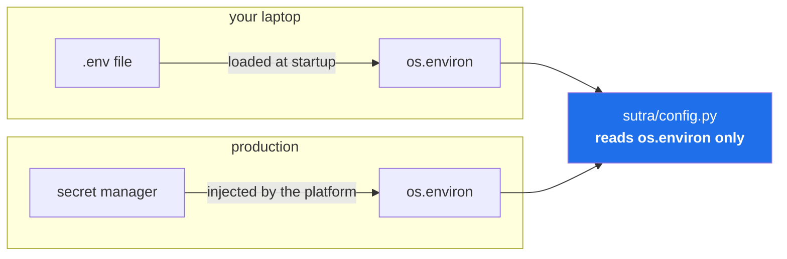

# 3.2 — `.env`, and the environment as an interface

## One-line answer

`.env` is a **local convenience for setting environment variables**, and the thing that actually
matters is the interface underneath it: configuration reaches your program through the *environment*,
never through a committed file — which is why the same code runs unchanged on your laptop, in CI, and
in a container.

---

## The story

A team has a `config.py` with the settings in it. It works.

Then they need different settings in production, so they add `config_prod.py` and an `if` that picks
one. Then staging needs its own, so there are three. Then somebody needs to run against production
data locally for an afternoon, so there is a fourth file that is gitignored and exists only on their
machine — and when they are on holiday, nobody else can reproduce what they were doing.

Then the database password changes. It is in two of the four files. Somebody updates one.

Nothing dramatic happens for a week. Then a deploy picks the other file, and a service that has run
for two years cannot reach its database. The fix takes four minutes. Finding it takes two hours,
because the config files all look correct — each one is internally consistent, and the only way to
see the problem is to know which file that deploy actually loaded.

**The bug was never the password.** It was that configuration lived *inside the artifact*. Every
environment needed a different artifact, so "the code" and "the settings" could not be separated —
and anything you cannot separate, you cannot vary independently.

---

## The idea in plain language

There is a well-known principle for this, usually phrased as: **store configuration in the
environment.** Not in code, not in a committed file, not in a file chosen by an `if`. In the
environment the process is started with.

An *environment variable* is a named piece of text the operating system hands to a process when it
starts (Day 0, [1.1](../../../day-00-toolchain-skeleton-driver/parts/01-toolchain/1.1-why-one-tool-owns-the-environment.md) met `PATH`,
which is one). Every language can read them; every deployment system can set them; none of them are
in your repository.

That single choice buys three things:

- **One artifact, many environments.** The same code, the same container image, the same commit runs
  everywhere. What differs is what it was handed.
- **Secrets stay out of the build.** A key injected at start-up exists in process memory. A key
  baked into an image exists in a layer, forever, distributable to anyone who pulls it.
- **A flat, universal interface.** `GOOGLE_API_KEY` means the same thing to Python, to a shell
  script, to a Docker `-e` flag, and to a Kubernetes secret. **No format, no parser, no library
  required.**

### So what is `.env`, exactly?

Here is the part that is genuinely confusing at first, and worth stating bluntly:

> **`.env` is not part of that interface. It is a convenience for populating it on your laptop.**

The interface is `os.environ`. `.env` is a file of `KEY=value` lines that *something* reads and
copies into `os.environ` at start-up. In production nothing reads a `.env` file — the environment is
set by the platform, from a secret manager. `.env` exists because typing five `export` commands
every time you open a terminal is miserable.



**Look at where the code sits.** It reads `os.environ` and knows nothing about `.env`. That is the
property that makes the same module work in both columns, and it is why
[3.3](3.3-loading-keys-failing-loudly.md) puts the file-reading in one small function that
production simply never calls.

### The two files, and why one of them is committed

| | `.env` | `.env.example` |
| --- | --- | --- |
| Contains | names **and values** | names only, values blank |
| In git? | **never** | **always** |
| Purpose | make your machine work | tell the next person what to set |
| If it leaks | rotate every key in it | nothing happens |

`.env.example` is documentation that cannot go stale in the usual way, because it sits next to the
code that reads it. A blank `GOOGLE_API_KEY=` tells a newcomer exactly what the program expects
without telling them anything secret — and Day 0's `.gitignore` already handles this precisely, with
`.env*` ignored and `!.env.example` rescued back out
([2.2](../../../day-00-toolchain-skeleton-driver/parts/02-repo-skeleton/2.2-gitignore-before-secrets-exist.md)).

### The rule that keeps them honest

**Real environment variables must win over `.env`.**

This sounds like a detail and is not. In CI and in production the platform sets the variables, and a
stray `.env` that happened to be copied in must never override them. The loader therefore uses
"write only if absent" rather than "write" — one word of difference, and the difference between a
laptop convenience and a production hazard.

> 💡 **The mental model:** the environment is a **doorway** every program already knows how to walk
> through. `.env` is you propping the door open on your own machine. Production has a doorman.

---

## Why Sutra needs it

- **Day 2 makes the first model call** (AG-02) and needs `GOOGLE_API_KEY` in `os.environ`. The SDK
  reads it from the environment itself — you never pass a key as an argument.
- **`GOOGLE_GENAI_USE_VERTEXAI=FALSE`** goes in the same file, and it is not a key: it is a switch
  that tells Google's stack to use the **free AI Studio API** rather than paid Vertex AI. **One line
  standing between you and a service that requires a billing account** (Addendum 02 §2).
- **Day 9 adds three more providers** (ADK-08, ADK-09). Four keys, one interface, no per-provider
  config format.
- **Day 47 makes sessions database-backed** (ADK-29) — a connection string, which is configuration
  that differs per environment and is exactly what this interface is for.
- **Day 86 containerises Sutra** (ADK-66, ADK-67, OPS-17) as "Cloud-Run-shaped": a **stateless
  container with env-injected secrets**. That day is only simple because today's code reads
  `os.environ` and nothing else. A container that expects a `.env` file is a container that needs a
  volume mount and a secret written to disk, which is strictly worse.
- **Day 92 is the pre-publication security review** (SEC-16) before the repo goes public. "Is there
  a credential anywhere in this repository or its history?" must be answerable with *no*.

---

## The mechanism

Day 0 wrote the `.gitignore` rule before any secret existed. Today the secret arrives, and the rule
is already waiting for it.

**Confirm the guard rail first.** Never create the file before checking the rule is live:

```bash
git check-ignore -v .env && git check-ignore -v .env.example || echo "-> .env.example is correctly NOT ignored"
```

**Line by line:**

- `git check-ignore -v .env` — prints the file, line number and pattern that ignores it
  ([2.2](../../../day-00-toolchain-skeleton-driver/parts/02-repo-skeleton/2.2-gitignore-before-secrets-exist.md)). If this prints nothing,
  **stop** — the rule is missing, and creating `.env` now is how the Day 0 story happens for real.
- `&& git check-ignore -v .env.example` — this one must **fail**, because `!.env.example` rescues it.
- `|| echo ...` — the failure is the success case, so `||` turns a silent non-zero into a readable
  line (Day 0, [3.1](../../../day-00-toolchain-skeleton-driver/parts/03-the-m-driver/3.1-set-euo-pipefail.md)).

**Now write `.env`** with the three keys from [3.1](3.1-the-three-free-doors.md):

```bash
cat > .env <<'EOF'
# Sutra — local secrets. NEVER committed. See .env.example for the names.
# Created Day 1. Rotate any key that has ever been pasted anywhere else.

# Gemini — the primary brain (aistudio.google.com)
GOOGLE_API_KEY=your-key-here
# Use the FREE AI Studio API, not paid Vertex AI. This line is not optional.
GOOGLE_GENAI_USE_VERTEXAI=FALSE

# Groq — the speed lane (console.groq.com)
GROQ_API_KEY=your-key-here

# OpenRouter — the breadth lane (openrouter.ai). Model ids MUST end in :free
OPENROUTER_API_KEY=your-key-here
EOF
```

**Line by line:**

- `cat > .env <<'EOF'` — the quoted heredoc. **The quotes are load-bearing here**: an API key can
  contain `$`, and an unquoted heredoc would try to expand it, silently truncating your key at the
  dollar sign. This is a real way to lose twenty minutes.
- The comment naming the source of each key is not decoration — six months on, "which console do I
  go to for this one?" is a real question, and the answer costs one line.
- `GOOGLE_GENAI_USE_VERTEXAI=FALSE` — a **switch, not a secret**. Vertex AI is the paid, GCP-billed
  path; AI Studio is the free one. The variable exists because the same SDK talks to both, and the
  default is not the one you want on $0.
- No quotes around the values. Most loaders — including the one you write in
  [3.3](3.3-loading-keys-failing-loudly.md) — treat the value as literal text to end of line, so
  quotes would become *part of the key*. That produces a 400 that looks like a bad key.
- **Replace `your-key-here` with your real keys now.**

**Verify it is invisible to git**, before doing anything else:

```bash
git status --porcelain --ignored | grep -E "^!! \.env$" && echo "-> .env is ignored"
git status --porcelain | grep "\.env" || echo "-> nothing .env-shaped is staged or untracked"
```

**Line by line:**

- `--ignored` makes ignored files visible with a `!!` prefix; without it a successful result prints
  nothing, and "nothing" is ambiguous.
- The second command checks the *normal* status — `.env` must not appear there at all, in any form.
- **Run both.** The first proves the rule matched; the second proves nothing slipped past it.

**Now update `.env.example`**, which *is* committed:

```bash
cat > .env.example <<'EOF'
# Names only. Never values. Copy to .env (gitignored) and fill in.
# All free tiers — no card on file, ever (Addendum 02).

# Day 1 — the three free doors
GOOGLE_API_KEY=
GOOGLE_GENAI_USE_VERTEXAI=FALSE
GROQ_API_KEY=
OPENROUTER_API_KEY=
EOF
```

**Line by line:**

- Identical variable names, blank values. **The names are the contract**; a mismatch between the two
  files is how a newcomer gets a `KeyError` on their first run.
- `GOOGLE_GENAI_USE_VERTEXAI=FALSE` keeps its value, because it is not a secret — it is a setting
  everyone should have, and leaving it blank would invite the wrong default.
- The comments say which day introduced each block, so the file grows legibly as Days 47 and 86 add
  more.

**Finally, get the variables into your current shell**, since a file is not an environment:

```bash
set -a; . ./.env; set +a
echo "GOOGLE_API_KEY is ${GOOGLE_API_KEY:+set (${#GOOGLE_API_KEY} chars)}${GOOGLE_API_KEY:-MISSING}"
```

**Line by line:**

- `set -a` — turn on **allexport**: every variable assigned from now on is automatically exported to
  child processes. Without it, `. ./.env` would set shell variables that `curl` never sees.
- `. ./.env` — the dot is `source`: run the file **in the current shell** rather than a subshell. A
  subshell would set the variables and then exit, taking them with it. `./` is required because
  `.` searches `PATH`, and your `.env` is not on `PATH`.
- `set +a` — turn allexport back off, so the rest of your session behaves normally.
- `${VAR:+x}` — substitute `x` **if the variable is set and non-empty**; `${VAR:-y}` substitutes `y`
  if it is **not**. Used together they print one message or the other.
- `${#VAR}` — the **length** of the value. **This is the habit to build: verify by length, never by
  printing the value.** A key echoed to a terminal is a key in your scroll-back, and possibly in a
  screen recording ([3.3](3.3-loading-keys-failing-loudly.md) makes this a rule in code).
- Note that this sourcing is a *shell* convenience for running `curl` by hand. Your Python code will
  not rely on it — `uv run` starts a fresh process, and [3.3](3.3-loading-keys-failing-loudly.md) is
  how that process gets its values.

---

## When it breaks

**The `$` in a key, silently truncated:**

```text
$ cat > .env <<EOF          # <-- note: no quotes around EOF
GROQ_API_KEY=gsk_ab$X9cdef
EOF
$ . ./.env; echo "${#GROQ_API_KEY}"
8
```

Eight characters. The key was longer. Bash expanded `$X9cdef` — an unset variable — to nothing and
ate the rest. **The 400 you get later says "API key not valid", which points you at the provider
rather than at your heredoc.** The fix is the quoted delimiter, `<<'EOF'`, and the diagnosis is
`${#VAR}`: a length that does not match what you pasted is the whole story.

**Quotes that became part of the value:**

```text
GOOGLE_API_KEY="AIza..."
```

```text
{"error": {"code": 400, "message": "API key not valid. Please pass a valid API key.",
 "status": "INVALID_ARGUMENT"}}
```

The key sent was `"AIza..."` **including the quote characters**, because a simple `.env` loader
takes the value as literal text. Some loaders strip surrounding quotes and some do not, which is
exactly why relying on the behaviour is a bad idea. **Do not quote values in `.env`.**

**A file that is not an environment:**

```text
$ cat .env | head -1
GOOGLE_API_KEY=AIzaSy...
$ echo "[$GOOGLE_API_KEY]"
[]
```

The key is right there in the file and the variable is empty. **A file is not an environment until
something reads it.** Nothing in your shell has. This is the single most common five minutes lost on
Day 2, and the fix is either the `set -a; . ./.env; set +a` above for shell work, or — for Python —
the loader in [3.3](3.3-loading-keys-failing-loudly.md).

**Sourcing in a subshell, which looks like it worked:**

```text
$ bash -c '. ./.env'
$ echo "[$GOOGLE_API_KEY]"
[]
```

No error at all. `bash -c` started a child process, the child loaded the variables, the child
exited, and the variables went with it. **A process cannot modify its parent's environment** — which
is not a limitation to work around but a security property, and it is why the `.` (source) form
exists.

**The variable that will not go away.** You rotate a key, update `.env`, and the old one keeps being
used:

```text
$ grep GROQ .env
GROQ_API_KEY=gsk_NEW...
$ echo "${GROQ_API_KEY:0:8}"
gsk_OLD.
```

The **real** environment variable is set — probably from an earlier `. ./.env` in this same shell —
and the loader in [3.3](3.3-loading-keys-failing-loudly.md) deliberately does not overwrite it. That
precedence is correct and is what protects production; it just surprises you locally. **Open a fresh
shell**, which is the cheapest fix, or `unset GROQ_API_KEY` first.

---

## In production

**Nothing reads a `.env` file in production, and designing as if something might is the mistake.**
Real deployments inject environment variables from a secret manager at process start: the value
exists in the process's memory and never touches disk. Sutra's Day 86 container is described as
"Cloud-Run-shaped" for exactly this reason — a **stateless container with env-injected secrets** is
the portable shape, and it works identically on a container platform, on Kubernetes, and in a CI
runner.

**A secret in an image layer is the same mistake as a secret in git.** Image layers are immutable
and distributable, so a `COPY .env .` followed later by `RUN rm .env` leaves the key permanently in
the earlier layer, retrievable by anyone who pulls the image. **The identical reasoning as Day 0's
git history** — you cannot delete forward out of an append-only structure — and it is why the
`.dockerignore` on Day 86 will exclude `.env` the way `.gitignore` does today.

**Short-lived credentials are where the industry is going, and it is worth knowing the direction.**
A long-lived API key is a permanent secret that must be stored, rotated, and audited. The modern
alternative is workload identity: the platform vouches for the process, and the process exchanges
that for a token that expires in an hour. **A credential that dies on its own makes a leak an
inconvenience rather than an incident.** Free tiers use long-lived keys, so Sutra uses them — but
the reason a paid production system reaches for something else is worth understanding, because it is
the same reasoning that makes rotation ([3.4](3.4-the-rotation-drill.md)) matter.

**Validate configuration at start-up, not at first use.** A service that starts happily and fails
forty minutes later, when a code path finally reads a missing variable, has converted a
configuration error into a runtime incident. The professional pattern is to read and check every
required variable during start-up and refuse to start if one is missing — **fail before serving
traffic, not during it.** That is [3.3](3.3-loading-keys-failing-loudly.md)'s subject, and it is why
it is a separate part rather than a footnote.

**What degrades at scale.** Four variables are trivial. Forty, across six services, is a
configuration management problem: which are required, which have defaults, which are secret, which
changed last Tuesday. The responses are a typed settings object rather than scattered
`os.environ[...]` lookups, a single generated document of every variable a service reads, and
treating a config change as a deploy — because **an environment variable changed by hand on one
instance is drift that nothing will ever tell you about.**

**The review comment a senior engineer leaves.** On a pull request adding `KEY = "sk-abc123"` to a
Python file: *"This can't be in the repo — read it from the environment, add the name to
`.env.example`, and if this key has ever been pushed, rotate it before we merge rather than after."*
Two separate instructions, and the second is the urgent one — **fixing the file and containing the
exposure are different jobs** (Day 0, [2.2](../../../day-00-toolchain-skeleton-driver/parts/02-repo-skeleton/2.2-gitignore-before-secrets-exist.md)).

**The interview question.** *"How does configuration reach your application?"* A weak answer names a
file. A strong one names the environment as the interface and explains what that buys: one artifact
across all environments, secrets that never enter the build, and a format every platform already
speaks. The details that mark experience are **real environment variables winning over any local
file**, and **validating at start-up rather than at first use** — because both are things you only
learn by having been burned by the alternative.

---

## Check yourself

```bash
git check-ignore -v .env && \
  ( git status --porcelain | grep -q "\.env$" && echo "FAIL: .env is visible to git" \
    || echo "PASS: .env invisible to git" ) && \
  diff <(grep -oE '^[A-Z_]+' .env | sort) <(grep -oE '^[A-Z_]+' .env.example | sort) \
    && echo "PASS: .env and .env.example declare the same names"
```

**The `diff` is the interesting check.** `<(...)` is process substitution — it makes each command's
output look like a file, so `diff` can compare two command outputs without temporary files.
`grep -oE '^[A-Z_]+'` pulls just the variable names from each. Any output from `diff` means the two
files have drifted, which is how the next person gets a `KeyError` on their first run.

**Answer out loud, without scrolling up:**

> What is the difference between `.env` and the environment, and which one does your code read? Then
> explain why the loader must let a real environment variable win over a `.env` value — and what
> would break in production if it did not.

---

**Next:** [3.3 — Loading keys, and failing loudly](3.3-loading-keys-failing-loudly.md)
