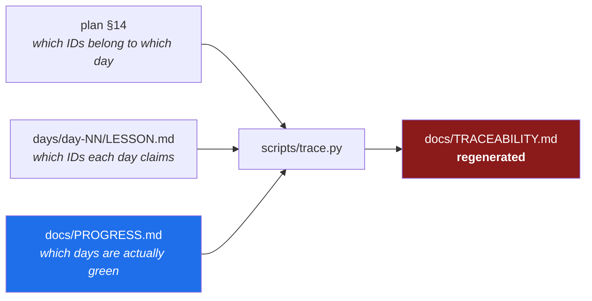

# 4.1 — The diary and the scoreboard

## One-line answer

A project keeps two completely different kinds of record — an **append-only diary** of what happened,
which only ever grows, and a **regenerated scoreboard** computed from it, which is never edited by
hand — and treating one like the other is how a project loses the ability to tell you the truth.

---

## The story

A team tracks its work on a wall of sticky notes. Three columns: to do, doing, done.

It works well for a while. Then a note gets moved to *done* on a Friday because the work is
essentially finished — there is a small thing left, but it will take ten minutes on Monday. On
Monday something more urgent arrives. The note stays in *done*.

Nobody lied. At the moment it moved, "done" was a reasonable description of a thing that was
nine-tenths finished.

Six weeks later, the wall says twenty-three things are done. Somebody asks whether a particular
feature works, and the answer is that it depends what you mean — the note is in *done*, and the last
ten minutes never happened, and by now nobody remembers which note that was.

The wall is not wrong about any individual note. It has simply become **a record of intentions
rather than a record of facts**, one small reasonable judgement at a time, and there is no way to
tell from looking at it which notes are which.

The fix that works is not more discipline. It is to stop asking humans to *assert* completeness, and
start **computing** it from something that cannot be moved on a Friday afternoon.

---

## The idea in plain language

Sutra keeps two categories of record and they have opposite rules. Confusing them is the failure
above.

### Append-only ledgers — the diary

**You only ever add a row at the bottom. You never edit an old one.**

| File | One row per | Written by |
| --- | --- | --- |
| `docs/PROGRESS.md` | completed day | you, when the day is genuinely finished |
| `docs/PACKAGES.md` | package installed | you, with the version you observed and the date |
| `docs/SKILL_PROVENANCE.md` | third-party skill, **before it runs** | you, after auditing it |
| `docs/CHANGELOG_PLAN.md` | amendment to the plan | you, before changing anything else |

Append-only is not filing tidiness. It is what makes the record *evidence*: a diary you can go back
and rewrite is not a diary, it is a draft. If `PACKAGES.md` could be edited, the version rows would
drift toward whatever is installed today, and the whole point — *what did we pin, and when, and
why* — would evaporate.

This is the same instinct as git history (Day 0,
[2.3](../../../day-00-toolchain-skeleton-driver/parts/02-repo-skeleton/2.3-git-init-and-what-a-repo-is.md)) and as superseding rather than
editing an ADR ([2.3](../02-repo-as-memory/2.3-the-adr-that-survives-a-cold-read.md)). **Three different documents,
one principle: history is content.**

### Regenerated ledgers — the scoreboard

**A script computes them. You never edit them, and if you do, the next run overwrites you.**

| File | Computed from | By |
| --- | --- | --- |
| `docs/TRACEABILITY.md` | plan §14 + the day hubs + `PROGRESS.md` | `scripts/trace.py` |
| `docs/TRACKER.md` | plan §14 + what is on disk | `scripts/tracker.py` |
| `docs/CURRICULUM_INDEX.md` | plan §14 | `scripts/trace.py` |

Each carries a header saying *do not edit this file by hand*, which is a courtesy — the real
protection is that editing it is pointless.

**The property that matters: a computed answer cannot drift from its sources.** The sticky-note wall
drifted because it was an assertion. `TRACEABILITY.md` cannot, because it is a *derivation* — and if
it says something wrong, the bug is in the sources or in the script, both of which are fixable in a
way that a drifted wall is not.



Look at the three inputs, because the design is in the *conjunction*. An ID counts as closed only
when **the plan assigns it to a day, that day's hub claims it, and that day has a row in
`PROGRESS.md`.** Any one alone is an assertion. All three together mean the plan, the document and
the human record agree — and disagreements become visible rather than quiet.

### Why a solo project needs this at all

The reasonable objection: this is a project with one person in it. Who is the ceremony for?

**It is for you, in four months, at a phase gate.** The plan's §15 says a phase is green only when
`scripts/trace.py` shows no open IDs from that phase or any earlier one. At the Phase 4 gate the
script prints `SK-16 ⬜ open`, and that single line is the difference between *I feel like I covered
skill auditing* and *I did not*. **Memory is an unreliable witness about completeness specifically**,
because the concepts you half-covered are exactly the ones that feel covered.

And it is the reason the whole project survives: **the repo is the memory, not the chat.** A fresh
session — you, or a different tool six months from now — reads the last row of `PROGRESS.md` and
knows where things stand, without a conversation to inherit. That claim only holds if the ledgers
are trustworthy, which is what the two rules protect.

> 💡 **The mental model:** the diary is what you **wrote down**; the scoreboard is what **follows**
> from it. You are allowed to add to the first and forbidden to touch the second — and the second is
> the one you look at when you want the truth.

---

## Why Sutra needs it

- **Plan §15 gates every phase on the scoreboard.** No open IDs from this phase or any earlier one,
  or the phase is not green. Sixteen gates, each one a computed answer rather than a feeling.
- **`./m done N` will not commit until the checklist is ticked** (Day 0,
  [3.4](../../../day-00-toolchain-skeleton-driver/parts/03-the-m-driver/3.4-the-done-gate.md)), and `./m check` regenerates the scoreboard
  every time. **The diary is written by hand; the scoreboard is refreshed by the gate.**
- **Day 29 audits third-party skills** (SK-12..SK-16) and writes `SKILL_PROVENANCE.md` rows *before*
  anything runs. An append-only provenance record is the whole mechanism of that day — a row you
  could edit afterwards would prove nothing.
- **Every day that installs something writes a `PACKAGES.md` row** with the version observed and the
  date (Principle 7). Day 2's `google-genai`, Day 5's `google-adk`, Day 9's `litellm`.
- **Day 93 makes the repository public.** These files become the visible record of how the project
  was actually built — and **Day 95 is an interview drill over exactly that record.**
- **Principle 14 — amend the plan first.** `CHANGELOG_PLAN.md` is where that happens, and it has
  already been used twice this week: once for the v2.0.0 depth contract, once for the conditional
  *Line by line* rule found while writing this day.

---

## The mechanism

Both kinds already exist — Day 0 created them. Today you write your first diary row and watch the
scoreboard change because of it.

**Look at the diary first:**

```bash
head -12 docs/PROGRESS.md && echo "--- rows so far ---" && grep -c "^| [0-9]" docs/PROGRESS.md
```

**Line by line:**

- `head -12` — the header explains the rule in the file itself, which is where a rule belongs if you
  want it followed.
- `grep -c "^| [0-9]"` — count lines starting with a pipe and a digit, which is what a data row looks
  like. **Expect `0`.** The ledger was reset at plan v2.0.0 and the v1 history is frozen at
  `legacy/ledgers/PROGRESS.md`.

**Now the scoreboard, and its three inputs:**

```bash
head -12 docs/TRACEABILITY.md && grep -c "⬜ open" docs/TRACEABILITY.md
```

**Line by line:**

- The header states the rule — `do not edit by hand` — and names the script that owns the file.
- `grep -c "⬜ open"` — **expect `199`.** Every ID in the plan, open, because no day has a
  `PROGRESS.md` row yet. That number is the honest current state of the project, and it is computed
  rather than claimed.

**Prove the "never edit" rule to yourself**, because a rule you have tested is a rule you believe:

```bash
echo "| FAKE-99 | 1 | 1 | ✅ closed |" >> docs/TRACEABILITY.md
grep -c "FAKE-99" docs/TRACEABILITY.md
uv run python scripts/trace.py
grep -c "FAKE-99" docs/TRACEABILITY.md || echo "-> gone: the script owns this file"
```

**Line by line:**

- `>>` appends — a hand-edit to a generated file, exactly the thing the header forbids.
- The first `grep -c` prints `1`: your edit is there.
- `uv run python scripts/trace.py` regenerates from the three sources.
- The second `grep -c` finds nothing and exits non-zero, so `||` prints the message. **Your edit
  evaporated**, which is the protection working: a generated file cannot carry a lie for longer than
  one run of the gate.

**Now write the diary row that closes today.** This is the row Day 1's hub §11 gives you, and it
belongs at the bottom of `docs/PROGRESS.md`:

```bash
cat >> docs/PROGRESS.md <<'EOF'
| 1 | 2026-08-23 | AG-01, OPS-01, OPS-02, OPS-03 | 14 | <hash> | ✅ |
EOF
```

**Line by line:**

- `>>` — **append**, never `>`. A single `>` would truncate the file to just this line, destroying
  every earlier row. That one-character difference is the append-only rule expressed in shell, and
  it is worth being deliberate about every time.
- `| 1 |` — the day number. `scripts/trace.py` finds green days by matching lines that start with a
  pipe and a number, so the shape matters.
- `AG-01, OPS-01, OPS-02, OPS-03` — **exactly** the IDs plan §14 assigns to Day 1. No more, no
  fewer; `trace.py` checks both directions and reports either as a problem.
- `14` — the part count, which is how a thin day becomes visible in the record itself.
- `<hash>` — a placeholder you replace with the commit hash after committing, since the row has to
  exist before the commit that contains it. A chicken-and-egg that every project solves this way.
- ✅ — gates green. **Only write this when they are**, which is what `./m done 1` enforces mechanically.

**Watch the scoreboard move:**

```bash
uv run python scripts/trace.py && grep -c "✅ closed day 1" docs/TRACEABILITY.md
```

**Line by line:**

- The script re-reads all three sources and rewrites the file.
- It should print `traceability: 4/199 closed, 0 problem(s)`. **Four**, because Day 1's hub claims
  four IDs and `PROGRESS.md` now says Day 1 is green.
- `grep -c "✅ closed day 1"` prints `4`. **You did not tell the scoreboard anything.** You added one
  diary row, and the scoreboard *derived* four closures from it — which is the entire distinction
  this part is about.

---

## When it breaks

**The green day whose document does not claim its IDs:**

```text
traceability: 3/199 closed, 1 problem(s); index: 199 IDs

## 🐛 Problems
- OPS-03: day 1 is green but its hub does not claim it
```

**What it means.** `PROGRESS.md` says Day 1 is finished, and Day 1's `LESSON.md` frontmatter lists
only three of the four IDs. One of the two is wrong, and the script deliberately does not guess
which. Either the day did not actually cover OPS-03 — in which case the diary row is optimistic and
the honest fix is to un-tick it — or the hub's frontmatter is missing an entry. **The check exists
precisely because those two look identical from the inside.**

**The claim the plan never made:**

```text
## 🐛 Problems
- day 1 claims IDs not assigned by the plan: ['ADK-01']
```

Day 1's hub claims `ADK-01`, which §14 assigns to Day 5. The plan wins
([2.2](../02-repo-as-memory/2.2-the-docs-tree-and-precedence.md)), so either the hub is wrong, or reality has
diverged and Principle 14 applies — **amend the plan first, then continue.** What you must not do is
edit the number until the message stops appearing, which silences the check without resolving the
disagreement.

**The hand-edited scoreboard, which is the failure with no error at all.** Somebody marks an ID
closed directly in `TRACEABILITY.md` because they know they covered it. Nothing complains — until
the next `./m check` regenerates the file and the edit vanishes. **In the meantime the project has a
document asserting something no source supports**, which is the sticky-note wall with extra steps.

**The truncated ledger:**

```text
$ cat > docs/PROGRESS.md <<'EOF'
| 2 | ... |
EOF
$ grep -c "^| [0-9]" docs/PROGRESS.md
1
```

One row. Every previous day is gone, because `>` truncates. **The recovery is git**
([2.3](../../../day-00-toolchain-skeleton-driver/parts/02-repo-skeleton/2.3-git-init-and-what-a-repo-is.md)) — `git checkout
docs/PROGRESS.md` restores the committed version, and this is one of the concrete reasons the
ledgers are committed with every day rather than at the end.

**The day marked green on a Friday.** No error, ever. This is the story, and the only defence is the
one Day 0 built: `./m done N` refuses while any checklist box is unticked
([3.4](../../../day-00-toolchain-skeleton-driver/parts/03-the-m-driver/3.4-the-done-gate.md)). **The gate cannot tell whether you were
honest** — but it makes ticking a box a deliberate act on the record rather than a thought at the end
of a long evening, and that is most of the value.

---

## In production

**"Compute it, don't assert it" is a general engineering instinct, and it shows up everywhere.**
Generated API clients rather than hand-written ones; infrastructure described in code rather than
clicked into a console; a dependency lockfile rather than a list of what you think is installed
(Day 0, [2.4](../../../day-00-toolchain-skeleton-driver/parts/02-repo-skeleton/2.4-pyproject-and-the-lockfile.md)). **Every one is the same
trade: give up the ability to hand-edit, gain the guarantee that the artifact matches its source.**

**Append-only is the shape of every serious audit trail.** Financial ledgers, event logs, database
write-ahead logs, git itself — none of them let you edit the past, and all of them are the systems
people trust when something has gone wrong. The reason is not tamper-resistance so much as
*reconstructability*: **if you can only add, then the current state is always derivable, and any
disagreement is a bug you can locate rather than a mystery.**

**The professional version of a phase gate is a release checklist that a machine can evaluate.** The
same principle scaled: rather than a person asserting "we're ready to ship", a set of computed
conditions — tests green, coverage above a threshold, no open blockers, migrations applied — each of
which is checked rather than claimed. **The value is not the checking; it is that the standard is
written down before the pressure arrives.**

**What degrades at scale.** Two generated files are easy. Twenty become a question of *when* they
regenerate, and the failure mode is a generated artifact that is stale rather than wrong — which is
worse, because it looks authoritative. The standard responses are regenerating in the gate (which is
why `./m check` runs both scripts) and failing the build when a generated file is dirty in the
working tree, so a stale artifact cannot be committed. **A generated file that someone has to
remember to refresh is a generated file that will be wrong.**

**The failure that only appears with real time.** These ledgers cost almost nothing on Day 1 and
prove their worth at month four, when you genuinely cannot remember whether Day 37 covered MCP auth
properly. The value is entirely in the future, which is why the discipline usually collapses — **the
person paying the cost is never the person receiving the benefit.** Automating the check is what
resolves that: `./m check` regenerates the scoreboard whether or not you feel like it.

**The review comment a senior engineer leaves.** On a pull request that edits a generated file:
*"This file has a `do not edit` header and is rebuilt by `./m check` — your change will vanish on
the next run. If the output is wrong, fix the source or the generator; if the generator can't
express this, that's the actual issue."* The principle: **a generated artifact is a symptom, never a
place to make a change.**

**The interview question.** *"How do you know when a piece of work is actually done?"* Weak answers
describe a feeling or a ceremony. A strong one separates the two records: a human-written,
append-only account of what happened, and a computed view derived from it that nobody can edit — so
that "done" is a *derivation* from evidence rather than an assertion. The detail that marks
experience is naming what happens when the two disagree: **the disagreement is the useful output**,
and a system that cannot produce one is a system that will quietly tell you what you want to hear.

---

## Check yourself

```bash
uv run python scripts/trace.py && \
  grep -c "^| [0-9]" docs/PROGRESS.md && \
  grep -c "✅ closed day 1" docs/TRACEABILITY.md && \
  head -3 docs/TRACEABILITY.md
```

One diary row, four closed IDs on the scoreboard, and a header saying the file is generated. **You
wrote one line and four lines changed elsewhere** — that gap is the whole idea.

**Answer out loud, without scrolling up:**

> Name the two kinds of ledger and the one rule each has. Then explain the three things that must
> all agree before `trace.py` will call an ID closed — and why any one of them alone would be an
> assertion rather than evidence.

---

**Next:** [4.2 — Build the generator yourself](4.2-build-the-generator-yourself.md)
