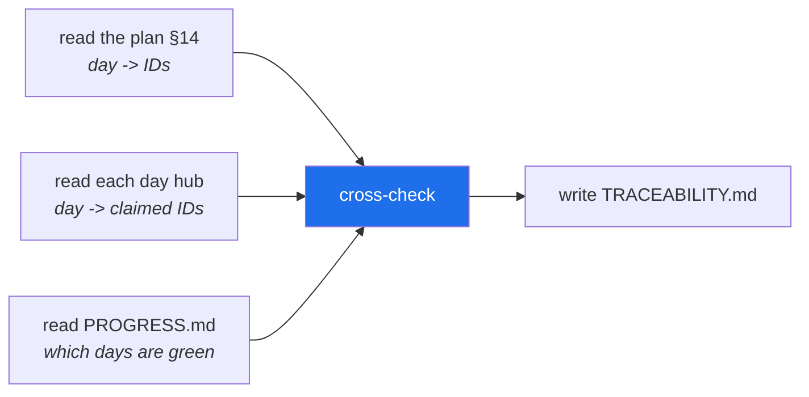

# 4.2 — Build the generator yourself

## One-line answer

You are going to write your own traceability generator — three readers and one writer, in about
forty lines — because **Principle 4 says hand-roll the mechanism before adopting the tool**, and a
script you have written is a script you can debug at a phase gate.

---

## The story

An engineer inherits a build system. It works, and nobody knows how.

One morning it stops working. The error is a single line about a missing artifact, produced by a
tool that somebody configured four years ago and that everyone has treated as furniture ever since.

They start reading. The configuration is not the problem. The tool's documentation describes an
option that does not appear to do what the name suggests. They try changing things — plausible
things, in a plausible order — and after two hours something works, though they could not say
exactly which change fixed it or why.

The build is green. Nobody has learned anything, and the next failure will cost the same two hours.

Now the other version. A different engineer, on a different team, once spent an afternoon writing a
crude version of the same tool: read some files, work out what depends on what, write an output.
Fifty lines, thrown away afterwards. When their build breaks, they read the error and think *ah —
it's looking for the artifact before the step that produces it has run*, because they have held the
shape of the problem in their hands.

**They are not smarter. They have a mental model, and the only reliable way to get one is to have
built the crude version once.**

That is Principle 4 in the plan: *build first, compare after.* Hand-roll the mechanism, then adopt
the framework — so the framework is a convenience, never a mystery.

---

## The idea in plain language

The traceability generator is genuinely small, and its smallness is the lesson. It is **three
readers and one writer**:



Each reader answers one question, and the cross-check is a single rule:

> An ID is **closed** when the plan assigns it to day *N*, day *N*'s hub claims it, **and** day *N*
> has a row in `PROGRESS.md`. Anything else is open, or a problem.

That is it. There is no clever algorithm here, and **that is worth noticing**: the value of this
script is not in its sophistication but in the fact that it computes an answer instead of accepting
one ([4.1](4.1-the-diary-and-the-scoreboard.md)).

### What you are building, and why it is not the shipped one

`scripts/trace.py` already exists in this repository. It arrived with the v2.0.0 format on Day 0,
because a format that validates day documents needs its validator before day one can be checked.

So today you write **your own**, in `days/day-01-bootstrap-and-map/lab/`, and then compare
([4.3](4.3-reading-the-shipped-generator.md)). That is deliberate and it is the better order:

- Writing forty lines teaches more than transcribing two hundred.
- The comparison is where the learning is — you will find three things the shipped one does that
  yours does not, and each one will be a small surprise you remember.
- `days/*/lab/` is gitignored (Day 0,
  [2.2](../../../day-00-toolchain-skeleton-driver/parts/02-repo-skeleton/2.2-gitignore-before-secrets-exist.md)), so your version is a
  scratchpad and cannot break `./m check`.

**The scratchpad is not the deliverable.** That is Day 0's rule and it applies here: this file is for
understanding, not for shipping.

### Two ideas you will need

**Regular expressions.** A *regex* is a pattern language for finding text. You need two:

- `\b(?:AG|ADK|MCP|SK|OPS|SEC)-\d{2}\b` — any concept ID. `(?:...)` groups alternatives without
  capturing them; `\d{2}` is exactly two digits; `\b` is a *word boundary*, so `ADK-01` matches but
  `XADK-011` does not.
- `^\|\s*(\d+)\s*\|` — a table row starting with a number. `^` anchors to line start, `\|` escapes
  the pipe (which means "or" in a regex), `\s*` allows optional spaces, and `(\d+)` **captures** the
  digits so you can read them back.

**A tiny state machine.** To read only §14 of the plan you walk the file line by line holding two
facts: *am I inside §14?* and *which phase heading did I last see?* Two variables and no library.
This is worth doing by hand once — it is the shape of every "parse the interesting part of a
document" problem you will meet.

> 💡 **The mental model:** the generator is a **stocktake**. It does not decide what should be on the
> shelves — the plan does that. It walks round, counts what is actually there, and posts the
> difference.

---

## Why Sutra needs it

- **Plan §15 gates every phase on this script's output.** Sixteen gates over ninety-six days, and at
  each one the number it prints decides whether the phase is green. **You will want to trust it, and
  the only route to trusting a tool is having built one.**
- **Day 3 hand-rolls the agent loop** (AG-03) before any framework touches it, and **Day 4
  hand-rolls tool calling** (AG-04) before `FunctionTool` on Day 10. This part is the same move,
  applied to tooling instead of to agents — and doing it here first means the pattern is familiar
  when the stakes are higher.
- **Day 31 is the quality gate** (SK-20, OPS-08), where `./m check` grows a skills lint and a
  `:free`-suffix lint. Both are scripts of exactly this shape: read some files, apply a rule, exit
  non-zero on a violation. **Today is where that shape becomes yours.**
- **Day 82 puts evals in CI** (OPS-15, ADK-62) — the same pattern again, with a different rule.
- And the practical one: when `trace.py` reports something surprising at the Phase 4 gate, you will
  either read it and understand it, or you will be the engineer in the story.

---

## The mechanism

Make the scratchpad, which `./m` will create for you:

```bash
./m scaffold 1 && ls days/day-01-bootstrap-and-map/
```

**Line by line:**

- `./m scaffold 1` — creates `days/day-01-bootstrap-and-map/lab/` (Day 0,
  [3.2](../../../day-00-toolchain-skeleton-driver/parts/03-the-m-driver/3.2-the-case-dispatcher.md)). Safe to re-run, because `mkdir -p`
  does nothing when the directory exists.
- The folder is gitignored, so nothing you write here is committed.

Now write your version. **Type it, do not paste it** — that is the entire point of this part.

```python
"""My own traceability generator. Day 1, OPS-03.

Three readers, one writer:
  1. the plan's section 14  -> which IDs each day must close
  2. each day's LESSON.md   -> which IDs that day claims
  3. docs/PROGRESS.md       -> which days are actually finished

An ID is closed only when all three agree. Anything else is open, or a problem.
"""

from __future__ import annotations

import re
from pathlib import Path

ROOT = Path(__file__).resolve().parents[3]
PLAN = ROOT / "docs" / "00_MASTER_PLAN.md"
ID_RE = re.compile(r"\b(?:AG|ADK|MCP|SK|OPS|SEC)-\d{2}\b")


def plan_map() -> dict[int, list[str]]:
    """Read section 14 into {day: [ids]}."""
    out: dict[int, list[str]] = {}
    in_map = False
    for line in PLAN.read_text(encoding="utf-8").splitlines():
        if line.startswith("## 14"):
            in_map = True
        elif in_map and line.startswith("## "):
            break
        elif in_map and (m := re.match(r"^\|\s*(\d+)\s*\|", line)):
            out[int(m.group(1))] = ID_RE.findall(line)
    return out


def green_days() -> set[int]:
    """Day numbers that have a row in PROGRESS.md."""
    text = (ROOT / "docs" / "PROGRESS.md").read_text(encoding="utf-8")
    return {int(m.group(1)) for m in re.finditer(r"^\|\s*(\d+)\s*\|", text, re.M)}


def claimed(day: int) -> list[str]:
    """The IDs a day's hub says it closes."""
    hub = ROOT / "days" / f"day-{day:02d}" / "LESSON.md"
    if not hub.is_file():
        return []
    for line in hub.read_text(encoding="utf-8").splitlines():
        if line.strip().lower().startswith("ids:"):
            return ID_RE.findall(line)
    return []


def main() -> None:
    plan, green = plan_map(), green_days()
    closed = total = 0
    problems: list[str] = []

    for day in sorted(plan):
        says = set(claimed(day))
        for cid in plan[day]:
            total += 1
            if day in green and cid in says:
                closed += 1
            elif day in green:
                problems.append(f"{cid}: day {day} is green but its hub does not claim it")
        if day in green and (extra := says - set(plan[day])):
            problems.append(f"day {day} claims IDs the plan did not assign: {sorted(extra)}")

    print(f"my trace: {closed}/{total} closed, {len(problems)} problem(s)")
    for p in problems:
        print(f"  - {p}")


if __name__ == "__main__":
    main()
```

**Line by line:**

- `ROOT = Path(__file__).resolve().parents[3]` — **count the levels.** This file is at
  `days/day-01-bootstrap-and-map/lab/trace_mine.py`, so `parents[0]` is `lab`, `[1]` is `day-01`, `[2]` is `days`, and
  `[3]` is the repo root. Getting this wrong is the first bug most people hit, and the symptom is a
  `FileNotFoundError` naming a path with a plausible-looking prefix.
- `ID_RE` — one pattern for all six ID families. `(?:...)` is a **non-capturing** group: it groups
  the alternatives without creating a capture, so `findall` returns whole IDs rather than just the
  prefix. Change it to `(...)` and you get `['AG', 'OPS']` instead of `['AG-01', 'OPS-01']`, which is
  a genuinely confusing five minutes.
- `if line.startswith("## 14")` — enter §14. `elif in_map and line.startswith("## ")` — the **next**
  top-level heading means §14 is over, so stop. Two lines, and that is the whole state machine.
- `(m := re.match(...))` — the walrus operator assigns and tests in one expression. Without it you
  would need a separate assignment line before the `elif`, which would break the chain.
- `re.match(r"^\|\s*(\d+)\s*\|", line)` — `match` anchors at the string start by default (unlike
  `search`), so the `^` is belt and braces. `(\d+)` captures the day number; `m.group(1)` reads it.
- `ID_RE.findall(line)` — every ID on that row. Note it reads the **whole line**, which is why a day
  row's IDs must live in that row and nowhere else.
- `re.finditer(..., re.M)` in `green_days` — `re.M` (multiline) makes `^` match at the start of every
  line rather than only the string. **Forget it and you get at most one match**, which shows up as
  "only day 1 is ever green".
- `{int(...) for m in ...}` — a set comprehension. A set because the only question asked of it is
  membership.
- `f"day-{day:02d}"` — zero-padded to two digits, matching the folder names from Day 0
  ([3.2](../../../day-00-toolchain-skeleton-driver/parts/03-the-m-driver/3.2-the-case-dispatcher.md)). `day-1` would not be found.
- `line.strip().lower().startswith("ids:")` — find the frontmatter's `ids:` line. Lowercasing makes
  it tolerant of `IDs:`; stripping handles indentation.
- `says = set(claimed(day))` — a set, because the two checks below are membership and difference.
- `if day in green and cid in says` — **the conjunction from
  [4.1](4.1-the-diary-and-the-scoreboard.md)**, in one line. The plan assigned it (we are iterating
  over `plan[day]`), the hub claims it, and the day is green.
- `elif day in green:` — green but unclaimed. **A problem, not silence.** The script refuses to
  guess which of the two records is wrong.
- `extra := says - set(plan[day])` — the reverse check: IDs the hub claims that the plan never
  assigned. **Both directions matter**, and omitting this one is the most common thing missing from
  a first attempt.
- `print(f"my trace: {closed}/{total} ...")` — a summary line first, details after. A tool that
  prints its headline last is a tool people stop reading.

Run it:

```bash
uv run python days/day-01-bootstrap-and-map/lab/trace_mine.py
```

**Line by line:**

- `uv run` — the project environment, no activation (Day 0,
  [2.5](../../../day-00-toolchain-skeleton-driver/parts/02-repo-skeleton/2.5-the-venv-you-never-activate.md)).
- Expected, once you have added Day 1's `PROGRESS.md` row from
  [4.1](4.1-the-diary-and-the-scoreboard.md): `my trace: 4/199 closed, 0 problem(s)`.
- **Compare against the shipped script**, which reads the same three sources:

```bash
uv run python scripts/trace.py
```

**Line by line:**

- Expected: `traceability: 4/199 closed, 0 problem(s); index: 199 IDs`.
- **The first two numbers must match yours.** If they do, your forty lines and the shipped two
  hundred agree about the state of the project — which is the moment the shipped one stops being
  furniture.
- The trailing `index: 199 IDs` is one of the things yours does not do.
  [4.3](4.3-reading-the-shipped-generator.md) is about the other two.

**Break it on purpose**, because a checker you have never seen fire is one you do not trust:

```bash
sed -i.bak 's/^ids: \["AG-01"/ids: ["AG-99"/' days/day-01-bootstrap-and-map/LESSON.md
uv run python days/day-01-bootstrap-and-map/lab/trace_mine.py
mv days/day-01-bootstrap-and-map/LESSON.md.bak days/day-01-bootstrap-and-map/LESSON.md
```

**Line by line:**

- `sed -i.bak 's/old/new/'` — edit in place with a backup ([3.4](../03-keys-and-env/3.4-the-rotation-drill.md)).
  This changes the hub's frontmatter to claim an ID the plan never assigned.
- Your script must now report **two** problems: `AG-01` is green-but-unclaimed, and `AG-99` is
  claimed-but-unassigned. **One edit, both directions caught** — which is why both checks exist.
- `mv ... .bak ...` — restore. Confirm with a re-run that you are back to `0 problem(s)`.

---

## When it breaks

**The root that is one level off:**

```text
Traceback (most recent call last):
  File "days/day-01-bootstrap-and-map/lab/trace_mine.py", line 20, in <module>
    PLAN = ROOT / "docs" / "00_MASTER_PLAN.md"
  ...
FileNotFoundError: [Errno 2] No such file or directory:
  'C:\\Users\\...\\sutra\\days\\docs\\00_MASTER_PLAN.md'
```

**Read the path in the error**, not the line number. It says `sutra\days\docs\` — one level too deep,
so `parents[3]` should be `parents[3]` and you wrote `parents[2]`. **The path in a
`FileNotFoundError` tells you exactly how far off you are**, which makes this a ten-second fix once
you know to look there.

**The capturing group that eats your IDs:**

```text
my trace: 0/398 closed, 0 problem(s)
```

Two symptoms at once: `398` is `199 × 2`, and nothing is closed. The regex used `(AG|ADK|...)`
instead of `(?:AG|ADK|...)`, so `findall` returned the *group* — the prefix — rather than the whole
match, and every ID became its own prefix counted twice. **A count that is a suspicious multiple of
the expected one is almost always a capture-group bug.**

**The missing `re.M`:**

```text
my trace: 0/199 closed, 0 problem(s)
```

Zero closed, even with a `PROGRESS.md` row. `finditer` without `re.M` treats `^` as "start of the
whole string", so only a row on line one could ever match. **The tell is that `green_days()` returns
an empty set** — print it and the bug is immediate.

**The unpadded day folder:**

```text
my trace: 0/199 closed, 4 problem(s)
  - AG-01: day 1 is green but its hub does not claim it
```

The day *is* green and the hub *does* claim it. But `claimed()` built the path `days/day-1/LESSON.md`
and the folder is `day-01`, so it returned `[]` and every ID looked unclaimed. **`{day:02d}`, not
`{day}`** — and note how the error message misleads you toward the hub when the bug is in the path.

**The §14 boundary that never closes.** If the `elif in_map and line.startswith("## ")` line is
missing, the reader keeps going past §14 into §15 and beyond, picking up ID mentions from the prose:

```text
my trace: 4/261 closed, 0 problem(s)
```

`261` instead of `199`. **A total that is too high means the reader is over-collecting**, and the fix
is a boundary rather than a smarter pattern.

---

## In production

**"Write the crude version first" is a real professional technique, not a teaching device.** When
evaluating a library, a forty-line version of what it does tells you what problem it actually solves
and where its complexity comes from — and that is exactly the knowledge you need to read its
documentation usefully. **The crude version is a lens, and you throw it away afterwards.**

**Small tools that compute a fact are the backbone of a healthy repository.** The pattern here —
read some files, apply a rule, print a summary, exit non-zero on a violation — is the same shape as
a linter, a licence checker, a schema-drift detector, and a dead-code finder. **The exit code is the
part that matters**, because it is what lets the tool go in the gate (Day 0,
[3.3](../../../day-00-toolchain-skeleton-driver/parts/03-the-m-driver/3.3-the-check-gate.md)) rather than being a thing someone remembers to
run.

**Parsing your own documents is a trade-off worth naming.** Reading §14 out of a Markdown table is
fragile: reformat the table and the parser breaks. The alternatives are a machine-readable source of
truth — YAML or JSON, with the Markdown generated from it — which is more robust and less pleasant
to edit by hand. **Sutra deliberately chose the fragile-but-human option**, because the plan is read
by people far more often than by scripts, and because the parser breaking is loud rather than
silent. Knowing you made that trade is the point; making it accidentally is not.

**What degrades at scale.** One script reading one file is fine. Twenty scripts each parsing the same
document is a maintenance problem, and the standard response is to parse once into a structured
intermediate that everything else consumes. Sutra is nowhere near that — but notice that
`scripts/tracker.py` and `scripts/trace.py` **both** parse §14 independently, which is a small
duplication that would become a real one at twice the size. **Seeing the seam before it hurts is
most of what design experience is.**

**The failure that only shows with real data.** Your script works on a plan with one green day. It
will meet a plan with ninety-six green days, a phase that was amended, an ID that moved between days
in a changelog entry, and a day folder that exists but is unwritten. **Each of those is a case the
crude version does not handle**, and discovering which ones matter is exactly what
[4.3](4.3-reading-the-shipped-generator.md) is for.

**The review comment a senior engineer leaves.** On a pull request adding a check script that prints
a warning and exits `0`: *"This can't fail the build, so it's documentation with extra steps. If the
condition is worth checking, exit non-zero and put it in `./m check`; if it isn't, don't add the
script."* The principle: **a check that cannot fail is not a check**, and a script nobody is forced
to run is a script that will be wrong within a month.

**The interview question.** *"How do you evaluate whether to use a library or write it yourself?"*
A weak answer is a rule of thumb about lines of code. A strong one describes the technique: write the
crude version first to understand the problem's actual shape, then read the library's documentation
with that understanding — **you will be able to tell which of its features are essential complexity
and which are someone else's requirements.** Then adopt, and keep the crude version only as
knowledge.

---

## Check yourself

```bash
uv run python days/day-01-bootstrap-and-map/lab/trace_mine.py && uv run python scripts/trace.py
```

The `closed/total` numbers must match. If yours says `4/199` and the shipped one says `4/199`, your
forty lines and its two hundred agree — and you are now in a position to ask *what are the other
hundred and sixty lines doing?*, which is the next part.

**Answer out loud, without scrolling up:**

> Name the three readers and the one rule that decides whether an ID is closed. Then explain why the
> script checks **both** directions — green-but-unclaimed and claimed-but-unassigned — and what
> would go unnoticed if it only checked one.

---

**Next:** [4.3 — Reading the shipped generator](4.3-reading-the-shipped-generator.md)
