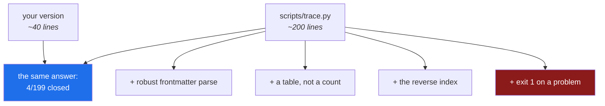

# 4.3 — Reading the shipped generator: what the extra lines buy

## One-line answer

Your forty lines and the shipped two hundred agree about the answer — so **every extra line is
buying something other than correctness**, and being able to name what each one buys is the
difference between using a tool and being able to maintain one.

---

## The story

Two versions of a function exist side by side in a codebase. They do the same thing. One is six
lines; the other is thirty-one.

A new engineer finds them and does the obvious, defensible thing: deletes the long one and points
everything at the short one. The tests pass. The diff is satisfying — twenty-five lines gone.

Three weeks later, an incident. The long version had handled a case the short one did not: an input
that arrives about once every ten thousand times, from one particular upstream system, in a shape
nobody would design on purpose. The long version had a branch for it and no comment explaining why.

Here is the part worth sitting with: **the engineer did the right thing with the information they
had.** Faced with unexplained duplication, consolidating is correct — the alternative is a codebase
that grows forever because nobody dares remove anything. The failure was that twenty-five lines of
hard-won knowledge were sitting in the code with nothing to say why they were there.

That is the same shape as the queue in [2.3](../02-repo-as-memory/2.3-the-adr-that-survives-a-cold-read.md), and it
has the same two lessons. The one you already know: **record the reason**. The one this part is
about: **when you meet code that is longer than it needs to be, the extra length is usually an
answer to a question you have not been asked yet** — and finding out what the question was is more
useful than shortening it.

---

## The idea in plain language

You wrote a working generator in [4.2](4.2-build-the-generator-yourself.md). `scripts/trace.py`
produces the same `closed/total`. So the extra lines are not fixing a wrong answer.

They buy four things, and each is a category worth recognising, because you will meet all four in
every mature tool you ever read.

### 1. Robustness — the inputs you did not have yet

Your `claimed()` reads any line beginning `ids:`. That is correct today, on a hub whose frontmatter
is at the top and whose body happens not to contain such a line.

The shipped version parses the frontmatter *block* — the region between the opening `---` and the
closing `---` — and looks only inside it. **The difference is invisible until a day document's prose
contains a line starting with `ids:`**, at which point yours silently reads the wrong one.

That is the archetypal robustness line: no benefit today, and it prevents a bug that would be
genuinely confusing when it arrives, because the symptom (an ID mismatch) points nowhere near the
cause (a coincidence in prose).

### 2. Diagnosis — telling a person what to do

Yours prints a count and a list of problems. The shipped one **writes the file** — a full table of
199 rows, each ID with its phase, its planned day, and its status — plus a `## 🐛 Problems` section
when there is anything to say.

Neither is more correct. But at a phase gate the question is rarely *how many are closed?* It is
*which ones are not, and where were they supposed to be?* **A count tells you there is a problem; a
table tells you where to go.**

### 3. A second job — the reverse index

The shipped script also writes `docs/CURRICULUM_INDEX.md`: every ID, grouped by curriculum, with the
day that teaches it and a link.

§14 answers *what does day 43 teach?* The index answers *where do I learn `MCP-14`?* — which is the
question you actually have on Day 60 when a document cites an ID you no longer remember. It rides
along in this script because it needs the same parse, and **a second output from an existing parse
is nearly free**, which is a real design consideration rather than an afterthought.

### 4. An exit code — the difference between a tool and a report

Yours prints problems. The shipped one prints them **and returns `1`**.

That single line is what lets it live in `./m check` (Day 0,
[3.3](../../../day-00-toolchain-skeleton-driver/parts/03-the-m-driver/3.3-the-check-gate.md)). A script that always exits `0` cannot fail a
gate, cannot fail CI, and is therefore a report that somebody has to remember to read. **The exit
code is the entire difference between a check and a suggestion.**



> 💡 **The mental model:** the crude version proves you understand the **problem**. The shipped
> version is the problem plus everything learned from running it — and the gap between them is the
> shape of production.

---

## Why Sutra needs it

- **Plan §15 gates every phase on this script**, and `./m check` runs it on every commit. You are
  going to see its output several hundred times over ninety-six days; understanding it once is
  cheap.
- **Day 31 is the quality gate** (SK-20, OPS-08), where `./m check` grows a skills lint and a
  `:free`-suffix lint. **Both will be scripts of exactly this shape**, and both must exit non-zero —
  which is a thing you now know to check for rather than discovering later.
- **Day 82 puts evals in CI** (OPS-15, ADK-62): the same pattern, a different rule, and the same
  requirement that a red result actually fails something.
- **Day 92 is the pre-publication security review** (SEC-16). "Are there open IDs from completed
  phases?" is a question that day answers by running this, and a surprising answer needs a person
  who can read the script.
- **Day 10 replaces your hand-rolled tool calling with `FunctionTool`** (ADK-10, ADK-11), and Day 53
  replaces hand-composed agents with the graph Workflow Runtime (ADK-32..34). **Both days are this
  one, at a larger scale**: you built the crude version, now read what the real one adds. Practising
  the comparison here, on two hundred lines you can hold in your head, is what makes those days a
  reading exercise rather than an act of faith.

---

## The mechanism

Read the shipped script against yours. Not line by line from the top — **go looking for the four
categories.**

```bash
wc -l days/day-01-bootstrap-and-map/lab/trace_mine.py scripts/trace.py
```

**Line by line:**

- `wc -l` — count lines in both. Roughly 40 against roughly 200. **Hold that ratio in mind**: five
  times the code for the same answer.

**Category 1 — the robust read.** Look at how the shipped version finds the `ids:` line:

```bash
sed -n '/^def doc_claims/,/^def /p' scripts/trace.py | head -25
```

**Line by line:**

- `sed -n '/start/,/end/p'` — print the range between two patterns
  ([2.1](../02-repo-as-memory/2.1-what-sutra-actually-is.md)). Here: from the `doc_claims` definition to the next
  `def`.
- Notice `if not text.startswith("---"): return []` — a file with no frontmatter yields nothing
  rather than scanning the body. **Yours would scan the whole document.**
- Notice `end = text.find("\n---", 3)` and `front = text[3:end]` — it slices out the frontmatter
  *block* and searches only inside it. The `3` skips the opening `---`.
- **This is the robustness line.** It costs four lines and prevents a class of bug that would
  otherwise present as an inexplicable ID mismatch.

**Category 2 — the table.** Look at what it writes rather than prints:

```bash
sed -n '/lines = \[/,/^    total/p' scripts/trace.py
```

**Line by line:**

- The `lines` list is the file being built: a header, an explanation of the closing rule, and a
  Markdown table header.
- Notice that the *rule itself* is written into the file — "An ID counts as **closed** only when…".
  **A generated artifact that explains its own semantics** is worth far more at a gate than one that
  emits a number, because the person reading it in four months has forgotten the rule.

**Category 3 — the second output.** Find where the index is written:

```bash
grep -n "write_index\|CURRICULUM_INDEX" scripts/trace.py
```

**Line by line:**

- `grep -n` — with line numbers, so you can jump to them.
- You will see `write_index(plan)` called from `main()` **after** the traceability file is written,
  reusing the `plan` dictionary that was already parsed.
- **That reuse is the design.** The expensive part is parsing §14; producing a second view of it is
  nearly free, which is why the two outputs live in one script rather than two.

**Category 4 — the exit code.** The last line of `main()`:

```bash
tail -8 scripts/trace.py
```

**Line by line:**

- `return 1 if problems else 0` — non-zero when anything was wrong.
- `sys.exit(main())` at the bottom — the function's return value becomes the **process** exit status.
  A bare `main()` would discard it and always exit `0`.
- **This is the line that makes it a gate.** Without it, `./m check` would print the problems and
  cheerfully continue to `OK all green` (Day 0,
  [3.1](../../../day-00-toolchain-skeleton-driver/parts/03-the-m-driver/3.1-set-euo-pipefail.md)).

**Now prove the exit code, because it is the claim with the most riding on it:**

```bash
sed -i.bak 's/^ids: \["AG-01"/ids: ["AG-99"/' days/day-01-bootstrap-and-map/LESSON.md
uv run python scripts/trace.py; echo "exit: $?"
uv run python days/day-01-bootstrap-and-map/lab/trace_mine.py; echo "mine exit: $?"
mv days/day-01-bootstrap-and-map/LESSON.md.bak days/day-01-bootstrap-and-map/LESSON.md
uv run python scripts/trace.py >/dev/null; echo "restored exit: $?"
```

**Line by line:**

- The `sed` makes the hub claim an ID the plan never assigned
  ([4.2](4.2-build-the-generator-yourself.md)).
- The shipped script prints the problems and exits **1**.
- **Yours prints the same problems and exits `0`** — because it never returns a status. Same
  diagnosis, no consequence. That is the whole of category 4, visible in two lines of output.
- The `mv` restores the hub; the final run must print `exit: 0`.

---

## When it breaks

**A check that reports and does not fail** — the failure this comparison exists to reveal:

```text
$ uv run python days/day-01-bootstrap-and-map/lab/trace_mine.py
my trace: 3/199 closed, 2 problem(s)
  - AG-01: day 1 is green but its hub does not claim it
  - day 1 claims IDs the plan did not assign: ['AG-99']
$ echo $?
0
```

Two problems, exit `0`. **Put this in a gate and the gate is decorative.** The output looks
identical to a real check right up until the moment it matters, which is why "does it exit non-zero?"
is the first question to ask of any script somebody proposes adding to CI.

**The generated file that was hand-edited.** Covered in
[4.1](4.1-the-diary-and-the-scoreboard.md), and worth seeing from the script's side: the shipped
version rewrites the whole file every run, so an edit does not merge — it disappears. **There is no
error, because from the script's point of view nothing happened.**

**The parse that drifts because the plan was reformatted:**

```text
traceability: 0/0 closed, 0 problem(s); index: 0 IDs
```

`0/0`. Not an error — the parser found nothing at all, which means §14's shape changed: a renamed
heading, a table column reordered, day numbers no longer first. **A total of zero is the signature of
a parse failure**, and it is worth recognising instantly because every count downstream of it will
look calm and be meaningless.

The deeper point is the trade-off from [4.2](4.2-build-the-generator-yourself.md): parsing a
human-edited Markdown table is fragile by construction. Sutra accepted that in exchange for a plan
that reads well to people. **The mitigation is that the failure is loud** — `0/0` is unmissable —
rather than a silently wrong subset.

**The `--summary` flag you did not know existed.** `scripts/tracker.py` has one; `trace.py` does not.
Reading a tool you did not write includes finding the affordances nobody told you about:

```bash
grep -n "argv\|--summary" scripts/tracker.py | head
```

**How to read it.** Options handled by inspecting `sys.argv` rather than declared in a help text are
easy to miss. **This is a mild criticism of the script**, and worth noticing: a tool whose options
are only discoverable by reading its source has documentation debt, even when the source is short.

---

## In production

**Reading code you did not write is the majority of professional work, and it is a trainable skill.**
The technique used here is the one that scales: **do not read top to bottom.** Go in with specific
questions — *how does it read its input? what does it write? what makes it fail?* — and search for
the answers. A two-hundred-line script read with four questions takes ten minutes; read linearly it
takes an hour and leaves less behind.

**The gap between the crude and the shipped version is where the domain knowledge is.** Every extra
branch in a mature tool is usually a bug report, an edge case, or a support ticket, fossilised.
**When you find one you do not understand, that is a question — not a candidate for deletion.** The
story at the top of this page is what happens when it is treated as the second thing, and the
professional habit is to reach for `git log -S` or `git blame` on the line before touching it (Day 0,
[2.3](../../../day-00-toolchain-skeleton-driver/parts/02-repo-skeleton/2.3-git-init-and-what-a-repo-is.md)).

**Exit codes are the interface between a script and everything that runs it.** CI, orchestrators,
shell chains, `set -e`, `make` — all of them see only the status. A script that swallows failures is
invisible to every one of them. The professional habit: **decide what the exit code means before
writing the body**, and treat `sys.exit(main())` as part of the skeleton rather than a flourish at
the end.

**"Build the crude version, then read the real one" is a technique for adopting anything.** It is
what makes a library's documentation legible — you can tell which options are essential complexity
and which are somebody else's requirements — and it is Sutra's Principle 4 applied to tooling. **Day
10 and Day 53 are the same move at higher stakes**: hand-rolled tool calling before `FunctionTool`,
hand-composed agents before the graph runtime. The habit is the transferable part.

**What degrades at scale.** Two hundred lines is readable by one person in one sitting. Two thousand
is not, and the responses are the ones the shipped script already gestures at: a docstring saying
what the module is *for* rather than what it contains, small named functions that can be read
independently, and — the one that matters most — **tests that document the edge cases the extra
branches exist for.** `scripts/trace.py` has none, which is honest to note: it is checked by being
run on every commit rather than by a test suite, and that is a weaker guarantee than it looks.

**The review comment a senior engineer leaves.** On a pull request deleting an unexplained branch:
*"What made you confident this is dead? `git log -S` on that condition, or a comment explaining the
case it handles — otherwise we're removing something whose reason has been forgotten, which is how
last quarter's incident happened."* The reviewer is not defending the code; **they are asking for
evidence rather than for absence of evidence.**

**The interview question.** *"How do you approach an unfamiliar codebase?"* Weak answers describe
reading the README and then "getting familiar with the code". A strong answer describes a *method*:
find the entry point, find what it reads and what it writes, find what makes it fail — and, when a
piece looks unnecessarily complicated, treat the complexity as an unanswered question rather than a
cleanup opportunity. **"I write a crude version of what I think it does, then diff my mental model
against the real one"** is an answer that stands out, because it is a technique rather than an
attitude.

---

## Check yourself

```bash
wc -l days/day-01-bootstrap-and-map/lab/trace_mine.py scripts/trace.py && \
  uv run python days/day-01-bootstrap-and-map/lab/trace_mine.py; echo "mine exit: $?" && \
  uv run python scripts/trace.py; echo "shipped exit: $?"
```

Same `closed/total`, both exit `0` while everything is correct. Now write down — in your own words,
in your notes — **the four things the extra lines buy**. If you can only name three, go back and
find the fourth in the source rather than in this document.

**Answer out loud, without scrolling up:**

> Your forty lines and the shipped two hundred produce the same number. Name what the extra lines
> buy, and say which one of them is the difference between a check and a report — and why.

---

**Day 1's teaching is complete.** Fourteen parts: you can say what makes a system agentic and where
Sutra's own boundary sits, the repository knows what it is and which document wins, three keys live
behind a guard rail you have now rotated for real, and completeness is something this project
computes rather than feels.

**Next:** the parts are done, so open the day's
[`papers/`](../../papers/01-intelligent-agents.md) — the definition this day started from turns out
to be thirty years old, and you can now be told which half of it survived. Then go back to the
hub's [§10 Done when](../../LESSON.md), work through [`CHECKLIST.md`](../../CHECKLIST.md), and
finish with `./m done 1`.
