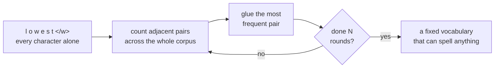

# *Neural Machine Translation of Rare Words with Subword Units* — why a token is not a word

## One-line answer

The reason your bill is counted in fragments rather than words is a 2015 translation paper that
solved a completely different problem — running out of vocabulary — and its fix, **chop rare words
into re-usable pieces**, is why `gemini-3.7-flash` can read a word that has never existed before.

---

## The story

A translation system in 2014 has a filing cabinet with a fixed number of drawers.

Each drawer holds one word it knows. There are, say, thirty thousand drawers, filled with the most
common words from the training data. This is not laziness — the system has to produce a probability
for every possible next word, and that is a calculation over every drawer, so more drawers means a
slower and heavier machine. Thirty thousand is already generous.

Then a sentence arrives containing a word that has no drawer. A surname. A product code. A German
compound noun assembled that morning by someone who needed a word for it. A medical term.

The system does the only thing it can: it files the word under **UNK** — unknown — and moves on.
Downstream, the translation comes out with a gap in it, or with a guess in it, and the gap is often
in the most information-dense position in the sentence. The words you most need translated
correctly — names, quantities, technical terms — are exactly the words most likely to be rare.

The workarounds are all bad in the same way. You can bolt on a dictionary and look up the unknown
word separately, which means maintaining a dictionary. You can copy the unknown word through
untranslated and hope. You can make the cabinet bigger, which makes everything slower and only
moves the cliff further away without removing it.

The paper's move is to stop treating the cabinet as a cabinet of **words**.

If a word has no drawer, it can still be spelled out of pieces that do. And if you choose the
pieces well — common words stay whole, rare words break into fragments that recur across many other
words — then the cabinet never runs out, because anything can be spelled.

---

## The idea in plain language

Start from the problem, which has a name: **open vocabulary**.

Language is open. New words appear constantly, and any fixed list of words is a snapshot that is
already wrong. But a neural network needs a **closed** list — a fixed number of output slots — to
produce probabilities over. Those two facts are in direct conflict, and every system before this
paper resolved the conflict by giving up on the rare words.

The paper resolves it in the other direction: **make the units smaller than words.**

The specific method is **byte-pair encoding**, or **BPE** — an idea borrowed from a data compression
technique from 1994 and repurposed. It works from the bottom up:

1. Start with every word split into individual characters. Now your vocabulary is tiny — just the
   alphabet — and *nothing* can be unknown, because anything can be spelled letter by letter.
2. Count every adjacent pair of symbols across the whole corpus. Find the most frequent pair.
3. Glue that pair together into one new symbol, and add it to the vocabulary.
4. Repeat, a fixed number of times.

That is the whole algorithm. There is no training, no neural network and no cleverness in it; it is
counting and gluing, repeated.

What emerges is the useful part. Common whole words get glued together early, because their letter
pairs are frequent — so `low` ends up as a single symbol. Rare words never get fully glued, so they
survive as a handful of pieces. **The frequent stays whole, the rare gets spelled**, and the size of
the vocabulary is a dial you set rather than a consequence of your data.

> **Jargon check.** A **corpus** is just "the pile of text you learned from". A **symbol** here is
> whatever is currently one unit — at the start a single character, later a glued-together chunk.
> The paper calls the resulting chunks **subword units**; everyone now calls them **tokens**.

---

## Why Sutra needs it

[Part 2.1](../parts/02-tokens-the-meter/2.1-what-a-token-is.md) told you a token is "a chunk of text,
often a fragment of a word", and that everything in this field is denominated in tokens. It did not
say **why anyone would build it that way** — and without the why, the tokenizer looks like an
arbitrary annoyance that makes your bill hard to predict.

It is not arbitrary. It is the fix that made open vocabulary possible, and the unpredictable bill is
the direct, unavoidable cost of that fix.

This matters concretely and soon:

- [Part 2.2](../parts/02-tokens-the-meter/2.2-reading-the-receipt.md) has you reading token counts off a
  usage object. Two prompts of equal *word* length routinely differ in token count, and now you know
  the mechanism: one of them contained rarer words, so more of it had to be spelled out.
- On **Day 46**, when Sutra starts retrieving documents, chunk boundaries will be measured in tokens
  and a badly-chosen chunk size will cut words in half. That failure is only diagnosable if you know
  that "words" was never the unit.
- Every quota decision in this curriculum — Principle 15's RPM/RPD budgets — is denominated in a
  unit invented by this paper for an unrelated purpose.

---

## The mechanism

Take a corpus of six words with counts, and watch four rounds of merging.

Each word starts as its characters plus an end-of-word marker `</w>`. The marker matters: it lets
the algorithm tell `low` at the end of a word from `low` at the start of `lower`, which are
genuinely different things.

| Round | Most frequent pair | Why | Vocabulary gains |
| --- | --- | --- | --- |
| start | — | every word is loose characters | `l o w e r n s t d i </w>` |
| 1 | `w` + `</w>` | `low`, `new` both end in `w` | `w</w>` |
| 2 | `n` + `e` | `new`, `newest` | `ne` |
| 3 | `l` + `o` | `low`, `lower` | `lo` |
| 4 | `lo` + `w</w>` | the whole word `low`, now one symbol | `low</w>` |

Notice what happened by round 4: **the most common whole word became a single token**, built out of
pieces that were themselves built out of pieces. That is the mechanism producing exactly the
behaviour you want, from nothing but frequency counting.



The encoding step is the same merges replayed in the order they were learned. That ordering is not a
detail — it is what makes the tokenizer **deterministic**, so the same string always costs the same
number of tokens.

---

## The paper in one demo

Two files, and the only thing they do is the paper's claim: an unseen word survives as pieces, or
dies as `<unk>`.

```text
lab/papers/subword-units/
├── bpe.py    learn merges, apply merges - the entire algorithm
└── run.py    one sentence, one unseen word, and the switch
```

**Line by line:** no model call, no network, no dependency. BPE is counting and gluing, so the
paper's contribution can be demonstrated in pure Python and the request budget for this demo is
**zero** — which matters on a free tier capped at 20 requests a day.

```python
"""Byte-pair encoding, learned from a corpus and applied to a word - the paper's whole method."""

from collections import Counter

END = "</w>"


def learn_merges(corpus: dict[str, int], rounds: int) -> list[tuple[str, str]]:
    """Repeatedly merge the most frequent adjacent symbol pair. That is the entire algorithm."""
    vocab = {tuple(word) + (END,): count for word, count in corpus.items()}
    merges: list[tuple[str, str]] = []
    for _ in range(rounds):
        pairs: Counter[tuple[str, str]] = Counter()
        for symbols, count in vocab.items():
            for a, b in zip(symbols, symbols[1:]):
                pairs[(a, b)] += count
        if not pairs:
            break
        best = max(pairs, key=lambda pair: (pairs[pair], pair))
        merges.append(best)
        vocab = {apply_merge(symbols, best): count for symbols, count in vocab.items()}
    return merges


def apply_merge(symbols: tuple[str, ...], pair: tuple[str, str]) -> tuple[str, ...]:
    """Glue every occurrence of one adjacent pair into a single symbol."""
    out: list[str] = []
    i = 0
    while i < len(symbols):
        if i < len(symbols) - 1 and (symbols[i], symbols[i + 1]) == pair:
            out.append(symbols[i] + symbols[i + 1])
            i += 2
        else:
            out.append(symbols[i])
            i += 1
    return tuple(out)


def encode(word: str, merges: list[tuple[str, str]]) -> list[str]:
    """Split a word into subword units, applying the merges in the order they were learned."""
    symbols = tuple(word) + (END,)
    for pair in merges:
        symbols = apply_merge(symbols, pair)
    return list(symbols)
```

**Line by line:**

- `END = "</w>"` — the end-of-word marker. Without it the algorithm cannot distinguish a fragment
  that ends a word from the same letters mid-word, and `low` in `low` would be indistinguishable
  from `low` in `lower`. The paper uses exactly this device.
- `vocab = {tuple(word) + (END,): count ...}` — **every word starts as loose characters.** This is
  the line that makes an unknown word impossible: anything can be spelled from characters.
- `for a, b in zip(symbols, symbols[1:])` — the standard adjacent-pairs idiom. Pair up each symbol
  with the one after it.
- `pairs[(a, b)] += count` — pairs are counted **weighted by how often the word appears**, not once
  per distinct word. A pair inside a word used six times is six times as important. Counting distinct
  words instead would learn merges for vocabulary rather than for text, which is a real and subtle
  way to get this wrong.
- `best = max(pairs, key=lambda pair: (pairs[pair], pair))` — most frequent pair wins, and the pair
  itself is the tie-break. The tie-break is not cosmetic: without it, ties resolve by dictionary
  insertion order and **the same corpus can produce different tokenizers on different runs**. A
  tokenizer that is not deterministic is not a tokenizer.
- `merges.append(best)` — the merges are kept **in order**, because encoding must replay them in
  exactly the order they were learned. This ordered list *is* the trained tokenizer; there is
  nothing else to it.
- `apply_merge` walking with `i += 2` on a hit — a merged pair consumes both symbols, so the scan
  must skip past both. Using `i += 1` here would let a symbol merge with itself in the same pass, a
  classic off-by-one in every hand-rolled BPE.
- `encode` — note it does **not** look anything up in a vocabulary. It replays merges. An unseen
  word goes through the identical code path as a seen one, which is the entire point of the paper.

```python
"""Open vocabulary or closed - one switch, one unseen word."""

from bpe import encode, learn_merges

USE_BPE = True
ROUNDS = 12

CORPUS = {"low": 6, "lower": 3, "newest": 4, "wider": 3, "new": 5, "wide": 2}
SENTENCE = ["low", "lowest", "widest"]


def main() -> None:
    merges = learn_merges(CORPUS, ROUNDS)
    known = set(CORPUS)
    print(f"USE_BPE = {USE_BPE}")
    print(f"trained on {len(known)} words: {sorted(known)}")
    if USE_BPE:
        print(f"learned {len(merges)} merges: {[a + b for a, b in merges]}")
    print()
    for word in SENTENCE:
        if USE_BPE:
            pieces = encode(word, merges)
        else:
            pieces = [word] if word in known else ["<unk>"]
        seen = "seen" if word in known else "UNSEEN"
        print(f"{word:>8} ({seen:>6})  ->  {pieces}")
    lost = sum(1 for w in SENTENCE if not USE_BPE and w not in known)
    print(f"\nwords reduced to <unk>: {lost}")


if __name__ == "__main__":
    main()
```

**Line by line:**

- `USE_BPE = True` — **the ablation switch.** `False` is the 2014 system: a fixed list of whole
  words, and `<unk>` for everything else.
- `ROUNDS = 12` — the vocabulary size dial, which the paper's central argument turns on. Twelve is
  chosen so the merge list is short enough to print and read; a real tokenizer uses tens of
  thousands.
- `CORPUS = {...}` — words with frequencies, exactly the input the paper's method takes. Deliberately
  built so that `low` and `new` are frequent and the pieces `lo`, `wide`, `west` recur.
- `SENTENCE = ["low", "lowest", "widest"]` — one word the corpus contains and **two it has never
  seen**. `lowest` and `widest` are the experiment; `low` is the control that proves the two paths
  agree on easy cases.
- `pieces = [word] if word in known else ["<unk>"]` — the ablation in one line. This is not a straw
  man; it is what the systems the paper was arguing with actually did.
- `lost = sum(...)` — the demo scores itself, so the verdict is not a matter of squinting at output.

Run it:

```bash
cd lab/papers/subword-units && uv run python run.py
```

**Line by line:** `uv run` so the pinned interpreter is used, and `cd` first because `run.py`
imports `bpe` as a sibling module.

```text
USE_BPE = True
trained on 6 words: ['low', 'lower', 'new', 'newest', 'wide', 'wider']
learned 12 merges: ['w</w>', 'ne', 'lo', 'we', 'r</w>', 'low</w>', 'wi', 'wid', 'wide', 'new</w>', 'wes', 'west']

     low (  seen)  ->  ['low</w>']
  lowest (UNSEEN)  ->  ['lo', 'west', '</w>']
  widest (UNSEEN)  ->  ['wide', 's', 't', '</w>']

words reduced to <unk>: 0
```

Now the ablation — change `USE_BPE = False`, change nothing else:

```text
USE_BPE = False
trained on 6 words: ['low', 'lower', 'new', 'newest', 'wide', 'wider']

     low (  seen)  ->  ['low']
  lowest (UNSEEN)  ->  ['<unk>']
  widest (UNSEEN)  ->  ['<unk>']

words reduced to <unk>: 2
```

Three things in those two tables are worth stopping on.

**The frequent word became one token.** `low` appears six times in the corpus and encodes to a
single symbol, `low</w>`. That is the "common words stay whole" half of the claim, produced by
nothing but counting.

**The unseen words survived.** `lowest` and `widest` were never in the corpus, and BPE still
represents them — losslessly, as pieces. Under the ablation both become `<unk>` and the information
is simply gone. Two of three words destroyed, from a vocabulary that had no gap in it at all for
whole words.

**The pieces are not morphemes, and this is important.** `lowest` came out as `['lo', 'west',
'</w>']` — not `low` + `est`, which is what a linguist would want. BPE has no idea what a word means;
it merged `we`, then `wes`, then `west` because those letter pairs were frequent, and `west` is a
string that happens to also be an English word. **The tokenizer is a compression scheme, not a
grammar**, and the moment you expect it to respect meaning it will embarrass you.

---

## When it breaks

**1 — The segmentation is frequency-shaped, not meaning-shaped.** The demo above is the small
version. The production version bites when a token boundary lands mid-concept: an identifier like
`user_id_42` splits on whatever the training text made frequent, and a model asked to reason about
its parts is reasoning about fragments that do not correspond to the parts you see. This is the root
of the entire family of "why can't it count the letters in a word" failures — the model was never
shown letters.

**2 — Text unlike the training text costs far more.** BPE's efficiency is a bet on the corpus. Text
that does not match — a language under-represented in training, a base64 blob, a minified file, a
long UUID — falls back toward character-level, and character-level means many tokens. The same
sentence in two languages can differ severalfold in token count, and since
[quota is the currency](../parts/02-tokens-the-meter/2.2-reading-the-receipt.md), that is a real and
uneven cost.

Watch for it concretely: paste a UUID into a token count and compare it against an English sentence
of the same character length. The UUID is dramatically more expensive, because none of its pairs
were frequent enough to merge.

**3 — The demo's own edge: too few rounds and everything is fragments.** Set `ROUNDS = 2` and
re-run:

```text
USE_BPE = True
trained on 6 words: ['low', 'lower', 'new', 'newest', 'wide', 'wider']
learned 2 merges: ['w</w>', 'ne']

     low (  seen)  ->  ['l', 'o', 'w</w>']
  lowest (UNSEEN)  ->  ['l', 'o', 'w', 'e', 's', 't', '</w>']
  widest (UNSEEN)  ->  ['w', 'i', 'd', 'e', 's', 't', '</w>']

words reduced to <unk>: 0
```

Nothing is unknown — the open-vocabulary guarantee holds absolutely, at every setting. But `low`
now costs three tokens instead of one. **The guarantee is free; the efficiency is what you are
buying with vocabulary size**, and that trade-off is the paper's actual engineering contribution.

---

## In production

**What survived: essentially all of it.**

Every major model you will call in this curriculum is tokenized by BPE or a close descendant.
`gemini-3.7-flash` does not have an unknown-word problem, and neither do the Groq or OpenRouter
models from [part 3.1 of Day 1](../../day-01-bootstrap-and-map/parts/03-keys-and-env/3.1-the-three-free-doors.md).
That is this paper, still running.

The survival is so complete that the original context has been forgotten. This was a **machine
translation** paper solving a **vocabulary size** problem in a world without large language models.
Nobody was thinking about billing. The fact that your invoice from a 2026 model provider is
denominated in units invented for 2015 German compound nouns is one of the field's better accidents.

**What did not survive: the framing, and one competitor.**

The paper argues its case in BLEU scores on English–German and English–Russian translation. Nobody
cites those numbers now. What propagated was the *mechanism*, lifted out of translation entirely.

The specific variant did shift. The paper's BPE operates on characters; production tokenizers
generally operate on **bytes** — byte-level BPE — which removes the last remaining hole, because
a character-level vocabulary still has to decide what to do with a character it has never seen, and
a byte-level one cannot ever meet one. Others use unigram language-model segmentation, which picks
pieces by likelihood rather than by frequency. The paper's *claim* — subword units solve open
vocabulary — won completely; its exact algorithm is one of several ways to cash it in.

**What changes at scale.** Three things you will actually hit:

- **Token counts are not portable.** The same string costs different amounts on different providers,
  because each trained its own merges. Any budget spreadsheet that assumes one number across
  providers is wrong, which matters from Day 9 when Sutra benchmarks four of them.
- **Prompt caching is token-boundary-sensitive.** Caches key on token prefixes, so a one-character
  edit near the start of a prompt can re-tokenize what follows and miss the cache entirely.
- **Estimating cost from character count is an approximation with a fat tail.** It works for prose
  in the training language and fails badly on code, identifiers and other languages — precisely the
  content an agent handles most.

**The review comment a senior engineer leaves:** *"you are truncating at a character count — what
happens when that lands mid-token?"* Slicing a string by characters and feeding it to a model
produces a broken final token, and the model's behaviour on a broken token is not defined by
anything you can read.

**The interview question:** *"why can't the model count the r's in a word?"* The weak answer is
"it's bad at counting". The strong answer is: it never saw the letters — it saw two or three
subword units learned by frequency, and asking it to count characters is asking it to reason about
something outside its input representation. Then the follow-up that shows you have shipped:
*and this is why tool use exists — you give it a function that can count.*

---

## Check yourself

Run the ablation, then change `ROUNDS` from `12` to `2` and to `30`, and watch the piece counts move:

```bash
cd lab/papers/subword-units && uv run python run.py
```

Then, without scrolling up, answer out loud:

1. **What did this paper actually claim?** State the problem it was solving — and note that it was
   not the problem you use it for.
2. **What do we do differently now?** Name the one variant change between the paper's BPE and a
   production tokenizer, and say what hole it closes.
3. `lowest` encoded as `['lo', 'west', '</w>']`, not `['low', 'est']`. Say in one sentence why that
   is expected rather than a bug — and name one model behaviour it explains.
