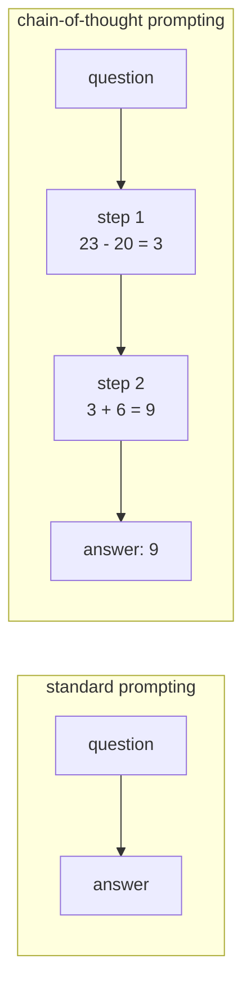

# *Chain-of-Thought Prompting Elicits Reasoning in Large Language Models* — the tax you pay for

## One-line answer

The invisible tokens on your bill in
[part 2.3](../parts/02-tokens-the-meter/2.3-the-thinking-tax.md) are a 2022 finding turned into a
product feature: **making a model write out its intermediate steps makes it dramatically better at
multi-step problems**, and once that was known, providers stopped waiting to be asked.

---

## The story

A model in 2021 can write a passable short story and cannot reliably do this:

> *A café has 23 apples. They use 20 to make pies, then buy 6 more. How many apples do they have?*

Not because it is a hard sum. Because the model answers the way a person answers when put on the
spot: it produces something immediately. It sees a question, it emits a number. It has no
opportunity to be careful, because there is nowhere for care to happen — the answer is the very
next thing it writes.

The standard response at the time was **scale**. Bigger models were better at almost everything, so
the assumption was that bigger models would eventually be better at this too. They were not, much.
Arithmetic word problems stayed stubbornly bad while everything else improved, and this was a
genuinely uncomfortable result: it suggested a category of thing scale alone would not fix.

Then somebody tries an experiment that sounds too simple to be worth running. Instead of showing
the model examples of *question and answer*, show it examples of **question, working out, answer**.
Change nothing else. No retraining, no architecture change, no extra data.

The accuracy on those problems does not improve slightly. On the harder benchmarks it moves by
tens of percentage points — from *does not work* to *works* — and the technique that produced it is
a change to the text you send.

The uncomfortable part, which the paper is honest about: the same change does very little for small
models, and can make them worse.

---

## The idea in plain language

Two terms, because the paper's contribution lives precisely between them.

**Few-shot prompting** was already standard. You show the model a handful of worked examples inside
the prompt, and it imitates the pattern. Show it three questions with their answers, ask a fourth,
and it answers in the same style. Nothing is trained; the examples are just text in the request.

A **chain of thought** is the intermediate reasoning written out — the steps a person would put on
paper between reading a problem and stating an answer.

The paper's move is to put chains of thought **into the few-shot examples**:

> Instead of exemplars that read *question → answer*, use exemplars that read
> *question → here is how I work it out, step by step → answer*.

The model imitates what it is shown, so it now produces its own steps before its own answer. And
because each token it generates becomes part of what it conditions on next, **the steps it writes
become input to the rest of the computation.** The model is not "thinking harder". It has been
given somewhere to put partial results, and the mechanism that lets it use them was there all along.

This is why the effect is not a trick. A model producing an answer immediately has one forward pass
between question and answer. A model producing eighty tokens of working has eighty, each able to
build on the last.

Two findings from the paper matter as much as the method:

- **It is emergent with scale.** The benefit appears only in sufficiently large models. In small
  ones, chain-of-thought prompting produces fluent, confident, wrong reasoning — and the paper says
  so plainly rather than burying it.
- **It is not fine-tuning.** Nothing about the model changes. The entire intervention is the shape
  of the examples in the prompt, which is why it spread across the industry within months.

> **Jargon check.** *Emergent* here means "does not appear gradually as models get bigger — it is
> absent, and then at some size it is present". Nothing mystical is claimed; it is a description of
> a curve.

---

## Why Sutra needs it

[Part 2.3](../parts/02-tokens-the-meter/2.3-the-thinking-tax.md) told you something that sounds like
a billing anomaly: `gemini-3.7-flash` reasons before it answers **by default**, that reasoning is
billed as output, and you cannot read it. The part showed you how to see it in
`total_thought_tokens` and how to turn `thinking_level` down.

This paper is *why that line item exists*. The sequence is short and worth holding:

1. 2022 — writing out steps makes large models much better at multi-step problems.
2. The technique needs the user to know about it and to write good exemplars.
3. So providers moved it inside the model, where it happens whether or not you asked.
4. Which is your bill.

Without this paper, `thinking_level` is an arbitrary dial with a confusing price. With it, the dial
is a **direct trade between accuracy and quota** — and on a free tier capped at
[20 requests a day](../parts/01-first-contact/1.5-the-only-door-429.md), that trade is the whole
game.

It also lands on the very next day. [Day 3](../../day-03-loop-hand-rolled/parts/01-loop-anatomy/1.1-the-navigator-and-the-driver.md)
has you hand-roll an agent loop in which the model writes a *thought* before choosing an action —
and that format is this paper, one step further on. Day 3's paper document takes that step.

---

## The mechanism

The difference is entirely in the prompt. Here are the two shapes, side by side.

**Standard few-shot** — the exemplar goes straight to the answer:

```text
Q: There are 15 trees. Workers plant more, ending with 21. How many did they plant?
A: 6

Q: A café has 23 apples. They use 20 for pies, then buy 6 more. How many apples now?
A:
```

The model has been shown that the correct behaviour is *emit a number immediately*, so it does. Any
error it makes is unrecoverable, because there is no step in which it could be caught.

**Chain-of-thought few-shot** — the exemplar shows the working:

```text
Q: There are 15 trees. Workers plant more, ending with 21. How many did they plant?
A: There were 15 trees. Afterwards there were 21. So the workers planted 21 - 15 = 6. The answer is 6.

Q: A café has 23 apples. They use 20 for pies, then buy 6 more. How many apples now?
A:
```

Now the demonstrated behaviour is *narrate, then conclude*, and the model follows suit. The
arithmetic `23 - 20 = 3` gets written down as its own token sequence, and the next step conditions
on a stated intermediate result rather than on an unstated one.



The crucial structural point: in the lower path, `step 1` is **text the model produced and can now
read**. The arrow from `step 1` to `step 2` is the ordinary next-token mechanism operating on the
model's own output. No new capability was added — room was made.

---

## The paper in one demo

Two files. The only variable is whether the exemplars contain reasoning.

```text
lab/papers/chain-of-thought/
├── prompts.py   the two exemplar sets - the entire experiment
└── run.py       ask the same question both ways, and the switch
```

**Line by line:** unlike the other two papers on this day, this one **cannot** be demonstrated
offline — its claim is about how a large model behaves, and a bigram model has no behaviour to
change. So the demo goes through `sutra.mechanics.ask`, the single door you built in
[part 1.5](../parts/01-first-contact/1.5-the-only-door-429.md), which carries the `retry-after`
handling and the model pin. Budget: **2 requests** of the free tier's 20 per day.

```python
"""The two exemplar sets. The only difference between them is the reasoning in the answers."""

QUESTION = "A café has 23 apples. They use 20 for pies, then buy 6 more. How many apples now?"

DIRECT = """Q: There are 15 trees. Workers plant more, ending with 21. How many did they plant?
A: 6

Q: A shop sells 4 boxes of 7 pens, then receives 12 more pens. How many pens is that?
A: 40

Q: {question}
A:"""

CHAIN = """Q: There are 15 trees. Workers plant more, ending with 21. How many did they plant?
A: There were 15 trees. Afterwards there were 21. So the workers planted 21 - 15 = 6. \
The answer is 6.

Q: A shop sells 4 boxes of 7 pens, then receives 12 more pens. How many pens is that?
A: Four boxes of seven pens is 4 x 7 = 28 pens. Then 12 more arrive, so 28 + 12 = 40. \
The answer is 40.

Q: {question}
A:"""
```

**Line by line:**

- `QUESTION` — one problem, held constant across both runs. Two subtraction-then-addition steps: one
  step is not enough to separate the conditions, and five would make failures hard to attribute.
- `DIRECT` and `CHAIN` — **the entire experiment.** Same two exemplars, same question, same
  formatting, same `Q:`/`A:` markers. The *only* difference is that `CHAIN`'s answers contain their
  working. Everything else being identical is what makes this an ablation rather than a comparison
  of two prompts someone wrote on different days.
- `A: 6` versus `A: There were 15 trees… The answer is 6.` — note the direct version is not a *bad*
  prompt. It is the standard few-shot prompting the paper was measuring against, and it was the
  normal thing to write in 2021.
- `The answer is N` as the closing phrase in `CHAIN` — the paper uses a fixed answer-marker so the
  final number can be extracted from the reasoning. Without it you get a correct chain of thought
  and no reliable way to parse the conclusion out of it, which becomes a real problem the moment you
  score more than one question.
- `\` at the end of the long lines — a line continuation inside the triple-quoted string, so the
  source stays inside the 100-character limit while the *prompt text* remains one unbroken line. The
  exemplar's own line breaks are part of the format being demonstrated, so they cannot be added
  casually.
- `{question}` — filled by `.format()` at call time, so the question lives in exactly one place.

```python
"""Chain-of-thought prompting, and the ablation that removes the reasoning."""

from google import genai

from sutra.mechanics import MODEL, ask

from prompts import CHAIN, DIRECT, QUESTION

CHAIN_OF_THOUGHT = True


def main() -> None:
    client = genai.Client()
    template = CHAIN if CHAIN_OF_THOUGHT else DIRECT
    prompt = template.format(question=QUESTION)

    response = ask(client, prompt, config=None, store=None)
    text = response.text.strip()
    usage = response.usage_metadata

    print(f"CHAIN_OF_THOUGHT = {CHAIN_OF_THOUGHT}   model = {MODEL}")
    print(f"--- the model's answer ---\n{text}")
    print(f"--- output tokens billed: {usage.candidates_token_count} ---")
    print(f"correct (9)? {'9' in text.split('.')[-2:][0] or text.endswith('9')}")


if __name__ == "__main__":
    main()
```

**Line by line:**

- `CHAIN_OF_THOUGHT = True` — **the ablation switch**, selecting which exemplar set is sent. Nothing
  else in the file differs between runs.
- `from sutra.mechanics import MODEL, ask` — the demo goes through **the day's own door**, not a raw
  SDK call. That is Principle 4 paying off: `ask` already handles the 429 with the server's stated
  `retry-after`, so this demo cannot silently become the thing that burns your daily quota in a
  retry storm.
- `client = genai.Client()` — reads `GOOGLE_API_KEY` from the environment, the interface
  [Day 1 part 3.2](../../day-01-bootstrap-and-map/parts/03-keys-and-env/3.2-env-and-the-environment-as-interface.md)
  set up. No key is ever written in a file.
- `template.format(question=QUESTION)` — the only string assembly, and it happens once.
- `usage.candidates_token_count` — the **output** token count, printed deliberately. This is the
  number that makes the paper's cost real: the chain-of-thought run produces several times the
  tokens for the same one-number answer, and that is the trade
  [part 2.3](../parts/02-tokens-the-meter/2.3-the-thinking-tax.md) is about.
- the `correct (9)?` line — a crude check, and honestly labelled as such. It looks for `9` near the
  end of the response because the chain-of-thought answer ends with a sentence and the direct answer
  is a bare number. **A real eval would not do this** — it would use the paper's answer-marker and
  parse after `The answer is`. Day 79 builds the real version; this is the smallest thing that can
  go RED.

Run it:

```bash
cd lab/papers/chain-of-thought && uv run python run.py
```

**Line by line:** `uv run` for the pinned interpreter and the project's virtual environment — which
is also what puts `sutra` on the import path, so `from sutra.mechanics import ask` resolves.

```text
TODO(me): run the command above with CHAIN_OF_THOUGHT = True, then with False, and paste both
outputs here — the answer text, the output-token count, and the correctness line for each.
```

**Why this block is a `TODO` and not a transcript.** Every other output in this curriculum was
copied from a run that actually happened. This one needs a live model and two of your twenty daily
requests, so it has not been run yet — and the rule (plan §17.4.2) is that a demo that has not been
run leaves the exact command rather than an invented transcript. **A fabricated model output is
undetectable**; a missing one costs one command. Principle 10 outranks a tidy-looking page.

What to expect when you run it, and what to do if you do not see it: on `gemini-3.7-flash` the
direct-prompt run may well be **correct anyway**, because a 2026 Flash model reasons internally by
default even when the exemplars do not ask it to. That is not the demo failing — **it is the
paper's afterlife**, and it is the single most interesting thing you can observe here. To see the
effect the paper actually measured, set `thinking_level` to its lowest supported value for the model
you are on (part 2.3 has the lookup command) and run both conditions again. Compare the output-token
counts in all four runs and you will have measured the tax and the benefit in the same sitting.

---

## When it breaks

**1 — The stated reasoning is not necessarily the actual reasoning.** This is the limitation that
matters most and the one the technique's popularity tends to bury. The model produces a plausible
chain of thought and an answer; nothing guarantees the answer was *caused* by those steps. Models
demonstrably produce correct reasoning followed by a wrong answer, and confident wrong reasoning
followed by a right one. A chain of thought is **generated text about a process**, not a trace of
the process.

You will meet this directly, on purpose, in
[Day 3's honest failure](../../day-03-loop-hand-rolled/parts/04-running-the-loop/4.3-the-honest-failure.md),
where your loop's stated thought and its chosen action disagree. It is not a bug in your loop.

**2 — It needs a large model, and the paper says so.** Chain-of-thought prompting on a small model
produces the *appearance* of reasoning with none of the benefit. On a free tier this is a real trap:
the smallest, cheapest models are the tempting ones, and they are exactly where this technique fails
while looking like it is working.

**3 — Every step is billed, and quota is the currency.** The direct run answers in one token. The
chain-of-thought run answers in fifty to a hundred. At **20 requests a day** the request count is
the binding constraint rather than the token count — but on a paid tier or a longer context this
inverts, and "we turned on reasoning" becomes a line item nobody predicted.

**4 — The demo's own edge.** If `sutra/mechanics.py` does not exist yet, you get:

```text
ModuleNotFoundError: No module named 'sutra.mechanics'
```

The demo depends on the day's build brief being done. That ordering is deliberate: this paper is
read **after** you have built the door, so that the door is the thing you use to read it.

---

## In production

**What survived: the finding, absorbed so completely that the technique became invisible.**

You almost never hand-write chain-of-thought exemplars in 2026, and that is not because the idea was
wrong. It is because it was right enough that providers moved it inside the model. `thinking_level`
on `gemini-3.7-flash` — the parameter you turned in
[part 2.3](../parts/02-tokens-the-meter/2.3-the-thinking-tax.md) — is this paper, productised.
"Reasoning models" as a category exist because of this line of work.

The vocabulary survived too, and drifted. "Chain of thought" now covers anything where a model
produces intermediate text before an answer, including the internal reasoning you are billed for
and cannot read. The paper's own meaning was narrower and more specific: **few-shot exemplars
containing reasoning**.

**What did not survive: hand-written exemplars, and the paper's own framing as a prompting trick.**

Two follow-ons ate most of the practice. *Large Language Models are Zero-Shot Reasoners*
(`arXiv:2205.11916`, 2022) showed that appending **"Let's think step by step"** gets much of the
benefit with **no exemplars at all** — which removed the main cost of the technique and is why the
phrase became famous while the original method did not. Then reasoning-by-default removed even that.

Worth being precise about, because the two are constantly conflated: **this paper is not "let's
think step by step".** That is the zero-shot paper. Citing this one for the trigger phrase is
citing it for a claim it does not make.

The benchmark numbers also did not survive. The paper's headline results are on arithmetic and
commonsense benchmarks that current models saturate. The *mechanism* propagated; the scoreboard is
history.

**What changes at scale.** Three things you will actually hit:

- **Latency, not just cost.** Reasoning tokens are generated serially before the answer appears. A
  reasoning model in an interactive path feels slow in a way a token count does not convey, and
  "turn thinking down for the user-facing call, up for the batch job" is a normal production split.
- **Reasoning text is a leak surface.** Intermediate steps can restate content the final answer
  would have withheld. When Sutra reaches safety work on **Day 66**, "what is in the reasoning" is a
  real question, and the answer is not always "nothing you would mind sharing".
- **You cannot evaluate what you cannot see.** Providers hide internal reasoning, so the only
  observable is the token count and the final answer. Any eval that wants to score *the reasoning*
  needs the model to emit it visibly — which is a deliberate design choice with a cost, and one
  Day 79 has to make.

**The review comment a senior engineer leaves:** *"is this prompt asking for reasoning we then throw
away?"* Requesting step-by-step output and parsing only the final line is common, and it is paying
full price for reasoning while discarding the artefact that would let you debug it. Either keep it
and log it, or turn it down.

**The interview question:** *"why does chain-of-thought prompting work?"* The weak answer is "it
makes the model think". The strong answer: **each generated token becomes part of the context for
the next one, so writing intermediate results gives the model somewhere to put them and more forward
passes between question and answer — it is not extra capability, it is room.** Then the sentence
that shows you have shipped: *and the stated chain is not a trace of what the model actually did, so
we treat it as output to be checked, never as an explanation to be trusted.*

---

## Check yourself

Run both conditions, then run both again with `thinking_level` at its lowest setting for your model,
and compare the four output-token counts:

```bash
cd lab/papers/chain-of-thought && uv run python run.py
```

Then, without scrolling up, answer out loud:

1. **What did this paper actually claim?** State the method precisely — and say what it is *not*
   (name the phrase it is constantly confused with, and whose paper that is).
2. **What do we do differently now?** Say where this technique lives in a 2026 model, and which line
   of your usage metadata is the bill for it.
3. Your direct-prompt run may have been correct anyway. Say in one sentence why that is evidence
   *for* the paper rather than against it.
