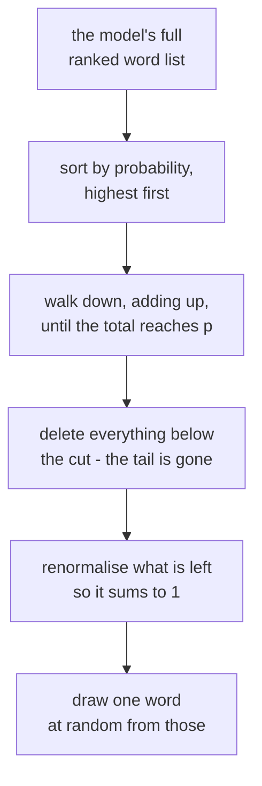

# *The Curious Case of Neural Text Degeneration* — why the most likely word is the wrong word

## One-line answer

`top_p` exists because of a 2019 finding that reads like a paradox — **always choosing the most
likely next word produces text no human would write** — and the fix, cutting off the tail of the
probability list instead of reshaping it, is the dial you turned in
[part 4.2](../parts/04-sampling-the-dial/4.2-turning-the-dial.md).

---

## The story

A team has a language model that is, by every measure they have, good.

They measure it the way everyone measures these things: they show it real text and check how
surprised it is. A good model is unsurprised by real sentences — it assigns them high probability.
This model is excellent by that standard. It has learned English.

Then they ask it to write something. The obvious way: at each step, take the word the model thinks
is most likely, append it, repeat. If the model is good at judging likelihood, and you always take
its best judgement, you should get its best writing.

You get this:

> *…the study was published in the journal Nature. The study was published in the journal Nature.
> The study was published in the journal Nature.*

Not a bug. Not an under-trained model. The **better** the model gets, the more confidently it does
this. And it is not limited to greedy choices: beam search, which considers many candidate
continuations and keeps the highest-scoring overall sequence, does it too — sometimes more.

So the team tries the opposite. Instead of always taking the most likely word, draw randomly in
proportion to the probabilities — genuinely sample from what the model believes. The repetition
vanishes. In its place: text that wanders, contradicts itself, and occasionally produces a word
that has no business being there at all.

Both failures come from the same model, on the same day, with the same weights. The model is not
the problem. **The way the text is being pulled out of it is the problem** — and that is what the
paper is about.

---

## The idea in plain language

Two terms first, because the whole argument lives in the gap between them.

**Decoding** is the procedure that turns a model's opinions into actual text. The model gives you a
probability for every possible next word; decoding is the rule you use to choose one. It is a
separate thing from the model, and you can swap it without retraining anything.

**Likelihood-maximising decoding** means: at each step, take the most probable option. Greedy
decoding does this one word at a time; beam search does it across whole sequences. Both are trying
to produce the *most probable text*.

The paper's central observation is that **the most probable text is not human-like text** — and it
puts a number on why. Human writing does not stay in the high-probability zone. Real sentences are
full of moments where the writer chose something a model would have rated unlikely. Text that never
does this reads as flat and, eventually, loops.

Now the other failure. If maximising likelihood is wrong, why not just sample from the distribution
honestly? Because of the **tail**. A model spreads a small amount of probability across an enormous
number of implausible words. Each one is individually near-impossible. Collectively they can hold a
meaningful share of the total, so if you keep sampling, you will eventually draw one — and a single
absurd word derails everything that follows, because the model now conditions on it.

The paper's fix is **nucleus sampling**, which is what `top_p` is:

> Sort the words by probability. Walk down the list adding them up until the total reaches `p`. Keep
> exactly those words, throw the rest away entirely, and sample from what remains.

The important word is **exactly**. The size of the kept set is not fixed — it changes at every step.
Where the model is confident, a handful of words reach `p` and the choice is narrow. Where the model
is genuinely uncertain, it takes many words to reach `p` and the choice stays wide. **The truncation
adapts to the model's confidence**, which is precisely what a fixed cutoff cannot do.

That last point is the contrast with `top_k`, which keeps a fixed number of words no matter what.
Ten words is far too many when the model is nearly certain, and far too few when it is genuinely
torn.

---

## Why Sutra needs it

[Part 4.1](../parts/04-sampling-the-dial/4.1-the-probability-list.md) showed you that a model emits a
ranked list of candidate next tokens. [Part 4.2](../parts/04-sampling-the-dial/4.2-turning-the-dial.md)
had you turn `temperature`, `top_p` and `top_k`, and made the point that they are routinely confused
because they *look* like three ways to do one thing.

They are not, and this paper is the reason:

- **`temperature` reshapes** the whole list — it makes underdogs more or less likely, but every word
  keeps a nonzero chance. The tail is still there.
- **`top_p` deletes** the tail before anything is drawn, and how much it deletes depends on the
  step.

You cannot get nucleus sampling's behaviour by turning temperature, at any setting. Turning
temperature down to suppress the tail also flattens the differences among the good candidates and
walks you back toward greedy — which is the repetition failure. That trade-off is exactly what the
paper is arguing about, and it is why both dials exist.

This is not academic for Sutra. From **Day 3** your hand-rolled loop asks a model to choose a tool,
and a loop that repeats itself is not merely dull, it is an agent stuck in a cycle burning quota. The
step budget you build in [Day 3's containment part](../../day-03-loop-hand-rolled/parts/05-containment/5.1-the-step-budget.md)
is the blunt guard; understanding *why* models loop is the sharp one. On **Day 79** the eval work
has to decide which sampling settings a test runs under, and "it passed at `top_p=0.9` and failed at
`1.0`" is a sentence you need to be able to interpret.

---

## The mechanism

Nucleus sampling is three steps, and the third is the one everyone forgets.

Take a step where the model's ranked opinion is:

| Word | Probability | Running total |
| --- | --- | --- |
| `client` | 0.55 | 0.55 |
| `team` | 0.20 | 0.75 |
| `manager` | 0.15 | **0.90** ← `top_p = 0.9` reached here |
| `timeline` | 0.06 | 0.96 |
| `backlog` | 0.03 | 0.99 |
| …400 more words | 0.01 total | 1.00 |

With `top_p = 0.9`, the kept set is the first **three** words. Everything below is deleted — not
made less likely, *deleted* — and the three survivors are renormalised so their probabilities sum to
1 again. That renormalisation is the forgotten third step, and without it you are sampling from a
distribution that does not add up.

Now consider a different step, where the model is genuinely unsure:

| Word | Probability | Running total |
| --- | --- | --- |
| `and` | 0.12 | 0.12 |
| `but` | 0.11 | 0.23 |
| `so` | 0.10 | 0.33 |
| …and eleven more before 0.9 is reached | | **0.90** |

Same `top_p = 0.9`. The kept set is now **fourteen** words. Nobody changed a setting — the
distribution changed, and the truncation followed it.



Contrast the two failures this sits between:

| Decoding rule | What it does | How it fails |
| --- | --- | --- |
| **greedy / beam** | always the top of the list | repetition loops; flat, inhuman text |
| **pure sampling** | draw from the full list | the tail eventually fires; incoherence |
| **`top_k`** | keep a fixed count | too wide when confident, too narrow when unsure |
| **nucleus (`top_p`)** | keep a variable count reaching mass `p` | tracks the model's own confidence |

---

## The paper in one demo

Two files. A tiny bigram model — small enough that you can see the whole distribution — decoded
three ways, with a switch.

```text
lab/papers/text-degeneration/
├── model.py   a bigram model and the nucleus truncation
└── run.py     decode, score the repetition, and the switch
```

**Line by line:** no model call and no network. Degeneration is a property of the *decoding rule*,
not of any particular model, so it reproduces on a bigram model built from five sentences — which
is exactly what makes it demonstrable at a request budget of **zero**.

```python
"""A tiny bigram language model - just enough of a next-word distribution to decode from."""

import random
from collections import Counter, defaultdict

CORPUS = """
the meeting starts at nine and the team reviews the backlog
the team reviews the numbers and the manager asks about the backlog
the manager asks about the numbers and the team writes a summary
the summary goes to the client and the client asks about the timeline
the timeline slips and the manager writes a note to the client
"""


def train(text: str) -> dict[str, Counter[str]]:
    """Count which word follows which. The entire model."""
    words = text.split()
    table: dict[str, Counter[str]] = defaultdict(Counter)
    for current, following in zip(words, words[1:]):
        table[current][following] += 1
    return table


def distribution(table: dict[str, Counter[str]], word: str) -> list[tuple[str, float]]:
    """The next-word probabilities after `word`, highest first."""
    counts = table.get(word)
    if not counts:
        return []
    total = sum(counts.values())
    ranked = sorted(counts.items(), key=lambda kv: (-kv[1], kv[0]))
    return [(w, c / total) for w, c in ranked]


def nucleus(ranked: list[tuple[str, float]], top_p: float) -> list[tuple[str, float]]:
    """Keep the smallest set of words whose probabilities sum to at least top_p. Drop the tail."""
    kept: list[tuple[str, float]] = []
    running = 0.0
    for word, prob in ranked:
        kept.append((word, prob))
        running += prob
        if running >= top_p:
            break
    return kept


def pick(ranked: list[tuple[str, float]], rng: random.Random) -> str:
    """Draw one word, in proportion to the probabilities given."""
    total = sum(p for _, p in ranked)
    roll = rng.uniform(0, total)
    running = 0.0
    for word, prob in ranked:
        running += prob
        if roll <= running:
            return word
    return ranked[-1][0]
```

**Line by line:**

- `CORPUS` — five sentences with **deliberate overlap**. `the client`, `the team`, `the manager` all
  recur, which is what gives some words a dominant continuation and makes greedy decoding lock on.
  A corpus of five unrelated sentences would not degenerate, and the demo would show nothing.
- `train` — a bigram model: for each word, count what came next. That is the complete model. It is
  the smallest thing that still has a genuine next-word distribution, and degeneration needs nothing
  more than that.
- `zip(words, words[1:])` — each word paired with its successor, the same adjacent-pairs idiom used
  by [7.1's BPE](01-subword-units.md).
- `sorted(counts.items(), key=lambda kv: (-kv[1], kv[0]))` — descending by count, with the **word
  itself as tie-break**. Without the tie-break, equally-frequent continuations would be ordered by
  dictionary insertion and the demo would not reproduce run to run. Reproducibility is the whole
  value of a demo like this.
- `distribution` returns probabilities, not counts — dividing by `total` is what turns a tally into
  something `top_p` can accumulate toward.
- `nucleus(ranked, top_p)` — **the paper, in six lines.** Walk the sorted list, keep adding, stop
  the moment the running total reaches `p`.
- `kept.append(...)` **before** the `running >= top_p` check — the word that *crosses* the threshold
  is kept, not dropped. Checking first would keep the smallest set summing to *less* than `p`, and at
  a step where the top word already has probability 0.95 that set would be empty. This off-by-one is
  the single most common way a hand-written nucleus implementation goes wrong.
- `pick` — proportional draw. `total = sum(p for _, p in ranked)` is the **renormalisation**: after
  truncation the kept probabilities no longer sum to 1, and rolling against their actual total is
  how you correct for that without rebuilding the list.
- `rng: random.Random` passed in rather than using the module-level `random` — so the run is seeded
  and reproducible, and so two decoding modes can be compared from the same starting state.

```python
"""Likelihood-maximising decoding degenerates. Truncating the tail is the fix."""

import random

from model import CORPUS, distribution, nucleus, pick, train

NUCLEUS = True
TOP_P = 0.9
SEED_WORD = "the"
LENGTH = 24
SEED = 7


def decode(table, mode: str, top_p: float, rng: random.Random) -> list[str]:
    out = [SEED_WORD]
    for _ in range(LENGTH):
        ranked = distribution(table, out[-1])
        if not ranked:
            break
        if mode == "greedy":
            out.append(ranked[0][0])
        elif mode == "pure":
            out.append(pick(ranked, rng))
        else:
            out.append(pick(nucleus(ranked, top_p), rng))
    return out


def repetition(words: list[str]) -> float:
    """Share of 4-word windows that have appeared before - the paper's degeneration symptom."""
    windows = [tuple(words[i : i + 4]) for i in range(len(words) - 3)]
    if not windows:
        return 0.0
    return 1 - len(set(windows)) / len(windows)


def main() -> None:
    table = train(CORPUS)
    mode = "nucleus" if NUCLEUS else "greedy"
    rng = random.Random(SEED)
    words = decode(table, mode, TOP_P, rng)
    print(f"NUCLEUS = {NUCLEUS}   mode = {mode}" + (f"   top_p = {TOP_P}" if NUCLEUS else ""))
    print(" ".join(words))
    print(f"repeated 4-word windows: {repetition(words):.0%}")


if __name__ == "__main__":
    main()
```

**Line by line:**

- `NUCLEUS = True` — **the ablation switch.** `False` gives greedy decoding, which is the exact
  procedure the paper is arguing against.
- `TOP_P = 0.9` — the value the paper's experiments land on, and still the common production default
  seven years later.
- `SEED = 7` — a fixed seed, so the sampled runs are reproducible and the comparison is stable. The
  greedy run needs no seed at all, which is itself a hint about what is wrong with it.
- `if mode == "greedy": out.append(ranked[0][0])` — always the top of the list. One line, no
  randomness, and it is enough to produce the failure.
- `out.append(pick(nucleus(ranked, top_p), rng))` — truncate **then** sample. The order is the whole
  method; sampling then truncating is not a thing.
- `repetition(words)` — the **measurement**, and the reason this is evidence rather than a vibe. It
  counts overlapping 4-word windows and reports what share are duplicates. The paper uses
  repetition metrics of this family; four is small enough to catch a short loop and large enough not
  to fire on ordinary English.
- `1 - len(set(windows)) / len(windows)` — distinct windows over total windows, subtracted from one.
  Text that never repeats a 4-word run scores 0%.
- `LENGTH = 24` — long enough for a loop to establish itself. At `LENGTH = 6` greedy decoding has
  barely started repeating and the numbers do not separate.

Run it:

```bash
cd lab/papers/text-degeneration && uv run python run.py
```

**Line by line:** `uv run` for the pinned interpreter, and `cd` first so `run.py` can import `model`
as a sibling.

```text
NUCLEUS = True   mode = nucleus   top_p = 0.9
the manager asks about the team reviews the team reviews the client and the timeline slips and the meeting starts at nine and the manager
repeated 4-word windows: 5%
```

Now the ablation — `NUCLEUS = False`, nothing else changed:

```text
NUCLEUS = False   mode = greedy
the client and the client and the client and the client and the client and the client and the client and the client and the
repeated 4-word windows: 86%
```

**That is the paper's headline, reproduced on a five-sentence bigram model.** Greedy decoding is
doing exactly what it was told — at every step it takes the most probable next word — and the result
is a loop that would run forever. `the` is most often followed by `client`; `client` is most often
followed by `and`; `and` is most often followed by `the`. Three locally-optimal choices form a cycle,
and nothing in "always take the best word" can escape it.

The measurement makes the comparison hard to argue with: **86% against 5%**, from one changed line.

For the third data point the paper discusses, run pure sampling — no truncation at all:

```text
    pure: the manager asks about the backlog the client asks about the client and the timeline slips and the summary the team writes a summary goes
          repeated 4-word windows: 0%
```

And here the demo honestly under-sells the paper, which is worth saying plainly rather than hiding:
pure sampling looks *fine* here. It should not, and on a real model it does not. The reason is that
this bigram model has **almost no tail** — after any given word there are only two or three
possible continuations, all of them plausible, so "sample from everything" and "sample from the
nucleus" are nearly the same instruction. A real model has tens of thousands of candidates at every
step, and it is that long tail of near-zero-probability words that pure sampling eventually draws
from. Reproducing *that* half of the paper needs a real model; reproducing the degeneration half
needs five sentences.

---

## When it breaks

**1 — The claim is about open-ended generation, not about every task.** The paper's argument
concerns text continuation, where there are many acceptable outputs. It does **not** say
likelihood-maximising decoding is always wrong. For a task with one correct answer — extract this
field, classify this ticket, emit this JSON — you generally *want* the most likely token, and
`top_p = 1.0` with `temperature = 0` is the right setting. Applying "nucleus sampling is better" to
a structured-output call is a misreading, and it is a common one.

This bites Sutra directly on **Day 4**, where the model emits a tool call that must parse. Creative
variety in a JSON payload is not a feature.

**2 — It does not eliminate repetition, it reduces it.** Nucleus sampling makes loops much less
likely; it does not make them impossible, because the loop-forming words are usually high
probability and therefore *inside* the nucleus. Production systems still carry repetition penalties
and stop conditions on top. If you have ever watched an agent restate the same plan three times, you
have seen `top_p` failing to save you — which is why
[Day 3's step budget](../../day-03-loop-hand-rolled/parts/05-containment/5.1-the-step-budget.md)
exists as a separate guard.

**3 — The demo's own edge: turn `TOP_P` down and the failure comes back.** Set `TOP_P = 0.4`:

```text
NUCLEUS = True   mode = nucleus   top_p = 0.4
the client and the client and the client and the manager asks about the team reviews the manager asks about the team reviews the client
repeated 4-word windows: 41%
```

Repetition goes from **5% to 41%** without touching the model, the seed or the corpus. Look at the
text and you can see the mechanism partly reasserting itself: the run opens with three cycles of
`the client and` before an alternative finally gets drawn.

The reason is structural. At any step where the top word already holds 0.4 of the mass, the nucleus
is a set of **one**, and "sample from a set of one" is greedy decoding wearing a different name. The
lower `p` goes, the more steps collapse that way, and the failure returns in proportion.

**`top_p` is a cutoff, not a repetition switch.** Turning it down does not make output "more
focused" — it walks you back toward the exact behaviour the parameter was invented to prevent.
Anyone reaching for `top_p = 0.1` for tighter output is heading here.

For the other end, `TOP_P = 1.0` keeps everything and is identical to pure sampling — which is worth
confirming for yourself, because it is the definition rather than a coincidence:

```text
NUCLEUS = True   mode = nucleus   top_p = 1.0
the manager asks about the backlog the client asks about the client and the timeline slips and the summary the team writes a summary goes
repeated 4-word windows: 0%
```

---

## In production

**What survived: nucleus sampling itself, essentially unchanged and now ubiquitous.**

The `top_p` parameter you set in [part 4.2](../parts/04-sampling-the-dial/4.2-turning-the-dial.md) is this
paper's method, under this paper's name, seven years later. Every provider in
[Day 1's three free doors](../../day-01-bootstrap-and-map/parts/03-keys-and-env/3.1-the-three-free-doors.md)
exposes it. The default value in most SDKs sits between 0.9 and 1.0, which is the range the paper's
experiments pointed at. Very few research contributions reach production this literally.

**What did not survive: beam search, for this purpose.**

In 2019 beam search was the standard way to generate text. The paper is one of the main reasons it
is no longer used for open-ended generation from large language models — its whole point is to find
high-likelihood sequences, and that is now understood to be the wrong target. Beam search remains
alive in machine translation and speech recognition, where there genuinely is a best answer to find.

Also mostly gone: the paper's own preferred evaluation. It leans on perplexity comparisons and
human judgements of a kind that the field has largely replaced with task-based evals — the sort you
will build from **Day 79**.

**What is new since:** the practical stack is now a *combination*. Production systems compose
`top_p` with temperature, frequency and presence penalties, `min_p`, and repetition detection.
Nucleus sampling won the argument about tail truncation and then became one component of a
decoding configuration rather than the whole of it.

**What changes at scale.** Two things you will actually hit:

- **Sampling settings are part of your eval's identity.** The same prompt at `top_p = 1.0` and
  `top_p = 0.9` is, for evaluation purposes, two different systems. An eval suite that does not pin
  its sampling parameters will produce flaky results and nobody will know why. Day 79 pins them.
- **`temperature = 0` is not "deterministic".** It removes the sampling randomness, and it is still
  not reproducible across time or hardware — which
  [part 4.3](../parts/04-sampling-the-dial/4.3-stability-is-not-reproducibility.md) already warned you
  about. This paper explains the first half of that sentence; batching and floating-point
  non-associativity explain the second.

**The review comment a senior engineer leaves:** *"why is `top_p` set to 0.7 here?"* The honest
answers are "the docs example used it" and "someone was trying to make output more focused" — both
of which are, per the demo's third failure above, moving toward the degeneration the parameter was
designed to prevent. The good answer names the task: open-ended text wants a high `top_p`;
structured output wants the tail gone by other means.

**The interview question:** *"what is the difference between temperature and top_p?"* The weak
answer is "both control randomness". The strong answer: **temperature reshapes the whole
distribution and every token keeps a nonzero chance; `top_p` deletes the tail outright, and how much
it deletes changes at every step according to the model's confidence.** Then the sentence that shows
you have shipped: *and you cannot get one from the other — turning temperature down to kill the tail
also flattens the good candidates and walks you back toward the repetition loop.*

---

## Check yourself

Run the ablation, then set `TOP_P` to `0.4` and to `1.0` and watch the repetition score move:

```bash
cd lab/papers/text-degeneration && uv run python run.py
```

Then, without scrolling up, answer out loud:

1. **What did this paper actually claim?** State the paradox in one sentence — what is wrong with
   always choosing the most likely word?
2. **What do we do differently now?** Name the decoding method this paper largely retired, and say
   where that method is still correct.
3. `top_p = 0.4` pushed repetition from 5% back up to 41%. Say in one sentence why that follows from
   the definition of nucleus sampling rather than being a bug in the demo.
