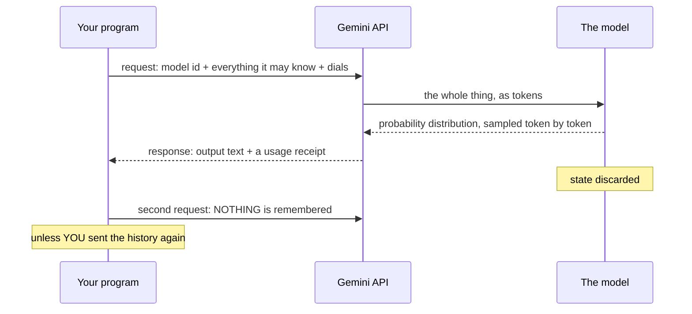

# 1.1 — The call that forgets you: what one model request actually is

## One-line answer

A model request is a **single, self-contained transaction** — you send everything the model is
allowed to know, it sends back words, and then it discards every trace of you — which means every
appearance of memory in every chat product you have ever used is somebody re-sending the transcript.

---

## The story

There is a consultant who has read almost everything ever written. You can book them by the hour and
they are genuinely brilliant. Three things about the arrangement are unusual, and every one of them
will matter to you for the rest of this project.

**The first is how they charge.** Not by the hour, not by the job — by the chunk of text. Every
chunk you say to them, and every chunk they say back. Talk more, pay more. Ask them to re-read a
long document, pay for the whole document again.

**The second is the door.** The meeting room has a door, and something happens when it closes: the
consultant forgets the meeting entirely. Not "gets a bit hazy on the details." Forgets that you
exist. You could walk back in ten seconds later and they would greet you as a stranger.

**The third only becomes visible if you run the same meeting twice.** Ask them the same question on
Monday and Tuesday and you may get two different answers — both good, both defensible, just
different. They are not being inconsistent. Before they speak, they quietly weigh several good
phrasings against each other and pick one, and the picking has a little randomness in it that you
are allowed to adjust.

Now here is the part that surprises people. You have almost certainly used a chat product that
clearly remembers what you said earlier in the conversation. Given the door, how?

The answer is that there is a clerk outside the room. Every time you send a message, the clerk walks
in with a folder containing **the entire conversation so far** and reads it aloud to the consultant
before your new question. That is it. That is the whole trick. The consultant's memory is a filing
cabinet in the hallway, maintained by somebody else, and it is refilled from scratch at the start of
every single meeting.

**You are about to become that clerk.** Not metaphorically — the folder is a Python list, and by the
end of this day you will have built it with your own hands and watched what happens when you forget
to bring it.

---

## The idea in plain language

A **large language model** — an LLM — is a program that takes text and produces the text most likely
to follow it. That is the entire job description. It is not looking anything up, it is not consulting
a database, and it has no awareness of anything beyond the text it was just handed.

You reach it through an **API** — an Application Programming Interface, which is just a formal way of
saying "an address your program can send data to, and a shape the answer comes back in." You send an
HTTP request over the internet; a reply comes back. That reply is what you pay for.

Three properties of that transaction define everything in this curriculum.

### It is metered in tokens, not words

A **token** is a chunk of text, usually a few characters — sometimes a whole word, often a fragment.
Models do not read words; they read tokens. Every quota you have, every size limit you will hit, and
every bill anyone has ever paid for this technology is counted in them.
[2.1](../02-tokens-the-meter/2.1-what-a-token-is.md) makes this concrete with real arithmetic.

### It is a single transaction, and the transaction ends

You send a request. You get a response. **The model retains nothing.** The next request starts from
absolutely nothing, and if you want it to know what happened before, you send that too — again, and
in full, and paying for it again.

There is one modern wrinkle here that most explanations of this are now out of date on, and this
project is going to be honest about it from the first day: **the provider will now optionally hold
the transcript for you on their side.** That does not make the model remember — it makes *their*
clerk do the job instead of yours. Who holds the folder turns out to be a real engineering decision
with real consequences, and it is the whole subject of section 3
([3.3](../03-context-and-memory/3.3-the-server-will-remember.md)).

### The last step is a weighted dice roll

The model does not decide on one next token. It produces a **probability distribution** — a score
for every token it could possibly say next. "blue" might score 62%, "red" 15%, "azure" 4%, and so on
across tens of thousands of candidates. Something then has to *pick* one, and that picking step is
called **sampling**. It has dials on it. Section 4 turns them and watches.

> 💡 **The mental model, and it is worth keeping for ninety-five more days:** the model is a
> brilliant consultant with total amnesia. **An agent is the clerk who maintains the dossier** —
> deciding what goes in the folder, what gets summarised out to save room, and what the next meeting
> actually needs to see. Every agent framework in existence, including the one this project adopts
> on Day 5, is an elaborate and well-organised clerk.

---

## Why Sutra needs it

Every confusing bug you will hit for the next ninety-five days is one of these three properties
wearing a costume.

- **Day 3 (AG-03)** hand-rolls the think→act→observe loop in plain Python. That loop is a `for`
  statement wrapped around a list that grows. The list exists *only* because of the amnesia — if the
  model remembered, there would be no loop to write, and Day 3 would not exist.
- **Day 4 (AG-04)** sends a tool result back to the model. It has to be appended to the history,
  because the model has no idea it asked for a tool a moment ago.
- **Days 19–20 (AG-08..10)** are context engineering: the history grows every single turn, the
  window does not, and something has to decide what gets dropped. That problem is a direct
  consequence of "send everything, every time."
- **Day 24 (OPS-07, AG-11)** budgets in tokens per provider. You cannot budget a unit you cannot
  explain, and [2.3](../02-tokens-the-meter/2.3-the-thinking-tax.md) shows you a number on your own
  screen that is larger than you expect.
- **Day 79's evals (AG-26..28)** score behaviour rather than exact strings, and the reason is the
  dice roll — [4.3](../04-sampling-the-dial/4.3-stability-is-not-reproducibility.md) explains why
  string equality is the wrong assertion for a system with sampling in it.

---

## The mechanism

No code yet — [1.4](1.4-the-first-interaction.md) writes the first real call, once
[1.2](1.2-pinning-before-installing.md) has installed the SDK and [1.3](1.3-listed-is-not-callable.md)
has proved which model your key can actually reach. What you can absorb right now is the *shape* of
the transaction, because everything else on this day is a variation on it.



Read the diagram twice, and pay attention to the note on the right. The gap between the two requests
is the entire subject of section 3, and the arrow that is *missing* — any arrow at all from the first
exchange to the second — is why agent frameworks exist.

Three things travel in that request, and it is worth naming them now because you will meet all three
as named parameters within a few pages:

| What you send | The Interactions API calls it | Where it is taught |
| --- | --- | --- |
| Which model | `model` | [1.3](1.3-listed-is-not-callable.md) |
| Everything it may know | `input` | [1.4](1.4-the-first-interaction.md), then [3.2](../03-context-and-memory/3.2-history-is-a-list-you-own.md) |
| How to pick words | `generation_config` | [4.2](../04-sampling-the-dial/4.2-turning-the-dial.md) |

And two things come back: the words, and a **receipt** telling you exactly what you were charged.
Most people never read the receipt. [2.2](../02-tokens-the-meter/2.2-reading-the-receipt.md) reads
it, and [2.3](../02-tokens-the-meter/2.3-the-thinking-tax.md) finds something in it that is not
where you would expect.

---

## When it breaks

The characteristic failure of this idea is not a traceback. It is a person confidently reasoning
from a false premise, and it sounds like this:

> *"The model must be broken — I told it my name two calls ago and now it says it doesn't know."*

Nothing is broken. The two calls were two separate meetings with an amnesiac, and nobody carried the
folder. You will produce this exact bug yourself in
[3.2](../03-context-and-memory/3.2-history-is-a-list-you-own.md), deliberately, and watch it resolve
the moment you re-send the history.

The version that actually costs people money looks like this, and it is worth recognising before you
write it:

```text
turn 1:  send 400 tokens   ->  charged 400
turn 2:  send 400 + 350    ->  charged 750
turn 3:  send 750 + 380    ->  charged 1,130
turn 4:  send 1,130 + 410  ->  charged 1,540
...
turn 20: send ~14,000      ->  charged 14,000
```

**What is happening.** Because every turn re-sends the whole conversation, the cost of turn *n* is
proportional to everything said in turns 1 through *n*. Total tokens processed across a conversation
grows with the **square** of its length, not linearly. A chat that feels twice as long costs roughly
four times as much. On a free tier that is not a bill — it is your daily quota disappearing in an
afternoon, and Day 24 is where you learn to see it coming.

There is no fix on this page, because it is not a defect. It is the shape of the thing. The
*management* of it — summarising old turns, dropping what no longer matters, keeping a running
digest — is Phase 3, and it is one of the genuinely hard parts of this field.

---

## In production

**The word "stateless" needs care now, and most explanations have not caught up.** For years the
correct professional sentence was "the LLM API is stateless." As of the lookups recorded in this
day's hub §8, that sentence is no longer precisely true of Gemini: the Interactions API will hold
your conversation server-side and let you continue it with an id. What remains exactly true, and is
the sentence to actually keep, is: **the model has no memory; state is a service, and someone must
own it.** Either you own it or the provider does, and that is a choice with consequences rather than
a fact of nature. [3.3](../03-context-and-memory/3.3-the-server-will-remember.md) is where you make
the choice deliberately.

**What changes at scale is that the folder becomes the product.** In a toy script the history is a
list you append to. In a real system it is a subsystem with a retention policy, a size cap, a
summarisation strategy, a privacy boundary and an audit trail — because the folder now contains
customer data, it is being re-sent over the network dozens of times per conversation, and somebody
in compliance is going to ask where it lives. Sutra meets this on Day 8 (sessions), Days 19–20
(context engineering) and Days 46–52 (memory), and the reason it takes that many days is that "just
keep the transcript" stops working almost immediately.

**The failure that only shows up with real traffic** is the one nobody designs for: conversations
that never end. Your test conversations are six turns long because you are testing. Real users open
a thread and keep it open for weeks. The history grows without bound, every turn costs more than the
last, latency climbs because the model is reading more, and eventually a request exceeds the context
window and the whole conversation stops working — for that one user, at their turn 400, in a way
that never reproduces on your machine. **A context window is not a limit you approach; it is a wall
some fraction of your users will hit, and the interesting engineering is what happens on the turn
before.**

**The review comment a senior engineer leaves** on a pull request that builds a chat feature by
appending to a list: *"What's the eviction policy? This list only grows. What happens at turn 200 —
and I don't mean 'it gets slower', I mean which specific messages do we drop and who decided that?
Also: we're re-sending the customer's whole conversation to a third party on every keystroke-ish
turn. Has anyone written that down where legal can see it?"* Both halves are the same observation
from different angles: **re-sending everything is not free, in money or in exposure.**

**The interview question.** *"Does an LLM remember previous messages?"* The weak answer is "no, it's
stateless." It is weak because it is now incomplete and slightly out of date. The strong answer
separates the layers: **the model itself retains nothing between requests — that has not changed and
will not.** What has changed is that providers now offer server-side conversation state as a
convenience, so a request can reference a stored prior turn instead of shipping the transcript.
Either way somebody is re-assembling context before inference; the only question is whether it is
your code or theirs, and you should have an opinion about which, because you can only debug, budget
and evaluate the context you can actually see.

---

## Check yourself

Nothing to run yet — the SDK is not installed until [1.2](1.2-pinning-before-installing.md). Instead,
open any chat assistant you use and do this deliberately:

```text
1. Tell it a specific fact about yourself.
2. Ask it something unrelated.
3. Ask it to repeat the fact from step 1.
```

It will succeed. Now answer this: **nothing in the model remembered that fact — so what did?** Name
the component and say where it physically lives.

**Answer out loud, without scrolling up:**

> Explain, without using the words "stateless" or "context," why a chat product appears to remember
> your conversation. Then say why the cost of a twenty-turn conversation is far more than twenty
> times the cost of one turn — and name the one property that causes both effects.

---

**Next:** [1.2 — Pinning before installing](1.2-pinning-before-installing.md)
