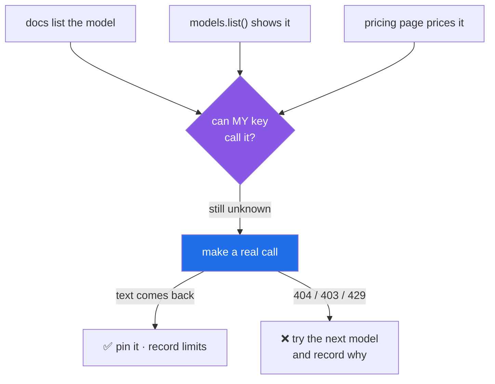

# 1.3 — Listed is not callable: choosing a free model with a live call

## One-line answer

A model appearing in the documentation, in the pricing page, or in your own `models.list()` output
is **not evidence that your key can call it** — only a live call is — and this is the single most
reliable way to lose an evening at the start of an LLM project.

---

## The story

Someone starts a project. They read the provider's model page, pick the model it recommends, write
it into their code, and run it. They get an error saying the model is not available.

Their first assumption is a typo. It is not a typo. Their second assumption is that the key is
broken, so they generate a new key. Same error. Their third assumption is that the model page is
wrong, so they ask the library to list the models their account can see — and the model is **right
there in the list**, spelled exactly as they typed it.

At this point the situation is genuinely maddening, because three independent sources agree the
model exists and the one thing that matters disagrees. They start reading forum posts. They find
people using that model successfully and saying it works fine. They begin to suspect their computer.

The actual explanation is mundane and takes one sentence: **that model had been closed to new
accounts, and their account was new.** The documentation described the model, which was accurate.
The listing endpoint described the model catalogue, which was accurate. Neither of them described
*this account's permission to invoke it*, because that was never what they were reporting.

Nobody lied. Three sources answered a slightly different question than the one being asked, and the
person spent an evening on it.

This is not hypothetical for this project. It happened here, on 2026-08-13, and it is in the record:
`docs/CHANGELOG_PLAN.md` carries the repin away from `gemini-2.5-flash` after a live call returned
404 while the docs and `models.list()` both still showed it. The scar became a rule.

---

## The idea in plain language

Four different systems can tell you about a model, and they are answering four different questions:

| Source | The question it actually answers |
| --- | --- |
| The docs model page | "What models does this company make?" |
| The pricing page | "What do they cost, for accounts that can use them?" |
| `models.list()` on your client | "What is in the catalogue this key can *see*?" |
| **An actual call that returns text** | **"Can this key invoke this model, right now?"** |

Only the last one is the question you care about, and only the last one costs a request.

The gap between them is real and has ordinary causes. Providers close old models to new signups
before removing them. They roll out new models by region and by tier. Free-tier access to a model
frequently differs from paid access to the same model. A catalogue is a marketing artefact and a
permission check is an authorisation artefact, and no company has ever been very good at keeping the
two synchronised.

There is a second trap sitting right next to this one, and it looks helpful.

### Floating aliases

Some providers publish **aliases** — names like `gemini-flash-latest` that resolve to whatever the
current model is. The official ADK documentation uses exactly this alias in its examples. It is
convenient and it is the wrong choice for this project, for the same reason
[1.2](1.2-pinning-before-installing.md) pins package versions: **a name that resolves to a different
thing next month is not a pin, it is a floating dependency wearing a model's clothes.** Your prompts
were tuned against one model, your evals were scored against one model, and your quota arithmetic
assumed one model's limits. An alias can change all three overnight with no commit in your history.

The plan says it directly for Day 5: pin the model explicitly, never rely on the framework's default.
The same rule applies today, one day earlier than the framework arrives.

### What "free" means here

Sutra is a zero-budget project (Principle 15). "Free" is not a discount — it is a hard constraint
that shapes the engineering, and Addendum 02 is the document that wins on model choice. In practice:

- **Free-tier limits are per *project*, not per key** — generating a second key does not double
  anything. This is stated on the rate-limits documentation and it disappoints everyone once.
- **The numbers are not published in a table.** The rate-limits page directs you to your own AI
  Studio view, because free limits vary by account. **Your numbers live in your dashboard**, and
  writing them down is part of today's checklist.
- **Requests-per-day quotas reset at midnight Pacific time.** Not on a rolling window from your
  first call — at a fixed wall-clock moment in a timezone that is probably not yours. Worth knowing
  before you conclude your key is broken at 9pm.

---

## Why Sutra needs it

- **Day 5 (ADK-01, ADK-02, ADK-73)** creates the first ADK agent and pins its model explicitly. The
  plan attaches a warning to that day — since ADK 2.2 the framework's own default moved to a preview
  model with tighter free quota — and the habit that protects you is the one you build here.
- **Day 9 (ADK-08, ADK-09)** runs the same agent across Gemini, Groq, OpenRouter `:free` and Ollama
  and benchmarks them. Every one of those four needs this same "listed ≠ callable" check, and
  OpenRouter adds its own version of the trap: a model string missing the `:free` suffix silently
  bills a paid model.
- **Day 70 (the quota router)** routes work between providers by *remaining quota*, which is only
  possible if you know which models each key can genuinely reach.
- **ADR-0005** assigned each free provider a named role. That decision is only worth anything if the
  models behind those roles are ones your keys can actually call.

---

## The mechanism

Two steps, and the second is the one that counts.

**Step 1 — see the catalogue.** This is cheap, it is metadata rather than inference, and it does not
spend your inference quota:

```python
from google import genai

from sutra.config import load_env

load_env()
client = genai.Client()

for m in client.models.list():
    print(m.name)
```

**Line by line:**

- `from google import genai` — the import path is `google.genai`, from the `google-genai` package
  pinned in [1.2](1.2-pinning-before-installing.md). Not `google.generativeai`, which is a different
  and older SDK.
- `from sutra.config import load_env` — the loader **you wrote on Day 1**
  ([3.3](../../../day-01-bootstrap-and-map/parts/03-keys-and-env/3.3-loading-keys-failing-loudly.md)).
  It copies `KEY=VALUE` lines from `.env` into the process environment without overwriting real
  environment variables. Nothing is being re-taught here; you are using your own code for the first
  time.
- `load_env()` — must run **before** `genai.Client()`. The client reads `GOOGLE_API_KEY` from the
  environment at construction time, so a loader called afterwards is a loader called too late. This
  ordering is a real bug people write.
- `genai.Client()` — no arguments. The key is **never** passed as a literal in code; it comes from
  the environment, which is the whole point of Day 1's `.env` discipline (Principle 9). A
  `genai.Client(api_key="AIza...")` in a file is a key in your git history.
- `client.models.list()` — the catalogue endpoint. **This is metadata, not inference**: it tells you
  what exists, spends no token quota, and — as the story above establishes — **proves nothing about
  your ability to call any of it.**
- `m.name` — comes back fully qualified, like `models/gemini-3.7-flash`. The id you pass to a
  request is the part after the slash.

**Step 2 — prove it with a real call.** This is the only step that answers the question:

```python
interaction = client.interactions.create(
    model="gemini-3.7-flash",
    input="Reply with exactly: OK",
    store=False,
)
print(interaction.output_text)
```

**Line by line:**

- `client.interactions.create(...)` — the Interactions API, which is the surface this project teaches
  from (ADR-0006). [1.4](1.4-the-first-interaction.md) unpacks the call properly; here it is being
  used as the cheapest possible probe.
- `model="gemini-3.7-flash"` — **an explicit pin, not `gemini-flash-latest`.** Verified against
  `ai.google.dev/gemini-api/docs/models` on 2026-08-24, where it is the model the current quickstart
  itself uses. Use whatever *your* step 1 listed and your call actually answers.
- `input="Reply with exactly: OK"` — the shortest useful prompt. You are testing authorisation, not
  capability, so do not spend tokens on a real question. Every call today comes out of a free daily
  allowance.
- `store=False` — do not persist this interaction server-side. It is a throwaway probe and there is
  no reason to leave it in the provider's storage. The default is `True`, which is itself worth
  knowing and is the subject of
  [3.3](../03-context-and-memory/3.3-the-server-will-remember.md).
- `interaction.output_text` — the convenience field holding the model's text. If this prints `OK`,
  the question is answered: **this key can call this model.** Nothing before this line was evidence.

**Step 3 — read your own limits and write them down.** Open the AI Studio rate-limit view for your
project. There is no command for this and no public table to copy from; the numbers are specific to
your account. Record the RPM and RPD you see, with today's date, in the `PACKAGES.md` row from the
hub's §11. Day 24 builds budgets on these numbers, and a budget built on a guess is a guess.



---

## When it breaks

**The model that is listed but closed to you** — the exact failure this project hit on 2026-08-13:

```text
google.genai.errors.ClientError: 404 NOT_FOUND. {'error': {'code': 404,
'message': 'models/gemini-2.5-flash is not found for API version v1beta, or is not
supported for generateContent. Call ListModels to see the list of available models
and their supported methods.', 'status': 'NOT_FOUND'}}
```

**What it means, and what it does not.** It reads like the model does not exist. It does exist. The
message even helpfully suggests calling `ListModels` — which, as the story explains, will show you
the model and send you round the loop again. **Read `404` here as "not available *to you*, for this
operation", not "no such thing".** Note also the date now attached to this specific model:
`gemini-2.5-flash` shuts down **2026-10-16**, so this error is going to get more common, not less.

**The smallest fix** is to try the next model on the list and record which one answered. Not to
regenerate your key, which is the instinct and which fixes nothing.

**The key that is absent rather than wrong:**

```text
google.genai.errors.ClientError: 400 INVALID_ARGUMENT. {'error': {'code': 400,
'message': 'API key not valid. Please pass a valid API key.', 'status':
'INVALID_ARGUMENT'}}
```

**What it means.** Usually not a bad key — usually **no key**, because `load_env()` was not called,
or was called after `genai.Client()`, or the `.env` line has quotes around the value that got
included as part of it. Check with the `describe()` helper you wrote on Day 1: it reports presence
and length and never the value itself. A length of zero and a length of thirty-nine are very
different problems.

**The one that means you are alive and spending:**

```text
google.genai.errors.ClientError: 429 RESOURCE_EXHAUSTED. {'error': {'code': 429,
'message': 'You exceeded your current quota, please check your plan and billing
details.', 'status': 'RESOURCE_EXHAUSTED', 'details': [{'@type':
'type.googleapis.com/google.rpc.QuotaFailure', 'violations': [{'quotaMetric':
'generativelanguage.googleapis.com/generate_content_free_tier_requests',
'quotaId': 'GenerateRequestsPerMinutePerProjectPerModel-FreeTier',
'quotaValue': '5'}]}, {'@type': 'type.googleapis.com/google.rpc.RetryInfo',
'retryDelay': '47s'}]}}
```

**What it means.** Your key works, the model is callable, and you have hit the per-minute ceiling.
**Read the two useful facts out of it**: `quotaValue: '5'` is your actual limit — the number the
dashboard would have told you — and `retryDelay: '47s'` is the server telling you exactly how long
to wait. [1.5](1.5-the-only-door-429.md) is entirely about not ignoring that second number, which is
what almost every retry tutorial does.

---

## In production

**What a professional writes instead of a hardcoded model string** is a model id that comes from
configuration, with the pin as its default — so that swapping models during an incident does not
require a code change and a deploy. The string still gets pinned; it just gets pinned somewhere you
can change under pressure. **What they never write is an alias like `gemini-flash-latest` in a
system with evals**, because it silently invalidates every score you have: your regression suite was
measured against a model that no longer exists at that name, and nothing in your repository records
the swap.

**What changes at scale is that model availability becomes an operational signal.** One developer
hitting a 404 is a puzzling evening. A fleet hitting 404s on a model that was deprecated overnight is
an outage, and the correct design is to have already decided what happens next: a documented fallback
model, a health check that calls each configured model periodically and alerts on a change in
reachability, and a deprecation calendar someone actually reads. **`gemini-2.5-flash` shutting down
on 2026-10-16 is a date that belongs in a calendar, not in a surprise.** This is precisely why the
plan puts a freshness check in every phase gate.

**The failure that only appears with real traffic** is the *partial* availability case, and it is
much nastier than a clean 404. A model is reachable from one region and not another, or reachable
for most requests and rate-limited into failure for a subset of tenants, or available on the paid
tier your staging account uses and unavailable on the free tier production runs under. The
integration test passes. A fraction of real requests fail in a way that looks random. **The tell is
an error rate that correlates with something other than load** — geography, tenant, time of day — and
the instinct to develop is to check *whose* key and *which* region before checking your code.

**The review comment a senior engineer leaves:** *"This model id is hardcoded in four files, and one
of them says `gemini-flash-latest`. When Google deprecates this — and they will, they published a
shutdown date for the last one — how many places do we edit and how do we know we got them all? Also
what's our fallback? 'The agent stops working' isn't a fallback."* The point underneath is that
**a model is a vendor dependency with a lifecycle**, and it deserves the same treatment as any other
external dependency: one place to change it, a documented alternative, and a note of when it expires.

**The interview question.** *"How do you decide which model to use?"* Weak answers compare benchmark
scores. A strong answer starts somewhere less glamorous: **verify you can actually call it with the
credentials you will run in production**, because catalogues, docs and pricing pages describe the
vendor's offering rather than your account's permissions. Then check quota shape against your traffic
shape — per-minute limits matter for burst, per-day for volume, and they fail differently. Then
compare quality, on *your* task, with an eval rather than a leaderboard. The detail that marks
experience is mentioning the deprecation calendar unprompted: the question is not only "which model
is best now" but "what happens to my system when this one goes away, and do I know the date?"

---

## Check yourself

Prove reachability rather than assuming it, and write down what you learn:

```bash
uv run python -c "
from google import genai
from sutra.config import load_env
load_env()
c = genai.Client()
names = [m.name for m in c.models.list()]
print(len(names), 'models visible')
print([n for n in names if 'flash' in n][:8])
"
```

Then make one real call to the model you intend to pin and confirm text comes back. **Two different
results, two different meanings** — make sure you can say which is which.

**Answer out loud, without scrolling up:**

> Your `models.list()` shows `gemini-2.5-flash` and your call to it returns 404. Explain, in one
> sentence each, why both of those are correct behaviour and not a bug. Then say what you would put
> in `PACKAGES.md` about it, and why the date on that row matters more than the model name.

---

**Next:** [1.4 — The first interaction](1.4-the-first-interaction.md)
