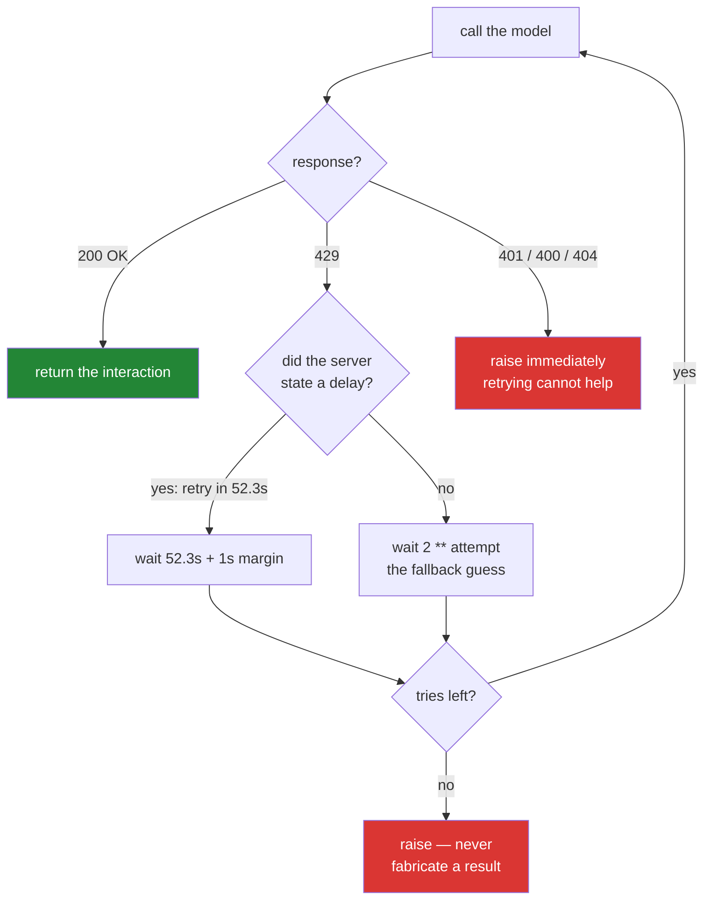

# 1.5 — The only door: 429 handling that listens to the server

## One-line answer

Every model call in this project goes through **one function**, and that function backs off using
**the delay the server stated** rather than a number you invented — then, when it runs out of tries,
it **raises** instead of returning something plausible.

---

## The story

A service starts getting rate-limited by an upstream API at peak. The team adds retries, the standard
recipe everyone knows: try again after one second, then two, then four. Exponential backoff. It is
in every textbook.

It makes things worse. Not slightly worse — measurably, visibly worse. The error rate goes up.

The upstream's limit was per minute. Their three retries all landed inside the same minute-long
window as the original request, so every one of them was refused on arrival. What the retries
achieved was to turn one rejected request into four rejected requests, quadrupling the load they were
applying to a service that had just told them it was over capacity. Every client did this
simultaneously, so the retry storm arrived synchronised, and the upstream — now handling four times
the traffic — started shedding requests it would otherwise have served.

The upstream had been explicit. Every single rejection carried a field saying, in effect, *"come back
in forty-seven seconds."* The team's retry logic never read it. It could not have: the recipe they
copied does not have a step for reading the response, because the recipe was written for a generic
case where no such information exists.

The fix was smaller than the bug. Read the number the server sent. Wait that long. The textbook
backoff stayed, but demoted to what it always should have been — **the fallback for when the server
does not tell you.**

---

## The idea in plain language

**HTTP 429** is the status code meaning *Too Many Requests*. It is not an error in the sense that
something is broken. It is the server telling you a true fact about capacity, politely, and it is the
status code you will see most often on a free tier because a free tier is defined by its limits.

**Backoff** means waiting before retrying. **Exponential backoff** means each wait is longer than the
last — 1, 2, 4, 8 — so a struggling server gets progressively more room.

The insight the story turns on is that these are two different sources of truth:

| Source of the delay | What it is | When to use it |
| --- | --- | --- |
| `Please retry in 52.320368558s.` from the server | **A fact.** The server computed when your window resets | **Always, when present** |
| `2 ** attempt` | **A guess.** A reasonable heuristic for when you know nothing | Only when the server said nothing |

Almost every retry tutorial teaches the guess and never mentions the fact, because most APIs do not
provide the fact. Gemini does. Groq does, in headers, with remaining-quota counts alongside. **When
the server tells you the answer, using your guess instead is not robustness — it is not listening.**

**The fact arrives in different clothes on different surfaces**, which is a lesson in itself. The
legacy `generate_content` surface ([6.1](../06-the-legacy-door/6.1-generate-content-parked.md)) puts
it in a structured field, `'retryDelay': '47s'`. The Interactions surface this project uses writes it
into the message as English prose: `Please retry in 52.320368558s.` Same fact, same server, two
spellings — so the parser below reads both, and `ADR-0007` records why it had to.

Two more ideas, and they are the ones that make this part `production` rather than `working`.

### Not every error should be retried

A `429` means *try again later* — retrying is correct. A `401` means *your credentials are wrong* —
retrying is pointless, and retrying an authentication failure four times is how you get an account
flagged for suspicious behaviour. A `400` means *your request is malformed* — it will be malformed
again. **Retry the errors that are about timing; surface the errors that are about you.**

### What happens when you run out of tries

This is the one that matters most, and it connects directly to the ADK **1.x → 2.x trap #4** from
plan §5.1: *don't swallow exceptions*. In ADK 1.x it was common for tool and model errors to be
caught and returned as strings — a tidy-looking `"Sorry, I couldn't complete that"` handed back to
the caller. ADK 2.x deliberately surfaces exceptions through the runtime so that callbacks, plugins,
retries and tracing can act on them.

The reason is Principle 10, **fail honestly**. A function that exhausts its retries and returns
`""` or `"unavailable"` has manufactured a result that the rest of the system will treat as real.
Your loop will append it to the history. Your classifier will parse it. Your eval will score it. **An
error you can see costs you an alert; an error you cannot see costs you a wrong answer delivered
confidently**, and the second is far more expensive.

---

## Why Sutra needs it

This function is written once, today, and then never rewritten — every later day imports it rather
than calling the SDK directly. That is deliberate: **one door means one place to fix quota
behaviour**, and ninety-four days from now there will be a lot of call sites.

- **Day 3 (AG-03)** loops over this function. A loop that calls a raw SDK method is a loop that can
  spend your entire daily quota in one burst.
- **Day 9 (ADK-08, ADK-09)** benchmarks four providers, all of which rate-limit differently — Groq
  publishes remaining quota in headers, OpenRouter has a lower per-day floor. One door is what makes
  four providers comparable.
- **Day 70 (the quota router)** routes work by remaining quota. It needs a single chokepoint that
  observes every 429 to know what remains.
- **Day 72 (SEC-15, OPS-13)** deepens exactly this function: jitter, an escalation policy,
  cross-provider failover. Today writes the honest core it grows from.
- **Addendum 02 is explicit**: *"Every model call path handles HTTP 429 with `retry-after` + backoff,
  then escalates. Never fabricate a result."* This part is that rule, in code.

---

## The mechanism



Add this to `sutra/mechanics.py`, above the demos:

```python
import re
import time

from google.genai._gaos.lib import compat_errors

MAX_TRIES = 4

# The 429 states the server's own delay, in one of two spellings: the Interactions
# surface writes "Please retry in 52.3s", the legacy surface "'retryDelay': '47s'".
_RETRY_DELAY = re.compile(
    r"(?:retryDelay['\"]?\s*:\s*['\"]?|retry in )(\d+(?:\.\d+)?)s", re.IGNORECASE
)


def _retry_wait(error: compat_errors.APIError, attempt: int) -> float:
    """Seconds to wait: the server's stated delay if it gave one, else backoff.

    Example:
        a 429 saying "Please retry in 52.3s"  -> 53.3  (their number, plus margin)
        a 429 carrying "'retryDelay': '47s'"  -> 48.0  (the legacy surface's spelling)
        a 429 with no stated delay, attempt 2 -> 4.0   (the 2 ** attempt fallback)
    """
    match = _RETRY_DELAY.search(str(error))
    if match:
        return float(match.group(1)) + 1.0
    return float(2**attempt)
```

**Line by line:**

- `from google.genai._gaos.lib import compat_errors` — **the errors the Interactions API actually
  raises**, and the single ugliest line in this project. The leading underscore says `_gaos` is
  private, and importing a private module is normally a mistake. It is here because as of
  `google-genai` **2.19.0** the SDK publishes no public alias for these classes:
  `google.genai.errors` exports the *legacy* hierarchy only, and
  `issubclass(compat_errors.RateLimitError, google.genai.errors.APIError)` is `False`. Catching the
  public name would catch **nothing**. The hub's §5 pins this with a test so that the day the SDK
  moves it, a laptop goes red instead of a retry silently disappearing. `ADR-0007` is the whole
  argument.
- `MAX_TRIES = 4` — a **named constant**, not a literal buried in a loop. It is a policy number
  someone will want to change, and Day 72 will.
- `_RETRY_DELAY = re.compile(...)` — compiled **once at module level** rather than on every call.
  The leading underscore marks it private: it is an implementation detail of this module, not part of
  its interface.
- `r"(?:retryDelay['\"]?\s*:\s*['\"]?|retry in )(\d+(?:\.\d+)?)s"` — one capture group, **two ways in**.
  `(?:A|B)` is a non-capturing alternation: match either the legacy `retryDelay` field or the
  Interactions surface's English `retry in`, then capture the number the same way for both. The
  `['\"]?` and `\s*` allow for quoting and spacing variations, because you are reading a serialised
  structure through its string form. `(\d+(?:\.\d+)?)` captures an integer **or** a decimal, because
  both appear — `47` from one surface, `52.320368558` from the other. **This is a pragmatic parse and
  it is allowed to fail** — when it does, the fallback below is correct rather than catastrophic.
- `def _retry_wait(error, attempt) -> float:` — a **pure function**: inputs to a number, no sleeping,
  no network, no printing. That is what makes it unit-testable without spending a single token, and
  the hub's §5 eval tests exactly this function.
- `match = _RETRY_DELAY.search(str(error))` — `str(error)` because the delay lives in the error's
  serialised body. Reaching into a specific attribute would couple this to one SDK version's error
  shape; the string form is stable across more of them.
- `return float(match.group(1)) + 1.0` — **the server's number, plus one second of margin.** The
  margin matters: waiting *exactly* the stated delay races the server's own clock, and losing that
  race costs another full window.
- `return float(2**attempt)` — the fallback, and **only** the fallback. This is the line every
  tutorial makes the main path. Here it is what you do when the server told you nothing: 1, 2, 4, 8.

Now the door itself:

```python
def ask(
    client: genai.Client,
    prompt: object,
    *,
    config: dict | None = None,
    store: bool = False,
) -> object:
    """The ONLY way Sutra calls a model: retry on 429, then fail honestly.

    Args:
        client: an authenticated genai.Client.
        prompt: a string, or a structured history list (see 3.2).
        config: generation settings — temperature, thinking_level (see 4.2).
        store: whether the provider persists this interaction (see 3.3).

    Raises:
        compat_errors.APIError: on any non-429 error, and on 429 after MAX_TRIES.
    """
    for attempt in range(MAX_TRIES):
        try:
            return client.interactions.create(
                model=MODEL, input=prompt, generation_config=config, store=store
            )
        except compat_errors.APIError as error:
            if error.status_code != 429 or attempt == MAX_TRIES - 1:
                raise
            wait = _retry_wait(error, attempt)
            print(f"429: quota hit — waiting {wait:.0f}s (attempt {attempt + 1}/{MAX_TRIES})")
            time.sleep(wait)
    raise AssertionError("unreachable: the loop always returns or raises")
```

**Line by line:**

- `def ask(client, prompt, *, config=None, store=False)` — the `*` forces `config` and `store` to be
  passed **by name**. `ask(client, prompt, cfg, True)` would be unreadable at the call site; `ask(...,
  store=True)` cannot be misread. House style for boolean parameters especially, because a bare
  `True` in a call tells the reader nothing.
- `store: bool = False` — **the default is inverted from the SDK's.** The SDK defaults to `True`;
  Sutra defaults to `False` and opts in. Principle 13: the containment story ships with the
  capability.
- `for attempt in range(MAX_TRIES)` — a `for` over a fixed range rather than a `while`. A `while` with
  a break condition **can** fail to break; a `for` over a range structurally cannot run more times
  than the range. Same instinct as Day 1's stop conditions
  ([1.2](../../../day-01-bootstrap-and-map/parts/01-what-is-an-agent/1.2-goal-tools-loop-stop.md)):
  make the bound structural, not conditional.
- `return client.interactions.create(...)` — the success path **returns from inside the loop**. There
  is no accumulating result and no flag variable; success exits immediately.
- `except compat_errors.APIError as error:` — catch **the root of the hierarchy this surface throws**,
  and nothing wider. Not bare `except:`, not `except Exception:`: a bare catch would swallow
  `KeyboardInterrupt` and every programming error in the call, turning a typo into a mysterious retry
  loop. Catching one class rather than each of `RateLimitError`, `AuthenticationError`,
  `BadRequestError`… is deliberate too — the branch below decides what is retryable, and it decides
  it by **status code**, which is the thing that actually determines the answer.
- `if error.status_code != 429 or attempt == MAX_TRIES - 1: raise` — **the honesty line, and the most
  important line in this file.** Two conditions, one `raise`. *Not a 429* → the error is about your
  request, not about timing, so retrying is useless; surface it now. *Last attempt* → you are out of
  tries; surface it rather than returning something. A bare `raise` re-raises the **original**
  exception with its traceback intact, which `raise error` would partially discard.
- `wait = _retry_wait(error, attempt)` — the server's number when it gave one. The whole point of the
  story at the top of this page.
- `print(f"429: quota hit — waiting ...")` — **say it out loud.** A process that silently sleeps for
  forty-seven seconds looks like a hang, and someone will kill it. Day 84 replaces this with a
  structured log; today, visibility beats elegance.
- `time.sleep(wait)` — actually wait. Blocking is correct here; this is a single-threaded teaching
  script. An async service would `await asyncio.sleep(...)`, and blocking the event loop instead is a
  real production bug.
- `raise AssertionError("unreachable: ...")` — the loop always returns or raises, so this line cannot
  execute. It exists because **falling off the end of a function returns `None` silently**, and a
  `None` leaking into a caller expecting an interaction is exactly the fabricated-result failure this
  whole part is about. If this ever fires, the loop logic is wrong and you want to know loudly.

Wire it into `demo_ask` by replacing the direct `client.interactions.create(...)` call with
`ask(client, "In one sentence: ...")`. From here on, **nothing in this project calls the SDK
directly.**

---

## When it breaks

**The wait working, which is what success looks like:**

```text
429: quota hit — waiting 48s (attempt 1/4)
text : A support-ticket triage desk is the function that reviews incoming
       customer issues and routes each one to the right team with the right urgency.
usage: total_input_tokens=14 total_output_tokens=31 total_thought_tokens=288 total_tokens=333
```

**What it means.** You hit the per-minute ceiling, the server said how long to wait, you waited, and
the call completed. **Nothing failed here** — this is the free tier behaving exactly as designed and
your code behaving exactly as intended. If you find the pause annoying, that feeling is the correct
one and it is what Day 70's quota router is for.

**Out of tries — the honest failure.** This is the real thing, printed by this project's own key on
2026-08-25:

```text
Traceback (most recent call last):
  File "sutra/mechanics.py", line 58, in ask
    return client.interactions.create(
google.genai._gaos.lib.compat_errors.RateLimitError: Error code: 429 - {'error':
{'message': 'You exceeded your current quota, please check your plan and billing
details. For more information on this error, head to:
https://ai.google.dev/gemini-api/docs/rate-limits. To monitor your current usage,
head to: https://ai.dev/rate-limit.
* Quota exceeded for metric:
generativelanguage.googleapis.com/generate_content_free_tier_requests, limit: 20,
model: gemini-3.7-flash
Please retry in 52.320368558s.', 'code': 'too_many_requests'}}
```

**Read three things off it.** The **class** is `compat_errors.RateLimitError`, not
`google.genai.errors.ClientError` — the Interactions surface has its own hierarchy, which is the
whole reason the import at the top of this page looks the way it does. The **limit is 20** on
`generate_content_free_tier_requests` for this model, which is your own quota number for the day, not
one from a table. And the delay arrives as **prose**, `Please retry in 52.320368558s.`, which is why
the parser above reads two spellings. **This traceback is the correct outcome**, and the temptation
to catch it and return a placeholder string is precisely trap #4.

**The failure this page was written to prevent, found the hard way.** Before `ADR-0007`, this door
caught `google.genai.errors.APIError` — the name every tutorial and every older Gemini snippet uses.
Against the Interactions surface it catches nothing:

```text
ESCAPED the except clause: raised as compat RateLimitError after 1 call(s)
status attr : 429 | has .code: False
_retry_wait on the real 429 body -> 1.0 seconds
```

**What it means, and why it is worth your attention.** Nothing errored *in the handler* — the handler
never ran. The 429 sailed past an `except` clause that looked correct, and one call became one
failure with no retry and no message. The second line is the aftershock: even a corrected `except`
would have raised `AttributeError` on `error.code`, because these classes carry `status_code`. The
third is the aftershock's aftershock: with the old regex, the wait computed from a server that said
*fifty-two seconds* was **one** second — the textbook backoff this entire page argues against,
arrived at by accident. **Three bugs, one wrong import, and every one of them silent.** The lesson is
Principle 8 at its sharpest: an error class is an API, and you verify it on the day you use it — by
raising one, not by reading about it.

**The retry hint that is not a reset time — the story at the top of this page, lived.** On
2026-08-25 this project's own key ran the day's seven demos back to back against an
**already-exhausted daily quota**. Every call obeyed the server's stated delay. Every call was
refused anyway:

```text
===================== ask =====================
429: quota hit — waiting 59s (attempt 1/4)
429: quota hit — waiting 55s (attempt 2/4)
429: quota hit — waiting 55s (attempt 3/4)
google.genai._gaos.lib.compat_errors.RateLimitError: Error code: 429 - … limit: 20,
model: gemini-3.7-flash. Please retry in 53.404194767s.
```

…and the same three lines again for `tokens`, `thinking`, `memory`, `server`, `sampling` and
`capped`. **Seven demos × four attempts = twenty-eight requests against a limit of twenty**, none of
which could ever have succeeded.

**What it means, and it is the whole point of the story at the top of this page.** `Please retry in
53s` is a **backoff hint, not a window reset.** The server is saying *do not hammer me for another
minute*; it is **not** saying *your quota returns in a minute*. When the exhausted limit is the daily
one, no wait short of midnight Pacific helps, and a retry loop that trusts the hint turns one refused
request into four — the exact arithmetic the opening story blames for making an outage worse, arrived
at here by a door that was doing everything this page told it to.

**Two tells separate the cases**, and both are on screen above: the delay is quoted in **seconds**
while the metric named is a **free-tier request count**, and the delay **does not shrink across
minutes of waiting**. The instinct to build: **a retry budget is not an escalation policy.**
`MAX_TRIES` bounds one call's stubbornness; it cannot know the day is over. Something above it has to
notice that every call is failing identically and **stop the run** — which is Day 70's quota router
and Day 72's escalation, and this is the printout that proves they are not busywork.

**One thing this page cannot yet tell you.** The `google.genai.errors.ClientError: 400 ...`
tracebacks quoted in [1.3](1.3-listed-is-not-callable.md), [1.4](1.4-the-first-interaction.md) and
the section 2–4 parts are real, but they are the **legacy** surface's shapes — the same mismatch this
page just spent four paragraphs on. What Interactions prints for a 400 or a 404 has not been observed
here, because the day's quota went on proving the 429. **Treat them as the right *content* in the
wrong *clothes***, and when you meet one on your own key, believe your terminal over this document.
That instruction is not humility, it is Principle 8: the observation outranks the write-up, always.

**The failure that proves you got it right.** Change `if error.status_code != 429 or attempt ==
MAX_TRIES - 1: raise` to `return None` and run with a bad key. You will see:

```text
text : None
usage: None
```

No error, no traceback, no indication that anything went wrong — and a `None` now travelling into
whatever called you. **That is what swallowing an exception buys you**, and it is why the hub's §5
eval asserts that `ask` raises rather than returns on a non-429.

---

## In production

**What a professional adds first is jitter.** Every client that reads `retryDelay: 47s` waits exactly
forty-seven seconds, which means every client retries at the *same instant* — a synchronised
thundering herd that recreates the overload. The fix is to randomise: wait the stated delay plus a
small random fraction, so retries spread out. Sutra adds this on Day 72; it is deliberately absent
today because you should first see the clean version and understand why it is not enough.

**What degrades at scale is that a blocking retry consumes a worker.** In this script, `time.sleep(48)`
costs nothing but patience. In a web service handling concurrent requests, a thread or connection is
held for the full wait, and under sustained rate-limiting your entire worker pool ends up asleep. The
service stops responding to *everything*, including health checks, and gets restarted by an
orchestrator that thinks it has crashed. **Retrying inside a request handler is how one upstream's
rate limit becomes your total outage** — which is why real systems push this work into a queue with
its own concurrency limit rather than making the caller wait.

**The failure that only appears with real traffic** is retrying a non-idempotent operation. Reading
text is safe to repeat. The moment an agent's call has a side effect — Sutra's Day 60–65 write path,
where an agent updates a ticket — a retry after a timeout can perform the action **twice**, because
a timeout tells you the response was lost, not that the work was skipped. The customer gets two
replies. **The rule is that retries need idempotency keys**, and the place to notice this is when you
first write a retry wrapper, not when you first write a write.

**The review comment a senior engineer leaves:** *"This catches 429 and retries four times — good.
But what does it do on a 503? Right now it raises immediately, and 503 is exactly the retryable case.
And the retry budget is per-call: if the caller loops over 200 tickets, worst case is 800 requests
against a service that's already told us to slow down. I want a shared budget, not a per-call one."*
Both points are real and both are Day 72's, and the reason to leave them for Day 72 is that a
function you understand completely is a better foundation than one you copied.

**The interview question.** *"How do you handle rate limits?"* Saying "exponential backoff" is the
answer that gets a follow-up rather than a nod. The strong version has four moves: **read the
server's own retry hint when it provides one** — `Retry-After`, `retryDelay` — because it is a fact
and your formula is a guess; **add jitter** so clients do not synchronise; **classify the error**,
since 429 and 503 are retryable and 400/401/404 are not; and **cap the attempts, then surface the
failure** rather than returning a placeholder, because a fabricated success corrupts everything
downstream. The detail that ends it well: mentioning that a per-minute limit makes naive 1-2-4-second
backoff actively harmful, because all three retries land inside the window that is already closed.

---

## Check yourself

Test the pure function without spending any quota — this is the eval the hub's §5 requires, and it
can go RED:

```bash
uv run python -c "
from sutra.mechanics import _retry_wait
class E(Exception):
    def __str__(self): return \"{'retryDelay': '47s'}\"
print('legacy spelling ->', _retry_wait(E(), 0))
class I(Exception):
    def __str__(self): return 'Please retry in 52.320368558s.'
print('interactions spelling ->', _retry_wait(I(), 0))
class N(Exception):
    def __str__(self): return 'no delay here'
print('server said nothing, attempt 2 ->', _retry_wait(N(), 2))
"
```

Expect `48.0`, `53.320368558` and `4.0`. **If any of the first two prints `1.0`, your regex is not
matching and every wait in this project is a guess** — find out now, not on Day 70. The second is the
one that matters most: it is the spelling your own key will actually send you.

And prove the door is pointed at the right hierarchy, which costs nothing and no quota:

```bash
uv run python -c "
from google.genai import errors
from google.genai._gaos.lib import compat_errors
print('429 class     :', compat_errors.RateLimitError.status_code)
print('legacy kin?   :', issubclass(compat_errors.RateLimitError, errors.APIError))
"
```

Expect `429` and **`False`**. That `False` is the entire content of `ADR-0007`: the public error name
is not the one this surface raises, so catching it would have caught nothing.

**Answer out loud, without scrolling up:**

> Your colleague's retry helper catches every exception, retries five times, and returns the string
> `"service unavailable"` when it gives up. Name the three separate bugs in that sentence. Then
> explain why a per-minute rate limit makes textbook 1-2-4-second backoff *worse* than not retrying
> at all.

---

**Next:** [2.1 — What a token is](../02-tokens-the-meter/2.1-what-a-token-is.md)
