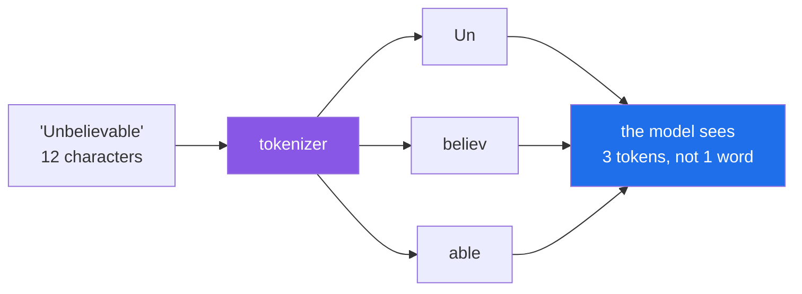

# 2.1 — What a token is: why nothing is counted in words

## One-line answer

A **token** is a chunk of text — often a fragment of a word rather than a whole one — and it is the
unit in which every limit, every quota and every bill in this field is denominated, which makes
"how many tokens is that?" the most practical question you can learn to estimate.

---

## The story

A shipping company charges by volume, not by item. You hand over a box; someone measures it; you pay
for the space it occupies in the container.

A customer with two hundred identical items to ship works out the price by counting items. Two
hundred items, so-and-so much each. The invoice arrives and it is nothing like their estimate — not
double, not half, just *unrelated*, in a way that makes them wonder if they have been overcharged.

They have not. Some of their items are long and thin and pack into gaps. Others are awkward and waste
the space around them. The container does not care how many things there are; it cares how much room
they take. **The customer was counting in the wrong unit**, and no amount of careful counting in the
wrong unit produces a right answer.

The uncomfortable part is that their unit felt more natural. "Two hundred items" is a fact about
their business. "Nine and a half cubic metres" is a fact about the shipping company's world, and it
is the only one that appears on the invoice.

This is exactly the relationship between words and tokens. You think in words because you write in
words. Every limit you will meet is denominated in tokens, and they do not convert cleanly.

---

## The idea in plain language

Models do not read letters and they do not read words. They read **tokens**: chunks of text produced
by a **tokenizer**, a program that splits text into pieces the model was trained to recognise.

A rough guide for English prose: **one token is about four characters, and a hundred tokens is about
seventy-five words.** Common words are usually a single token. Rarer words get split into fragments.

The word `Unbelievable` might arrive as three tokens — `Un`, `believ`, `able` — like Lego bricks that
snap together. `the` is one token. A long chemical name might be a dozen. This is not arbitrary: the
tokenizer was built so that frequent sequences get their own token and rare ones are assembled from
smaller pieces, which is how a fixed vocabulary of a few hundred thousand tokens can represent any
text at all, including text in languages and formats it has never seen.

Consequences that will bite you, in rough order of when:

| Fact | Why you care |
| --- | --- |
| **Whitespace and punctuation are tokens too** | A prettily-indented JSON blob costs meaningfully more than a compact one |
| **Non-English text often costs more per word** | The tokenizer's vocabulary is dominated by English, so other scripts fragment further |
| **Code tokenizes badly** | Identifiers like `get_user_by_id` split into several tokens; long files get expensive fast |
| **Numbers fragment unpredictably** | `2026` may be one token or two; you cannot reason about digits by counting them |
| **The same text is a different count on a different model** | Tokenizers differ between model families. A count is not portable |

That last row matters more than it looks. **There is no universal "token count" for a piece of text
— only a count for a given tokenizer.** Estimating with a rule of thumb is fine for planning; when a
number has to be right, ask the provider.

### Why is anything counted this way?

Because tokens are what the model actually processes, and its costs are real. Every token in your
input is compared against every other token as the model reads it, so the work grows faster than the
text does. Every token of output is a separate forward pass through a very large network. **Tokens
are the unit in which the provider's costs are incurred**, so they are the unit in which your limits
are expressed.

And on a free tier, tokens are not money — they are **the currency Addendum 02 talks about**. Your
budget is denominated in requests per minute and per day, and in tokens per minute. Spending them
carelessly on a Tuesday means not having them on a Tuesday evening.

---

## Why Sutra needs it

Sutra is a support-ticket triage system, so let us do the arithmetic that will govern its design.

A typical ticket body — *"I keep getting logged out every time I switch tabs…"*, around two hundred
words — is roughly **260 tokens**. That is the ticket alone, before any instructions.

- **Day 3's loop** re-sends the whole conversation every turn. A five-turn triage run does not cost
  5 × 260; it costs 260 + 520 + 800 + 1,100 + 1,400 ≈ **4,000 tokens**, because turn *n* carries
  everything from turns 1 to *n*. **This is the arithmetic that makes context engineering a
  discipline** rather than a nicety.
- **Day 4's tools** add their descriptions to *every* request. Three tools with careful descriptions
  might be 400 tokens, paid on every single turn of every single run, forever. Tool descriptions are
  not documentation — they are a recurring cost.
- **Days 19–20 (AG-08..10)** decide what earns a place in the window. They are only necessary
  because of the numbers above.
- **Day 24 (OPS-07, AG-11)** enforces budgets in RPM/RPD per provider. You cannot enforce a budget in
  a unit you cannot estimate.
- **Day 49's RAG day (AG-33)** chooses a chunk size and a top-k. Both are token-budget decisions
  wearing retrieval clothes: retrieve five chunks of 500 tokens and you have spent 2,500 tokens
  before the model reads the question.

---

## The paper behind it

> **Neural Machine Translation of Rare Words with Subword Units**
> `arXiv:1508.07909` · 2015
> <https://arxiv.org/abs/1508.07909>

It claimed that a translation model does not need a vocabulary of whole words at all: chop rare
words into re-usable fragments and the vocabulary can never run out, because anything can be spelled.

**Taught in full in [*Neural Machine Translation of Rare Words with Subword Units*](../../papers/01-subword-units.md)**, in this day's `papers/` directory — including
the algorithm in forty lines you can run, and why your tokens are not morphemes.

---

## The mechanism

Estimation first, because it is the skill you will use daily, and it needs no API call at all:

```python
def estimate_tokens(text: str) -> int:
    """Rough token estimate for English prose: ~4 characters per token.

    Good enough for planning and budgets. NOT good enough for a hard limit —
    ask the provider when the number has to be right (see 2.2).
    """
    return len(text) // 4
```

**Line by line:**

- `len(text) // 4` — integer division by four, the standard rule of thumb for English. **This is
  deliberately crude.** It exists so you can look at a prompt in your editor and know instantly
  whether it is a 50-token or a 5,000-token problem, which is a judgement you need constantly.
- `-> int` — returns a whole number of tokens. There is no such thing as a fraction of a token; the
  meter counts discrete chunks.
- **Why a function and not just doing it in your head?** Because you will want it in the budget
  arithmetic on Day 24, and because writing it down makes the approximation *explicit* rather than a
  vague sense that prompts are "probably fine."
- **What this deliberately does not do** is tokenize. A real tokenizer for this model family means
  either a network call or a local copy of the vocabulary, and both are heavier than an estimate
  needs to be. When you need the true count, [2.2](2.2-reading-the-receipt.md) reads it off the
  receipt of a call you were making anyway.

Now build the intuition with your own eyes:

```python
samples = {
    "short word": "the",
    "long word": "Unbelievable",
    "a ticket": "I keep getting logged out every time I switch tabs. "
    "This started on Monday and happens on Chrome and Firefox.",
    "pretty JSON": '{\n  "id": 4521,\n  "urgency": "high"\n}',
    "compact JSON": '{"id":4521,"urgency":"high"}',
}
for label, text in samples.items():
    print(f"{label:>14}: {len(text):>4} chars -> ~{estimate_tokens(text):>3} tokens")
```

**Line by line:**

- `samples = {...}` — a dict of label to text, chosen to expose the specific surprises: a
  single-token word, a word that fragments, realistic input, and the same data formatted two ways.
- `"pretty JSON"` versus `"compact JSON"` — **the same information, different token counts.** The
  newlines and indentation are tokens you pay for on every call. When a later day puts structured
  data in a prompt, this is the reason it goes in compact.
- `f"{label:>14}"` — right-align in a fourteen-character field so the output forms readable columns.
  Cosmetic, but a table you can scan teaches better than a ragged list.
- **Read the output as ratios, not absolutes.** The point is not that the ticket is exactly 260
  tokens; it is that pretty JSON costs noticeably more than compact JSON carrying identical data.



---

## When it breaks

Tokens rarely produce a traceback of their own. They produce **budget surprises** and one very
specific wall.

**The wall, when the input exceeds the context window:**

```text
google.genai.errors.ClientError: 400 INVALID_ARGUMENT. {'error': {'code': 400,
'message': 'The input token count (1104832) exceeds the maximum number of tokens
allowed (1048576).', 'status': 'INVALID_ARGUMENT'}}
```

**What it means.** You sent more than the model can hold. Note the numbers: the limit is 1,048,576 —
which is 2²⁰, a **binary** limit, not the round "one million" everyone quotes. Note also that this is
a `400`, an error about your request: retrying is useless, which is exactly why
[1.5](../01-first-contact/1.5-the-only-door-429.md)'s door re-raises non-429 errors immediately.
**The smallest fix is to send less** — and *deciding* what to send less of is Phase 3's whole
subject.

**The per-minute token limit, which is not the same as the request limit:**

```text
google.genai.errors.ClientError: 429 RESOURCE_EXHAUSTED. {'error': {'code': 429,
'message': 'You exceeded your current quota', 'status': 'RESOURCE_EXHAUSTED',
'details': [{'@type': 'type.googleapis.com/google.rpc.QuotaFailure', 'violations':
[{'quotaMetric': 'generativelanguage.googleapis.com/generate_content_free_tier_input_token_count',
'quotaId': 'GenerateContentInputTokensPerModelPerMinute-FreeTier'}]}]}}
```

**What it means.** Read the `quotaId`: **InputTokens** PerMinute, not **Requests** PerMinute. You
made few requests but each carried a large prompt. This confuses people badly, because they counted
their calls, stayed under the request limit, and got rate-limited anyway. **Two independent meters
run at once**, and a long-context application hits the token meter first.

**The estimate that was not good enough:**

```text
estimated: 950 tokens   ->  actual: 1,410 tokens
```

**What it means.** The `// 4` rule was built for English prose and you fed it code, JSON, or another
language. **The fix is not a better constant** — it is knowing when an estimate is inadequate. For
planning, estimate. For a hard limit, measure.

---

## In production

**What a professional does instead of estimating** is measure and record. Every response carries the
true count ([2.2](2.2-reading-the-receipt.md)); logging it on every call turns token usage from
guesswork into a graph. The estimate stays useful for a *pre-flight* check — refuse to send a request
you can already tell is oversized, rather than paying the latency of a round trip to be told so — but
the number that goes in a budget is a measured one.

**What degrades at scale is the part nobody plans for: the prompt prefix.** Your system instruction
and tool descriptions are, say, 800 tokens. Charming in development. At ten thousand requests a day
that is **eight million input tokens per day spent on text that never changes**, and it is the single
largest line item in most LLM systems. Two techniques address it, and both appear later in this
plan: **prompt caching**, where the provider stores the unchanging prefix so you are not charged full
price to re-send it, and simply *making the prefix shorter*, which is unglamorous and frequently
halves a bill. **The cheapest token is the one you stopped re-sending.**

**The failure that only appears with real traffic** is tokenizer surprise on real user input. Your
tests use English prose that tokenizes at the expected ratio. Then real traffic arrives: a customer
pastes a stack trace, another writes in Japanese, a third includes a base64-encoded screenshot in a
support ticket. Base64 is close to worst case — it is high-entropy and fragments into near-one-token-
per-few-characters, so a modest attachment can consume an enormous slice of the window. **The system
that worked for a year falls over on one customer's paste**, and the tell is a size limit expressed
in characters rather than tokens.

**The review comment a senior engineer leaves:** *"This truncates the ticket body at 2,000
characters. Characters aren't the unit — a Japanese ticket at 2,000 characters could be four times
the tokens of an English one, and a base64 blob could be worse. Truncate on the token count, and log
when we truncate so we know how often we're throwing away customer text."* The second half is the
sharper point: **silent truncation is data loss you cannot detect later.**

**The interview question.** *"Roughly how many tokens is a page of text, and why does it matter?"*
The number wanted is around 500–750 tokens for a page, from the ~4-characters-per-token rule. What
separates a real answer is what comes next: tokens are the unit of **three** scarce resources at
once — quota, latency and context space — so a decision to include more text is simultaneously a cost
decision, a speed decision and an eviction decision. The detail that shows you have operated one of
these: mentioning that a conversation's total token consumption grows with the **square** of its
length, because every turn re-sends everything before it, which is why context management is
engineering rather than housekeeping.

---

## Check yourself

```bash
uv run python -c "
def est(t): return len(t) // 4
pretty  = '{\n  \"id\": 4521,\n  \"urgency\": \"high\"\n}'
compact = '{\"id\":4521,\"urgency\":\"high\"}'
print('pretty ', len(pretty),  'chars ->', est(pretty),  'tokens')
print('compact', len(compact), 'chars ->', est(compact), 'tokens')
"
```

Same data, two costs. Now multiply the difference by ten thousand requests a day and you have found a
real optimisation that involves no cleverness at all.

**Answer out loud, without scrolling up:**

> A colleague says "our prompts are fine, they're only about 300 words." Give two reasons that
> sentence does not tell you whether the prompts are fine. Then explain why staying under the
> requests-per-minute limit does not guarantee you will avoid a 429.

---

**Next:** [2.2 — Reading the receipt](2.2-reading-the-receipt.md)
