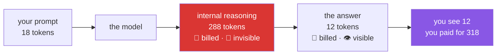

# 2.3 — The thinking tax: output you pay for and never see

## One-line answer

Modern Gemini Flash models **reason before they answer, by default**, and that reasoning is billed as
output while remaining invisible to you — so the tokens you are charged for can be several times the
tokens you can read.

---

## The story

A restaurant prints a bill. Food, drinks, a service charge — and one line item the customer does not
recognise, larger than the wine.

They ask. The manager explains, pleasantly and accurately, that the dish they ordered is prepared to
order, and preparation involves a quantity of work that never reaches the plate: stock reduced for
hours, trimmings discarded, a sauce made in a batch of which they received two spoonfuls. The kitchen
did that work. It is on the bill because it was done.

The customer is not being cheated. They also had no way to know. Nothing on the menu described the
kitchen's process, and the dish arrived looking like a modest plate of food. Their mental model was
*"I pay for what I can see"*, and in this restaurant that model is wrong — not slightly, but by more
than the visible portion.

The interesting detail is what happens next time. Knowing this, the customer can ask for the simpler
preparation, or accept the cost as the price of the good version. What they cannot do any longer is
be surprised. **The information was always on the bill; they had simply never had a reason to read
that line.**

---

## The idea in plain language

A **thinking model** — sometimes called a reasoning model — does not begin producing its answer
immediately. It first generates an internal chain of working: considering approaches, checking
itself, discarding directions. Then it writes the answer you receive.

That internal working is made of tokens. Real tokens, generated one at a time, costing real time and
real quota. They are counted in `total_thought_tokens`, which
[2.2](2.2-reading-the-receipt.md) had you print.

Three facts, verified against the Gemini thinking documentation on 2026-08-24 and re-checked on
2026-08-25:

1. **Thinking is on by default** for current Gemini Flash models — `gemini-3.7-flash` defaults to a
   medium thinking level. You do not opt in; you would have to opt out.
2. **It is controlled by `thinking_level`**, a string passed inside `generation_config` — and
   **which levels a model accepts is decided per model, not once for the API.** The parameter's full
   set is `minimal`, `low`, `medium`, `high`; `gemini-3.7-flash` accepts only `low`, `medium` and
   `high`, and defaults to `medium`. `minimal` belongs to other models — `gemini-3.6-flash` and
   `gemini-3.5-flash-lite` among them. Sending a level your model does not have is a **400**, not a
   quiet downgrade; *When it breaks* has the exact body.
3. **`gemini-2.5-flash-lite` has thinking off by default** — which is a large part of why Addendum 02
   nominates Flash-Lite as the high-volume, low-stakes lane.

And the fact that does the damage, from the SDK's own issue tracker
([python-genai#2062](https://github.com/googleapis/python-genai/issues/2062)):

> **`max_output_tokens` caps thinking *plus* output combined** on Gemini 3 models — contrary to the
> documentation, which describes them as separate budgets.

Read that twice. If you set a cap intending to limit the answer, **the reasoning spends it first**,
and the answer gets whatever is left — possibly nothing.
[5.1](../05-the-failure-lab/5.1-the-cap-that-ate-the-answer.md) makes this happen on your machine on
purpose, because it is the kind of thing you only truly believe once you have watched it.

### Why would anyone want this?

Because it works. On tasks with any reasoning content — multi-step problems, code, careful
classification — a model that thinks first is markedly more accurate than one that answers
immediately. **You are buying quality with tokens**, and that is often an excellent trade.

The problem is not that it costs. The problem is that it costs **invisibly**, so it is absent from
every estimate built by looking at prompts and answers — which is every estimate anyone makes before
they learn this.

---

## Why Sutra needs it

- **Sutra's classifier** (Days 10–13) routes tickets. Routing is a short, closed decision — one of
  five categories, one of three urgencies. It does not need three hundred tokens of deliberation for
  each ticket, and at ticket volume that deliberation is the dominant cost. **`thinking_level` is a
  per-task decision**, and the classifier is the clearest case for turning it down.
- **Sutra's researcher** (Day 58) reasons across evidence from several tools. That is exactly the
  work thinking improves, and paying for it is correct.
- **Day 24's budget** (OPS-07, AG-11) is wrong by a large factor if it counts only visible output.
  This part is why that budget reads three fields rather than two.
- **Days 79–83 (evals)** run large numbers of calls. Addendum 02 already routes evals to Flash-Lite
  for its higher daily allowance; the thinking default is the second, less obvious reason that choice
  is right.
- **Day 70's quota router** cannot predict a request's cost from its prompt length alone, because
  thought tokens vary with problem difficulty rather than prompt size. **The same prompt can cost
  differently on two runs**, which is a genuinely awkward property to build a router on.

---

## The paper behind it

> **Chain-of-Thought Prompting Elicits Reasoning in Large Language Models**
> `arXiv:2201.11903` · 2022
> <https://arxiv.org/abs/2201.11903>

It claimed that showing a large model worked examples — question, reasoning, answer — rather than
just question and answer makes it dramatically better at multi-step problems, with no retraining at all.

**Taught in full in [*Chain-of-Thought Prompting Elicits Reasoning in Large Language Models*](../../papers/02-chain-of-thought-prompting.md)**, in this day's `papers/` directory — including
why the industry moved this inside the model, which is exactly why you are billed for it.

---

## The mechanism

Make the tax visible by asking the same question at two thinking levels:

```python
def demo_thinking(client: genai.Client) -> None:
    """Same question, two thinking levels — watch the hidden half move.

    Usage:  uv run python -m sutra.mechanics thinking     (2 model calls)
    """
    prompt = "A train leaves at 14:05 and arrives at 17:40. How long is the journey?"

    for level in ("low", "high"):
        interaction = ask(client, prompt, config={"thinking_level": level})
        usage = interaction.usage
        thought = usage.total_thought_tokens or 0
        visible = usage.total_output_tokens or 0
        print(
            f"thinking_level={level:>7} | "
            f"thought={thought:>4} visible={visible:>4} "
            f"| hidden share={thought / max(thought + visible, 1):.0%}"
        )
        print(f"    answer: {interaction.output_text}")
```

**Line by line:**

- `prompt = "A train leaves at 14:05..."` — a small arithmetic question, chosen because it has
  **genuine reasoning content but a short answer**. That is the shape that exposes the tax most
  starkly: a handful of visible tokens sitting on top of a much larger pile of hidden ones.
- `for level in ("low", "high")` — the two ends of the dial **this model actually has**, so the
  difference is unmistakable. `minimal` would be one notch below `low`, but `gemini-3.7-flash` does
  not offer it (fact 2 above); `medium` sits between these two and behaves as you would expect.
- `config={"thinking_level": level}` — passed through
  [1.5](../01-first-contact/1.5-the-only-door-429.md)'s `ask`, which forwards it to
  `generation_config`. Verified against `ai.google.dev/gemini-api/docs/thinking` on 2026-08-24.
  **Note it is a string, not a number** — the older `thinking_budget` integer belongs to the previous
  generation of this API and is a common source of confusion.
- `thought = usage.total_thought_tokens or 0` — **the `or 0` is not decoration.** As
  [2.2](2.2-reading-the-receipt.md) showed, this field is `None` on models that do not think, and
  arithmetic on `None` raises `TypeError`. Write the guard the first time.
- `thought / max(thought + visible, 1)` — the hidden share as a fraction. `max(..., 1)` prevents
  division by zero if both are zero, which happens on a filtered or empty response. **Guarding a
  divisor is cheaper than debugging a `ZeroDivisionError` in a printout.**
- `:.0%` — format as a whole-number percentage. The percentage is the point of the demo: absolute
  token counts are hard to react to, but *"73% of what I paid for was invisible"* is not.
- **Two calls, so two units of quota.** If the second returns 429, watch the wrapper wait — the pause
  is your free tier being exactly as documented.

Register it, as with every demo:

```python
demos = {"ask": demo_ask, "tokens": demo_tokens, "thinking": demo_thinking}
```

**Line by line:**

- Third row in the same dict. No new branching, no new structure — which is what a dispatcher built
  this way buys you.



---

## When it breaks

**The empty answer that cost you a fortune** — the failure this whole section builds toward:

```text
thinking_level=   high | thought= 512 visible=   0 | hidden share=100%
    answer: None
```

**What it means.** The call succeeded. No exception, no error status. The model spent its entire
allowance reasoning and produced no visible text, so `output_text` is `None` while your quota is
gone. **This is the single most confusing outcome on this day**, and it is why
[1.4](../01-first-contact/1.4-the-first-interaction.md) insisted you treat `output_text` as optional.
[5.1](../05-the-failure-lab/5.1-the-cap-that-ate-the-answer.md) reproduces it deliberately with a
token cap.

**The `TypeError` you were warned about:**

```text
Traceback (most recent call last):
  File "sutra/mechanics.py", line 91, in demo_thinking
    print(usage.total_thought_tokens + usage.total_output_tokens)
TypeError: unsupported operand type(s) for +: 'NoneType' and 'int'
```

**What it means.** You ran against a model with thinking off — Flash-Lite, most likely — and the
field came back `None`. **The smallest fix is the `or 0` guard**, and the broader lesson is that
vendor response fields are optional by default, whatever the happy path suggested.

**The level this model does not have:**

```text
google.genai._gaos.lib.compat_errors.BadRequestError: Error code: 400 - {'error': {'message': "'minimal' is not a supported thinking level for this model. Allowed values are: medium, low, high.", 'code': 'invalid_request'}}
```

**What it means.** You sent `thinking_level="minimal"` to `gemini-3.7-flash`, which has no such
level. Read where the refusal came from: **the server, not the SDK.** The SDK's own type is happy
with all four —

```text
$ uv run python -c "from google.genai._gaos.types.interactions.thinkinglevel import ThinkingLevel; print(ThinkingLevel)"
typing.Union[typing.Literal['minimal', 'low', 'medium', 'high'], google.genai._gaos.types.basemodel.UnrecognizedStr]
```

— because the *parameter* takes four values while any given *model* takes a subset of them. The fix
is `low`, the floor on this model. **The habit worth taking from it outlives this parameter: a
vendor's client library validates the shape of your request, never its meaning for the model you
picked.** Anything model-specific — levels, modalities, context length, tool support — is checked
only when the request lands, so the first proof that a setting is real is a successful call.

**The setting that does nothing:**

```text
thinking_level=    low | thought= 274 visible=  15
thinking_level=   high | thought= 281 visible=  14
```

**What it means.** You asked for two different levels and got essentially the same behaviour. Two
possibilities and they are worth telling apart: either the parameter did not reach the model — check
that `ask` is forwarding `config` into `generation_config` rather than dropping it — or **this model
does not honour that level**, which is documented behaviour for some models where thinking cannot be
fully disabled. The SDK issue tracker notes exactly this: non-zero thought counts returned regardless
of the requested budget. **Verify with a printout rather than trusting that a parameter you passed
had an effect**, which is a good instinct for any vendor API.

---

## In production

**What a professional does is set `thinking_level` per task rather than globally.** A single
project-wide setting is always wrong somewhere: it is wasteful on the classifier and it is
under-powered on the researcher. The practice is to treat it as part of each call's configuration,
chosen by what the call is for — **the lowest level your model offers** for extraction, routing and
formatting, where the answer is a lookup rather than a deduction; higher for genuine reasoning. **The savings are not marginal.**
On a short classification task the reasoning can be the overwhelming majority of the tokens, so
turning it down is frequently the largest single cost reduction available, and it usually costs no
measurable quality on that task.

**What degrades at scale is predictability, not just cost.** Thought tokens vary with the *difficulty*
of the problem rather than the length of the prompt, so two requests with identically-sized inputs can
differ several-fold in what they consume. This breaks the natural approach to capacity planning —
estimating from input size — and it makes latency variable in a way users notice: the same feature
feels fast on easy inputs and slow on hard ones. **Timeouts calibrated on the easy case will fire on
the hard case**, and because hard cases correlate with important cases, your timeouts will
preferentially kill your most valuable requests.

**The failure that only appears with real traffic** is a *quality* regression from a cost
optimisation. A team notices the thinking tax, sets `thinking_level` to its floor everywhere, and
watches their token usage drop by half. Everyone is delighted. Accuracy on the hardest ten per cent
of tickets quietly degrades — the multi-step ones, the ambiguous ones, the ones where reasoning was
actually doing something. Nobody notices for weeks, because the aggregate accuracy metric barely
moves and the affected cases are, by definition, the minority. **This is the exact scenario evals
exist for** (Phase 12): a change that improves one number and silently damages another is invisible
without a scored regression suite, and "we saved 50% on tokens" is not a complete sentence unless it
ends with "at no measured quality cost."

**The review comment a senior engineer leaves:** *"We set `thinking_level: low` globally in this
PR. What's the eval delta? I'll believe the cost win — I want to see the accuracy number next to it,
especially on the multi-step cases. And this is set in one place for every call site; the classifier
and the researcher have completely different needs."*

**The interview question.** *"You're asked to halve the cost of an LLM feature. Where do you look?"*
The mediocre answer goes straight to a smaller model. A strong answer works down a list in order of
effort-to-payoff: **the reasoning budget first**, because thinking is on by default and is frequently
the largest invisible line item and is a one-line change; then the **static prompt prefix**, since
instructions and tool descriptions are re-sent on every call and prompt caching or simply shortening
them attacks the biggest recurring cost; then the **history policy**, because re-sending everything
makes cost grow with the square of conversation length; and only then the model itself, which is the
change most likely to move quality. The sentence that ends it well: **every one of those is a quality
trade, so each needs an eval number beside it, or you have not saved money — you have moved the cost
somewhere you are not measuring.**

---

## Check yourself

```bash
uv run python -m sutra.mechanics thinking
```

Read the hidden-share percentage. Then answer the question that matters for Sutra: **for a classifier
that outputs one word — `billing`, `bug`, `account` — what share of your tokens would be reasoning,
and is that a good trade?**

**Answer out loud, without scrolling up:**

> Explain to someone who has never heard of it why an LLM bill can be four times larger than the
> visible text suggests. Then name the one setting you would change first to reduce it, the one
> number you would insist on seeing before shipping that change, and why `gemini-2.5-flash-lite`
> appears in Addendum 02 as the high-volume lane.

---

**Next:** [3.1 — The desk that gets wiped](../03-context-and-memory/3.1-the-desk-that-gets-wiped.md)
