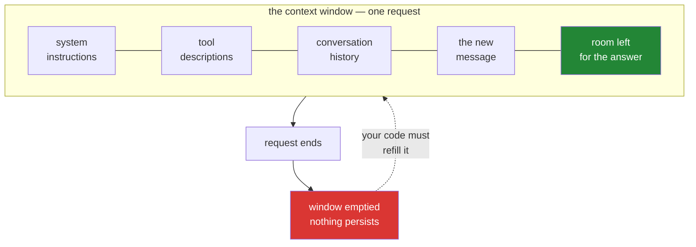

# 3.1 — The desk that gets wiped: the context window, and what fits on it

## One-line answer

The **context window** is the total amount of text a model can consider in one request — everything
you send plus everything it generates, measured in tokens — and it is not a memory, because it is
emptied completely the moment the request ends.

---

## The story

Picture a desk in a room with a door.

The desk is large. You can spread out a great many documents on it — reports, notes, the whole file
on a case. Whoever sits at that desk can see everything laid out there at once and reason about all
of it together, which is genuinely powerful. Things at opposite ends of the desk can be compared.

Two rules govern the desk, and they are absolute.

**The desk has edges.** Large is not infinite. Keep adding documents and eventually they start to
fall off, and — this is the part that matters — **nobody tells you which ones fell.** You do not get
a warning that page four is now on the floor. You get an answer that confidently omits page four.

**The desk is cleared when the door closes.** Not tidied. Cleared. Everything on it is removed and
destroyed. The next person to sit down finds bare wood, and if they need the case file, someone has
to carry every page back in and lay it out again.

Now the question that makes this concrete. Someone sits at that desk for eight hours and appears to
work continuously on one case, remembering what they read that morning. How?

They do not. **Eight separate people sat there, one after another**, and between each one a clerk
carried in every document from before, laid it out, added the new page, and stood back. What looks
like one continuous mind working through a problem is a relay, and the clerk is doing all the
remembering.

The desk is the context window. The clerk is your code. You are about to write the clerk.

---

## The idea in plain language

The **context window** is a hard limit on how many tokens one request can involve. It covers
everything: your instructions, the conversation so far, any documents you pasted, the tool
descriptions, and the answer the model generates. All of it shares one budget.

Some vocabulary, defined once:

| Term | Plain meaning |
| --- | --- |
| **Context window** | The maximum tokens one request may involve, input and output together |
| **Context** | The actual content you put in the window this time |
| **Truncation** | Cutting content to fit — done by you deliberately, or by a library quietly |
| **Overflow** | Exceeding the window. On Gemini this is a hard `400`, not a silent trim |

Flash-class models have very large windows — on the order of a million tokens, which is a few
thousand pages. This leads to a reasonable-sounding conclusion that is wrong: *"the window is huge,
so I do not need to think about it."*

Three reasons that fails.

**You pay for what is on the desk, every single time.** [2.1](../02-tokens-the-meter/2.1-what-a-token-is.md)
established that every turn re-sends everything, so a large window is an invitation to spend an
enormous amount. The window is a capacity, not an allowance.

**Quality degrades before capacity does.** Models attend less reliably to material buried in the
middle of a very long context than to material at the start or end. Filling the window does not fill
it with equally useful attention, and the effect is well enough known to have a name — "lost in the
middle." **A prompt at 90% of the window is usually a worse prompt, not a more informative one.**

**The window is shared with the output.** Input plus reasoning plus answer must all fit. Fill it with
input and you have squeezed the space available for the reply — which is precisely the mechanism
behind [5.1](../05-the-failure-lab/5.1-the-cap-that-ate-the-answer.md).

### The distinction that matters most

**A window is not a memory.** A memory persists and is consulted selectively. A window is refilled
from scratch on every request and read in full every time. Everything that *feels* like memory in
any LLM product is a program deciding what to put in the window, and that program's decisions are
where the engineering lives.

---

## Why Sutra needs it

- **[3.2](3.2-history-is-a-list-you-own.md), the very next part**, has you watch the wipe happen: a
  fact told in one call and unavailable in the next.
- **Day 3 (AG-03)** builds the clerk. The loop's growing history list is the stack of documents
  carried back in.
- **Days 19–20 (AG-08..10, ADK-22)** are context engineering — deciding what earns a place on the
  desk when the case file outgrows it. Summarise old turns? Drop tool outputs? Keep a running digest?
  Those are the real questions, and this part is why they exist.
- **Day 49 (AG-33)** is retrieval: when the material is far too large for any window, fetch only the
  relevant fragments. RAG is, at bottom, a strategy for a desk with edges.
- **Day 24 (OPS-07)** budgets it, because window capacity and quota are different limits that people
  routinely conflate.

---

## The mechanism

The arithmetic is the mechanism here, and it is worth doing rather than reading:

```python
WINDOW = 1_048_576  # tokens, Flash-class. 2**20 — a binary limit, not "1 million"

instructions = 400  # system prompt: sent every single turn
tool_descriptions = 350  # from Day 4 onwards: sent every single turn
ticket = 260  # one support ticket
reply = 300  # what the model generates

fixed = instructions + tool_descriptions
turn_1 = fixed + ticket + reply
print(f"fixed overhead, every turn : {fixed}")
print(f"turn 1 total               : {turn_1}")
print(f"turns before the window is full: ~{WINDOW // turn_1}")
```

**Line by line:**

- `WINDOW = 1_048_576` — the real number, and it is `2**20`. Everyone says "one million"; the limit is
  binary. The underscores are Python's numeric separator, purely for readability.
- `instructions` and `tool_descriptions` — **the fixed prefix.** These do not change between turns and
  are re-sent on every one. Naming them `fixed` below is the point of the exercise: this is the
  recurring cost [2.3](../02-tokens-the-meter/2.3-the-thinking-tax.md)'s production section named as
  the biggest line item in most systems.
- `reply = 300` — output counts against the window too. A common mistake is to budget only input and
  then be surprised by a truncated answer.
- `WINDOW // turn_1` — an estimate of how many *independent* turns fit. **It is a deliberately
  misleading number**, and the next block explains why.

That estimate is wrong in the direction that matters. Turns are not independent — each one re-sends
its predecessors:

```python
history = 0
for turn in range(1, 8):
    sent = fixed + history + ticket
    history = sent + reply  # everything so far becomes next turn's history
    print(
        f"turn {turn}: sent {sent:>6} tokens  (history carried: {history - reply - ticket - fixed:>6})"
    )
```

**Line by line:**

- `history = 0` — the first turn carries nothing before it.
- `sent = fixed + history + ticket` — what this turn actually transmits: the unchanging prefix, plus
  everything said so far, plus the new input. **This line is the whole idea of the section.**
- `history = sent + reply` — after the turn, everything just sent *and* the model's reply become the
  history the next turn must carry. The variable grows by roughly the size of a full exchange each
  time.
- **Run it and watch the `sent` column.** It does not grow by a constant amount — it compounds,
  because each turn re-sends the accumulated total. This is the quadratic growth from
  [1.1](../01-first-contact/1.1-the-call-that-forgets-you.md), now in numbers you produced yourself.



Notice what the diagram makes obvious and prose does not: **the room left for the answer is whatever
the other four sections did not take.** Grow the history and you shrink the reply.

---

## When it breaks

**Overflow — the hard wall:**

```text
google.genai.errors.ClientError: 400 INVALID_ARGUMENT. {'error': {'code': 400,
'message': 'The input token count (1104832) exceeds the maximum number of tokens
allowed (1048576).', 'status': 'INVALID_ARGUMENT'}}
```

**What it means.** You sent more than fits. **The good news is that it is loud** — Gemini refuses
rather than silently discarding your earliest messages, which some systems do. A `400` is an error
about your request, so [1.5](../01-first-contact/1.5-the-only-door-429.md)'s door re-raises it
immediately rather than retrying, which is correct: it will not fit next time either.

**The smallest fix is to send less**, and the important question is *what* — dropping the oldest
turns, summarising them, or retrieving only relevant fragments are three different strategies with
three different failure modes, which is why Days 19–20 exist.

**The silent version, which is worse:**

```text
user:      What was the ticket ID I mentioned at the start?
assistant: You haven't mentioned a ticket ID in our conversation.
```

**What it means.** Some frameworks trim history to fit, automatically, and do not tell you. The call
succeeds, the model answers confidently, and the answer is wrong because the evidence was removed
before it ever saw it. **This is not a model failure — it is a data-loss bug in the layer above**,
and it is the reason Sutra's Day 3 loop manages history explicitly rather than delegating it. If a
library is quietly dropping your messages, you want that to be a decision you made.

**Quality falling off before capacity does:**

```text
context: 780,000 tokens (74% of window)
question: "What did the customer say about refunds in the third email?"
answer:   a plausible summary of the wrong email
```

**What it means.** No error at all. Everything fit. The model simply attended less reliably to
material buried deep in a very long context. **The fix is not a bigger window** — it is putting less,
and more relevant, material in front of it. This is the single most counterintuitive fact in this
section: **a smaller prompt is often a more accurate prompt.**

---

## In production

**What a professional builds instead of "append to a list forever" is a context *policy*** — an
explicit, written-down rule for what goes in the window on every request, with a budget. Something
like: system instructions always; the last N turns verbatim; a running summary of everything older;
retrieved documents up to a token cap; and a hard ceiling that triggers eviction before the provider's
limit rather than at it. **The policy is a design artefact, not an implementation detail**, because
every choice in it is a trade between cost, latency and how much the system appears to remember.

**What degrades at scale is that the window becomes a contended resource with several claimants.**
Instructions want room. Tool descriptions want room — and they grow every time someone adds a tool.
Retrieved documents want room. Conversation history wants room. The answer needs room. Each of these
is owned by a different part of the system, frequently by a different engineer, and **nobody owns the
total.** The characteristic incident is that adding a fifth tool pushes a long-running conversation
over the edge, and the failure appears in a feature nobody touched. The defence is a per-component
token budget, enforced in code, so that overflow is caught at its cause rather than at its symptom.

**The failure that only appears with real traffic** is the conversation that never ends. Your tests
run six turns. Real users open a thread and keep it alive for weeks. That one thread grows until it
overflows, and it fails *only for that user*, *only at their turn 400*, in a way that never
reproduces locally. **Every unbounded conversation is a scheduled failure**; the only question is
which user gets there first. This is why session and memory design (Day 8, Days 46–52) is a real
subsystem rather than a list.

**The review comment a senior engineer leaves:** *"What's the context budget for this request, and
who enforces it? Right now instructions, retrieved docs and history all grow independently and the
first thing anyone hears about it is a 400 from the provider. I want a token budget per component
and a test that fails when we blow it — not an incident."*

**The interview question.** *"The model has a million-token context window. Why not just put
everything in it?"* The weak answer is "cost." Cost is only the first of three, and the least
interesting. The full answer: **cost**, because every turn re-sends everything, so consumption grows
with the square of conversation length; **quality**, because attention degrades over long contexts and
material buried in the middle is recalled less reliably, meaning a fuller prompt can be a worse
prompt; and **the output shares the budget**, so a bloated input squeezes the answer and can produce
truncation that looks like a model failure. The sentence that ends it: **a context window is a
capacity, not a target** — the engineering is deciding what deserves to be in it, which is why
retrieval and summarisation exist at all.

---

## Check yourself

Run the compounding loop and look at the `sent` column:

```bash
uv run python -c "
fixed, ticket, reply = 750, 260, 300
history = 0
for turn in range(1, 8):
    sent = fixed + history + ticket
    history = sent + reply
    print(f'turn {turn}: sent {sent:>6}')
"
```

Turn 7 should be several times turn 1, from a conversation that only got six exchanges longer. Now
say what that means for a support thread a customer keeps open for a fortnight.

**Answer out loud, without scrolling up:**

> Explain the difference between a context window and a memory to someone who thinks they are the
> same thing. Then give the three reasons not to fill a large window even when everything fits — and
> say which of the three surprises people most.

---

**Next:** [3.2 — History is a list you own](3.2-history-is-a-list-you-own.md)
