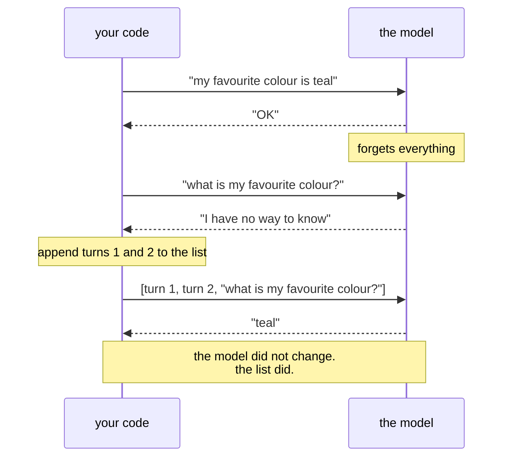

# 3.2 — History is a list you own: proving the amnesia, then curing it

## One-line answer

Tell the model a fact, ask about it in a separate call, and it will not know — until you send the
earlier exchange back as part of the new request, at which point it "remembers" instantly, because
**the memory was never in the model; it was in the list you built**.

---

## The story

A locksmith is called to a building three times in one week for the same jammed door.

The first visit, they diagnose it, try something, and leave a note in their van's logbook. The second
visit — a different locksmith from the same company — arrives with no knowledge of the first, runs
the same diagnosis, tries the same thing, and leaves. The third visit repeats it exactly.

The building manager is furious, and phrases the complaint in the obvious way: *"why don't your
people remember anything?"*

The dispatcher's answer is the interesting one. The company's locksmiths are contractors. They do
not share a memory and were never going to. What the company has is a **job file**, and the file
works perfectly — every visit's notes are in it. Nobody had been printing it and handing it to the
contractor on the way out.

The fix was not to hire locksmiths with better memories. It was one step in the dispatch process:
**print the file, put it in their hand.** After that the third locksmith knew everything the first
had found, and the door got fixed.

Notice what did *not* change. The contractors still forget. That was never the problem to solve.

---

## The idea in plain language

The model is the contractor. The list you maintain is the job file. Your code is the dispatcher who
remembers to hand it over.

Concretely: to make a model appear to remember, you send the previous exchange back as part of the
next request. That is the entire mechanism. There is no hidden state, no session, no profile — just a
list of turns that you build, own, and re-send.

Each entry in that list is a **turn**, labelled with who said it. The model needs the labels: without
them, a transcript is an undifferentiated wall of text and the model cannot tell your question from
its own previous answer.

Two shapes exist for sending this, and today uses the explicit one:

| Shape | What you send | Who holds the state |
| --- | --- | --- |
| **A plain string** | Just the new message | Nobody. Every call is turn one |
| **A list of turns** | The whole conversation, structured | **You** — this is Sutra's default |
| An id referencing a stored turn | A pointer to the provider's copy | The provider — see [3.3](3.3-the-server-will-remember.md) |

[1.4](../01-first-contact/1.4-the-first-interaction.md) used the first shape. This part uses the
second, which is the one Day 3's loop is built on and the one ADR-0006 records as this project's
house style.

**Why insist on owning the list?** Because everything interesting you will ever do to a conversation
is an operation on that list: summarising old turns to save room, dropping tool outputs once
they have been used, injecting retrieved documents, redacting a customer's card number before it
reaches a third party. **A list in your process is something you can inspect, test, log and edit. A
conversation living on somebody else's server is not.**

---

## Why Sutra needs it

- **Day 3 (AG-03)** hand-rolls the think→act→observe loop. That loop is a `for` statement around
  exactly this list — append the model's turn, append the tool result, send it all again. **If you
  understand this part, Day 3 is half written.**
- **Day 4 (AG-04)** appends a *tool result* turn to the same list, which is how the model learns what
  its requested tool returned.
- **Day 8 (ADK-06, ADK-07)** introduces ADK's session service — a managed version of this list. You
  will recognise it, because you built the unmanaged one first (Principle 4).
- **Days 19–20 (AG-08..10)** edit this list under pressure: what to summarise, what to drop, what to
  keep verbatim. **You cannot write a context strategy for a list you do not control.**
- **Day 66 onwards (safety)** inspects this list for injected instructions. Inspection requires
  possession.

---

## The mechanism

First, prove the amnesia. This is the demo worth running slowly, because everything after it is a
consequence:

```python
def demo_memory(client: genai.Client) -> None:
    """Three calls: tell a fact, ask without history, ask with history.

    Usage:  uv run python -m sutra.mechanics memory     (3 model calls)
    """
    setup = "My favourite colour is teal. Reply with just: OK."

    first = ask(client, setup)
    print("call 1 (told it)      :", first.output_text)

    second = ask(client, "What is my favourite colour?")
    print("call 2 (no history)   :", second.output_text)
```

**Line by line:**

- `setup = "My favourite colour is teal. Reply with just: OK."` — a fact plus an instruction to reply
  briefly. The brevity is a quota decision: you are testing recall, not paying for prose.
- `first = ask(client, setup)` — call one, through the door from
  [1.5](../01-first-contact/1.5-the-only-door-429.md). The model now "knows" the colour, for as long
  as this request lasts, which is not long.
- `second = ask(client, "What is my favourite colour?")` — **call two is a brand new conversation.**
  Same client, same key, moments later — and none of that matters. Nothing from call one travelled
  here.
- **What you will see** is the model saying it has no way to know, or asking you, or occasionally
  inventing a colour. That last case is worth noticing: **an amnesiac under pressure to answer will
  sometimes guess**, which is a preview of why Days 66–72 care about grounding.

Now cure it, in the same demo:

```python
    history = [
        {"type": "user_input", "content": [{"type": "text", "text": setup}]},
        # TODO(me): add the model's own turn from `first`, then the new question.
        # Read the exact shape off the object rather than guessing it:
        #   uv run python -c "print(type(first).__mro__); print(first)"
        # Verified today: the user-turn shape above, from
        # ai.google.dev/gemini-api/docs/text-generation (2026-08-24).
    ]

    third = ask(client, history)
    print("call 3 (with history) :", third.output_text)
```

**Line by line:**

- `history = [...]` — **a plain Python list.** Not a framework object, not a session, not a
  connection. This is the job file from the story, and the fact that it is this ordinary is the point.
- `{"type": "user_input", "content": [{"type": "text", "text": setup}]}` — one turn, structured.
  `type` labels **who is speaking**; `content` is a list because a turn can hold several pieces —
  text today, images and tool results later. Verified against the text-generation documentation on
  2026-08-24.
- **The `TODO(me)` is deliberate and it is yours to solve** (this project does not do your reps). The
  model's own turn must go into the list too — otherwise the conversation reads as two consecutive
  user messages with the answer missing.
- `uv run python -c "print(type(first).__mro__); print(first)"` — **the lookup command, exactly as
  you should run it.** Principle 8 forbids inventing an API, and it equally forbids this document
  guessing a field name for you. Print the object you already have and read its real shape. That
  printout is more authoritative than any documentation, because it came from the version you
  installed.
- `third = ask(client, history)` — the same `ask`, with a **list** instead of a string. The
  parameter was typed `object` in [1.5](../01-first-contact/1.5-the-only-door-429.md) for exactly
  this reason.
- **When it works, call 3 answers "teal" immediately** — and nothing about the model changed between
  call 2 and call 3. Only what you handed it.

Register it:

```python
demos = {"ask": demo_ask, "tokens": demo_tokens, "thinking": demo_thinking, "memory": demo_memory}
```

**Line by line:**

- Fourth entry, same pattern. `store` stays `False` throughout: **you are holding the state, so
  there is no reason for the provider to hold it too.**



---

## When it breaks

**The unlabelled transcript** — the mistake almost everyone makes first:

```python
# WRONG: flattening the conversation into one string
ask(client, "My favourite colour is teal. OK. What is my favourite colour?")
```

**Line by line:**

- Everything is now a single user message. The model cannot tell which words were yours and which
  were its own, so `OK` reads as something *you* said. It usually still answers correctly here,
  which is exactly what makes this dangerous — **it works on toy examples and degrades on real
  ones**, where the model starts treating its own earlier output as user instructions. That
  confusion is also a security surface: Day 66's prompt-injection work depends on the boundary
  between roles being real.

**The list that grew without limit:**

```text
google.genai.errors.ClientError: 400 INVALID_ARGUMENT. {'error': {'code': 400,
'message': 'The input token count (1104832) exceeds the maximum number of tokens
allowed (1048576).', 'status': 'INVALID_ARGUMENT'}}
```

**What it means.** You appended and never evicted. [3.1](3.1-the-desk-that-gets-wiped.md) predicted
this. **The smallest fix is a cap on turns**; the correct fix is a policy, which is Days 19–20.

**The turn shape the API rejects:**

```text
google.genai.errors.ClientError: 400 INVALID_ARGUMENT. {'error': {'code': 400,
'message': 'Invalid value at \'input\' (oneof), oneof field \'input\' is already
set. Cannot set \'text\'', 'status': 'INVALID_ARGUMENT'}}
```

**What it means.** Your list entries do not match the expected structure — usually a `content` that
is a bare string where a list of typed parts is required, or a `type` that is not a recognised turn
kind. **The fix is the lookup command from the `TODO` above**: print a real interaction object and
mirror its shape. Guessing at this from memory of a different SDK is how people lose an evening here.

**The forgotten append, which produces the strangest behaviour of all:**

```text
call 3: "teal"
call 4: "teal"
call 5: "teal"
```

**What it means.** You appended the user's turns but never the model's, so every call sees the same
list and produces the same answer. It looks like the model is stuck. It is not — **it is answering
an identical question identically**, which is correct behaviour on a deterministic-ish setting. Day 1
([1.2](../../../day-01-bootstrap-and-map/parts/01-what-is-an-agent/1.2-goal-tools-loop-stop.md))
called this out as the most common loop bug there is, and here it is, one day early.

---

## In production

**What a professional writes instead of a list is a conversation object with a policy attached** —
something that owns the turns *and* the rules: a maximum token budget, an eviction strategy, a
summarisation hook, and a redaction pass that runs before anything leaves the process. The list is
still in there. What changes is that the operations on it are named, tested and reviewable, rather
than being `history.append(...)` scattered across a codebase.

**What degrades at scale is concurrency, and it degrades silently.** A list is mutable and shared. Two
requests for the same conversation, arriving at once, both read the history, both append, and one
overwrites the other — a lost turn, no error, a conversation that skips. In a single-threaded script
this cannot happen; in a web service it happens under load and is nearly impossible to reproduce
locally. **The fix is that conversation state needs the same treatment as any other shared mutable
state**: a lock, an atomic append, or a per-conversation queue. This is one of the strongest arguments
for a real session service rather than a dictionary of lists, and it is why Day 8 exists.

**The failure that only appears with real traffic is what ends up in the list.** In development the
history holds pleasant test sentences. In production it holds whatever customers typed: card numbers,
passwords pasted into a support ticket, another customer's details forwarded by mistake. **Every one
of those is re-sent to a third party on every subsequent turn**, multiplied by conversation length,
and each copy is a place it can be logged. The mitigations — redact on the way in, cap retention, keep
the history where your compliance boundary already is — are all only available to someone who owns the
list. **This is the strongest practical argument in ADR-0006 for `store=False` as the default**, and
[3.3](3.3-the-server-will-remember.md) argues it properly.

**The review comment a senior engineer leaves:** *"`history.append()` in four places and no eviction
anywhere. What's the cap, who enforces it, and what happens when we hit it — do we drop the oldest
turn, summarise, or fail? Also this list is a module-level dict keyed by user id, which means two
concurrent requests from the same user will race. Please put this behind something with a lock and a
policy."*

**The interview question.** *"How does a chatbot remember the conversation?"* The answer that gets a
follow-up is "it sends the history back." The complete answer names who owns the list and what that
buys: your application maintains an ordered, role-labelled list of turns and re-sends it — which is
why cost grows with the square of conversation length, why every conversation needs an eviction
policy, and why the history is a compliance surface rather than a data structure. The detail that
marks experience: **the roles are not cosmetic.** Flattening a conversation into one string works in
a demo and fails in production, because the model starts treating its own prior output as user
instruction — which is both a quality problem and the doorway to prompt injection.

---

## Check yourself

```bash
uv run python -m sutra.mechanics memory
```

Call 2 must fail to know the colour. If it somehow does know, you have accidentally left `store=True`
somewhere and the provider is carrying state you did not intend — which is itself the lesson of
[3.3](3.3-the-server-will-remember.md), arriving early.

**Answer out loud, without scrolling up:**

> In three calls you made a model forget and then remember, and the model was identical throughout.
> Say exactly what changed. Then give two reasons — one about cost, one about safety — why Sutra
> keeps that list in its own process rather than letting the provider hold it.

---

**Next:** [3.3 — The server will remember for you](3.3-the-server-will-remember.md)
