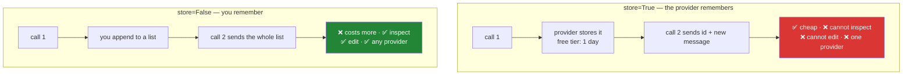

# 3.3 — The server will remember for you: and why Sutra says no

## One-line answer

The Interactions API will hold your conversation on Google's servers and let you continue it with
`previous_interaction_id` — which is genuinely useful, is **on by default**, and is a decision this
project makes deliberately in the other direction.

---

## The story

A company offers to store your filing cabinet for you.

The offer is good and the terms are honest. They will keep every document, indexed and instantly
retrievable. You stop paying for the room the cabinet occupied and you stop carrying folders to
meetings — you just quote a reference number and the relevant papers appear. For most people, most of
the time, this is strictly better.

Two years later the company's client is asked a question by a regulator: *which documents did you
send to your subcontractor in March, and what was in them?*

They cannot answer directly. The documents are not theirs to inspect any more; they hold reference
numbers. They can ask, and the storage company is helpful and responsive, and it takes eleven days.
The regulator wanted it in three.

Nobody behaved badly here. The storage company delivered exactly what it promised. The client had
made a reasonable trade — convenience now against a capability they did not expect to need — and the
part they got wrong was not noticing they had made a trade at all. **The cabinet moved out of the
building the day they signed, and it never occurred to them to ask what they had given up.**

---

## The idea in plain language

[3.2](3.2-history-is-a-list-you-own.md) had you carry the folder yourself: build a list of turns,
send it every time. The Interactions API offers the other arrangement.

When you create an interaction with `store=True` — **which is the default** — the provider keeps it.
Your next call can pass `previous_interaction_id` instead of the whole history, and the conversation
continues as if you had sent everything.

The facts, verified against the interactions documentation on 2026-08-24:

| | Your list ([3.2](3.2-history-is-a-list-you-own.md)) | `previous_interaction_id` |
| --- | --- | --- |
| Who holds the conversation | Your process | Google's servers |
| What you send each turn | Everything, again | An id and the new message |
| Retention | However long you keep it | **Free tier: 1 day. Paid: 55** |
| Can you inspect it | Yes, it is a list | Only through their API |
| Can you edit it | Yes — summarise, redact, drop | No |
| Cost of a long conversation | Grows with the square of length | Much flatter |
| Works offline / with another provider | Yes | No |

That cost row is not a small thing. It is the single strongest argument for the feature, and it is
real: re-sending a fifty-turn conversation on every turn is genuinely wasteful, and this eliminates
it.

So why decline?

### What you give up

**Inspection.** [3.2](3.2-history-is-a-list-you-own.md) argued that everything interesting is an
operation on the list — summarising, redacting, injecting retrieved documents, checking for injected
instructions. **You cannot operate on a list you do not have.**

**Portability.** An id is meaningful to one provider. ADR-0005 gave each of Sutra's four free
providers a named role and Day 9 benchmarks the same agent across all of them; a conversation living
inside Gemini's storage cannot be handed to Groq. **Server-side state is provider lock-in with a
convenient interface.**

**Debuggability.** When an agent behaves strangely on turn nine, the first question is *what did it
actually see?* With a local list that is a `print`. With an id it is an API call, if the retention
window has not already expired.

**A clear compliance boundary.** `store=True` means customer conversations are persisted on a third
party's infrastructure. That is a normal, documented, contractually-governed arrangement — and it is
a decision someone should make on purpose, not inherit from a default.

### And what it is genuinely good for

Be fair to it, because a curriculum that only argues one side is not teaching. Server-side state is
an excellent fit for long-running assistant conversations where cost dominates, for prototypes where
you want a working chat quickly, and for exactly the background execution the documentation notes
`store=False` is incompatible with. **Sutra declines it for Sutra's reasons**, which are a
multi-provider agent that must inspect and edit its own context. Different system, different answer.

---

## Why Sutra needs it

- **Day 3 (AG-03)** loops over a list it can print. An agent whose context is a remote id is an agent
  you debug by asking someone else.
- **Day 8 (ADK-06, ADK-07)** builds sessions in ADK. **This part is the comparison that makes that
  day land**: ADK's session service and `previous_interaction_id` are two answers to one question,
  and knowing both is what lets you choose.
- **Day 9 (ADK-08, ADK-09)** runs one agent across four providers. Portable context is a
  precondition.
- **Days 19–20 (AG-08..10)** rewrite the context on every turn — summarise, evict, inject. All of it
  requires possession.
- **Days 66–72 (safety)** inspect context for injected instructions before it reaches the model.
  Inspection requires possession.
- **Principle 13 — blast radius before capability.** A default that persists customer data on a third
  party is a blast radius. This part is its containment story.

---

## The mechanism

See both arrangements side by side, then choose knowingly:

```python
def demo_server_state(client: genai.Client) -> None:
    """The provider holds the conversation — the arrangement Sutra declines.

    Usage:  uv run python -m sutra.mechanics server     (2 model calls)
    """
    first = client.interactions.create(
        model=MODEL,
        input="My favourite colour is teal. Reply with just: OK.",
        store=True,
    )
    print("call 1:", first.output_text, "| id:", first.id)

    second = client.interactions.create(
        model=MODEL,
        input="What is my favourite colour?",
        previous_interaction_id=first.id,
        store=True,
    )
    print("call 2:", second.output_text)
    print("tokens sent on call 2:", second.usage.total_input_tokens)
```

**Line by line:**

- `client.interactions.create(...)` **directly, not through `ask`** — the one deliberate exception in
  this day. `ask` hard-codes `store=False` because that is Sutra's policy, and this demo exists to
  show the policy's alternative. **When you break your own rule, break it visibly and say why.**
- `store=True` — the provider keeps this interaction. On the free tier, for one day. Note again that
  this is the API's *default*: the striking thing is not that you can turn it on, it is that
  [1.4](../01-first-contact/1.4-the-first-interaction.md) had to turn it **off**.
- `first.id` — the handle. This is what replaces the folder. It is a string that means something only
  inside Google's systems.
- `previous_interaction_id=first.id` — continue that conversation. **No history list anywhere.** The
  server reassembles the context on its side before inference.
- `print("tokens sent on call 2:", second.usage.total_input_tokens)` — **the line that makes the case
  for the feature.** Compare it with the same second turn in
  [3.2](3.2-history-is-a-list-you-own.md), where you re-sent everything. The difference is what
  server-side state buys, and it is not small.
- `second.output_text` should say teal. **The model still forgot** — that has not changed and cannot.
  Somebody else's clerk carried the folder.

Now the contrast, which is the real content of this part:

```python
    # Sutra's shape, for comparison — the list is ours, so we can look at it.
    history = [{"type": "user_input", "content": [{"type": "text", "text": "..."}]}]
    print("turns we can inspect:", len(history))
    print("we could redact, summarise or hand this to another provider")
```

**Line by line:**

- `len(history)` — a number you can compute because the data is local. With an id, the equivalent
  question requires a network call to the party you are trying to audit.
- The comment names the three operations Days 19–20, 49 and 66 all depend on. **This is not a
  preference; it is a prerequisite for most of the remaining curriculum.**



---

## When it breaks

**The id that has expired:**

```text
google.genai.errors.ClientError: 404 NOT_FOUND. {'error': {'code': 404,
'message': 'Interaction not found: interactions/abc123', 'status': 'NOT_FOUND'}}
```

**What it means.** On the free tier, stored interactions are retained for **one day**. Your id was
valid yesterday. **There is no recovery** — the conversation is gone, and if you did not keep a copy
you have lost the customer's thread. This is the single sharpest practical argument in this part:
**a retention window you do not control is a data-loss schedule you did not set.** Read the free-tier
number again and imagine a support conversation that pauses over a weekend.

**The default that surprised someone:**

```text
$ grep -rn "store=" sutra/
sutra/mechanics.py:61:        model=MODEL, input=prompt, generation_config=config, store=store
```

**What it means.** One place sets it, and it is `ask`. **That is the property to preserve.** The
failure mode is the codebase where `store` is unset at forty call sites, every one of them defaulting
to `True`, and nobody can answer "do we persist customer conversations?" without reading all forty.
The grep above is a real audit you can run today and should be able to run on Day 90.

**Mixing the two arrangements:**

```text
call 3 answers as though turn 2 never happened
```

**What it means.** You sent a `previous_interaction_id` *and* a partial history list, or you
alternated between the two across turns. The provider's chain and your list are now two different
conversations, and which one wins is not something to reason about at 11pm. **Pick one owner for
conversation state and keep it** — the mixed arrangement is worse than either.

---

## In production

**What a professional does is make this an explicit, written architectural decision** with the
trade-offs recorded — exactly what ADR-0006 is for. The wrong version of this decision is not
choosing the other option; it is **not noticing there was a decision**, shipping the default, and
discovering the terms during an audit. Both arrangements are defensible. Only one of them is
defensible *without knowing you chose it*, and that is the one the story at the top of this page is
about.

**What degrades at scale is what always degrades: coupling you cannot see.** Server-side state works
beautifully until you want a second provider — for cost, for redundancy, for a capability Gemini does
not have — and then you discover that every live conversation is anchored to one vendor's storage and
there is no migration path, because the history was never in your database. **A provider outage
becomes a total outage** rather than a failover, which is precisely the scenario ADR-0005 assigned
Ollama the offline-baseline role for. The cost saving was real; the resilience cost was invisible
until it was load-bearing.

**The failure that only appears with real traffic** is the retention cliff. In testing, conversations
last a few enthusiastic minutes and the one-day window is invisible. Real support conversations pause
overnight, over weekends, over holidays. The customer replies on Monday to a thread from Friday and
the id is gone — **and it fails for exactly the conversations that matter most**, the long-running,
high-stakes ones, while every short interaction keeps working perfectly. Your error rate stays low
and your worst customer experiences get worse.

**The review comment a senior engineer leaves:** *"We're using `previous_interaction_id`, which means
customer conversation content lives on the vendor's side and we can't inspect it. Three questions:
what's the retention, what happens when a conversation outlives it, and how do we answer a data
subject access request? If the answer to the last one is 'we ask Google', that needs to be in the
DPA and someone in legal needs to have read it."* **Every clause is a consequence of one default
nobody changed.**

**The interview question.** *"Should you use the provider's server-side conversation state?"* Answers
in either direction are weak; the question is testing whether you can name the trade. Server-side
state buys a large cost reduction on long conversations and removes a whole class of state-management
code. It costs inspection, editing, portability, and a clear compliance boundary — you cannot
summarise, redact, or inject retrieved context into a conversation you cannot read, and you cannot
move it to another provider. **So the honest answer is conditional**: for a single-provider chat
assistant where cost dominates, take it; for an agent that must edit its own context, run across
several providers, and be auditable, own the list. Then the detail that shows you have actually
looked: **check the retention window against how long your conversations really live** — a free tier
that keeps interactions for one day will lose every support thread that pauses overnight.

---

## Check yourself

```bash
uv run python -m sutra.mechanics server
grep -rn "store=" sutra/
```

The first shows the feature working and the cheaper second turn. The second should show **exactly one
place** in the codebase that decides this. If it ever shows more, the decision has escaped its ADR.

**Answer out loud, without scrolling up:**

> Name three things you can do with a conversation you hold in a list that you cannot do with one
> held behind an id — and say which of the three Days 19–20 depend on. Then say what the free tier's
> retention window means for a support ticket a customer replies to on Monday morning.

---

**Next:** [4.1 — The probability list nobody shows you](../04-sampling-the-dial/4.1-the-probability-list.md)
