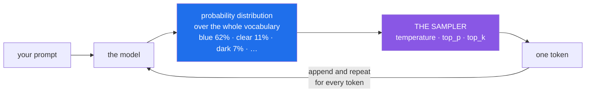

# 4.1 — The probability list nobody shows you

## One-line answer

A model does not produce a word — it produces a **score for every word it could possibly say next** —
and something separate then picks one from that list, which is why the same prompt can give different
answers and why "the model decided" is usually the wrong description of what happened.

---

## The story

A weather forecaster is asked, on air, whether it will rain tomorrow. They say yes. It does not rain.
A viewer complains that the forecaster was wrong.

The forecaster was not wrong, and the gap between what they knew and what they said is the whole
subject of this page.

What their model produced was a distribution: 70% rain, 25% cloud, 5% clear. That is a rich,
carefully-computed statement about tomorrow. What the broadcast format demanded was one word. So a
second step ran — a step that has nothing to do with meteorology — which took a spread of
possibilities and collapsed it into a single utterance.

**All the interesting information lives in the first step. All the visible behaviour comes from the
second.** And the second step is not part of the model at all: it is a policy about how to speak,
imposed on top. Change the policy and the same forecast produces a different broadcast. Always say
the most likely outcome, and you get "rain." Say something proportional to the odds, and one night in
four you get "cloudy" from an identical forecast.

The viewer thought they were arguing with the forecast. They were arguing with the presentation
policy, and nobody had ever told them it existed.

---

## The idea in plain language

When a model reads your prompt, its output at each step is **not a token**. It is a number for every
token in its vocabulary — tens of thousands of them — saying how well each would continue the text.

For the prompt *"The sky is"*, the list might begin:

| Token | Probability |
| --- | --- |
| ` blue` | 62% |
| ` clear` | 11% |
| ` dark` | 7% |
| ` falling` | 3% |
| ` a` | 2% |
| …tens of thousands more, each tiny | |

Those numbers sum to 100%. This list is called a **probability distribution**, and producing it is
the entirety of what the model does.

Then a separate step picks one. That step is **sampling**, and it is where the dials live.

Two important consequences follow immediately.

**The model is not "deciding" in any sense you would recognise.** It computes a spread; a sampler
collapses it. When people say a model "chose" a word or "wanted" to say something, they are
describing the output of a policy that was configured, often by default, often by someone who never
thought about it.

**One token at a time, then the whole thing repeats.** Having picked ` blue`, the model appends it to
the text and computes a *fresh* distribution for what follows. A hundred-token answer is a hundred
distributions and a hundred picks. This is why one unusual pick early can send an entire answer
somewhere strange: **every subsequent distribution is conditioned on the tokens already chosen.**

### Why not always take the most likely token?

You could. It is called **greedy decoding**, and it sounds obviously correct — always take the
front-runner, get the best answer.

It is not obviously correct, for a reason worth understanding. Locally-best choices do not compose
into a globally-best sentence. Greedy decoding is prone to bland, repetitive text, and it can lock
itself into loops — a phrase whose most likely continuation leads back to that same phrase. The
highest-probability *token* at each step does not produce the highest-probability *sentence*, because
the model never gets to reconsider.

So samplers introduce controlled randomness, and the dials in
[4.2](4.2-turning-the-dial.md) control how much.

---

## Why Sutra needs it

Sutra has components with genuinely opposite requirements, and the same setting cannot serve both:

- **The classifier** (Days 10–13) decides a ticket's category and urgency. Routing must be **boring
  and repeatable** — the same ticket must not land in billing on Tuesday and engineering on
  Wednesday. It wants the front-runner every time.
- **The writer** (Day 58) drafts a reply for a human to review. A little variety produces better
  prose, and a reviewer is going to read it anyway.
- **Day 79–83 (evals)** score behaviour across runs. **Evals are impossible to interpret without
  understanding this page**: if you do not know why two runs differ, you cannot tell a regression
  from a dice roll, and [4.3](4.3-stability-is-not-reproducibility.md) is about exactly that trap.
- **Day 12 (ADK-13, structured output)** asks the model for JSON. Sampling is what puts a stray token
  in the middle of your JSON, and low temperature is part of why structured output works at all.
- **Day 66 onwards (safety)** cares because randomness means a prompt that is safe in ten tests can
  produce something different on the eleventh. **A system that behaves well on average is not the
  same as one that behaves well.**

---

## The mechanism

You cannot see the distribution through this API — it returns text, not scores. So build the
intuition on a distribution you *can* see, in plain Python, with no model and no quota spent:

```python
import random

# What a model's output for "The sky is ___" might look like, simplified.
distribution = {"blue": 0.62, "clear": 0.11, "dark": 0.07, "falling": 0.03, "grey": 0.02}


def greedy(dist: dict[str, float]) -> str:
    """Always take the front-runner. Deterministic, and prone to blandness."""
    return max(dist, key=dist.get)


def sample(dist: dict[str, float]) -> str:
    """Pick proportionally to probability — the weighted dice roll."""
    return random.choices(list(dist), weights=list(dist.values()), k=1)[0]


print("greedy, 5 runs :", [greedy(distribution) for _ in range(5)])
print("sampled, 5 runs:", [sample(distribution) for _ in range(5)])
```

**Line by line:**

- `distribution = {...}` — a dict of token to probability. A real one has tens of thousands of
  entries and these five would be its head. **The shape is what matters**: one dominant candidate and
  a long tail of small ones.
- `max(dist, key=dist.get)` — returns the key with the highest value. This is greedy decoding in one
  line. Note it has no randomness at all: **same input, same output, forever.**
- `random.choices(population, weights=..., k=1)` — a **weighted** draw: `blue` is chosen about 62% of
  the time, `grey` about 2%. This is the "roll weighted dice" step. `k=1` draws one; the `[0]` unwraps
  the single-item list it returns.
- `[greedy(distribution) for _ in range(5)]` — five runs. All identical, necessarily.
- `[sample(distribution) for _ in range(5)]` — five runs. Mostly `blue`, occasionally something else.
  **Run it several times.** That variety, from an unchanging distribution, is the entire explanation
  for why a model gives different answers to the same question.
- **Note what did not change between the two functions: the distribution.** The model's actual output
  is identical in both cases. Only the picking policy differs — which is the forecaster's point,
  in code.

The dials in [4.2](4.2-turning-the-dial.md) are all modifications to this picture. Some reshape the
distribution before drawing; others discard part of it. Seeing that they operate on **the list**, not
on the model, is what makes them make sense:



---

## When it breaks

The characteristic failure is not an error — it is **a wrong mental model**, and it produces
conversations like this one:

```text
tester:    The model gave a different answer than yesterday. It's broken.
engineer:  Did the prompt change?
tester:    No.
engineer:  Then it's working. Sampling is non-deterministic by default.
```

**What it means.** Nothing malfunctioned. The distribution was probably near-identical; the draw
differed. **The reason this matters is that it destroys naive testing**: an assertion like
`assert answer == "blue"` will pass repeatedly and then fail, and the failure will be attributed to
whatever was deployed most recently rather than to the dice.

**Greedy decoding stuck in a loop** — the reason "always take the front-runner" is not free:

```text
prompt: List three benefits of exercise.
output: Exercise is good for you. Exercise is good for you. Exercise is good
        for you. Exercise is good for you. Exercise is good for you.
```

**What it means.** The most likely token after that phrase was the start of the same phrase, and with
no randomness there is nothing to break the cycle. **This is the failure sampling exists to prevent**,
and it is why temperature 0 is a tool rather than a default.

**A single unlucky token derailing an entire answer:**

```text
{"category": "billing", "urgency": "high", "summary": "Customer cannot log in
after switching tabs, which reminds me of a story about a lighthouse keeper…
```

**What it means.** One low-probability token got drawn early, and **every subsequent distribution was
conditioned on it.** The model is not confused; it is coherently continuing the text it now finds
itself in. This is why structured output (Day 12) uses low temperature, and why a schema constraint
is better than hoping.

---

## In production

**What a professional does is set sampling per task and write down why.** A single project-wide
temperature is a smell: classification, extraction and structured output want determinism, while
drafting and brainstorming want variety. The value should live next to the call, chosen for the job,
with a comment giving the reason — because six months later somebody will want to change it and the
only thing worse than a magic number is a magic number nobody dares touch.

**What degrades at scale is your ability to reason about incidents.** With sampling on, a bad output
may be a bug, a prompt regression, a model update, or a low-probability draw that will not recur.
**Distinguishing those requires many runs, not one**, so mature teams log the sampling settings
alongside every response and re-run failures several times before opening an investigation. "It did
it once" is not a reproduction, and treating it as one sends engineers chasing ghosts.

**The failure that only appears with real traffic** is the long tail becoming certain. A one-in-ten-
thousand unlucky draw is invisible in testing — you will never see it in a hundred runs. At a million
requests a day it happens a hundred times a day, *every* day. Whatever your worst-case output is,
**at volume it is not a possibility, it is a schedule.** This is the argument for constraints that are
structural rather than probabilistic: a JSON schema the decoder must satisfy, a validation layer that
rejects malformed output, an allow-list for categories. **Do not sample your way to safety.**

**The review comment a senior engineer leaves:** *"`temperature=0.9` on the classifier — was that
deliberate? Routing should be repeatable, and at 0.9 the same ticket can land in two different queues
on two different days. Also this test asserts exact string equality against a sampled output; it will
pass in CI until it doesn't and then someone will spend a morning on it."*

**The interview question.** *"Why does an LLM give different answers to the same question?"* The
answer to avoid is anything involving the model "changing its mind." What is wanted: the model
produces a **probability distribution over next tokens**, and a separate sampling step picks from it —
so the variation comes from the picking policy, not from the model, and it is configurable. The
follow-up that separates people is *"so how do you test it?"* Not with string equality. You test
**properties** — is it valid JSON, is the category one of the five allowed values, does it cite a
source — and you score behaviour across many runs rather than asserting one exact output. That is
precisely why Phase 12 builds evals instead of adding assertions.

---

## Check yourself

```bash
uv run python -c "
import random
d = {'blue': 0.62, 'clear': 0.11, 'dark': 0.07, 'falling': 0.03, 'grey': 0.02}
print('greedy :', [max(d, key=d.get) for _ in range(8)])
print('sampled:', [random.choices(list(d), weights=list(d.values()))[0] for _ in range(8)])
"
```

Run it four or five times. The greedy row never changes. The sampled row is mostly `blue` with
occasional visitors — and **the distribution was identical every single time.**

**Answer out loud, without scrolling up:**

> Explain to someone who has never heard of it why the same prompt can produce two different answers,
> without saying the model "decided" anything. Then give the reason greedy decoding — always taking
> the most likely token — is not simply the best strategy.

---

**Next:** [4.2 — Turning the dial](4.2-turning-the-dial.md)
