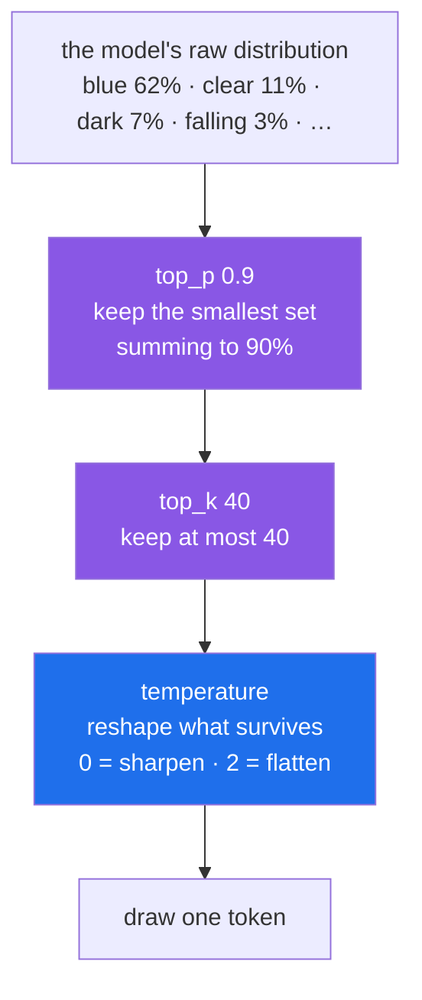

# 4.2 — Turning the dial: temperature, top_p, top_k, and watching them move

## One-line answer

**Temperature** reshapes the probability list to make underdogs more or less likely, while **top_p**
and **top_k** delete the tail of the list before anything is drawn — and the reason to know all three
is that they solve different problems and are routinely confused for each other.

---

## The story

A recruiting manager gives an assistant a stack of two hundred applications and one instruction:
*"pick someone."*

Three assistants, three interpretations.

**The first** takes the top-ranked application every time. Perfectly consistent, and after a year
every hire looks the same, because the ranking criteria have quietly become the only criteria.

**The second** keeps only the top ten and picks among those, roughly by rank. Consistent enough,
still varied, and — crucially — **the person ranked 187th is never hired.** They are not unlucky.
They were removed from consideration before any choosing happened.

**The third** shuffles the whole stack so that ranking matters less, then draws. Occasionally
brilliant, occasionally the 187th applicant, and nobody can predict which.

Now the important part. Ask each assistant to be "less random" and they will do different things. The
first has nothing to change. The second will shorten the shortlist. The third will make the shuffle
gentler. **Same request, three different mechanisms, three different outcomes** — and if you conflate
them, you will ask for one and get another.

Temperature is the shuffle. Top-k is the shortlist by count. Top-p is the shortlist by cumulative
merit. They are not three names for one dial.

---

## The idea in plain language

[4.1](4.1-the-probability-list.md) established that the model emits a probability list and a sampler
picks from it. These three settings act on that list, at two different moments.

### Temperature — reshaping the list

**Temperature** flattens or sharpens the distribution *before* anything is drawn.

- **Low** (approaching 0) sharpens it. The front-runner's lead grows; underdogs shrink toward
  nothing. At 0 you get greedy decoding — always the top token.
- **Around 1.0** leaves the model's own probabilities roughly as computed.
- **High** (toward 2.0) flattens. A token at 3% becomes meaningfully more likely to win.

The mental image: **temperature is how hard you shake the stack before drawing.** Nothing is removed;
the odds are redistributed.

### Top-k — a shortlist by count

Keep only the *k* highest-probability tokens, discard everything else, then sample among the
survivors. `top_k=1` is greedy. `top_k=40` means "the best forty are eligible, the rest cannot
happen."

**Crude but predictable.** Its flaw is that it ignores the shape of the distribution: forty
candidates is far too many when one token has 95% of the mass, and probably too few when the model is
genuinely torn between hundreds.

### Top-p — a shortlist by cumulative probability

Also called **nucleus sampling**. Go down the list adding probabilities until they reach *p*, keep
those tokens, discard the rest.

`top_p=0.9` means "keep the smallest set of tokens that together account for 90% of the probability."
**The shortlist resizes itself**: when the model is confident, that might be two tokens; when it is
uncertain, two hundred. This adaptiveness is why top-p is generally preferred to top-k.

| Setting | Acts by | Shortlist size | Typical use |
| --- | --- | --- | --- |
| `temperature` | Reshaping odds | Unchanged — nothing removed | The main dial you touch |
| `top_k` | Truncating by count | Fixed | Rarely tuned by hand now |
| `top_p` | Truncating by mass | Adapts to confidence | A sane guardrail, left near 0.95 |

### And a fourth dial that is not a sampler at all

`thinking_level` from [2.3](../02-tokens-the-meter/2.3-the-thinking-tax.md) sits in the same
`generation_config` and is easy to lump in with these. It is a different kind of thing entirely:
sampling controls **how a token is picked**, thinking controls **how much reasoning happens before
tokens are picked at all.** They are independent, and conflating them leads to trying to fix a quality
problem with temperature when the answer was reasoning budget.

### The practical advice

**Tune temperature. Set top_p once and leave it. Ignore top_k unless you have a specific reason.**
Moving temperature and top_p together makes the effect of each impossible to attribute, which is the
most common way people end up with a configuration nobody understands.

---

## Why Sutra needs it

Every component in Sutra has a defensible setting, and they are not the same:

| Component | Day | Setting | Why |
| --- | --- | --- | --- |
| Classifier | 10–13 | `temperature=0` | Routing must be repeatable — same ticket, same queue |
| Structured output | 12 | `temperature=0` | One stray token invalidates the JSON |
| Researcher | 58 | moderate | Framing a query several ways finds more |
| Writer | 58 | `~0.7` | Drafts a human reviews; variety reads better |
| Evals | 79–83 | fixed and recorded | A varying setting makes scores unattributable |

- **Day 12 (ADK-13)** depends on this most sharply: structured output at high temperature produces
  malformed JSON, and the fix is a setting rather than a better prompt.
- **Day 79–83** cannot interpret a score without knowing the sampling configuration that produced it,
  which is why the settings belong in the eval record.

---

## The paper behind it

> **The Curious Case of Neural Text Degeneration**
> `arXiv:1904.09751` · 2019
> <https://arxiv.org/abs/1904.09751>

It claimed something that reads like a paradox: always choosing the most likely next word produces
repetitive, inhuman text — so the fix is to delete the tail of the list, not to reshape it.

**Taught in full in [*The Curious Case of Neural Text Degeneration*](../../papers/03-neural-text-degeneration.md)**, in this day's `papers/` directory — including
a reproduction of the repetition loop you can run offline, and why `top_p` is not a second temperature.

---

## The mechanism

Watch the dial move, using the door from
[1.5](../01-first-contact/1.5-the-only-door-429.md):

```python
def demo_sampling(client: genai.Client) -> None:
    """Same prompt, two temperatures, three runs each.

    Usage:  uv run python -m sutra.mechanics sampling     (6 model calls — mind the RPM)
    """
    prompt = "Invent a name for a new shade of blue paint. Two words, nothing else."

    for temperature in (0.0, 1.6):
        answers = []
        for _ in range(3):
            interaction = ask(
                client,
                prompt,
                config={"temperature": temperature, "thinking_level": "low"},
            )
            answers.append((interaction.output_text or "").strip())
        print(f"temperature={temperature}: {answers}")
```

**Line by line:**

- `prompt = "Invent a name for a new shade of blue paint..."` — **the prompt choice is the lesson
  here.** An obvious question like "name a colour" has one overwhelming front-runner, so flattening
  the odds changes nothing visible and the demo appears to fail. An *open* task spreads the
  probability mass across many good answers, which is where temperature has something to work with.
  If your dial seems dead, suspect the prompt before the parameter.
- `for temperature in (0.0, 1.6)` — the two ends. `0.0` is greedy; `1.6` is well up the range.
- `config={"temperature": temperature, "thinking_level": "low"}` — **two settings, and the second
  is doing quiet but essential work.** A thinking model reasons its way to an answer *before*
  sampling, which peaks the distribution and suppresses the very variety you are trying to observe.
  Turning reasoning down lets the dial show its effect. This interaction between the two settings is
  not obvious and costs people a confusing afternoon. `low` is the floor on `gemini-3.7-flash`; the
  lower `minimal` exists on other models and is a 400 here
  ([2.3](../02-tokens-the-meter/2.3-the-thinking-tax.md)).
- `(interaction.output_text or "").strip()` — **the `or ""` guard again.** As
  [1.4](../01-first-contact/1.4-the-first-interaction.md) and
  [2.2](../02-tokens-the-meter/2.2-reading-the-receipt.md) both warned, `output_text` can be `None`
  on a successful call, and `.strip()` on `None` raises `AttributeError`.
- `for _ in range(3)` — **three runs per setting, because one run shows nothing.** With sampling you
  are observing a distribution, and a single draw is not evidence about it. This is the same instinct
  that makes evals score across many cases.
- **Six calls total.** On a free tier with a low per-minute ceiling this demo alone may trip a 429 —
  in which case you get to watch [1.5](../01-first-contact/1.5-the-only-door-429.md)'s wrapper wait
  out the server's stated delay, which is worth seeing at least once.

Register it:

```python
demos = {
    "ask": demo_ask,
    "tokens": demo_tokens,
    "thinking": demo_thinking,
    "memory": demo_memory,
    "server": demo_server_state,
    "sampling": demo_sampling,
}
```

**Line by line:**

- Sixth entry. Same dict, no new structure.



Note the order: **truncation happens first, then reshaping.** A token top-p discarded cannot be
resurrected by any temperature, which is the mechanical reason the recruiting manager's second and
third assistants behave differently.

---

## When it breaks

**The dial that appears to do nothing** — the most common surprise on this page:

```text
temperature=0.0: ['Ocean Whisper', 'Ocean Whisper', 'Ocean Whisper']
temperature=1.6: ['Ocean Whisper', 'Ocean Whisper', 'Ocean Whisper']
```

**What it means, and it is usually not a bug.** Three candidate explanations, worth telling apart:
the prompt has one overwhelming front-runner so flattening changes nothing; **thinking is on**, so
the model deliberated its way to the same answer before any sampling occurred; or the parameter never
reached the model because `ask` dropped `config` instead of forwarding it to `generation_config`.
**Check the third first** — it is the only one that is actually broken — by passing a deliberately
absurd temperature and seeing whether anything changes at all.

**The value the API refuses:**

```text
google.genai.errors.ClientError: 400 INVALID_ARGUMENT. {'error': {'code': 400,
'message': 'Unable to submit request because it has a temperature value of 3 but
the supported range is from 0 (inclusive) to 2 (exclusive). Update the value and
try again.', 'status': 'INVALID_ARGUMENT'}}
```

**What it means.** Temperature is bounded, and the bound is provider-specific. Note `2 (exclusive)` —
you cannot pass exactly 2. **A `400` is about your request**, so
[1.5](../01-first-contact/1.5-the-only-door-429.md)'s door re-raises immediately rather than
retrying, which is right: it will be just as invalid next time.

**High temperature meeting structured output** — the failure Day 12 exists to prevent:

```text
temperature=1.5, asked for JSON:
{"category": "billing", "urgency": "high", "summary": "Customer's card was
declined thrice — perhaps the moon was in retrograde!", "confidence": 0.8,}
```

**What it means.** Look at the trailing comma before the closing brace. `json.loads` will reject the
whole thing. **One improbable token, drawn once, invalidated the entire response** — and the content
was otherwise fine, which is what makes this maddening. Low temperature reduces it; a schema
constraint (Day 12) removes it. **Do not try to fix this with a sterner prompt.**

**The two dials moved together:**

```text
temperature=0.3, top_p=0.5  ->  bland
temperature=1.4, top_p=0.99 ->  chaotic
```

**What it means.** You changed both, so you cannot attribute either effect and you have no idea which
direction to move next. **Move one dial at a time**, which is the same discipline as any other
experiment.

---

## In production

**What a professional writes instead of a bare number is a named configuration per task** —
`CLASSIFIER_CONFIG`, `DRAFT_CONFIG` — defined in one place, with a comment giving the reason, and
referenced at the call sites. Two properties matter: the setting is **discoverable** (someone asking
"why is this deterministic?" finds an answer, not a literal), and it is **changeable in one place**
when an eval says it should move.

**What degrades at scale is attribution.** Sampling settings interact with prompt version, model
version and thinking level, so a quality change has four candidate causes. Teams that do not log all
four alongside each response end up unable to answer "what changed?" — and the honest answer becomes
"something, six weeks ago." **Log the generation config with the response**, or accept that your
quality investigations will be archaeology.

**The failure that only appears with real traffic** is the rare malformed output. At temperature 0.7,
a JSON response might be malformed once in two thousand calls. Your test suite of fifty cases will
never see it. In production it is dozens of failures a day, arriving as a mysterious low-rate parse
error that nobody can reproduce because **it is not deterministic and never was.** The instinct to
develop: when an error rate is low, non-zero, and unreproducible, suspect sampling before you suspect
your parser — then fix it structurally, with a schema, rather than by nudging temperature down and
hoping.

**The review comment a senior engineer leaves:** *"`temperature=0.9` and `top_p=0.6` — where did
these come from? Moving both means we can't attribute the behaviour to either. Pick one to tune,
leave top_p at the default, and put the eval number that justified it in the comment. Also the
classifier and the drafter share this config object and they want opposite things."*

**The interview question.** *"What's the difference between temperature and top_p?"* This question is
specifically checking whether you know they are different mechanisms rather than two names for
"randomness." The answer: **temperature reshapes the probability distribution** — flattening it makes
unlikely tokens more likely, and nothing is removed — whereas **top_p truncates it**, keeping only
the smallest set of tokens whose probabilities sum to *p* and discarding the rest before any draw
happens. Hence the practical rule: tune one, usually temperature, and leave the other at a sane
default, because moving both makes the effect of each unattributable. The detail that ends it well:
noting that on a reasoning model, **thinking level can matter more than either** — the model
deliberates before sampling, which peaks the distribution, so a temperature change can appear to do
nothing at all.

---

## Check yourself

```bash
uv run python -m sutra.mechanics sampling
```

Temperature 0.0 should give three identical answers. If 1.6 also gives three identical answers, work
through the three explanations in *When it breaks* and determine which one you are looking at — that
diagnosis is the actual exercise here.

**Answer out loud, without scrolling up:**

> Explain the difference between temperature and top_p as *mechanisms*, not as amounts of randomness.
> Then say which one you would set for Sutra's ticket classifier and why the writer wants something
> different — and name the third setting that could make both dials look broken.

---

**Next:** [4.3 — Stability is not reproducibility](4.3-stability-is-not-reproducibility.md)
