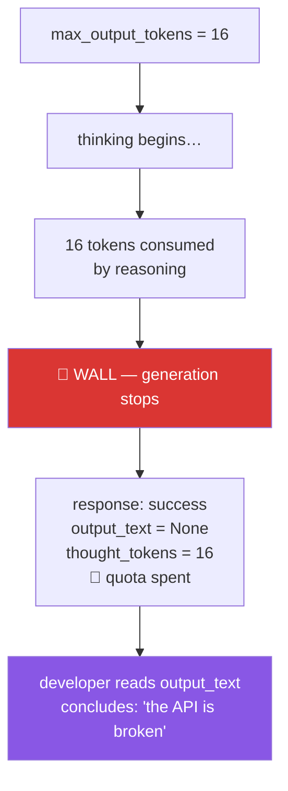

# 5.1 — 💥 Failure lab: the cap that ate the answer

## One-line answer

Set `max_output_tokens` small on a thinking model and you will get a **successful call with no answer
in it** — because the reasoning spends the budget before the visible text gets any, and the cap is a
wall rather than an instruction.

---

## The story

🎬 **The scene.** A summarisation feature is going out. It works well, but a few responses ramble
longer than the UI can display, so the fix is obvious and takes one line: cap the output. Sixteen
tokens is plenty for a one-line summary.

😬 **The naive fix.** Some responses come back empty. The natural reading is that the model has
misunderstood, so the prompt gets firmer — *"Answer in ONE short sentence. BE BRIEF."* — and the cap
gets nudged to twenty-four. A few more responses arrive. Most are still empty. The prompt gets
firmer again. Someone suggests the model is broken and files a support ticket.

💥 **Why it fails.** The model reasons before it answers, that reasoning is generated as tokens, and
on this model family **`max_output_tokens` caps reasoning and answer together.** The sixteen tokens
were spent thinking, silently, before a single visible word was produced. Then generation stopped —
at the wall, mid-thought — and the response came back successful, with nothing in it. Every prompt
revision was addressed to a model that never got far enough to read its instruction as an
instruction about length.

The bill for those empty responses is not zero. It is close to the full sixteen tokens each time.
**They paid for the thinking and received the silence.**

💡 **The insight.** A token cap is not a request for brevity — **it is a guillotine.** The model does
not plan its answer to fit; it generates until it is cut off. Brevity is a property you ask for in
the prompt, where the model can act on it. A cap is a runaway-protection mechanism, and on a thinking
model it protects you from an answer as readily as from a runaway.

---

## The idea in plain language

Two ways to control output length, and they are not variations on one another:

| | The prompt | `max_output_tokens` |
| --- | --- | --- |
| What it is | A request the model plans around | A hard stop applied during generation |
| When it acts | Before and during generation | The instant the count is reached |
| Result when it binds | A short, complete answer | A truncated or **absent** one |
| Use it for | Brevity | Protection against runaway cost |

The wrinkle that makes this a failure lab rather than a footnote is documented in the SDK's own issue
tracker ([python-genai#2062](https://github.com/googleapis/python-genai/issues/2062)):

> `max_output_tokens` caps thinking **plus** output combined on Gemini 3 models — contrary to the
> documentation, which describes them as separate budgets.

Read that as an engineer rather than as a reader: **the documented behaviour and the observed
behaviour differ, and the observed behaviour is the one your users get.** This is why Principle 8
says verify against the live source on the day you use it, and why this day's hub §8 lists the pages
and issues actually read.

The failure has a particularly nasty shape:

- **No exception is raised.** The call succeeds.
- **`output_text` is `None`** — not empty string, not an error object.
- **Your quota is spent.** You paid for the reasoning.
- **The evidence is in the receipt**, in `total_thought_tokens`, which most code never prints.

Every one of those four properties conspires to send you looking in the wrong place. Code that reads
only `output_text` sees `None` and concludes the API is broken.

---

## Why Sutra needs it

- **Day 12 (ADK-13, structured output)** constrains what the model emits. Anyone reaching for a token
  cap to keep JSON small will land here exactly.
- **Day 24 (OPS-07, AG-11)** builds budgets. **A cap is the most tempting budget instrument and the
  worst one** — it converts overspend into invisible failure. Rate limiting and prompt design are the
  right levers.
- **Day 79–83 (evals)** run on small budgets. An eval whose model got capped mid-thought scores zero
  and looks like a quality regression, sending someone to investigate a prompt that was fine.
- **Principle 10 — fail honestly.** This is the day's clearest case: a `None` that looks like an
  answer is the fabricated result the principle forbids, and the defence is reading the receipt.
- **Every day carries a deliberate failure** (plan §17.7). This is Day 2's, and you should run it
  rather than read it.

---

## The mechanism

Reproduce it on purpose. Add this demo, run it, and read the receipt:

```python
def demo_capped(client: genai.Client) -> None:
    """Failure lab: a tiny max_output_tokens meets a thinking model.

    Usage:  uv run python -m sutra.mechanics capped     (2 model calls)
    """
    prompt = "Explain why the sky is blue."

    for cap in (16, 400):
        interaction = ask(client, prompt, config={"max_output_tokens": cap})
        usage = interaction.usage
        print(f"--- max_output_tokens={cap} ---")
        print("  text          :", repr(interaction.output_text))
        print("  thought tokens:", usage.total_thought_tokens)
        print("  output tokens :", usage.total_output_tokens)
```

**Line by line:**

- `prompt = "Explain why the sky is blue."` — an **open** question, deliberately. It invites
  reasoning, which is what makes the cap bite. A closed question like "what is 2+2" may squeak
  through and hide the effect.
- `for cap in (16, 400)` — the broken case **and the working one, in the same run.** Seeing only the
  failure teaches half the lesson; the contrast is what makes the cause unambiguous.
- `config={"max_output_tokens": cap}` — the cap, passed through
  [1.5](../01-first-contact/1.5-the-only-door-429.md)'s `ask` into `generation_config`.
- `repr(interaction.output_text)` — **`repr`, not the bare value.** This matters: `print(None)`
  displays as an empty line that looks like a blank answer, while `repr` shows the literal `None`.
  When you are diagnosing an absence, you need to see the difference between `None`, `''` and `' '`.
- `usage.total_thought_tokens` — **the evidence.** On the capped run this will be non-trivial while
  output tokens are zero or near it. That single pair of numbers is the entire diagnosis, and it is
  invisible to any code that prints only the text.
- **Two calls, so two units of quota.** Worth it: this is the demo you will remember.

Register it:

```python
demos = {
    "ask": demo_ask,
    "tokens": demo_tokens,
    "thinking": demo_thinking,
    "memory": demo_memory,
    "server": demo_server_state,
    "sampling": demo_sampling,
    "capped": demo_capped,
}
```

**Line by line:**

- Seventh and final entry for this day.

Now the fix, which is not a bigger cap:

```python
    # The right instrument: ask for brevity, and keep the cap as a runaway guard.
    interaction = ask(
        client,
        "Explain why the sky is blue. Answer in one short sentence.",
        config={"max_output_tokens": 400, "thinking_level": "low"},
    )
    print("  brief answer  :", interaction.output_text)
```

**Line by line:**

- `"... Answer in one short sentence."` — **brevity in the prompt**, where the model can plan for it.
  This is the actual control for length.
- `"max_output_tokens": 400` — the cap stays, but set **generously**, high enough that it never binds
  on a normal answer. Its job is to stop a runaway, not to shape output. **A limit that fires
  routinely is not a safety limit; it is a bug.**
- `"thinking_level": "low"` — reduce the reasoning so less of the budget goes to invisible work.
  From [2.3](../02-tokens-the-meter/2.3-the-thinking-tax.md), and the correct instrument when the
  problem is that thinking is consuming the budget. **`low`, not `minimal`:** this model has no
  `minimal`, and asking for one is a 400 rather than the nearest available level.
- **Three changes, three different jobs.** The prompt controls length, the cap prevents disaster, and
  the thinking level controls the invisible half. Reaching for one to do another's work is the
  mistake this whole page documents.



---

## When it breaks

**The failure itself, which is the point of the exercise:**

```text
--- max_output_tokens=16 ---
  text          : None
  thought tokens: 16
  output tokens : 0
--- max_output_tokens=400 ---
  text          : Sunlight contains all colours, and the shorter blue wavelengths
                  scatter far more strongly off air molecules than longer red ones,
                  so light reaching your eye from all over the sky is dominated by blue.
  thought tokens: 173
  output tokens : 44
```

**What it means.** Read the two `thought tokens` figures together. In the capped run, **every single
token of the budget went to reasoning** and the wall arrived before one visible word. In the second,
the model thought for 173 tokens and then wrote 44 — which would have needed a budget of at least
217, roughly fourteen times the cap that was set. **No amount of prompt rewording would have fixed
the first case.**

**The variant that is even more confusing** — a cap that is nearly enough:

```text
  text          : 'Sunlight contains all colours, and the shorter blue wavel'
  thought tokens: 173
  output tokens : 27
```

**What it means.** Truncated mid-word. This one at least *looks* wrong, so it gets diagnosed quickly.
The empty case is more dangerous precisely because it looks like a different bug entirely.

**The downstream damage, which is the real cost:**

```text
Traceback (most recent call last):
  File "sutra/triage.py", line 44, in classify
    return json.loads(interaction.output_text)
TypeError: the JSON object must be str, bytes or bytearray, not NoneType
```

**What it means.** The `None` travelled. The parse fails several layers from the cause, and the
traceback points at your JSON handling rather than at a generation config set in a different file.
**This is what makes the failure expensive** — not the empty response, but how far it gets before
anything notices. The defence is checking the receipt at the call site, which is why
[2.2](../02-tokens-the-meter/2.2-reading-the-receipt.md) insisted on reading `usage` on every call.

---

## In production

**What a professional writes instead of a tight cap** is a generous cap plus a length instruction in
the prompt plus an explicit check on the finish reason. The cap exists so that a pathological input
cannot generate ten thousand tokens; it is not the mechanism for shaping normal output. **The check
on the finish reason is the part most people omit** — it is what distinguishes "the model finished"
from "the model was cut off", and without it a truncated answer is indistinguishable from a complete
one to every layer downstream.

**What degrades at scale is that this failure is input-dependent, so it arrives gradually.** A cap of
200 is generous for most tickets and binding for the ten per cent that are complicated. Those are
disproportionately your important tickets — long, multi-part, from frustrated customers. **Your
system fails preferentially on the cases that matter most**, at a low enough rate that the aggregate
error metric barely moves. The tell is a quality complaint that correlates with input length, and it
is worth knowing that shape because it recurs: **limits calibrated on typical inputs fail on
atypical ones, and atypical usually means important.**

**The failure that only appears with real traffic** is the interaction between this and a retry. The
capped call returns `None`, some wrapper treats that as a transient failure and retries, the retry is
capped identically and returns `None` again, and now you are paying three times for three empty
answers before surfacing an error that was never transient.
[1.5](../01-first-contact/1.5-the-only-door-429.md) drew this line deliberately: retry the errors
that are about *timing*. A `None` from a cap is about your configuration, and no number of retries
will change a configuration.

**The review comment a senior engineer leaves:** *"`max_output_tokens=50` to keep summaries short —
this is a thinking model, so that budget covers reasoning too and we'll get empty responses on
anything non-trivial. Put the length instruction in the prompt, raise the cap to something that only
fires on a runaway, and check the finish reason before we parse. Right now a truncated answer and a
complete one look identical to everything downstream."*

**The interview question.** *"You set a token limit and started getting empty responses. What's
happening?"* This question is testing whether you have operated a reasoning model. The answer:
thinking models generate internal reasoning tokens before the visible answer, and the output cap
covers both — so a small cap is consumed by reasoning and generation stops before any visible text,
returning a **successful** call with `None` text and real quota spent. The diagnosis is reading the
usage receipt, where thought tokens will be at the cap and output tokens at zero. Then the sentence
that ends it well: **a token cap is runaway protection, not a brevity instruction** — brevity belongs
in the prompt, where the model can plan around it, and the cap should be set high enough that it
never fires in normal operation, because a safety limit that fires routinely has stopped being a
safety limit.

---

## Check yourself

```bash
uv run python -m sutra.mechanics capped
```

You should see `None` for the capped run and a real answer for the generous one — with the thought
tokens explaining the difference. **If both runs return text, raise the cap's severity** (try 8) until
you have watched it happen, because reading about this is not the same as seeing your own quota buy
you nothing.

**Answer out loud, without scrolling up:**

> A colleague says "the API is broken, it returns nothing." Give the two fields you would ask them to
> print, and say what each would tell you. Then explain why a token cap is the wrong tool for
> brevity, and what the right tool is.

---

**Next:** [6.1 — 🅿️ `generate_content`, the legacy door](../06-the-legacy-door/6.1-generate-content-parked.md)
