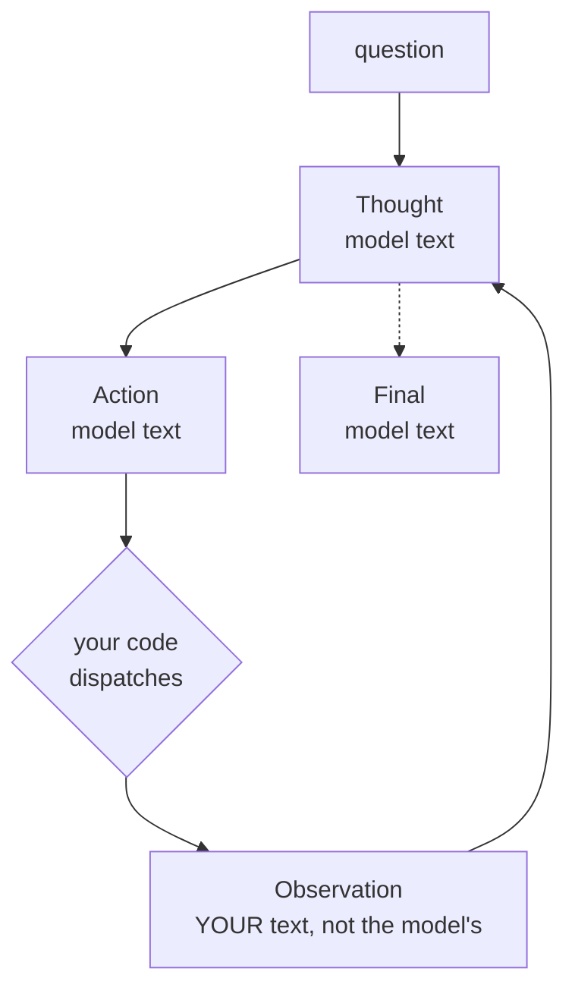

# *ReAct: Synergizing Reasoning and Acting in Language Models* — the loop you just built

## One-line answer

The think → act → observe loop you hand-rolled today is a 2022 paper almost line for line, and its
finding was not *"let the model use tools"* — it was that **reasoning and acting are worse
separately than together**, which is why your `SYSTEM` prompt asks for a thought before every
action.

---

## The story

By late 2022 there were two research communities solving what looked like two problems.

One had discovered that if you make a model write out its reasoning, it gets much better at
multi-step problems. That work is the [chain-of-thought paper](../../day-02-llm-mechanics/papers/02-chain-of-thought-prompting.md)
you read yesterday. It produced models that could reason beautifully about a question — and were
sealed in a box. Whatever the model believed at the start was all it had. If it was wrong about a
fact, it reasoned impeccably from the wrong fact to a confidently wrong answer, and nothing in the
method could catch that.

The other community had models that could *act*: emit a command, have a program run it, get a
result. These systems could look things up, so they were not stuck with what they happened to know.
But they acted the way someone works through a checklist — one command, then the next, with no
visible account of why. When a lookup returned something unexpected, there was no mechanism for
noticing. The plan had been fixed before the surprise arrived.

Stated side by side, the two failures are almost comically complementary. **Reasoning without acting
cannot check anything. Acting without reasoning cannot adapt.**

The paper's move is to interleave them in a single stream: think, act, observe what came back,
think again about what it means, act again. Not reasoning *then* acting. Alternating, with each one
feeding the other.

---

## The idea in plain language

The method is a loop with three kinds of turn, and the model produces the first of them as ordinary
text:

| Turn | Who writes it | What it is |
| --- | --- | --- |
| **Thought** | the model | one sentence of reasoning about what to do next and why |
| **Action** | the model | the tool call it wants, written as text |
| **Observation** | **your code** | what actually came back — never the model |

The model writes a thought and an action, then stops. Your program executes the action, appends the
real result as an observation, and hands the whole growing transcript back. The model reads its own
previous reasoning alongside the actual outcome, and writes the next thought.

Two things about this are easy to miss.

**The thought is not decoration or logging.** It is text in the transcript, so it becomes part of
what the model conditions on at the next step. This is the same mechanism as chain-of-thought — the
model's own output becomes its input — but now with real observations interleaved, so the reasoning
is repeatedly confronted with facts it did not generate.

**The observation is the only thing in the loop the model did not write.** Everything else is the
model's own text. That single asymmetry is what makes the system able to be *wrong and then
corrected*, and it is why your code and not the model must produce it.

The paper's result is that this beats both of its ingredients on their own — better than
chain-of-thought alone on knowledge tasks, better than action-only on interactive ones — and it
does it by prompting, with no fine-tuning.

---

## Why Sutra needs it

You did not read this paper and then build the loop. You built the loop, badly at first, and are
reading the paper afterwards. That is Principle 4, and it means the mapping should be almost
uncomfortable:

- [Part 1.1](../parts/01-loop-anatomy/1.1-the-navigator-and-the-driver.md) — "the model proposes,
  your code executes, the model never touches the world" is the Thought/Action/Observation split.
- [Part 1.2](../parts/01-loop-anatomy/1.2-the-transcript-is-the-world.md) — "the transcript is what
  gets smarter" is the paper's core mechanism restated.
- [Part 3.1](../parts/03-the-protocol/3.1-a-contract-enforced-by-politeness.md) — your `SYSTEM`
  prompt asks for a thought before an action. Now you know that is not a stylistic preference; it
  is the finding.
- [Part 2.3](../parts/02-tools-and-dispatch/2.3-a-failed-tool-is-an-observation.md) — a tool failure
  written back as an observation rather than raised as an exception is the paper's design, and the
  reason your agent can recover from a bad lookup at all.

It also frames what comes next. [Part 7.1](../parts/07-the-text-protocol-ceiling/7.1-what-a-schema-would-have-caught.md)
lists what a line of text cannot express — and every one of those limits is a limit of *this
paper's* text protocol. Day 4 replaces the text channel with a schema; Day 53 replaces the single
loop with several agents. Both are departures from a design you can now name.

---

## The mechanism

One question, one transcript, and the alternation running down it:

```text
Question: why is ticket T-1042 still open?

Thought: I do not know what T-1042 says. I should read it before guessing.
Action: lookup_ticket[T-1042]
Observation: "Customer cannot log in. Redirect loop after SSO. Escalated 3 days ago."

Thought: This is an SSO redirect loop. I should check whether the knowledge base has a known fix.
Action: search_kb[SSO redirect loop]
Observation: "KB-88: SSO redirect loops are usually a clock skew between IdP and SP."

Thought: I now have both the symptom and a likely cause, which is enough to answer.
Final: T-1042 is an SSO redirect loop, and KB-88 attributes those to clock skew.
```

**Line by line:** the first `Thought` is doing real work — it says *I do not know*, which is what
prevents an immediate guess. Each `Observation` is text your program wrote, not the model. And the
loop ends because the model emitted `Final:`, not because a counter ran out — though a counter must
exist anyway, which is [part 5.1](../parts/05-containment/5.1-the-step-budget.md).

Now the same question with reasoning removed — the act-only ablation the paper compares against:

```text
Question: why is ticket T-1042 still open?

Action: search_kb[T-1042]
Observation: no knowledge base article matches "T-1042".
Action: search_kb[ticket T-1042]
Observation: no knowledge base article matches "ticket T-1042".
Action: search_kb[T-1042 status]
Observation: no knowledge base article matches "T-1042 status".
```

**Line by line:** the failure is not that it picked a bad first tool — that is an easy mistake to
make. It is that **nothing in the transcript reacts to the miss.** Three observations say the same
thing and the fourth action is a fourth rephrasing, because there is no turn in which the model
writes *"the knowledge base does not hold ticket records; I should use the ticket tool"*. Without a
thought turn, the observation has nowhere to land.



The dotted edge matters: the loop leaves through the model's own decision, and the solid cycle is
the only path that touches the world.

---

## The paper in one demo

Two files. The only variable is whether the model is asked for a thought before each action.

```text
lab/papers/react/
├── prompts.py   the two system prompts - the entire experiment
└── run.py       the same question through the same tools, and the switch
```

**Line by line:** this demo needs a live model — the paper's claim is about what a model does when
given room to reason, and no offline stand-in can produce that honestly. It reuses the tools and the
dispatcher you built today, plus `ask` from
[Day 2 part 1.5](../../day-02-llm-mechanics/parts/01-first-contact/1.5-the-only-door-429.md), so
the 429 handling is already correct. Budget: up to **12 requests** — six steps in each condition —
against a free tier of 20 a day, so run it once and read carefully.

```python
"""The two system prompts. The only difference is whether a Thought is required."""

QUESTION = "why is ticket T-1042 still open?"

REACT = """You answer questions using tools, one step at a time.

Each turn, write exactly two lines:
THOUGHT: one sentence about what you need next and why
ACTION: tool_name[argument]

When you can answer, write instead:
FINAL: your answer

Tools: lookup_ticket[id], search_kb[query]"""

ACT_ONLY = """You answer questions using tools, one step at a time.

Each turn, write exactly one line:
ACTION: tool_name[argument]

When you can answer, write instead:
FINAL: your answer

Tools: lookup_ticket[id], search_kb[query]"""
```

**Line by line:**

- `QUESTION` — held constant across conditions, and chosen so the *wrong* first tool is genuinely
  tempting: the question mentions a ticket, and there are two tools that plausibly relate to it.
- `REACT` and `ACT_ONLY` — identical prompts except for the `THOUGHT:` line and the "two lines"
  versus "one line" instruction. Same tools, same output format, same closing rule. Everything
  else being equal is what makes this an ablation.
- `THOUGHT: one sentence about what you need next and why` — **the paper's entire intervention**, in
  one instruction. Note it asks for *and why*: a thought that only restates the plan adds no new
  information to the transcript.
- `Tools: lookup_ticket[id], search_kb[query]` — the same menu in both, so a difference in outcome
  cannot be blamed on one condition being told about a tool the other was not. Your
  [`_menu_is_complete()`](../parts/03-the-protocol/3.1-a-contract-enforced-by-politeness.md) check
  exists because this is easy to get wrong.

```python
"""ReAct, and the ablation that removes the reasoning."""

from google import genai

from sutra.loop import _dispatch
from sutra.mechanics import ask

from prompts import ACT_ONLY, QUESTION, REACT

REASONING = True
MAX_STEPS = 6


def main() -> None:
    client = genai.Client()
    system = REACT if REASONING else ACT_ONLY
    transcript = f"{system}\n\nQuestion: {QUESTION}\n"

    print(f"REASONING = {REASONING}   max_steps = {MAX_STEPS}")
    for step in range(MAX_STEPS):
        reply = ask(client, transcript, config=None, store=None).text.strip()
        print(reply)
        transcript += reply + "\n"
        if "FINAL:" in reply:
            print(f"--- finished in {step + 1} steps ---")
            return
        action = reply.split("ACTION:")[-1].strip()
        observation = _dispatch(action)
        print(f"Observation: {observation}")
        transcript += f"Observation: {observation}\n"
    print(f"--- gave up after {MAX_STEPS} steps, no Final ---")


if __name__ == "__main__":
    main()
```

**Line by line:**

- `REASONING = True` — **the ablation switch**, selecting the system prompt and nothing else.
- `from sutra.loop import _dispatch` — the demo reuses **your** dispatcher, so the tools behave
  exactly as they do in the day's own loop. Re-implementing them here would let the demo differ from
  the thing it is explaining.
- `transcript = f"{system}\n\nQuestion: ..."` — one growing string. This is
  [part 1.2](../parts/01-loop-anatomy/1.2-the-transcript-is-the-world.md) in its crudest form, and
  it is enough: the paper's mechanism needs the transcript to accumulate, not to be well-typed.
- `ask(client, transcript, ...)` — the whole transcript every time, because the model is stateless.
  Sending only the last turn is the amnesia failure Day 2 part 3.1 made you watch.
- `if "FINAL:" in reply` — the model's own exit, checked **before** the step budget is consumed.
  The markers are uppercase because that is the protocol *your* `SYSTEM` prompt speaks
  ([part 3.1](../parts/03-the-protocol/3.1-a-contract-enforced-by-politeness.md)); the paper
  itself wrote them in title case, and the casing is the least load-bearing thing about it.
- `action = reply.split("ACTION:")[-1].strip()` — deliberately crude parsing, and it is the reason
  [part 7.1](../parts/07-the-text-protocol-ceiling/7.1-what-a-schema-would-have-caught.md) exists.
  Taking the last `Action:` is a guess about a format enforced by nothing but politeness; a model
  that writes two actions, or mentions the word inside a thought, breaks it. Day 4 replaces this
  line with a schema.
- `observation = _dispatch(action)` — a tool failure comes back as a **string**, not an exception,
  exactly as [part 2.3](../parts/02-tools-and-dispatch/2.3-a-failed-tool-is-an-observation.md)
  argues. That is what gives the reasoning condition something to recover from.
- `for step in range(MAX_STEPS)` — the step budget from
  [part 5.1](../parts/05-containment/5.1-the-step-budget.md). In the act-only condition it is not a
  formality: it is what stops the rephrasing loop from running until your quota is gone.

Run it:

```bash
cd lab/papers/react && uv run python run.py
```

**Line by line:** `uv run` for the pinned interpreter and the project virtual environment, which is
also what puts `sutra` on the import path.

```text
TODO(me): run the command above with REASONING = True, then with False, and paste both transcripts
here — every Thought, Action and Observation, plus the closing line saying how many steps it took
or whether it gave up.
```

**Why this block is a `TODO` and not a transcript.** It needs a live model and it has not been run,
and the rule (plan §17.4.2) is that a demo which has not been run leaves the exact command rather
than an invented transcript. **A fabricated agent trace is undetectable** and would be worse than
useless in a document arguing that stated reasoning cannot be trusted.

What to watch for when you run it: the interesting result is **not** "reasoning wins". On a good
2026 model the act-only condition may well succeed too, because — as
[Day 2's chain-of-thought paper](../../day-02-llm-mechanics/papers/02-chain-of-thought-prompting.md)
explains — the model reasons internally whether or not you asked. Look instead at **what happens
after a bad tool call**. If both conditions get a miss on their first action, compare what the next
action is. Recovery, not success, is what this paper is about.

---

## When it breaks

**1 — The stated thought is not the actual reason.** Today's
[honest failure part](../parts/04-running-the-loop/4.3-the-honest-failure.md) had you watch a
thought and an action disagree. That is not your prompt being weak; it is a property of the method.
The thought is generated text *about* a decision, produced in the same pass as the decision. Reading
it as an explanation is a mistake this paper's popularity encourages, and it is why an agent's
reasoning belongs in logs as **evidence to be checked**, never as an audit trail to be trusted.

**2 — The protocol is enforced by nothing.** The paper's format is a convention in a prompt, and
politeness is the only thing holding it. A model that writes the marker twice, wraps its action in a
code fence, or explains what it is about to do before doing it breaks the parse. You met the real
failure today, in [part 3.2](../parts/03-the-protocol/3.2-parsing-a-reply-you-did-not-write.md) —
the model bolded its own marker, because that is what a helpful document-writer does:

```text
--- step 1 ---
THOUGHT: I need the ticket contents.
**ACTION:** lookup_ticket 4521

OBSERVATION: Protocol error: no ACTION: or FINAL: line. Reply using the exact format.
```

Note what did **not** happen: nothing raised. The protocol error came back as an *observation*,
which is this paper's own design working as intended — the loop's one recovery channel is the same
channel a tool failure uses. Every one of the nine limits in
[part 7.1](../parts/07-the-text-protocol-ceiling/7.1-what-a-schema-would-have-caught.md) is a limit
of this design.

**3 — Reasoning tokens are billed, and the loop multiplies them.** Every step resends the whole
transcript, and the ReAct condition adds a thought to that transcript at every step. Cost grows
faster than linearly in the number of steps — which is exactly the table
[part 5.2](../parts/05-containment/5.2-the-transcript-is-a-bill.md) makes you print. On 20 requests
a day, a six-step loop in two conditions is more than half your budget.

**4 — It assumes one agent and one transcript.** There is no mechanism here for two agents, for
resuming after a crash, or for a human approving a step. Days 53, 60 and 65 exist because this
design has no answer to any of those.

---

## In production

**What survived: the loop shape, so completely that it is now the default meaning of "agent".**

Almost every agent framework shipping today — including the ADK you meet on
[Day 5](../../day-05-first-adk-agent/parts/04-the-runner/4.1-the-runner-is-your-run-loop.md) — runs
a version of this loop. When a framework says "agent", it means think → act → observe. Your
hand-rolled `run_loop` is not a simplified teaching version of what frameworks do; it is
structurally the same thing with fewer conveniences, which is exactly what Principle 4 promised.

The insight that survived hardest is the one that is easiest to state and hardest to remember:
**observations must come from your code.** Every safety property this curriculum builds later —
containment, approval gates, audit — rests on that asymmetry.

**What did not survive: the text protocol.**

The paper's `Thought:` / `Action:` / `Observation:` lines are parsed with string splitting, and that
is gone from production. Tool calls are now structured: the model emits a typed call against a
declared schema and the runtime validates it before anything executes. That is Day 4, and it removes
an entire category of failure the paper simply lived with.

Also gone: the paper's hand-written few-shot ReAct exemplars. Models are now trained to use tools,
so the format does not need demonstrating in every prompt.

**What changes at scale.** Three things you will actually hit:

- **The transcript is the cost centre, and it grows every step.** Long-running agents need summarisation
  or windowing, which is Day 17 onward — and every one of those techniques risks dropping the
  observation that mattered.
- **Loops are the default failure, not the exception.** Real agents repeat actions, and the step
  budget is a blunt instrument that stops the bleeding without diagnosing it. Production systems add
  repeated-action detection and escalation.
- **"The agent decided to" is still not an acceptable sentence.** Part 1.1 said so on the first page
  of this day, and this paper is why it keeps being tempting: the transcript reads like an account
  of a decision. It is an account the same system generated.

**The review comment a senior engineer leaves:** *"what happens when the tool returns an error — does
the model see it, or does the loop raise?"* If it raises, you have act-only with extra steps: the
agent cannot recover from anything, because the one turn that could react to the failure never
happens.

**The interview question:** *"what does ReAct actually add over just letting a model call tools?"*
The weak answer is "it lets the model use tools". The strong answer: **tool use was already
possible — ReAct's finding is that interleaving reasoning with acting beats either alone, because
the reasoning turn is where an unexpected observation gets absorbed.** Then the sentence that shows
you have shipped: *and the thought is generated text, not a trace, so we log it as evidence and
never as an explanation.*

---

## Check yourself

Run both conditions, and compare **what each one does after its first bad tool call**:

```bash
cd lab/papers/react && uv run python run.py
```

Then, without scrolling up, answer out loud:

1. **What did this paper actually claim?** State the finding in one sentence — and say what it did
   *not* claim to be first at.
2. **What do we do differently now?** Name the part of the paper's design that production replaced,
   and say which day of this curriculum replaces it.
3. Point at the one turn in the loop that your code writes rather than the model. Say in one
   sentence what would break if the model wrote it instead.
