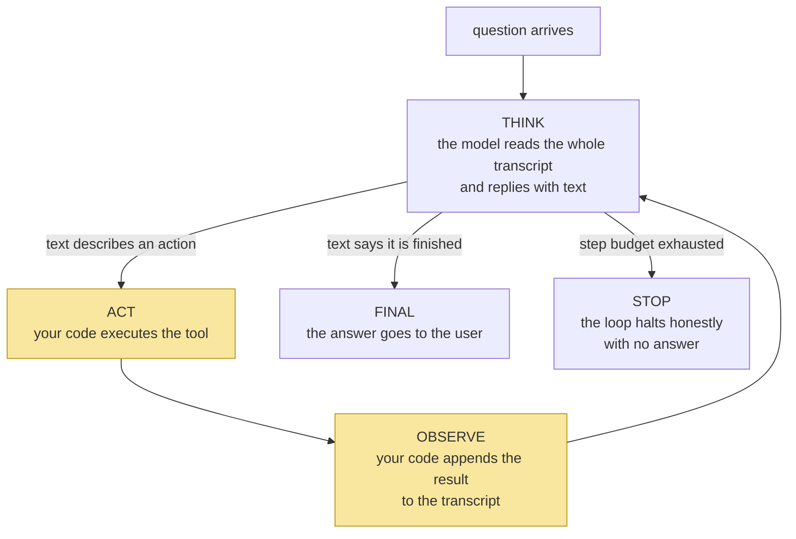

# 1.1 — The navigator and the driver: what an agent is, mechanically

## One-line answer

An agent is a loop around a stateless text model: the model reads the transcript and *proposes* an
action as text, your code *executes* it and writes the result back, and this repeats until the model
says it is done or your loop says *enough* — the model never touches the world, it only ever asks.

---

## The story

A rally car is halfway up a mountain stage. In the passenger seat sits the navigator — the one with
the maps, the pace notes, the whole route in their head. They are brilliant. They can see three
corners ahead. And their hands never once touch the steering wheel.

In the driver's seat sits someone with no map at all. What the driver has is hands, feet, and a
brake pedal.

The car makes it up the mountain because of a strict little ritual, repeated every few seconds. The
navigator calls out one instruction: *"left three, tightens."* The driver turns the wheel. Then —
and this is the part everyone underestimates — the driver's world *answers back*: the car grips or
slides, the corner opens or closes, and the navigator hears and feels the result before calling the
next note. Instruction, action, result. Instruction, action, result.

Take away any one of the three and the car goes off the road. A navigator who never gets told what
happened is calling notes for a road they are no longer on. A driver who improvises ignores the one
person who can see ahead. And a crew with no way to *stop* the run when something is wrong doesn't
have a rally car — it has an accident that hasn't finished happening yet.

---

## The idea in plain language

Here is the puzzle this day exists to solve. A **model** — the amnesiac text machine you met on
[Day 2](../../../day-02-llm-mechanics/parts/01-first-contact/1.1-the-call-that-forgets-you.md) —
can only ever do one thing: read text in, produce text out. It cannot open a file, query a
database, or close a support ticket. It has a brilliant mind and no hands.

So how does an "agent" ever *do* anything?

The answer is the rally car. The model is the navigator: it reads everything so far and *says
what should happen next* — as text, because text is all it can produce. Your code is the driver:
it reads that text, actually performs the action, and — the underestimated beat — *writes the
result back into the conversation* so the model can see what happened. Around again. That
repetition is called the **agent loop**, and its three beats have names:

| Beat | What happens | Who does it |
| --- | --- | --- |
| **Think** | Read the transcript so far; decide what is needed next | The model |
| **Act** | Execute the requested tool with the requested argument | **Your code** |
| **Observe** | Write the tool's result back into the transcript for the next call | **Your code** |

Count them. Two of the three beats are **yours**. The model never touches the world; it only ever
*asks*, and your loop decides whether to honour the request. That one sentence is the security
model of every agentic system ever built: the model's power is exactly what your loop agrees to
execute, no more.

**Agent = model + loop + transcript.** That is the entire trick. Every framework you will ever
meet — ADK included, when it arrives on Day 5 — is an elaboration of this one sentence, and today
you build the sentence by hand so that the framework can never be a mystery to you
(Principle 4: build first, compare after).

---

## Why Sutra needs it

- **Day 4 (AG-04)** replaces today's text protocol with the API's native function calling. If you
  have not felt today's version creak, Day 4's schemas look like ceremony instead of a cure.
- **Day 5 (ADK-01, ADK-02)** hands the loop to a framework. The runner you meet there executes
  exactly the three beats in the table above — and because you wrote them yourself first, you will
  be able to point at where each one went.
- **Days 62–65** build Sutra's approval gates. An approval gate is an intervention between *think*
  and *act* — a pause at the exact point where the model has asked and your code has not yet agreed.
  You cannot place that pause precisely in a loop you have never seen the inside of.
- **Day 71 (AG-31)** gives an agent a browser. Everything frightening about that day is contained by
  the fact you learn today: capability lives in the loop, not in the model.

---

## The mechanism

No code yet — the code fills the rest of the day. What the mechanism needs first is the shape,
because the shape is what survives after the syntax is forgotten:



Read the two highlighted boxes again: *act* and *observe* are your code. The model owns exactly one
box. Everything Sutra will ever be trusted to do — and everything it must be prevented from doing —
passes through the two boxes you own.

Notice also that the diagram has **two exits**, not one. The model can declare success, or your
loop can pull the brake. A loop with only the first exit is a machine you cannot stop, and
[5.1](../05-containment/5.1-the-step-budget.md) is an entire part about why that is an outage, not
a feature.

And one more thing hides in the *think* box: the model reads **the whole transcript** every single
time. Not the latest message — everything. Day 2 proved the model is stateless
([3.1](../../../day-02-llm-mechanics/parts/03-context-and-memory/3.1-the-desk-that-gets-wiped.md));
the loop is where that fact stops being trivia and becomes your job description. Every turn, *you*
rebuild the model's entire world. The next part is about exactly that.

---

## When it breaks

The break at this altitude is not a traceback — it is a wrong mental model, and it produces a
sentence you will hear (and must never say) in design meetings:

```text
"The agent decided to delete the file."
```

**What it means.** Nothing of the sort happened, and the phrasing hides the one fact that matters.
The model *emitted text describing a deletion*. Some loop — written by a person, reviewed by a
person, deployed by a person — read that text and executed it. If the deletion was a disaster, the
disaster lives in the loop's dispatch decision, not in the model's sentence. Teams that talk about
what "the agent decided" end up hardening the wrong layer: they tune prompts when they should be
guarding the dispatch table.

**The smallest fix** is linguistic discipline that becomes architecture: *the model proposes, the
loop disposes*. Say it that way in every design conversation and the security questions ask
themselves — what may the loop execute? with whose permissions? logged where? stopped by whom?
Those four questions are Days 62–71 of this curriculum, and every one of them is a question about
the loop.

---

## In production

**The production version of this idea is an inventory.** In a real system, "where is the loop?"
must have a written answer, because the loop is where every control attaches. When Sutra reaches
ADK on Day 5 the loop lives inside the runner; when a vendor platform runs your agent, the loop
lives in their infrastructure — and every guarantee you care about (allowlists, spend caps, audit
logs, kill switches) is a feature of *whoever owns the loop*, not of the model. A senior engineer
evaluating an agent platform reads the loop's controls first and the model benchmarks second.

**What degrades at scale is accountability.** One hand-rolled loop on one laptop is easy to reason
about. A production system runs thousands of concurrent loops, each one authorised to act on a
different user's behalf. The question "which loop executed this action, proposed by which model
turn, on behalf of whom?" must be answerable from logs alone — which is why Principle 12 (*if it
isn't observable, it didn't happen*) is enforced from today, in the smallest possible way: today's
loop prints every proposal and every result as it happens.

**The review comment a senior engineer leaves** on a design doc that says "the agent will handle
refunds": *"The model can't handle anything — it can only ask. Which component executes the refund,
what is the maximum amount it will execute without a human, and where is that enforced? If the
answer is 'in the prompt', this doesn't ship."*

**The interview question** is the innocent-sounding *"so what actually happens when an LLM 'calls a
tool'?"* The answer that ends the interview early: "the model calls the function." The answer that
starts a good conversation: "nothing happens inside the model — it emits a structured request, the
runtime validates it against the tools it is willing to expose, executes it with the runtime's own
permissions, and appends the result to the context for the next turn. The gap between *emit* and
*execute* is where all the security lives, and I've built that gap by hand."

---

## Check yourself

```bash
grep -rn "loop" docs/00_MASTER_PLAN.md | head -5
```

The plan mentions the loop long before ADK, MCP, or any tool — run the command and notice that the
hand-rolled loop is Day 3 of ninety-seven, not an afterthought.

**Answer out loud, without scrolling up:**

> Name the three beats of the agent loop, say who performs each one, and then answer this: if a
> production agent does something destructive, why is "the model decided to" never an acceptable
> sentence in the incident report?

---

**Next:** [1.2 — The transcript is the world](1.2-the-transcript-is-the-world.md)
