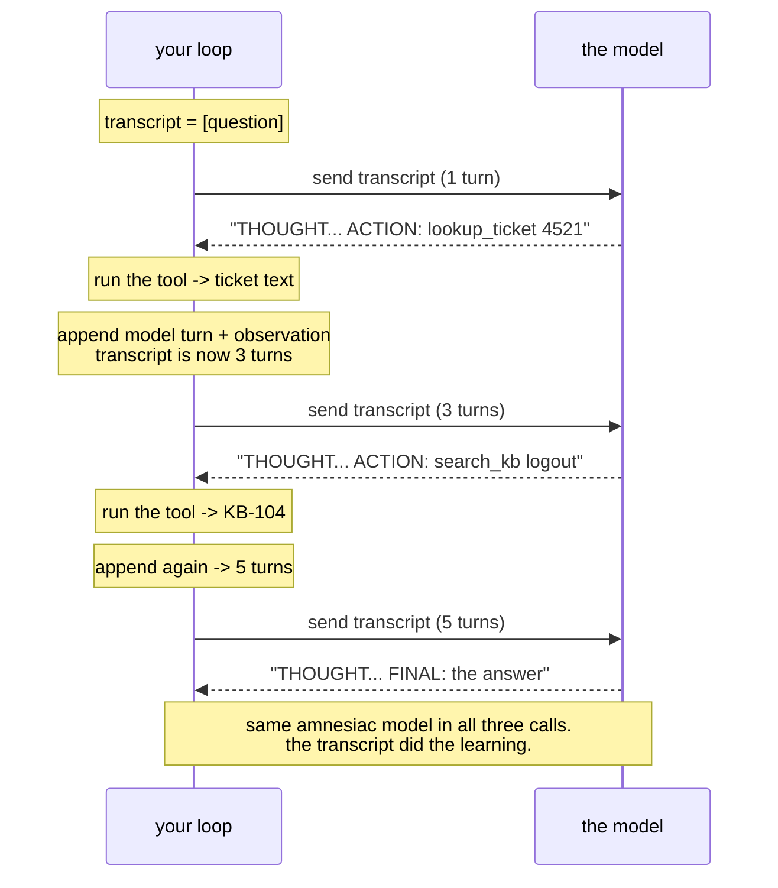

# 1.2 — The transcript is the world: the loop is a for-statement over Day 2's list

## One-line answer

The agent's entire universe is the list of turns you re-send on every call — not what your code
did, not what your terminal shows, only what got written back — so the loop is nothing more exotic
than a `for` statement that appends to Day 2's history list and sends it again.

---

## The story

A ship's captain in the age of sail keeps a logbook. Every event goes in: the heading, the weather,
the sail changes, what the lookout saw. It is a discipline, and on calm days it feels like
paperwork.

Then one night the captain falls ill, and the first mate takes the deck. The mate has never sailed
this route. But the mate has the logbook — and the logbook is *complete*. Every decision of the
last three weeks, with what was known when it was made. The mate reads it and steers as if they had
been aboard since the first day.

Now imagine one ruined page. The evening the storm was sighted, someone saw it, shouted about it,
adjusted the sails — and never wrote it down. To the mate reading the log, that storm *does not
exist*. Not "is hard to find". Does not exist. The mate will steer straight back into it, and no
amount of shouting from the crew about "we already dealt with this!" changes what is on the page.

The ship is commanded by whoever writes the log. The person at the wheel just executes it.

---

## The idea in plain language

On Day 2 you proved two things the hard way. The model is **stateless** — it forgets everything
between calls
([3.1](../../../day-02-llm-mechanics/parts/03-context-and-memory/3.1-the-desk-that-gets-wiped.md)
called it the desk that gets wiped). And "memory" is a **plain Python list of turns** that *you*
maintain and re-send with every request
([3.2](../../../day-02-llm-mechanics/parts/03-context-and-memory/3.2-history-is-a-list-you-own.md)
— the job file the dispatcher hands over).

Today that list gets a promotion. In the loop, the list is not just the conversation — it is the
**world model**. Every turn of the loop, the model wakes up with total amnesia, is handed the list,
and must reconstruct everything from it: what the user wanted, what actions have been taken, what
those actions returned. Then it proposes the next step, forgets everything, and the cycle repeats.

Three consequences follow, and each one is a family of bugs you will someday debug:

- **What is not in the list never happened.** Your code ran the tool. Your terminal printed the
  result. None of that reaches the model unless the result is *appended as a turn*. The ruined
  logbook page is [6.1](../06-failure-lab/6.1-the-goldfish-loop.md), today's failure lab, and you
  will stage it on purpose.
- **The list grows every step.** Each loop turn appends the model's reply and the tool's result,
  and each call re-sends everything — so a loop's token cost grows with the *square* of its length,
  exactly the arithmetic Day 2's
  [2.1](../../../day-02-llm-mechanics/parts/02-tokens-the-meter/2.1-what-a-token-is.md) warned
  about. Today the answer to "what earns a place in the list?" is simply *everything*; by Day 19
  you will understand why that cannot scale, and Phase 3 exists to answer it properly.
- **It is the same amnesiac model every time.** Nothing about the model improves between step one
  and step three of a triage. **The transcript is what is getting smarter.** Hold onto that
  sentence; it reframes every agent you will ever read about.

One vocabulary note, defined here on first use: today the tool's result is written into the list as
an **observation** — a turn that begins `OBSERVATION:`, sent with the same `user_input` turn type
you used on Day 2. Why a *user* turn? Because in the Interactions API's world there are exactly two
speakers, the model and everything-that-is-not-the-model — and a tool result is the world speaking
*to* the model. It is a workable convention with a real weakness, and Day 4 replaces it with a
first-class tool-result turn. The weakness is discussed there, with an address:
`days/day-04-*/`.

---

## Why Sutra needs it

- **Today, twice over:** [4.1](../04-running-the-loop/4.1-assembling-the-loop.md) writes the two
  `append` lines that make the loop work, and
  [6.1](../06-failure-lab/6.1-the-goldfish-loop.md) deletes them to show what the world looks like
  to a model that is never told what happened.
- **Day 8 (ADK-06, ADK-07)** introduces ADK's session service — a managed, persistent version of
  this exact list. The comparison only lands if you have maintained the unmanaged one.
- **Days 19–20 (AG-08..10)** are context engineering: deciding what earns a place in this list when
  it can no longer hold everything. You cannot write an eviction policy for a list you have never
  owned.
- **Day 66 onward (SEC)** treats the list as an attack surface: prompt injection is a hostile
  observation trying to get written into the world model. Inspection and defense both require
  possession.

---

## The mechanism

The mechanism is small enough to fit in one diagram, and the diagram is worth more than the code
around it — the code is Day 2's `ask()` plus two `append` calls:



Trace the token meter through it. Call one sends one turn. Call two re-sends that turn plus two
more. Call three re-sends all five. Nothing was cached, nothing was remembered server-side — Sutra
sets `store=False` on every call, a decision Day 2's
[3.3](../../../day-02-llm-mechanics/parts/03-context-and-memory/3.3-the-server-will-remember.md)
made deliberately and ADR-0006 recorded — so the growth is real, metered, and yours to manage.

That is the entire mechanism. Everything else in this day — the tools, the protocol, the parser,
the brake — is machinery for deciding *what text goes into the list next*.

---

## When it breaks

The canonical break is the one Day 2's memory demo already showed you in miniature — the append
that never happened. In a loop it looks like this, and it is strange the first time you see it:

```text
--- step 1 ---
THOUGHT: I need the ticket contents before I can triage it.
ACTION: lookup_ticket 4521
OBSERVATION: Title: Keeps getting logged out. Body: I keep getting logged out...

--- step 2 ---
THOUGHT: I need the ticket contents before I can triage it.
ACTION: lookup_ticket 4521
```

**What it means.** Step 2's request is byte-for-byte identical to step 1's, because the transcript
never grew — the observation was printed to *your* terminal and never appended to *the model's*
world. At `temperature=0.0`
([4.2](../../../day-02-llm-mechanics/parts/04-sampling-the-dial/4.2-turning-the-dial.md): greedy
decoding, same input → same output) the model gives the same answer to the same question, forever.
The model is not stuck. **It is answering an identical question identically, which is correct.**
Your loop is the broken part.

**The smallest fix** is the two `append` lines in
[4.1](../04-running-the-loop/4.1-assembling-the-loop.md). The diagnostic habit that outlives today:
when an agent "ignores" a tool result, do not reread the prompt — **print the transcript that went
into the very next call** and check whether the result is actually in it. Almost always, it is not.

---

## In production

**The professional version of this list is called context assembly, and it is a pipeline, not an
append.** A production agent's each-turn input is *built*: the system rules, a summary of older
turns, the last few turns verbatim, retrieved documents, and the recent observations — assembled
fresh every call under a token budget. The insight that survives from today: that pipeline's output
is still just a list of turns, and the model still cannot tell the difference. There is no other
channel. Whoever assembles the list programs the agent.

**What degrades at scale is the square.** A support conversation that runs to forty loop steps
re-sends a fortune in tokens on every step, and the last call carries the whole history of the
previous thirty-nine. Production systems cap this three ways — summarise old turns, truncate stale
observations, cache the stable prefix — and every one of those is an *edit to the list* that the
model never knows happened. Days 19–20 build all three.

**The failure that only appears with real traffic** is the observation that is too big. One tool
returns a 200-row database dump; it gets appended verbatim; every subsequent call re-sends it; the
loop that worked in the demo now blows the context window — Day 2's
[3.1](../../../day-02-llm-mechanics/parts/03-context-and-memory/3.1-the-desk-that-gets-wiped.md)
showed you the exact `INVALID_ARGUMENT` this ends in. The rule a reviewer will state: **tools
summarise; they do not dump.** You will feel the first twinge of this today when a KB article comes
back longer than the question that asked for it.

**The review comment a senior engineer leaves:** *"This appends every observation verbatim and
never evicts. What is the token ceiling of the transcript, which component enforces it, and what is
the eviction order when it is hit? 'The window is a million tokens' is a description of the cliff,
not a policy for staying away from it."*

**The interview question:** *"your agent calls a tool and then acts as if it never did — walk me
through the debug."* The answer that shows you have been here: "First I print the exact payload of
the call *after* the tool ran, because the world of the model is that payload and nothing else. If
the result is missing, the append is broken. If it is present, then it is a formatting or salience
problem — the result is in the world but unrecognisable. The bug is almost never the model."

---

## Check yourself

```bash
uv run python -m sutra.mechanics memory
```

Run Day 2's memory demo once more and watch call 2 fail and call 3 succeed. Today's whole day is
that demo with a `for` statement around it.

**Answer out loud, without scrolling up:**

> Your loop runs a tool and prints the result, but the model repeats the same action forever. Say
> why the model's behaviour is *correct*, whose bug it is, and the first thing you would print to
> prove it.

---

**Next:** [2.1 — Tools are plain functions](../02-tools-and-dispatch/2.1-tools-are-plain-functions.md)
