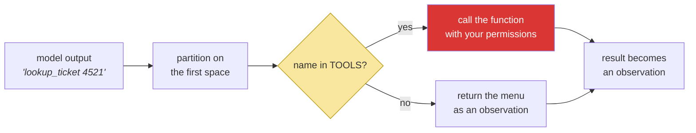

# 2.2 — The dispatch table is the boundary: one dict stands between a sentence and your filesystem

## One-line answer

The model names a tool in text and your loop looks that name up in a dictionary you wrote — so the
set of things an agent can do is **exactly the set of keys in that dict**, which makes one small
Python object the security boundary of the entire system.

---

## The story

A courier arrives at the goods entrance of an office building with a parcel and a name on it.

There are two ways this building could work.

In the first, the courier reads the name aloud and the security guard walks them to whichever office
the name matches, unlocking doors on the way. If the parcel says "server room", they go to the
server room. The guard's job is to interpret the name and act on it.

In the second, the guard has a laminated sheet on the desk. It lists eleven destinations and nothing
else. The courier reads the name; the guard looks down the sheet. If the name is on it, the parcel
is delivered there. If the name is not on it — "server room", "CEO's office", "the safe" — the guard
says, "that is not on my list", and hands the parcel back with a note saying what *is* on the list.

The second building is not more suspicious than the first. It is not running a background check on
every courier. It has simply decided, once, in advance, in writing, what the goods entrance can
reach — and made that decision impossible to argue with, because the sheet is laminated and the
guard does not improvise.

The interesting property of the second building is this: **you can audit it in ten seconds by
reading one sheet of paper.** You cannot audit the first building at all.

---

## The idea in plain language

Your loop receives a line of text from the model that says something like `lookup_ticket 4521`. It
has to turn that name into a running function. There are two ways to do that, and the difference
between them is not stylistic.

**The dangerous way** is to resolve the name dynamically — look it up in the module's globals, use
`getattr`, or worst of all `eval` it. Then the set of things the model can reach is "everything
importable in this process", which on a normal Python installation includes the filesystem, the
network, and the ability to start other programs. Nobody writes `eval(model_output)` deliberately.
People write `globals()[name](arg)` because it is convenient, and get the same result.

**The safe way** is a **dispatch table**: a dictionary you wrote by hand, mapping a name you chose to
a function you chose.

> A **dispatch table** is a fixed mapping from names to functions, used to turn a piece of data into
> a call. It is called *dispatch* because the mapping decides where the request goes.

The consequence is worth stating as a rule, because it will still be true on Day 96:

> **An agent's capability is the key set of its dispatch table.** Not what the prompt says. Not what
> the model believes. Not what the documentation claims. The keys.

This is Principle 13 — *blast radius before capability* — in its smallest possible form. Every power
Sutra gains between now and Day 96 arrives as a new entry in a table like this one, and every one of
those entries is a decision somebody made and can be asked about in review.

Two more things this table gives you for free, and they matter as much as the safety:

- **A denial that teaches.** When the model asks for something that is not on the list, you do not
  crash and you do not silently ignore it. You return a message naming what *is* available, and the
  model reads it on the next turn and corrects itself. The laminated sheet, handed back with the
  parcel.
- **One place to attach everything.** Logging, permission checks, rate limits, approval gates,
  audit trails — every one of them is code that goes *at the dispatch point*. Days 62–65 hang a
  human-approval pause here. Day 70 hangs a quota router here. They can, because there is a *here*.

---

## Why Sutra needs it

- **Today**, [4.1](../04-running-the-loop/4.1-assembling-the-loop.md) calls `_dispatch` once per loop
  step, and it is the only line in the whole file that touches the outside world.
- **Day 4 (AG-04)** replaces the text name with an API-native function-call object. The dispatch
  table survives unchanged — you still look up a name you chose in a dict you wrote. Only the
  parsing goes away.
- **Day 10 (ADK-10, ADK-11)** hands the table to ADK as `tools=[...]`, and ADK builds its own
  internal dispatch from it. Knowing that `tools=[...]` *is* this dict is the difference between
  using ADK and trusting ADK.
- **Days 62–65 (durability and humans)** insert an approval gate between the lookup and the call.
  That is a two-line change *because* the lookup and the call are two lines. In a system that
  resolved names dynamically, there is no seam to insert into.
- **Day 66 onward (SEC)** treats a prompt-injected instruction as a request that reaches exactly this
  dict. An injection can make the model *ask* for anything; it cannot add a key.

---

## The mechanism

The table itself is three lines, and its plainness is the feature:

```python
# The dispatch table: action name -> real function. The ONE door between
# the model's wishes and the real world (Principle 13 lives here).
TOOLS = {"lookup_ticket": lookup_ticket, "search_kb": search_kb}
```

**Line by line:**

- `TOOLS = {...}` — **a literal dict, written by hand, at module level.** Not built by scanning the
  module, not populated by a decorator, not assembled from a config file. Every one of those is more
  elegant and every one of them makes the answer to "what can this agent do?" require running code
  instead of reading a line. On Day 96, when Sutra is a multi-agent system, you will still want that
  answer to be readable.
- `"lookup_ticket": lookup_ticket` — the key is a **string the model will write**, and the value is a
  **function object, not a call**. No parentheses. `lookup_ticket()` would run the function right now,
  at import time, and store its return value; `lookup_ticket` stores the function itself so the loop
  can call it later.
- The key and the function name are identical here, which is convenient and **not required**. They
  are two different namespaces: the key is part of the contract you show the model, the function name
  is part of your code. On Day 11 you will rename a tool for the model's benefit without touching the
  function, and that is only possible because these are separate.
- **Two entries.** That is the whole capability of today's agent: read a ticket, search a knowledge
  base. It cannot write, delete, email, or spend. Not because the prompt forbids it — because there
  is no key.

Now the dispatcher. This is the function that turns a sentence into a call, and it is where the
boundary is actually enforced:

```python
def _dispatch(action: str) -> str:
    """Execute 'tool_name argument'; errors come back as observations.

    Example:
        >>> _dispatch("lookup_ticket 4521")
        "Title: Keeps getting logged out. ..."
        >>> _dispatch("send_email boss@corp")
        "Unknown tool 'send_email'. Available: lookup_ticket, search_kb."
    """
    name, _, argument = action.partition(" ")
    tool = TOOLS.get(name.strip())
    if tool is None:
        return f"Unknown tool {name.strip()!r}. Available: {', '.join(TOOLS)}."
    return tool(argument.strip())
```

**Line by line:**

- `def _dispatch(action: str) -> str:` — the **leading underscore** marks it private to this module.
  It is machinery, not interface: nothing outside `sutra/loop.py` should be turning strings into
  calls, and the underscore says so to a reader and to a linter.
- `name, _, argument = action.partition(" ")` — `str.partition` splits on the **first** occurrence
  only and always returns three pieces, so it cannot raise. Compare `action.split(" ")`, which
  returns a list of unpredictable length and forces you to handle it; and `action.split(" ", 1)`,
  which is closer but still returns one item when there is no space, so unpacking into two names
  raises `ValueError`. **Partition is the one that cannot fail on malformed input**, and malformed
  input is exactly what a text protocol delivers.
- The `_` in the middle is the separator itself, deliberately discarded. Naming it `_` is the
  conventional way to say "I know this exists and I do not want it".
- Splitting on the *first* space means the argument may itself contain spaces —
  `search_kb user keeps getting logged out` gives `name="search_kb"` and the entire rest as the
  query. That is not an accident; a KB query is prose.
- `tool = TOOLS.get(name.strip())` — **`.get`, returning `None` on a miss.** `TOOLS[name]` would
  raise `KeyError` and kill the loop; see [2.3](2.3-a-failed-tool-is-an-observation.md) for why that
  is the wrong failure mode. And note what this line *is not*: it is not `getattr(module, name)` and
  not `globals()[name]`. The lookup is confined to a dict with two keys.
- `if tool is None:` — **`is None`, not `if not tool`.** They differ if a value in the table is ever
  falsy, and more importantly `is None` states the actual question: did the lookup miss?
- `return f"Unknown tool {name.strip()!r}. Available: {', '.join(TOOLS)}."` — the **denial that
  teaches**. It is a return, not a raise: the loop continues, the model reads this on the next turn,
  and it is told the correct menu. `', '.join(TOOLS)` iterates the dict's keys, so the message can
  never drift out of date with the table — add a tool and the error message updates itself.
- `return tool(argument.strip())` — **the only line in Sutra that runs something the model asked
  for.** One line, one place, auditable. When Day 62 adds "and pause here for a human", this is the
  line it wraps.

The shape of the boundary, drawn once:



The yellow diamond is the boundary; the red box is the only place capability is exercised. Everything
Phase 10 does to make Sutra safe is an intervention on one of those two boxes.

---

## When it breaks

The break to see on purpose is the model asking for something that does not exist. Models invent
plausible tool names constantly — it is a direct consequence of being pattern-completers — and a
support agent will sooner or later ask to email somebody:

```text
--- step 2 ---
THOUGHT: I should notify the account owner about the fix.
ACTION: send_email owner@example.com KB-104 explains your logout issue
OBSERVATION: Unknown tool 'send_email'. Available: lookup_ticket, search_kb.

--- step 3 ---
THOUGHT: I cannot send email, so I will answer the user directly.
FINAL: This looks like KB-104 — cookies with SameSite=Strict on an http:// dashboard...
```

**What it means.** The system worked exactly as designed. The model asked for a capability it does
not have; the table said no; the denial went back as an observation; the model adapted. **No
exception, no crash, no email.** Notice that the model was not "wrong" to ask — asking is all it can
do. The table is what makes asking harmless.

The version that breaks badly is the one where the table is not the boundary:

```text
Traceback (most recent call last):
  File "sutra/loop.py", line 63, in _dispatch
    return globals()[name](argument)
           ~~~~~~~~~^^^^^^
KeyError: 'send_email'
```

**What it means.** Someone replaced the table with a lookup into the module's globals to save typing
a dict. Today it raises `KeyError` and kills the run. Tomorrow someone imports `os` at the top of
the file for an unrelated reason, and now `ACTION: system rm -rf ~` resolves to a real function. **The
bug is not the traceback. The bug is that the capability set became "whatever is imported", and it
changes every time somebody edits an import line.** The smallest fix is the literal dict, and the
reason it is the fix is that its key set cannot change without a diff.

---

## In production

**The production version of this dict has a name: the tool registry, or the allowlist.** It is
usually still a mapping, but it is built once at start-up, it is often assembled per-agent or
per-tenant, and — the part that matters — **it is logged**. A real system emits, at start-up, the
exact list of tools each agent is permitted to call, so that the answer to "what could this thing do
at 3am on Tuesday?" is in the logs rather than in somebody's memory of a deploy.

**What changes at scale is that one table becomes many.** Different users get different capabilities:
a free-tier customer's agent may read tickets; a support engineer's agent may close them; nobody's
agent issues refunds without an approval step. That is *per-request* dispatch construction, and it
introduces the failure mode that only appears with real traffic: **a table built from mutable state
at request time can be wrong**. A cached admin table served to a normal user is a privilege-escalation
bug, and it is not hypothetical — it is the ordinary consequence of memoising something that should
not have been memoised.

**What a professional writes instead of the teaching version** is the same dict with three additions:
each entry carries the permission required to use it, the dispatcher checks that permission against
the *caller's* identity rather than the process's, and every dispatch — allowed or denied — is
logged with the invocation id. That is Days 62–71 in one sentence, and it all hangs off
`return tool(argument.strip())`.

**The review comment a senior engineer leaves:** *"This resolves tool names at call time from module
scope. That means the capability set is 'whatever is currently imported', which changes with every
unrelated refactor and cannot be reviewed. Make it an explicit registry and log it at start-up. Also:
tools run with the service account's permissions, not the user's — say somewhere why that is
acceptable here."*

**The interview question:** *"how do you stop an agent from doing something it should not?"* The
answer that ends badly: "I tell it not to in the system prompt." The answer that shows you have
shipped one: "A prompt is a request; the dispatch table is a law. The model can ask for anything —
prompt injection guarantees it eventually will — so the capability is defined by the registry the
runtime is willing to execute, checked against the caller's permissions, with an approval gate for
anything with a blast radius, and every dispatch logged. The prompt is a usability feature. The
table is the control."

---

## Check yourself

```bash
uv run python -c "from sutra.loop import _dispatch; print(_dispatch('send_email a@b.c hello'))"
```

You should get the menu back as a **string** — `Unknown tool 'send_email'. Available: ...` — with no
exception and no email. That single line is Principle 13 in your terminal.

**Answer out loud, without scrolling up:**

> Someone asks "what can your agent do?" Say where you would look to answer that in ten seconds, and
> then say what would be wrong with answering "it's in the system prompt".

---

**Next:** [2.3 — A failed tool is an observation](2.3-a-failed-tool-is-an-observation.md)
