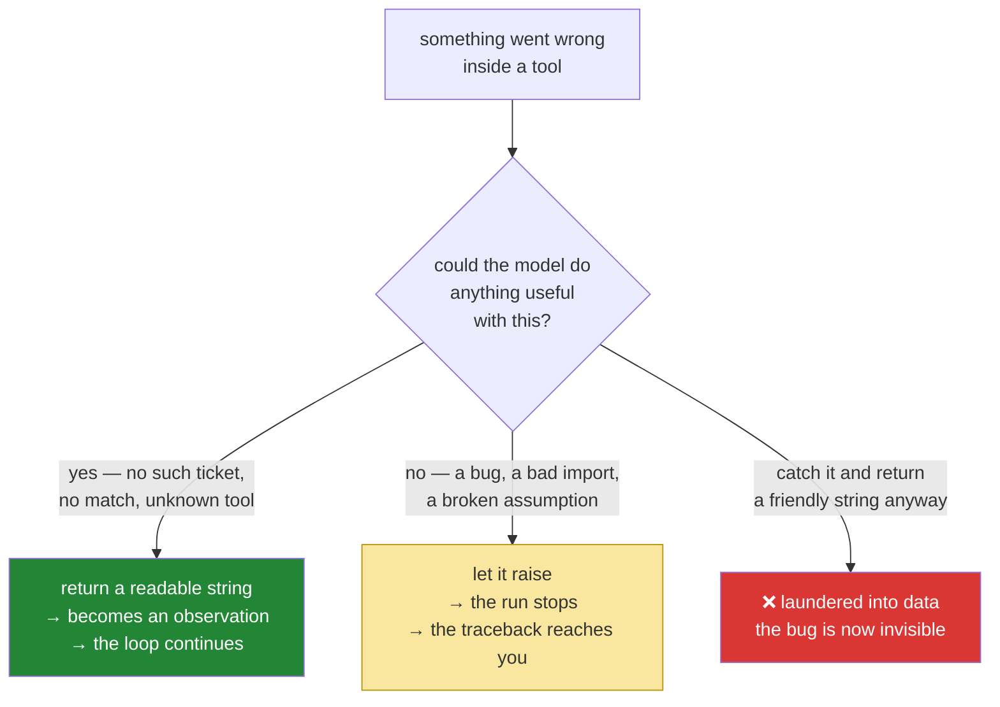

# 2.3 — A failed tool is an observation, not a crash: two species of error

## One-line answer

An error the *model* could do something about must come back as a readable observation so the model
can react, while an error in *your own code* must raise and stop the run — and confusing the two
gives you either an agent that cannot recover or an agent that hides its own bugs.

---

## The story

A junior doctor orders a blood test for a patient. Two different things can go wrong, and the
hospital treats them completely differently.

In the first, the sample comes back and the result is *abnormal*. That is not a failure of the
system. That is **information** — it is the entire reason the test was ordered. It goes on the chart,
the doctor reads it, and the next decision changes because of it. Nobody escalates. Nobody files an
incident. The abnormal result is the machine working.

In the second, the analyser itself is broken: a calibration fault, an empty reagent, a jammed
carousel. Now the correct behaviour is the opposite. **This must not go on the chart.** It must not
be quietly reported as "normal" or "inconclusive" — because a doctor reading "inconclusive" will
reasonably order a different test, when what is actually needed is an engineer. This one goes to the
biomedical team, loudly, and the machine goes out of service until it is fixed.

The disaster case is the one where a hospital blurs them: a broken analyser that returns a plausible
number. Every doctor downstream now makes confident decisions on a fiction, and nothing in the chart
says anything is wrong. The error did not disappear; it was *laundered* into data.

---

## The idea in plain language

Inside an agent loop there are two completely different kinds of failure, and the whole of this part
is learning to tell them apart on sight.

| | **Agent-visible failure** | **Programmer failure** |
| --- | --- | --- |
| Example | Ticket 9999 does not exist; no KB article matched; unknown tool name | A typo in your dispatcher; a `None` where a dict was expected; a bad import |
| Who can act on it | The **model** — try another tool, ask the user, answer honestly | **You** — it needs a code change |
| Correct behaviour | **Return a string.** It becomes an observation and the loop continues | **Raise.** The run stops and the traceback reaches you |
| The abnormal blood test | ✅ this is that | |
| The broken analyser | | ✅ this is that |

The dividing question is not "is this bad?" — both are bad. The question is **"could the model
possibly do something useful with this?"**

- *Ticket 9999 does not exist.* The model can absolutely act on that: it can tell the user the
  ticket was not found. So it is data. Return it.
- *`_dispatch` got `None` where it expected a callable, because you wrote `TOOLS.get(name)` and then
  forgot the `is None` check.* The model can do nothing with that. It is a defect in your code, and
  it must reach you, not the transcript.

The third behaviour — the one that looks helpful and is the worst of all — is **swallowing**:
catching an exception and returning a friendly string so the loop keeps going. It reads as
robustness. It is the broken analyser reporting a plausible number. The bug is now invisible, the
model builds on a fiction, and your logs show a successful run. This is Principle 10 (*fail
honestly*) stated from the code's side, and it is not a stylistic preference — it is why Sutra's
answers can be trusted at all.

**Name the trap.** This is **1.x → 2.x trap #4 — don't swallow exceptions** (plan §5.1), met four
days before you meet the framework. The old ADK habit was to catch tool and model errors and return
them as strings; ADK 2.x deliberately surfaces exceptions through the runtime so callbacks, plugins
and retry logic can act on them, and catching them yourself breaks all three. Today you build the
2.x posture by hand, so that on Day 5 it is a habit rather than a rule you were handed.

---

## Why Sutra needs it

- **Today**, [4.3](../04-running-the-loop/4.3-the-honest-failure.md) runs a lookup that misses on
  purpose and requires the agent to *say so* instead of inventing a ticket. That demo only works
  because the miss came back as a readable string.
- **Day 2 already committed to this** on the model side: `ask` re-raises every non-429 error rather
  than returning a placeholder
  ([1.5](../../../day-02-llm-mechanics/parts/01-first-contact/1.5-the-only-door-429.md)). Today the
  same discipline reaches the tool side, and the two halves meet.
- **Day 21 (ADK-23)** is the ADK day about error surfacing — trap #4 in the framework's own terms.
  You will recognise it because you drew this line yourself.
- **Day 13 (ADK-14, ADK-15)** adds callbacks that fire on tool errors. A swallowed exception never
  fires a callback, so today's discipline is what makes that day's machinery work at all.
- **Days 79–83 (evals)** score honesty explicitly: an agent that invents a ticket scores zero even if
  the prose is beautiful. The eval can only see what the loop lets through.

---

## The mechanism

Look again at the two returns in `lookup_ticket` and `_dispatch`, this time as a policy rather than
as syntax:

```python
def lookup_ticket(ticket_id: str) -> str:
    # A miss returns a MESSAGE, not an exception — the model must be able
    # to read the failure and react to it.
    return TICKETS.get(ticket_id.strip(), f"No ticket with id {ticket_id!r}.")
```

**Line by line:**

- `TICKETS.get(..., f"No ticket with id {ticket_id!r}.")` — the default argument is **the failure
  message itself**, so there is exactly one return statement and no branch to get wrong. A miss and a
  hit leave through the same door, which is what makes the signature honestly `-> str`.
- The message is written **for a reader who is a language model**: it states what was asked for and
  what happened, in a full sentence, with the id quoted. Compare `return None` (the model sees the
  string `"None"` and has to guess) or `return ""` (the model sees nothing at all and will often
  assume the tool succeeded and returned an empty ticket).
- What this line is *not*: `raise KeyError(ticket_id)`. That would end the run over a perfectly
  ordinary situation — a user asking about a ticket that was already deleted — and it would end it
  in a way that no amount of prompt engineering could recover from.

And the corresponding discipline in the loop itself, which is a **non**-line — the thing that is
deliberately absent:

```python
# ACT: find the requested action and execute it (or explain the miss).
if action is None:
    observation = "Protocol error: no ACTION: or FINAL: line. Reply using the exact format."
else:
    observation = _dispatch(action)
```

**Line by line:**

- **There is no `try` here, and that is the design.** If `_dispatch` raises, the exception travels up
  and out of `run_loop`, out of `main`, and prints a traceback with your line number in it. That is
  correct: an exception at this point means *your code* is broken, and Principle 10 says it surfaces.
- `if action is None:` — the model replied with neither `ACTION:` nor `FINAL:`. Note which species
  this is: the model can absolutely fix this on the next turn if it is told, so it is data. The
  string is a **coaching message**, not an error — it restates the contract.
- `observation = _dispatch(action)` — everything the model can act on has already been converted to a
  string *inside* `_dispatch` ([2.2](2.2-the-dispatch-table-is-the-boundary.md)): unknown tool names,
  missing tickets, empty KB matches. By the time control returns here, the only things that can still
  raise are genuine defects.

The rule, as a decision you make once per tool:



**A caveat with an address.** There is a real third case: an error the model cannot fix *and* that is
not your bug — the ticket API is down, the network is unreachable, the credential expired. Today
Sutra has no such tool, so the question does not arise; the honest answer is a retry policy at the
tool boundary and an escalation when retries are exhausted, which is exactly the shape `ask` already
has for 429s. It is built properly on **Day 21 (ADK-23)** and again on **Day 72 (SEC-15, OPS-13)**.
Until then, do not let a broken dependency return a plausible string.

---

## When it breaks

The instructive break is the swallow. Someone, wanting a loop that "never falls over", writes this:

```python
try:
    observation = _dispatch(action)
except Exception as error:  # ← the bug, not the fix
    observation = f"The tool had a problem: {error}"
```

**Line by line:**

- `except Exception as error:` — catches **everything**, including your own `TypeError` from a typo
  three lines away and any `AttributeError` from a half-finished refactor.
- `observation = f"The tool had a problem: {error}"` — and now the defect is **inside the
  transcript**, where the model will read it, reason about it, and produce a confident answer built
  on it. The run exits with status zero. Your logs say it worked.

Here is what that looks like in the terminal, and the reason it is so hard to spot:

```text
--- step 2 ---
THOUGHT: I have the ticket; now I need the known-issue article.
ACTION: search_kb logged out
OBSERVATION: The tool had a problem: 'NoneType' object is not callable

--- step 3 ---
THOUGHT: The knowledge base seems unavailable, so I will advise from the ticket alone.
FINAL: There is no matching known issue on record. Based on the report, this is
likely a browser cache problem — please ask the user to clear cookies and retry.
```

**What it means.** Read the last line again. **The agent invented a diagnosis and stated it as
fact**, and it was *right to*, given what it was told: it was told the knowledge base was
unavailable. The actual truth was that KB-104 existed, matched perfectly, and would have given the
correct `SameSite`/`https` answer — but `'NoneType' object is not callable` is a Python defect (a
missing `is None` guard in `_dispatch`), and it got laundered into an observation.

**The smallest fix is to delete the `try`.** Then the same defect produces this instead:

```text
Traceback (most recent call last):
  File "sutra/loop.py", line 118, in run_loop
    observation = _dispatch(action)
                  ^^^^^^^^^^^^^^^^^
  File "sutra/loop.py", line 67, in _dispatch
    return tool(argument.strip())
           ^^^^^^^^^^^^^^^^^^^^^^
TypeError: 'NoneType' object is not callable
```

Ugly, immediate, and it names the file and the line. That is not the loop failing to be robust; that
is the loop refusing to lie. **A traceback you can fix beats an answer you cannot trust.**

---

## In production

**What a professional writes instead is the same split, made explicit in the type system.** Tools
return a small structured result — an outcome and a payload — rather than a bare string, so that
"not found" is a *value* the loop can count, log and test, while genuine exceptions still propagate.
Sutra reaches that shape on Day 12 (ADK-13, structured output) and Day 11 (AG-06, tool design); today
the distinction is carried by discipline rather than by types, which is honest for two tools and
would not survive twenty.

**What degrades at scale is your ability to see the difference in aggregate.** One swallowed
exception in one run is a wrong answer. The same swallow in a service handling thousands of runs is a
**silent correctness regression**: your error rate is zero, your latency is fine, your users are
getting confidently wrong answers, and nothing in your dashboards moves. Teams discover this through
customer complaints, which is the most expensive detector available. The metric that catches it is
not an error count — it is a count of *tool outcomes by kind*, so that "KB unavailable" appearing
four hundred times in an hour is visible as an anomaly even though no request failed.

**The failure that only appears with real traffic** is the partial dependency outage. The KB index is
up but returning empty results for one shard. Every affected run gets `No KB article matched`, which
is a legitimate agent-visible observation — the model handles it gracefully and tells users there is
no known issue. **The system is behaving correctly and lying to everyone.** The defence is that
tools distinguish *no result* from *could not search*, because those look identical to a model and
are opposite facts. Write that distinction into every retrieval tool you ever build.

**The review comment a senior engineer leaves:** *"This catches `Exception` and turns it into agent
text. That converts every bug in this call path into a hallucination with a plausible cause. Let
programmer errors propagate; return structured results only for outcomes the model is supposed to
reason about — and make 'no results' and 'search failed' different values, because the model cannot
tell them apart and they mean opposite things."*

**The interview question:** *"a tool your agent calls throws an exception. What should happen?"* The
answer that shows you have run one in production: "It depends which kind of failure it is, and that
is the first thing I would establish. If it is a domain outcome the model should reason about —
nothing found, not permitted, already closed — it is a return value, phrased so the model can act on
it, and it gets counted as a metric. If it is a defect or an unavailable dependency, it propagates:
the run fails loudly, the trace carries the stack, and a human finds out. The failure mode I actively
design against is the middle path where an exception becomes a friendly sentence in the transcript,
because from that point on the agent is reasoning about a fiction and every downstream answer is
confidently wrong with no error anywhere in the logs."

---

## Check yourself

```bash
uv run python -c "from sutra.loop import lookup_ticket, _dispatch; print(repr(lookup_ticket('9999'))); print(repr(_dispatch('drop_database sutra')))"
```

Both must print a **quoted string**. Neither may print a traceback. Then read them and ask whether a
model could act on each one — that is the test you will apply to every tool you write from now on.

**Answer out loud, without scrolling up:**

> Give one example of a tool failure that should come back as text, and one that should raise. Then
> say what specifically goes wrong — in the user's answer, not in your logs — when you catch the
> second kind and return it as text.

---

**Next:** [3.1 — A contract enforced by politeness](../03-the-protocol/3.1-a-contract-enforced-by-politeness.md)
