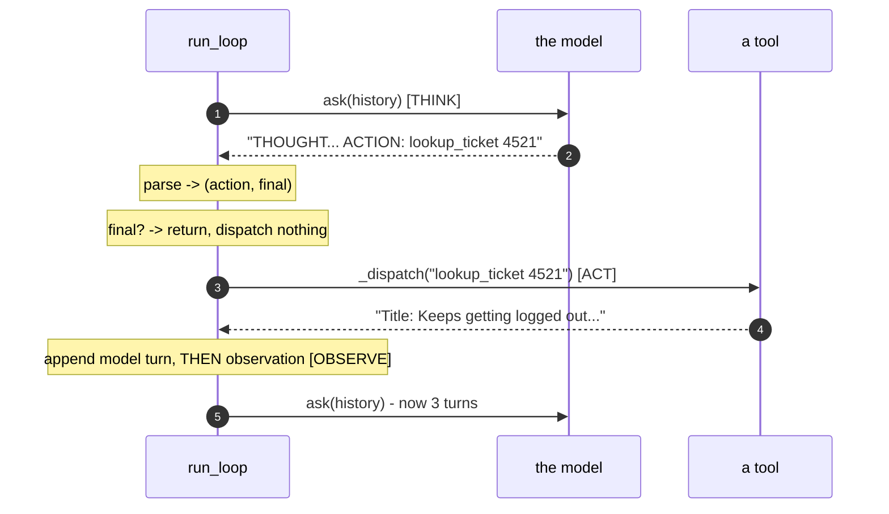

# 4.1 — Assembling the loop: twenty lines where only the order matters

## One-line answer

Every piece of the loop already exists and every piece is trivial — the whole difficulty of this
part is the *sequence*, because almost every agent-loop bug is something happening one line before
or one line after it should.

---

## The story

A racing car comes into the pit lane. Around twenty people descend on it and it leaves again in
about the time it takes to read this sentence.

What is remarkable is that no individual job is hard. One person operates a gun that undoes one nut.
One person pulls a wheel off. One person pushes a wheel on. One person holds a sign. Any of them
could explain their task in a sentence, and any of them could do it, alone, slowly, with no drama.

The whole thing is sequence. The gun must finish before the wheel comes off. The wheel must be on
before the gun goes back. And the sign — the one that tells the driver to go — must not lift until
every one of the other jobs reports finished.

The accidents in that sport are almost never someone failing at their job. They are release
failures: the sign lifts, the driver does exactly what they are told, and the car leaves the box
with a wheel not attached. Everyone did their piece correctly. The order was wrong, and the order is
the only thing that was ever hard.

---

## The idea in plain language

You now have every component:

| Component | Built in | What it does |
| --- | --- | --- |
| `ask` | Day 2 [1.5](../../../day-02-llm-mechanics/parts/01-first-contact/1.5-the-only-door-429.md) | one model call, with 429 handling and honest failure |
| `SYSTEM` | [3.1](../03-the-protocol/3.1-a-contract-enforced-by-politeness.md) | the protocol the model is asked to speak |
| `_parse` | [3.2](../03-the-protocol/3.2-parsing-a-reply-you-did-not-write.md) | reply text to `(action, final)` |
| `_dispatch` | [2.2](../02-tools-and-dispatch/2.2-the-dispatch-table-is-the-boundary.md) | action text to a tool result, safely |
| `_user_turn` | [3.1](../03-the-protocol/3.1-a-contract-enforced-by-politeness.md) | one turn in the shape the API expects |

Assembly is deciding what happens in what order, and there are exactly four decisions:

- **Think before acting.** The model must see everything so far, so the call happens at the top of
  each pass with the whole transcript.
- **Check for `FINAL` before acting.** If the model said it is finished, there is nothing to
  dispatch, and dispatching anyway would be running an action the model did not ask for.
- **Act, then observe — never observe then act.** The tool must actually run before its result is
  written down. This sounds too obvious to state until you have seen someone append a hopeful
  placeholder and dispatch afterwards.
- **Append both halves.** The model's own reply *and* the observation go into the transcript. Miss
  the first and the model cannot see what it decided; miss the second and it cannot see what
  happened. [6.1](../06-failure-lab/6.1-the-goldfish-loop.md) is an entire part about the second
  mistake, staged on purpose.

And one decision that is not about order at all but belongs here because it is structural: **the
loop is a `for` over a fixed range, not a `while`.** A `while` loop's bound is a condition somebody
has to get right; a `for` over a range cannot run more times than the range, whatever the body does.
That choice is [5.1](../05-containment/5.1-the-step-budget.md)'s subject and Principle 13's first
appearance today — the brake ships with the engine, not after it.

---

## Why Sutra needs it

- **Today**, this function is the day. [4.2](4.2-the-first-real-run.md) runs it,
  [4.3](4.3-the-honest-failure.md) runs it against a question it cannot answer, and
  [6.1](../06-failure-lab/6.1-the-goldfish-loop.md) breaks it in one specific place.
- **Day 5 (ADK-01, ADK-02)** hands this function to a framework. ADK's runner does exactly what is
  written here; because you wrote it, you will be able to point at where each of these lines went and
  ask what the framework does differently at each one.
- **Day 7 (ADK-04, ADK-05)** replaces the `print` calls with a real event stream. The reason the
  events exist is visible today: your loop already has four moments worth emitting.
- **Days 62–65** insert a human approval step between *parse* and *dispatch*. That is one `if`, on
  one line of this function, and knowing exactly which line is the difference between designing an
  approval gate and hoping for one.

---

## The mechanism

First the missing helper — the model's own turn. This one carries a `TODO(me)`, because you already
solved it once and this project does not do your reps twice:

```python
def _model_turn(text: str) -> dict:
    """One model-side turn, for appending the model's own reply to the history.

    TODO(me): fill in the model turn shape. You read it off a real interaction
    object on Day 2 (part 3.2) instead of guessing it, and the same rule holds
    here: never invent an API (Principle 8). Print a real one if you need it:

        uv run python -c "from sutra.config import load_env; load_env(); \
from google import genai; from sutra.mechanics import ask; \
print(ask(genai.Client(), 'say hi'))"
    """
```

**Line by line:**

- `def _model_turn(text: str) -> dict:` — the same signature shape as `_user_turn`, so the two read
  as a pair at the call site: `history.append(_model_turn(reply))` next to
  `history.append(_user_turn(observation))`. Symmetry at the call site is worth a little duplication
  in the definitions.
- The `TODO(me)` is **not** a gap in the teaching. Day 2 asked you to read this shape off a live
  object rather than copy it from a document, and printing a guessed shape here would quietly undo
  that. The rule the two days share: **the object you installed is more authoritative than any
  documentation, including this document.**
- The lookup command costs **one model call**. It is in the hub's §6 budget for that reason; a
  command that spends quota is never presented as free.
- If your turn shape is wrong, you will not get a subtle bug — you will get Day 2's
  `400 INVALID_ARGUMENT ... Invalid value at 'input'`, immediately, on step 2. That is a good
  failure: loud, early, and it names the field.

Now the loop itself. This is the whole of Day 3 in one function:

```python
def run_loop(client: genai.Client, question: str, *, max_steps: int = 6) -> str:
    """Think -> act -> observe until the model answers or the budget runs out.

    Usage:  uv run python -m sutra.loop "why does ticket 4521 log people out?"

    Args:
        client: an authenticated genai.Client.
        question: the user's question, in plain English.
        max_steps: the brake. The loop cannot run more passes than this.

    Returns:
        The model's FINAL answer, or an honest report that no answer was reached.
    """
    history = [_user_turn(f"{SYSTEM}\n\nUser question: {question}")]
    observation = "(the loop never ran)"

    for step in range(1, max_steps + 1):
        # THINK - the model reads the entire transcript and proposes one move.
        reply = ask(client, history, config={"temperature": 0.0}).output_text or ""
        print(f"\n--- step {step} ---\n{reply.strip()}")

        action, final = _parse(reply)
        if final is not None:
            return final

        # ACT - execute what was asked, or explain why it could not be read.
        if action is None:
            observation = "Protocol error: no ACTION: or FINAL: line. Reply using the exact format."
        else:
            observation = _dispatch(action)
        print(f"OBSERVATION: {observation}")

        # OBSERVE - both halves of the exchange go back into the world model.
        history.append(_model_turn(reply))
        history.append(_user_turn(f"OBSERVATION: {observation}"))

    return f"Stopped after {max_steps} steps without an answer. Last observation: {observation}"
```

**Line by line:**

- `def run_loop(client, question, *, max_steps: int = 6) -> str:` — `max_steps` is **keyword-only**
  (the `*`), so a call site always reads `run_loop(client, q, max_steps=3)` and never
  `run_loop(client, q, 3)`. A bare `3` at a call site tells a reader nothing, and this particular
  number is a safety limit, which is the last kind you want ambiguous.
- `-> str` — the function **always returns a string**, on every path. There is no `None` return for
  "no answer", because a caller that has to check for `None` will eventually forget to, and the
  honest-failure string is more useful than a null anyway.
- `history = [_user_turn(f"{SYSTEM}\n\nUser question: {question}")]` — the transcript is created
  **inside** the function, so every run starts clean. A module-level `history` would leak one run's
  turns into the next, which is a bug that looks like the model remembering things it should not.
- `observation = "(the loop never ran)"` — a **pre-binding that exists purely for the last line of
  the function.** Without it, `max_steps=0` makes the `for` body never execute and the final `return`
  reads a name that was never assigned. See *When it breaks* for the exact error; this one line is
  the fix, and it is here rather than there because a function should not be able to crash on a legal
  argument.
- `for step in range(1, max_steps + 1):` — starts at `1` because the printed trace is for humans and
  humans count from one; `max_steps + 1` so `max_steps=6` really means six passes. **The bound is
  structural**: nothing in the body can extend it, which is the whole argument against a `while`.
- `ask(client, history, config={"temperature": 0.0})` — the **only** model call in the file, through
  Day 2's door, so 429 handling and honest failure are inherited rather than re-written.
  `temperature=0.0` is greedy decoding (Day 2's
  [4.2](../../../day-02-llm-mechanics/parts/04-sampling-the-dial/4.2-turning-the-dial.md)): you want
  the model following a format, not exploring phrasings. It also makes today's failures reproducible,
  which matters more than it sounds when you are debugging a loop.
- `.output_text or ""` — the guard from Day 2's trap list. `output_text` can be `None` on a
  **successful** call, and `None.splitlines()` is the `AttributeError` in
  [3.2](../03-the-protocol/3.2-parsing-a-reply-you-did-not-write.md). `or ""` converts a silent
  `None` into an ordinary format miss, which the loop already knows how to handle.
- `print(f"\n--- step {step} ---\n{reply.strip()}")` — **Principle 12, in its cheapest possible
  form.** Every proposal is visible as it happens. A loop you cannot watch is a loop you will debug
  by guessing, and Day 7 replaces this line with a proper event stream precisely because the need is
  already obvious here.
- `action, final = _parse(reply)` — tuple unpacking into two clearly-named locals. Note there is no
  `try` around it: `_parse` is a pure function over a string and cannot raise on any input, which is
  a property worth having deliberately rather than by luck.
- `if final is not None: return final` — **the check before the act.** The model said it is done, so
  no dispatch happens and the function exits. `is not None` rather than `if final:` because an empty
  final answer is still a final answer, and truthiness would silently treat it as "not finished" and
  keep looping.
- Note what this early `return` skips: the final reply is **never appended** to `history`. For a
  single-question run that costs nothing, because the list dies with the function. The moment Sutra
  holds a conversation across questions — Day 8's session service — that omission becomes a real bug,
  and the fix is to append before returning. Written here so that when Day 8 changes it, you know why.
- `if action is None:` — neither marker was found. This is the **coaching** branch from
  [2.3](../02-tools-and-dispatch/2.3-a-failed-tool-is-an-observation.md): a failure the model can act
  on becomes a readable observation, not an exception.
- `observation = _dispatch(action)` — **no `try`, deliberately.** Everything the model can react to
  has already been turned into a string inside `_dispatch`; anything that raises past this line is
  your bug, and Principle 10 says it surfaces with a traceback rather than becoming agent text.
- `print(f"OBSERVATION: {observation}")` — the second half of the visible trace. Together with the
  reply print, your terminal shows the exact conversation the model is having, in order.
- `history.append(_model_turn(reply))` — **the model's own turn, appended before the observation.**
  This is the pit-stop order. Swap these two lines and the transcript reads as if the world answered
  before the model asked; the model will still often cope, which is exactly what makes the bug
  survive to production.
- `history.append(_user_turn(f"OBSERVATION: {observation}"))` — the result, labelled with the word
  the system prompt taught, sent as a **user-side turn** because a tool result is the world speaking
  to the model ([1.2](../01-loop-anatomy/1.2-the-transcript-is-the-world.md)). Tomorrow replaces this
  with a first-class tool-result turn, and the weakness of the convention is discussed there.
- `return (f"Stopped after {max_steps} steps without an answer. ...")` — **the fall-through.** The
  `for` finished without a `FINAL`, so the loop ran out of budget. It returns a plain statement of
  what happened, including the last observation, and it does not attempt an answer. That restraint is
  [5.1](../05-containment/5.1-the-step-budget.md)'s entire subject.

The order, drawn once, with the four decisions marked:



And the entry point, so the file is runnable rather than importable-only:

```python
def main() -> int:
    """Run one triage from the command line. Returns a process exit code."""
    if len(sys.argv) < 2:
        print('usage: uv run python -m sutra.loop "<question>"')
        return 2
    load_env()
    answer = run_loop(genai.Client(), " ".join(sys.argv[1:]))
    print(f"\n=== ANSWER ===\n{answer}")
    return 0


if __name__ == "__main__":
    raise SystemExit(main())
```

**Line by line:**

- `def main() -> int:` — returns an **exit code** rather than calling `sys.exit` itself, so it stays
  callable from a test. Anything that terminates the interpreter is untestable by construction.
- `if len(sys.argv) < 2: ... return 2` — no question given. `2` is the conventional code for a usage
  error (as distinct from `1`, a runtime failure), and the usage line is printed rather than a
  traceback because a missing argument is a user mistake, not a program fault.
- `load_env()` — Day 1's loader, **before** `genai.Client()`. The client reads the key at
  construction; a loader called afterwards is called too late, which is Day 2's trap list verbatim.
- `" ".join(sys.argv[1:])` — joins the remaining arguments, so an unquoted question still works. It
  is a small kindness that saves a confusing `usage:` message when someone forgets the quotes.
- `raise SystemExit(main())` — the standard idiom under `if __name__ == "__main__":`. It runs
  `main`, uses its return value as the process exit code, and keeps `main` itself pure enough to
  test. Run it as `python -m sutra.loop`, **never** `python sutra/loop.py` — the second gives
  `ModuleNotFoundError: No module named 'sutra'`.

---

## When it breaks

**The zero-step call**, which is the reason for that odd pre-binding:

```text
Traceback (most recent call last):
  File "sutra/loop.py", line 124, in run_loop
    return (f"Stopped after {max_steps} steps without an answer. "
            f"Last observation: {observation}")
                              ^^^^^^^^^^^
UnboundLocalError: cannot access local variable 'observation' where it is not associated with a value
```

**What it means.** `max_steps=0` is a perfectly legal argument, and it makes `range(1, 1)` empty, so
the loop body never runs and `observation` was never assigned. Python only creates the name when the
assignment executes. **The smallest fix is the `observation = "(the loop never ran)"` line before the
loop** — and the habit worth taking: when a function reads a variable after a loop, ask what happens
when the loop runs zero times.

**The swapped appends**, which produces a transcript that reads backwards:

```text
--- step 2 ---
THOUGHT: The observation arrived before I asked for anything, so I am not sure
what it refers to. I will look up the ticket to be safe.
ACTION: lookup_ticket 4521
OBSERVATION: Title: Keeps getting logged out. Body: I keep getting logged out...
```

**What it means.** The observation was appended before the model's own reply, so from the model's
side the world answered a question it had not yet asked. Notice it did not crash and did not even
fail — it repeated an action it had already taken, and burned a call doing it. **This is the bug
class the pit-stop story is about**, and the only reliable way to find it is to print `history`
itself rather than reading the code.

**The missing `or ""`**, straight from Day 2's cap failure:

```text
Traceback (most recent call last):
  File "sutra/loop.py", line 99, in run_loop
    print(f"\n--- step {step} ---\n{reply.strip()}")
                                    ^^^^^^^^^^^
AttributeError: 'NoneType' object has no attribute 'strip'
```

**What it means.** A **successful** call returned no text — a thinking model spent the whole output
budget before writing a visible word. The fix is the `or ""` already in the line above; the reason
it is worth understanding rather than pattern-matching is that the underlying condition is not an
error at all, so no amount of error handling would have caught it.

**The wrong module invocation**, which everyone hits once:

```text
Traceback (most recent call last):
  File "sutra/loop.py", line 3, in <module>
    from sutra.config import load_env
ModuleNotFoundError: No module named 'sutra'
```

**What it means.** You ran `python sutra/loop.py` instead of `uv run python -m sutra.loop`. Running a
file directly puts *that file's folder* on the import path, not the project root, so the package
containing the file is not importable from inside it. **The fix is `-m`,** and the rule to carry:
`-m` runs a module inside its package; a path runs a script outside of one.

---

## In production

**What a professional writes instead is a loop with an interception point at every arrow in that
diagram.** The teaching version calls `ask`, parses, dispatches and appends inline; the production
version fires a hook before and after each of those, because every operational requirement that will
ever land on you attaches to one of them — an approval gate before dispatch, a redaction pass before
append, a token accountant after the call, a trace span around the whole step. Sutra reaches this on
Day 13 (callbacks) and Day 14 (plugins), and the shape of ADK's callback list on Day 13 will look
familiar precisely because it is the list of moments in this function.

**What degrades at scale is that this loop is synchronous and single-tenant.** It holds one
conversation in one Python list on one thread and blocks on `time.sleep` when it is rate-limited. A
service running thousands of concurrent triages needs the transcript in a store rather than a local
(Day 8), the wait to be `await`ed rather than slept (blocking an event loop is a real outage), and a
step to be resumable — because a process restart mid-run currently loses everything the run has
learned and the user's question with it. The single most valuable property to design for early is
that **the transcript is the entire state**: if it lives somewhere durable, the loop becomes
restartable almost for free.

**The failure that only appears with real traffic is the partial step.** The model proposes an
action, the tool executes it — a refund, an email, a ticket close — and the process dies before the
observation is appended. On retry the transcript has no record of the action, so the model proposes
it again and the tool runs it twice. That is the classic at-least-once delivery problem arriving in
an agent loop, and the defences are the ordinary ones: make tools idempotent, give each action a key
the tool can deduplicate on, and write the intent to the transcript *before* executing rather than
after. Notice that the teaching version above writes after. It is correct for two read-only tools and
would be a genuine incident for a tool that spends money.

**The review comment a senior engineer leaves:** *"The loop appends the observation after the tool
runs, so a crash between them makes the action invisible to the retry. That's fine while every tool
is a read. Before anything here can write, I want the proposed action persisted before dispatch and
an idempotency key on the tool, or we will refund somebody twice and have no record of why."*

**The interview question:** *"walk me through your agent loop, and tell me where you'd put a human
approval step."* The answer that shows you have built one: "The loop is think, act, observe. The
model call happens with the whole transcript, I parse one directive out of the reply, and there's
exactly one line that executes it. The approval step goes between the parse and the dispatch —
that's the only point where the intent is known and nothing has happened yet. Anywhere earlier and
you are approving a sentence; anywhere later and you are approving something that already ran. The
second thing I'd say is that the loop must be bounded by a `for` over a fixed step budget, not a
`while` on a condition, because the condition is model-controlled and the range isn't."

---

## Check yourself

```bash
uv run python -c "import inspect, sutra.loop as L; print(inspect.getsource(L.run_loop).count('history.append'))"
```

It must print `2`. Two appends, one for each half of the exchange — the whole of
[6.1](../06-failure-lab/6.1-the-goldfish-loop.md) is what happens when that number is `1`.

**Answer out loud, without scrolling up:**

> Name the four ordering decisions in `run_loop` and say what goes wrong if each one is reversed.
> Then say which single line an approval gate would wrap, and why not the line before it.

---

**Next:** [4.2 — The first real run](4.2-the-first-real-run.md)
