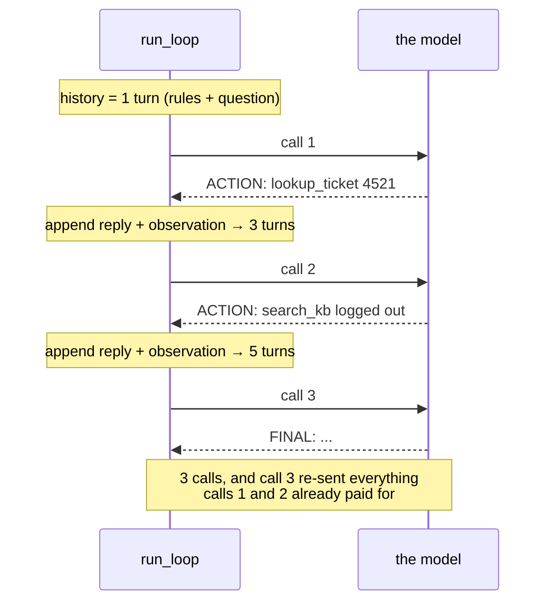

# 4.2 — The first real run: reading a trace, and proving the answer was earned

## One-line answer

A correct answer is not evidence that the loop worked — the only proof is a fact in the final answer
that exists nowhere except in a tool result, which is why today's knowledge base contains a detail
the model could not have known.

---

## The story

A teacher sets a homework question and gets back two papers with the same correct answer at the
bottom. Neither shows any working. From the answers alone she cannot tell who understood the
problem, who copied, and who guessed well.

So the next week she does something quietly clever. She writes the question around a detail that
appears in exactly one place — a slightly odd figure printed on page ninety-four of the textbook and
nowhere else in the world. Anyone who opened the book will use that figure. Anyone who reasoned from
general knowledge will produce something sensible and *different*.

The papers come back. Most carry the odd figure. Two carry a perfectly reasonable number that is not
it. She has learned nothing about who is clever — she has learned something far more useful about who
actually opened the book.

That is the difference between an answer being right and an answer being *earned*, and it is the
only thing you can check from the outside.

---

## The idea in plain language

You are about to run the loop for the first time, and the temptation is to read the last line, see
something sensible, and call it working. Resist it, because a language model has read an enormous
amount of technical writing and can produce a plausible support answer about session cookies with no
tools, no ticket, and no knowledge base whatsoever.

So the run gets checked three ways, in this order:

- **Read the trace, not the answer.** Each step prints the model's reply and the resulting
  observation. A working loop shows a *chain*: a thought that names what is missing, an action that
  fetches it, an observation that supplies it, and a next thought that uses it. If step two's thought
  does not refer to what step one's observation said, the chain is broken even if the ending is fine.
- **Apply the citation test.** Today's knowledge base was written with the teacher's trick in it. The
  article about logouts names a specific mechanism — a cookie attribute and a protocol — and those
  words appear in the final answer only if the article actually reached the model. That is the odd
  figure on page ninety-four.
- **Count the calls.** A three-step run is three model calls, not one. If your quota moved by one,
  the model answered from its own memory and never used a tool at all, which is a *failure* wearing a
  correct answer as a disguise.

One term defined on first use: what your terminal prints is a **trace** — an ordered record of what a
system did, step by step, as it did it. It is the single most valuable artifact an agent produces,
and it is worth more than the answer, because the answer tells you what happened once and the trace
tells you *why*, which is the only thing you can fix.

---

## Why Sutra needs it

- **Today**, [4.3](4.3-the-honest-failure.md) uses this same trace to check something harder than
  correctness — whether the agent admits what it does not know — and
  [6.1](../06-failure-lab/6.1-the-goldfish-loop.md) reads a trace that is broken in one specific
  place.
- **Day 7 (ADK-04, ADK-05)** turns these `print` lines into a real event stream. Every event ADK
  emits corresponds to something already visible in this trace, which is why the day is a comparison
  rather than an introduction.
- **Day 84 (OPS)** replaces the trace with structured spans and a trace id that follows a request
  across processes. Same idea, industrial plumbing.
- **Days 79–83 (evals)** score runs automatically. Every automated check you will write there is a
  machine reading exactly what you are about to read by eye: did the answer cite what it should have,
  and did the chain actually happen.

---

## The mechanism

Run it. One command, and the question is deliberately the one whose answer is in the knowledge base:

```bash
uv run python -m sutra.loop "Ticket 4521 says the user keeps getting logged out. What is going on and what should we tell them?"
```

**Line by line:**

- `uv run python -m sutra.loop` — the project interpreter, and `-m` so the module runs **inside** its
  package ([4.1](4.1-assembling-the-loop.md): a bare path gives `ModuleNotFoundError: No module named
  'sutra'`).
- The question names **the ticket id and the symptom**. Both matter: the id is what makes
  `lookup_ticket` the obvious first move, and the symptom is what makes `search_kb` the obvious
  second. A question that gave only the id would still work; a question that gave only the symptom
  would let the model skip straight to the knowledge base and never read the ticket, which is a
  perfectly reasonable thing for it to do and a less interesting run to read.
- Quote the whole question. Unquoted it still works — `main` joins the remaining arguments — but a
  shell will eat the question mark in some configurations, and a question that arrives without its
  final word is a confusing first run.
- **This command costs three model calls** on a clean run. Budget it: the hub's §6 counts it, and a
  handful of experimental runs is enough to meet a per-minute ceiling on a free tier.

Here is what a healthy run looks like. Read it as a chain, not as an output:

```text
--- step 1 ---
THOUGHT: I need the contents of ticket 4521 before I can diagnose anything.
ACTION: lookup_ticket 4521
OBSERVATION: Title: Keeps getting logged out. Body: I keep getting logged out of the
dashboard every few minutes. Started yesterday. Plan: Pro.

--- step 2 ---
THOUGHT: The ticket describes repeated logouts, so I should check for a known issue.
ACTION: search_kb logged out of the dashboard
OBSERVATION: KB-104 'Unexpected logouts': cookies set with SameSite=Strict plus an
http:// dashboard URL end sessions early; fix is forcing https.

--- step 3 ---
THOUGHT: KB-104 matches the reported symptom exactly, so I can answer.
FINAL: This matches KB-104. The dashboard is setting session cookies with
SameSite=Strict while being served over http://, which causes the browser to drop
the session after a short time. Tell the user we have identified a known issue and
are forcing https on the dashboard; that will stop the logouts.

=== ANSWER ===
This matches KB-104. The dashboard is setting session cookies with SameSite=Strict
while being served over http://, which causes the browser to drop the session after
a short time. Tell the user we have identified a known issue and are forcing https
on the dashboard; that will stop the logouts.
```

Now read it properly, in the order that matters:

| What to check | Where to look | What a pass looks like |
| --- | --- | --- |
| Did the chain happen? | step 2's `THOUGHT` | it refers to what step 1's observation *said* — "repeated logouts" is from the ticket body, not from the question |
| Was the answer earned? | `SameSite`, `http://`, `https` in `FINAL` | those exact words exist only in KB-104's text |
| Was the citation real? | `KB-104` in `FINAL` | the id appears in an observation before it appears in the answer |
| Did it stop cleanly? | the last step | a `FINAL:` line, not a step-budget message |
| What did it cost? | step count | three steps, three model calls |

**The single most important cell in that table is the second row.** `SameSite=Strict` is the odd
figure on page ninety-four. It is a real mechanism, it is specific, and it is in the knowledge base
that your loop fetched — so its presence in the final answer is evidence that the observation
travelled all the way from a Python dict into the model's context and out again. An answer that says
*"this is likely a session-timeout configuration issue"* is not wrong, and it is not evidence of
anything.

There is a second, subtler pass worth making, and it is the one that separates people who have
debugged agents from people who have run them. Look at what is **not** in the trace:

```bash
uv run python -m sutra.loop "Ticket 4521 says the user keeps getting logged out. What is going on?" 2>&1 | grep -c "^ACTION:"
```

**Line by line:**

- `2>&1` — merge the error stream into the output stream, so nothing is lost if the run raises. On a
  clean run it changes nothing, and on a broken run it is the difference between seeing the traceback
  and seeing half of it.
- `grep -c "^ACTION:"` — count lines *beginning with* `ACTION:`. The caret anchors at the start of
  the line, so a thought sentence mentioning the word is not counted.
- **It must print `2`** for the run above. Zero means the model answered from its own training data
  and used no tools at all — the disguised failure this whole part is about. One means it read the
  ticket and then answered without checking the knowledge base, which is the *plausible-sounding*
  failure, and the one you will meet most often in real systems.

The run as a whole, with the transcript's growth shown, because that growth is what you are paying
for:



---

## When it breaks

**The most dangerous outcome of today, which is a correct answer:**

```text
--- step 1 ---
THOUGHT: Repeated logouts from a dashboard usually indicate a session cookie problem.
FINAL: This is most likely a session cookie issue — check whether the cookie's
SameSite attribute is set to Strict and whether the dashboard is served over https.
Ask the user to clear cookies and confirm the URL scheme.

=== ANSWER ===
This is most likely a session cookie issue — check whether the cookie's SameSite
attribute is set to Strict and whether the dashboard is served over https...
```

**What it means.** One step. One model call. **No tool was used at all**, and the answer is broadly
right, because the model has read a great deal about session cookies and this is a common problem.
Every part of that output looks like success and none of it is.

Read what is missing: no ticket was fetched, so nothing here is grounded in *this user's* report; no
article was retrieved, so `KB-104` is not cited and the answer hedges with "most likely"; and the
next ticket, whose cause is *not* a common problem, will get the same confident guess.

**The smallest fix is a better question, not better code.** Ask something the model cannot know —
which is exactly what [4.3](4.3-the-honest-failure.md) does next, with a ticket that does not exist.
The durable lesson: **a demo question whose answer the model already knows cannot test a retrieval
system.** Every eval you write from Day 79 onward has to be designed against this, and it is the
single most common flaw in agent demos.

**The half-chain**, subtler and much more common in production:

```text
--- step 2 ---
THOUGHT: The ticket describes repeated logouts. This is a well-known browser
session issue, so I can answer without further lookup.
FINAL: The user is experiencing session expiry, likely due to cookie settings...
```

**What it means.** The ticket was fetched and the knowledge base was not. `grep -c "^ACTION:"` prints
`1`. The answer is uncited, and worse, it *sounds* grounded because it mentions the user's symptom —
which came from the ticket. The tell is always the same: **a real mechanism, or a category?**
`SameSite=Strict plus an http:// URL` is a mechanism and could only have come from KB-104. "Cookie
settings" is a category and could have come from anywhere.

The fix is a prompt change — the rule *"cite the KB article id in your FINAL answer"* — and the
reason it belongs in the prompt rather than the code is that your loop cannot tell a grounded answer
from an ungrounded one, but it *can* check for a cited id. Try it, and note what you have just built:
your first eval assertion.

**Running out of quota mid-run**, which you will see and which is not a bug:

```text
--- step 2 ---
THOUGHT: The ticket describes repeated logouts, so I should check for a known issue.
ACTION: search_kb logged out of the dashboard
OBSERVATION: KB-104 'Unexpected logouts': cookies set with SameSite=Strict...
429: quota hit — waiting 34s (attempt 1/4)

--- step 3 ---
THOUGHT: KB-104 matches the reported symptom exactly, so I can answer.
FINAL: This matches KB-104...
```

**What it means.** A loop spends several calls in quick succession, so it trips a per-minute ceiling
far more easily than a single call ever did. Day 2's `ask` read the server's own stated delay, waited
it out, and carried on — the run is slower and completely correct. **This is the free tier working as
designed**, and the fact that the pause is announced rather than silent is why it reads as a wait
rather than a hang.

**The identical repeated step**, which has its own part:

```text
--- step 2 ---
THOUGHT: I need the contents of ticket 4521 before I can diagnose anything.
ACTION: lookup_ticket 4521
```

**What it means.** Step 2 is byte-for-byte step 1. The transcript did not grow, so the model was
asked the same question twice and answered it the same way twice — correctly. Your appends are
broken. This is [6.1](../06-failure-lab/6.1-the-goldfish-loop.md), staged on purpose, and you will
run it deliberately before the day is over.

---

## In production

**What a professional writes instead of `print` is a structured trace with a run id.** Every step
becomes a span carrying the step number, the proposed action, the tool that ran, its latency, its
outcome and the token counts, all tied to one identifier that follows the request through every
process it touches. The reason is not tidiness: it is that a printed trace can only be read by the
person whose terminal it is, and the question you actually need answered — *"show me every run last
night where the agent answered without citing an article"* — is a query, not a scroll. Sutra builds
that on Day 84, and the design constraint that starts today is to make every step emit a **complete**
record rather than a readable one.

**What degrades at scale is your ability to look at traces at all.** Ten runs a day, you read them
all. Ten thousand, you read none, and the interesting ones are a fraction of a percent. Production
practice is to sample normal traces and keep **every** trace that hit an interesting condition —
budget exhausted, a tool error, zero tool calls, an answer with no citation. Choosing those
conditions is a design act, and the honest version of it starts from the failures in this part: the
run that used no tools and the run that used one tool are both *successes* by any status code you can
measure, so if they are not conditions you capture deliberately, you will never see one again.

**The failure that only appears with real traffic is what a trace contains.** The transcript holds
the user's question verbatim, the ticket body verbatim, and whatever the tools returned — which in a
real support system is names, email addresses, and occasionally a password someone pasted into a
ticket. A trace store is a copy of all of it, usually with longer retention and weaker access
controls than the database it came from. Every serious deployment redacts on the way into the trace,
not on the way out, and Day 68's data-handling work is where Sutra does it. Today's synthetic tickets
exist precisely so this is a lesson rather than an incident.

**The review comment a senior engineer leaves:** *"The demo question is one the base model can answer
without any tools, so this trace doesn't prove retrieval works — it proves the model has read the
internet. Pick a question whose answer only exists in our data, assert the article id appears in the
output, and make zero-tool-call runs a tracked condition rather than a success."*

**The interview question:** *"your agent gave the right answer. How do you know the retrieval step
worked?"* The answer that shows you have shipped one: "From the answer alone, I don't — a strong base
model will produce a plausible answer to most support questions with no retrieval at all, and that
looks identical to success in every metric you'd naively collect. So I check the trace for the chain,
and I put something in the retrieved data that couldn't come from anywhere else — a specific
identifier, an internal mechanism, a value that isn't public — and assert on it. In production I
track the distribution of tool calls per run and treat zero-tool runs as an anomaly to look at, not
as a fast success. The version of this failure that actually bites is subtler: the retrieval runs,
returns nothing useful, and the model answers from its own knowledge anyway. That one is only
visible if you're asserting on grounding rather than on correctness."

---

## Check yourself

```bash
uv run python -m sutra.loop "Ticket 4521 says the user keeps getting logged out. What should we tell them?" 2>&1 | tee days/day-03-loop-hand-rolled/lab/run1.txt | grep -E "^(THOUGHT|ACTION|OBSERVATION|FINAL)" | head -20
grep -c "SameSite" days/day-03-loop-hand-rolled/lab/run1.txt
```

The first command prints the chain. The second must print at least `2` — once in the observation and
once in the final answer. If it prints `1`, the article was fetched and never used; if it prints `0`,
no article was fetched at all.

**Answer out loud, without scrolling up:**

> Your agent produced a correct, sensible support answer. Say two things you would check in the trace
> before believing the loop works, and explain why "the answer was right" is the weakest possible
> evidence you could have.

---

**Next:** [4.3 — The honest failure](4.3-the-honest-failure.md)
