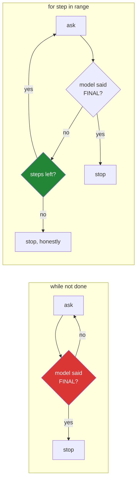

# 5.1 — The step budget: the brake ships with the engine

## One-line answer

The loop's bound must be a fixed number your code chose, enforced by a `for` over a range that
nothing inside the body can extend — because the thing deciding whether to continue is the model,
and the model is precisely the component that might be wrong.

---

## The story

On a summer morning in 2012 a trading firm switched on a new piece of software before the market
opened.

Something in it read an old setting the wrong way. Not dramatically — it did not crash, it did not
alarm, it did not do anything a monitor would have flagged. It simply began buying and selling.
Then it did it again. Then again, thousands of times a second, every single transaction perfectly
legal, correctly formatted and properly logged.

The people in the building knew something was wrong within a few breaths of the opening bell. What
they did not have was a way to make it stop. There were engineers, there were phones, there were
people shouting; there was no single switch. By the time the machine was off, the firm had lost
something near four hundred and forty million dollars, and it did not survive the year.

Nobody wrote a bug that lost that money. Somebody wrote a loop that had no reason of its own to
stop, and everything else followed.

---

## The idea in plain language

Your loop asks a model what to do next, and then does it, and then asks again. The obvious way to
write that is: *keep going until the model says it is finished.*

Read that sentence again with the story in mind. **The condition for stopping is controlled by the
component you trust least.** If the model never emits `FINAL:` — because it is confused, because a
tool keeps returning something it cannot use, because the format instruction eroded twenty steps ago
— your loop runs forever, spending a paid call every pass, and the only thing that stops it is
somebody noticing.

So the rule, which is Principle 13 (*blast radius before capability*) in its smallest possible form:

> **The bound on a loop belongs to your code, not to the model, and it goes in on the same day the
> loop does — not later, when it is needed.**

There are two ways to write a bound and they are not equivalent:

| | `while not done:` | `for step in range(1, max_steps + 1):` |
| --- | --- | --- |
| What ends it | a condition someone has to get right | running out of numbers |
| Can the body extend it? | yes — set `done = False` and it never ends | **no** |
| What a bug in the body does | may loop forever | costs one wasted pass, then ends |
| Reviewer has to check | every path that touches the condition | nothing |

The second is a **structural** bound: it is not enforced by correct logic, it is enforced by there
being no more numbers. That difference is the entire point. Correct logic is a thing you hope for;
a `range` is a thing you have.

And there is a second decision hiding behind the first, which people usually get wrong: **what
happens when the budget runs out?** Three options, and only one is honest:

- **Raise an exception.** Tempting, and wrong for this case: running out of steps is not a defect,
  it is a normal outcome of a hard question, and turning it into a traceback means the caller cannot
  distinguish "your agent is broken" from "your agent could not finish".
- **Answer anyway** — ask the model for a best guess with what it has. This is the third clerk from
  [4.3](../04-running-the-loop/4.3-the-honest-failure.md) wearing a system design as a disguise, and
  it converts a visible limit into an invisible fabrication.
- **Report the stop.** Return a plain statement: how many steps ran, and what the last observation
  was. It is not satisfying, and it is the only one that leaves the caller better informed than
  before.

---

## Why Sutra needs it

- **Today**, [6.1](../06-failure-lab/6.1-the-goldfish-loop.md) breaks the transcript on purpose and
  the loop repeats one action forever. The step budget is the only reason that experiment costs a
  handful of calls instead of your entire daily quota.
- **[5.2](5.2-the-transcript-is-a-bill.md)** shows why a step limit is not enough on its own: steps
  are cheap early and expensive late, so a bound on *count* is a weak bound on *cost*.
- **Day 21 (ADK-23, SEC-02)** and **Day 24 (OPS-07, AG-11)** turn this into real budget enforcement —
  per-run token ceilings, per-provider quota accounting, and what happens when one is hit.
- **Day 70 (Quota-Router)** routes work between free providers by remaining quota. Every one of those
  decisions is downstream of a run having a knowable maximum cost.
- **Days 92–96 (multi-agent)** compound the problem: an agent that can call another agent that can
  call it back is a loop whose bound is not visible in any single function. The habit of writing the
  brake first is what keeps that day survivable.

---

## The mechanism

The bound is one parameter and one `for`. Here is the version that is already in
[4.1](../04-running-the-loop/4.1-assembling-the-loop.md), with the two lines that matter isolated:

```python
def run_loop(client: genai.Client, question: str, *, max_steps: int = 6) -> str:
    ...
    for step in range(1, max_steps + 1):
        ...
    return f"Stopped after {max_steps} steps without an answer. Last observation: {observation}"
```

**Line by line:**

- `*, max_steps: int = 6` — **keyword-only, with a default.** Keyword-only because a bare number at a
  call site is unreadable and this particular number is a safety limit. A default because the caller
  who forgets to set one must still get a bound; a signature that *requires* the caller to pass a
  limit will eventually meet a caller who passes a very large one.
- `= 6` — small on purpose. Today's agent needs two steps for its real question and three for a
  thorough one, so six is generous. **The right default is a few times what a healthy run needs**,
  which makes exhaustion a signal rather than a routine event. A default of 50 would hide the very
  failures the number exists to catch.
- `for step in range(1, max_steps + 1):` — the structural bound. Note that nothing inside the body
  touches `step` or `max_steps`; that is not a coincidence to be preserved by discipline, it is
  guaranteed by `range` having already been constructed.
- `return (f"Stopped after {max_steps} steps without an answer. ...")` — the fall-through, reached
  only when the `for` completed without a `FINAL:`. It is a **plain report**, not an exception and
  not an attempted answer. It names the number of steps so a reader can tell a budget stop from every
  other kind of ending, and it includes the last observation so the stop is diagnosable without
  digging out the trace.
- This return is the reason `observation` is pre-bound above the loop
  ([4.1](../04-running-the-loop/4.1-assembling-the-loop.md)) — with `max_steps=0` the body never runs
  and the name would not exist.

Now the version to never write, side by side, because the difference is the whole part:

```python
    # DO NOT DO THIS
    done = False
    while not done:
        reply = ask(client, history, config={"temperature": 0.0}).output_text or ""
        action, final = _parse(reply)
        if final is not None:
            done = True
            answer = final
        else:
            history.append(_user_turn(f"OBSERVATION: {_dispatch(action)}"))
```

**Line by line:**

- `while not done:` — the loop's continuation is now a **variable**, and a variable can be got wrong
  by any line in the body, by a future edit, or by an exception that skips the assignment.
- `if final is not None: done = True` — the only line that can end the loop, and it fires only when
  the model cooperates. A model that never emits `FINAL:` — which is a *format* failure, not a
  reasoning failure, and therefore common — makes this program run until the process is killed or the
  daily quota is gone.
- Notice there is no step counter at all, so there is also **no way to notice**. The run produces
  output continuously and looks busy. This is the trading floor: everything is working, each
  individual action is valid, and there is no switch.
- The seductive part is that this version is *shorter*. Bounds always look like ceremony until the
  afternoon they do not.

The two shapes, and where each one can end:



One diamond is owned by the model. The other is owned by you. That is the whole diagram.

And now the eval that proves the brake actually holds — **offline, no key, no quota**, which is what
makes it a test rather than a demonstration:

```python
import types


class AlwaysActs:
    """A fake client whose every reply asks for the same tool, forever."""

    def __init__(self) -> None:
        self.calls = 0
        self.interactions = self  # so client.interactions.create(...) lands here

    def create(self, **kwargs: object) -> object:
        self.calls += 1
        return types.SimpleNamespace(
            output_text="THOUGHT: I will check again.\nACTION: lookup_ticket 4521"
        )


def test_the_step_budget_is_a_hard_ceiling() -> None:
    client = AlwaysActs()
    answer = run_loop(client, "anything at all", max_steps=3)
    assert client.calls == 3
    assert "Stopped after 3 steps" in answer
```

**Line by line:**

- `class AlwaysActs:` — a **fake, not a mock library.** It is nine lines, it has no dependency, and
  what it does is obvious from reading it. Reach for a mocking framework when a hand-written fake
  stops being readable, which is much later than most codebases assume.
- `self.interactions = self` — the small trick that makes this work. `ask` calls
  `client.interactions.create(...)`, so pointing `interactions` back at the object itself means
  `create` below receives the call. One line instead of a second class.
- `def create(self, **kwargs: object)` — accepts **any** keyword arguments and ignores them, so the
  fake does not break when `ask` starts passing something new. A fake that asserts on its arguments
  is testing the caller; this one is testing the loop.
- `self.calls += 1` — **the assertion's whole point.** The test does not check that the loop
  *finished*; it checks how many times it called the model, which is the number that would have been
  unbounded.
- `types.SimpleNamespace(output_text=...)` — the smallest object with the one attribute `run_loop`
  reads. Stdlib, no dependency, and it makes the shape of the dependency explicit: the loop needs
  `.output_text` and nothing else.
- The reply always contains an `ACTION:` and never a `FINAL:`, which is exactly the model behaviour
  that makes a `while` loop run forever. **The test is the disaster, staged.**
- `assert client.calls == 3` — `==`, not `<=`. The budget is a ceiling *and* the loop should use all
  of it when the model never finishes; an assertion of `<= 3` would still pass if the loop quietly
  stopped after one step for an unrelated reason.
- `assert "Stopped after 3 steps" in answer` — the ending must be **identifiable**. A caller, an eval,
  or a dashboard has to be able to tell a budget stop from an answer, and a distinctive string is the
  crudest workable version of that. Day 12's structured output replaces it with a field.
- **This test passes even with `_model_turn` still a `TODO(me)`**, because nothing here inspects the
  history. That is deliberate: the brake is testable before the agent works, which is the correct
  order to build them in.

---

## When it breaks

**The brake working, which is what you will actually see** — run
[6.1](../06-failure-lab/6.1-the-goldfish-loop.md)'s broken loop, or ask an unanswerable question:

```text
--- step 6 ---
THOUGHT: I still do not have enough information about this ticket.
ACTION: lookup_ticket 9999
OBSERVATION: No ticket with id '9999'.

=== ANSWER ===
Stopped after 6 steps without an answer. Last observation: No ticket with id '9999'.
```

**What it means.** Nothing failed. The loop reached its limit and said so, having spent six calls.
The message is doing three jobs at once: it says the run ended, it says *why* it ended, and it hands
you the last thing that happened so you can start debugging without opening the trace. **A stop
message that says only "failed" would have cost you a re-run.**

**The budget that was raised instead of investigated**, which is the most common real-world response
and the wrong one:

```python
answer = run_loop(client, question, max_steps=40)  # "it kept hitting the limit"
```

**Line by line:**

- Raising the number does make the message go away, and this is worth being blunt about: **the limit
  was not the problem.** A run that needs forty steps to answer a support question is a run where
  something is wrong — a tool returning unusable output, a format miss loop, a question the tools
  cannot answer — and every one of those is now forty paid calls instead of six.
- The correct response to a budget stop is to **read the trace** and find out which step stopped
  making progress. The number goes up only when a healthy run genuinely needs more, and then it goes
  up with a note saying why.

**No budget at all**, which is what the `while` version buys you:

```text
--- step 41 ---
THOUGHT: I will check the ticket again to be certain.
ACTION: lookup_ticket 4521
OBSERVATION: Title: Keeps getting logged out. Body: I keep getting logged out...
429: quota hit — waiting 31s (attempt 1/4)
--- step 42 ---
...
google.genai.errors.ClientError: 429 RESOURCE_EXHAUSTED ... 'quotaId':
'GenerateRequestsPerDayPerProjectPerModel-FreeTier', 'quotaValue': '250'
```

**What it means.** The loop ran until the **daily** quota was gone, which took a few thousand
seconds and cost you the rest of the day's work. Read the `quotaId`: this is PerDay, not PerMinute,
so Day 2's retry wrapper correctly refused to wait it out and raised. **The free tier is what turned
an unbounded loop into a bad afternoon instead of a large bill** — Principle 15, doing a job nobody
designed it for.

**The exception version**, which looks more rigorous and is worse:

```python
    raise RuntimeError(f"agent exceeded {max_steps} steps")
```

**Line by line:**

- It reads as strict, and the strictness is aimed at the wrong thing. Running out of steps is a
  **normal outcome** of a question the tools cannot answer, so this converts an ordinary result into
  an error that a caller must now catch — and a caller who catches `RuntimeError` will eventually
  catch a real one with it.
- It also destroys the useful part. The exception carries the step count and not the last observation,
  so the one piece of information that would have told you *where* progress stopped is gone.
- Keep exceptions for the case where **your code** is broken (Principle 10 and
  [2.3](../02-tools-and-dispatch/2.3-a-failed-tool-is-an-observation.md)). A limit being reached is
  the system working.

---

## In production

**What a professional writes instead is three budgets, not one.** Steps are the cheapest bound to
implement and the weakest, because step cost is not constant — [5.2](5.2-the-transcript-is-a-bill.md)
shows that step six costs several times step one. A real agent runtime enforces a **step ceiling**, a
**token ceiling** for the whole run, and a **wall-clock deadline**, and it stops on whichever arrives
first. The deadline matters more than it looks: it is the only one of the three that bounds a run
whose tool is a slow network call rather than a model. Sutra builds the token budget on Day 24 and
the deadline arrives with the async work in Phase 12.

**What degrades at scale is that the budget becomes a distribution.** One run with a ceiling of six
is a fact. Ten thousand runs a day is a histogram, and the number you actually need is not the
ceiling but the **share of runs that hit it**. Under a percent means the ceiling is doing its job as
a backstop. Ten percent means it has quietly become your normal completion path and a tenth of your
users are getting a stop message — and nothing will page you, because every one of those runs
returned successfully. Emit the stop reason as a counter on day one; it is one line, and without it
this failure is invisible for months.

**The failure that only appears with real traffic is the budget that stops the wrong thing.** A run
hits the ceiling halfway through a sequence of actions — three of five refunds issued, two not, and
the transcript ends with a message about steps. Read-only tools make this harmless, which is why
today's agent has only two of them. The moment a tool writes, a step budget is no longer a brake but
a **guillotine**, and the design that survives it is one where the loop's state is durable and a
stopped run is *resumable* rather than abandoned. That is the deep reason the transcript-as-state
idea from [1.2](../01-loop-anatomy/1.2-the-transcript-is-the-world.md) matters, and Day 8's session
service is the first step toward it.

**The review comment a senior engineer leaves:** *"There's a step ceiling but no token ceiling and no
deadline, so a run with one pathological tool response can be inside the step budget and still cost
twenty times a normal run. Add a token budget for the whole run and a wall-clock deadline, stop on
whichever comes first, and emit the stop reason as a labelled counter — I want to know what fraction
of runs end this way before a customer tells me."*

**The interview question:** *"what stops an agent loop?"* The answer that ends the conversation is
"when the model says it's done". The answer that starts a good one: "Two things, and only one of them
is the model. The model can declare it's finished, and my code can stop it — and the second one has
to be structural, a `for` over a fixed range rather than a `while` on a condition, because the
condition would be evaluated on output from the component most likely to be wrong. In production
that's three bounds: steps, total tokens for the run, and a wall-clock deadline, stopping on
whichever hits first. And when a bound is hit, the run reports that it stopped and why — it doesn't
raise, because running out of budget is a normal outcome, and it definitely doesn't ask the model for
a best guess with what it has, because that turns a visible limit into an invisible fabrication."

---

## Check yourself

```bash
uv run python -m pytest tests/test_loop.py -q -k budget
```

Green. Now break it on purpose: change `for step in range(1, max_steps + 1):` to
`while True:` and run the same test. It will hang — kill it with `Ctrl-C` and read the traceback to
see which line it was sitting on. **Put the `for` back.** A brake you have never tested is a
decoration.

**Answer out loud, without scrolling up:**

> Say why the loop's bound is a `for` over a range rather than a `while`, and name the component
> whose judgement you are declining to trust. Then say what your loop returns when the budget is
> exhausted, and why neither raising nor guessing is acceptable there.

---

**Next:** [5.2 — The transcript is a bill](5.2-the-transcript-is-a-bill.md)
