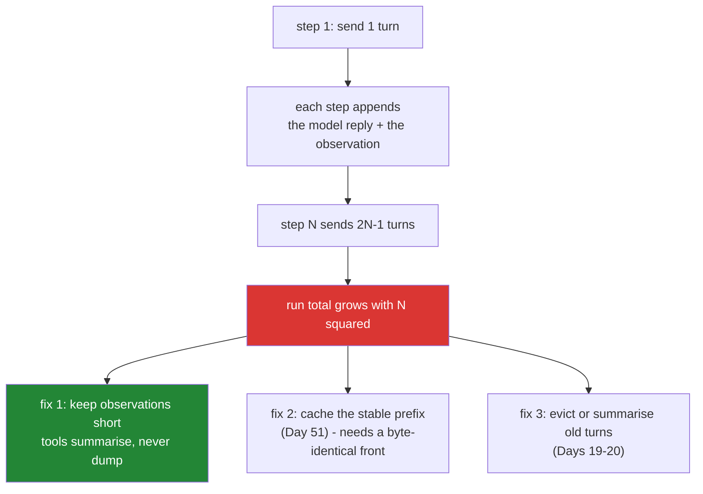

# 5.2 — The transcript is a bill: why a six-step run costs far more than six calls

## One-line answer

Every step re-sends the entire transcript, so a run's cost is not the number of steps but the sum of
a growing list — which makes a limit on step *count* a weak limit on step *cost*, and makes the
length of a tool's output a budget decision rather than a formatting one.

---

## The story

A lawyer bills by the page read.

You send the first letter about your case: one page. She reads one page and bills you for one.

You send a second letter with a follow-up question. But she has no memory of the first — this firm's
rule is that every question is answered fresh, from the complete file. So she reads both pages and
bills for two.

The third question: three pages. The fourth: four. Each individual bill looks perfectly reasonable
and is exactly what was agreed. Nobody is doing anything wrong.

At the end of the month you open the invoice expecting ten pages of reading, because you sent ten
letters. The invoice is for fifty-five, and every line of it is correct.

Then you notice something worse. Your seventh letter included a forty-page appendix. It was read
once, on question seven — and then again on eight, nine and ten. One decision about what to attach,
made without thinking, cost you a hundred and sixty pages of reading.

---

## The idea in plain language

[1.2](../01-loop-anatomy/1.2-the-transcript-is-the-world.md) established that the model is stateless
and the transcript is its entire world, re-sent on every call. This part is the invoice for that
fact.

Each pass of the loop adds **two** turns to the transcript — the model's reply and the observation
([4.1](../04-running-the-loop/4.1-assembling-the-loop.md)'s two `append` lines). So the input to each
call grows steadily, and the run's total input is the sum of a growing series rather than a constant
times the step count.

Put concretely, if the transcript is `T` turns at step one and grows by two each step:

| Step | Turns sent | Running total of turns sent |
| --- | --- | --- |
| 1 | 1 | 1 |
| 2 | 3 | 4 |
| 3 | 5 | 9 |
| 4 | 7 | 16 |
| 5 | 9 | 25 |
| 6 | 11 | 36 |

Six steps, thirty-six turns' worth of reading. **The total grows with the square of the step count**
— the running-total column is the step number multiplied by itself, which is not a coincidence but
the arithmetic of summing an arithmetic series. Doubling the step budget does not double the cost of
a worst-case run; it roughly quadruples it.

Two consequences follow, and they are the reason this is a `production`-level part rather than a
piece of trivia:

- **[5.1](5.1-the-step-budget.md)'s step ceiling is a weak cost bound.** Six steps is a bound on
  count, and the cost of the sixth is several times the cost of the first. What you actually want to
  bound is tokens for the whole run, and step count is only a proxy for it.
- **The length of a tool's output is a budget decision.** An observation is not printed once — it is
  re-sent on every remaining step. A tool that returns a two-hundred-row dump on step two pays for
  that dump again on steps three, four, five and six. This is the forty-page appendix, and it is why
  the rule *tools summarise, they do not dump* is a real engineering constraint and not a style
  preference.

One term defined on first use: **prompt caching** is a provider feature where the unchanging front
part of your input — the system prompt and the older turns — is stored on their side so a repeat send
is charged at a fraction of the normal rate. It does not remove the growth; it makes the repeated
part cheap. Sutra builds it on Day 51, and its one design demand is already visible here: the stable
part of the transcript has to come **first** and stay byte-identical, or nothing matches.

---

## Why Sutra needs it

- **Today**, this is the number that makes [5.1](5.1-the-step-budget.md)'s brake meaningful. A step
  budget you cannot convert into a token figure is a limit you cannot reason about.
- **Days 19–20 (AG-08, AG-09, AG-10, ADK-22)** are context engineering — deciding what earns a place
  in the transcript, and summarising or evicting the rest. Every technique there is a direct attack
  on this curve, and none of it makes sense until you have measured the curve on your own run.
- **Day 24 (OPS-07, AG-11)** enforces a real per-run budget in RPM/RPD terms. Its arithmetic reads
  the same `usage` fields you are about to print.
- **Day 51** adds caching. **Day 70** routes between free providers by remaining quota. Both are
  answers to the question this part asks.
- **Principle 15:** quota is the currency. On a free tier this curve is not an abstract cost — it is
  the difference between finishing your day's work and waiting until midnight Pacific.

---

## The mechanism

You already have the receipt. Day 2's
[2.2](../../../day-02-llm-mechanics/parts/02-tokens-the-meter/2.2-reading-the-receipt.md) showed that
every interaction carries a `usage` object and that **it cannot be reconstructed later** — if you do
not read it when the call returns, it is gone. So the change to `run_loop` is to stop throwing it
away.

Three lines change at the top of the loop body:

```python
    spent: list[object] = []

    for step in range(1, max_steps + 1):
        interaction = ask(client, history, config={"temperature": 0.0})
        reply = interaction.output_text or ""
        spent.append(interaction.usage)
        print(f"\n--- step {step} ---\n{reply.strip()}")
```

**Line by line:**

- `spent: list[object] = []` — declared beside `history`, because the two grow together and are the
  two things a run accumulates. `list[object]` rather than a precise type because the SDK's usage
  class is an implementation detail you have not verified the name of; **naming a type you have not
  checked is inventing an API** (Principle 8), and `object` is honest.
- `interaction = ask(...)` — the interaction is now **bound to a name** instead of having
  `.output_text` chained straight off it. That single change is the whole mechanism: the previous
  version discarded the receipt at the end of the expression.
- `reply = interaction.output_text or ""` — the same guard as before, now on its own line. Day 2's
  trap: `output_text` can be `None` on a successful call.
- `spent.append(interaction.usage)` — **collect, do not total, here.** Summing as you go would give
  you one number; keeping the per-step objects lets you print the curve, and the curve is the lesson.
  It also costs nothing: the objects already exist.
- **Order matters slightly**: append the usage *before* any `return` further down, or a run that
  finishes on step three loses step three's receipt.

And the report, printed once at the end of a run:

```python
def _cost_table(spent: list[object]) -> str:
    """One row per step, so the growth in input tokens is visible as a shape."""
    rows = ["step   input  output  thought   total"]
    for step, usage in enumerate(spent, start=1):
        rows.append(
            f"{step:>4}  {usage.total_input_tokens:>6}  {usage.total_output_tokens:>6}  "
            f"{usage.total_thought_tokens:>7}  {usage.total_tokens:>6}"
        )
    total = sum(usage.total_tokens for usage in spent)
    rows.append(f"run total: {total} tokens over {len(spent)} calls")
    return "\n".join(rows)
```

**Line by line:**

- `def _cost_table(spent: list[object]) -> str:` — returns a **string** rather than printing. A
  function that prints can only be used one way; a function that returns can be printed, logged,
  asserted on in a test, or written to the lab folder.
- `enumerate(spent, start=1)` — steps numbered from one to match the trace above them. `start=1` is
  the whole reason to use `enumerate` rather than `range(len(...))`.
- `usage.total_input_tokens`, `total_output_tokens`, `total_thought_tokens`, `total_tokens` — the
  four fields Day 2 read off a live object on 2026-08-24 and recorded in its
  [2.2](../../../day-02-llm-mechanics/parts/02-tokens-the-meter/2.2-reading-the-receipt.md).
  **Re-verify them rather than trusting this document** — the legacy surface calls one of them
  `thoughts_token_count`, and copying between the two is a documented way to lose an evening. If
  `usage` is `None` on some call, that is a fact worth discovering here rather than in Day 24's
  budget code.
- `f"{step:>4}  {usage.total_input_tokens:>6}"` — right-aligned columns, because the point of the
  table is that one column **climbs** and a ragged left edge hides it. Formatting is doing analytical
  work here, which is rare enough to be worth naming.
- `total = sum(usage.total_tokens for usage in spent)` — a generator expression, not a list
  comprehension: nothing needs the intermediate list.
- `run total: ... over N calls` — the two numbers side by side are the entire argument of this part.
  Divide one by the other and compare it against a single call's cost from Day 2.

Wire it into the two exits so every run reports:

```python
        if final is not None:
            print(f"\n{_cost_table(spent)}")
            return final
```

**Line by line:**

- Printed **before** the `return`, so the table appears whichever way the run ends. The same two lines
  go above the fall-through return at the bottom of the function; a run that hit the step budget is
  precisely the run whose cost you most want to see.
- This is the second time today a `return` has needed something to happen just before it
  ([4.1](../04-running-the-loop/4.1-assembling-the-loop.md): the un-appended final turn). Two exits,
  each needing the same preamble, is the pressure that produces a `try/finally` or a context manager
  in a larger program. It is not worth it for two lines; note the pressure and move on.

Here is the shape you are looking for. **These are illustrative numbers — yours will differ, and
yours are the ones that count** (Principle 7 records what was observed, not what was printed in a
document):

```text
step   input  output  thought   total
   1     412      28      196     636
   2     498      31      241     770
   3     642      96      312    1050
run total: 2456 tokens over 3 calls
```

Read the `input` column downward. It climbs on every step, and it climbs because of the two `append`
lines and nothing else. Now compare `run total` against the cost of a single Day 2 call: **three
steps did not cost three times one call.** Then imagine step four's input, and step six's, and the
run where a tool returned a long article on step two.

The curve, with the two things that bend it:



---

## When it breaks

**The long observation, which is the version you will actually cause.** Add a third tool that returns
a realistic knowledge-base article rather than a one-sentence summary, and watch the input column:

```text
step   input  output  thought   total
   1     412      27      188     627
   2     498      34      256     788
   3    3104      41      302    3447
   4    3260     118      377    3755
run total: 8617 tokens over 4 calls
```

**What it means.** Step three fetched a long article — roughly two and a half thousand tokens of it —
and step four **paid for that article again**. So would steps five and six. One tool's return value,
chosen without thinking about it, more than tripled the run.

**The smallest fix is in the tool, not in the loop.** A retrieval tool returns a *relevant extract*
with an id, not a whole document; if the model needs more it can ask for it by id, which turns an
unconditional cost into a conditional one. This is the constraint behind chunking on Day 49, and it
is the sense in which a tool's return value is an interface design decision rather than a formatting
one.

**The 400 at the end of a long run**, which is this curve meeting a wall:

```text
google.genai.errors.ClientError: 400 INVALID_ARGUMENT. {'error': {'code': 400,
'message': 'The input token count (1104832) exceeds the maximum number of tokens
allowed (1048576).', 'status': 'INVALID_ARGUMENT'}}
```

**What it means.** The transcript grew past the context window. Day 2's
[3.1](../../../day-02-llm-mechanics/parts/03-context-and-memory/3.1-the-desk-that-gets-wiped.md)
predicted this exact error and Day 2's
[3.2](../../../day-02-llm-mechanics/parts/03-context-and-memory/3.2-history-is-a-list-you-own.md)
predicted the cause. Note **where** it lands: on the last call of a long run, after you have already
paid for every earlier one. A cheap failure would have happened at the start. **The smallest fix is a
cap on turns; the correct fix is an eviction policy**, which is Days 19–20.

**The missing receipt**, which is a design failure rather than an error:

```python
        reply = ask(client, history, config={"temperature": 0.0}).output_text or ""
```

**Line by line:**

- This is the original line from [4.1](../04-running-the-loop/4.1-assembling-the-loop.md), and it is
  perfectly correct code that quietly throws away the only record of what the call cost. The
  interaction object is garbage-collected at the end of the expression and **the usage cannot be
  fetched afterwards** — there is no endpoint that will tell you what a past call consumed.
- The general rule, worth carrying past today: **when a call returns metadata you are not using yet,
  capture it anyway if it cannot be recovered.** The cost of holding a small object is nothing; the
  cost of not having it is a re-run.

---

## In production

**What a professional writes instead is a token accountant, not a print statement.** Every model call
in a real system reports its usage to a counter labelled by run, tenant, model and step, and the
run's total is compared against a per-run ceiling that stops the loop when it is crossed — the second
of [5.1](5.1-the-step-budget.md)'s three bounds. That ceiling is enforced *before* the call, using
the input size you are about to send, because discovering you are over budget after paying is not
enforcement. Sutra builds this on Day 24, and its inputs are exactly the four fields above.

**What degrades at scale is that the average hides everything.** Mean tokens per run is a comfortable
number and it is the wrong one, because this distribution has a long tail by construction: most runs
finish in two steps and cost little, and the rare eight-step run costs sixteen times as much rather
than four. Watch the 95th and 99th percentile of tokens per run, and watch them *by step count* — the
finding that matters is almost always "runs that reach step five cost more than everything else
combined". A cost regression will show up there while the mean is still flat.

**The failure that only appears with real traffic is the cache that never hits.** Caching pays for
the stable prefix of the transcript, and the prefix is only stable if it is byte-identical between
calls. Put anything volatile near the front — a timestamp in the system prompt, a user id, a
freshly-shuffled tool list, the current date — and the prefix changes on every request, the cache
misses every time, and you pay full price while your dashboards show caching "enabled". Teams find
this by noticing the bill did not move after a caching launch. The rule that prevents it is the one
already visible in [3.1](../03-the-protocol/3.1-a-contract-enforced-by-politeness.md): **stable
content first, volatile content last**, and treat the prompt prefix as a cache key rather than as
text.

**The review comment a senior engineer leaves:** *"This tool returns the full article body, which
gets re-sent on every subsequent step of the run. Return an extract plus the id and let the model ask
for the rest — right now a single retrieval on step two sets the price of steps three through six.
Also: we bound steps but not tokens, so our 'worst case' is a number we cannot convert into quota."*

**The interview question:** *"your agent's cost per conversation is four times what you estimated.
Where do you look?"* The answer that shows you have run one: "First at the shape rather than the
total, because a loop's cost is quadratic in its length — every step re-sends the whole transcript,
so the estimate was probably built as calls times average call cost, and that's the wrong model. I'd
plot input tokens per step for a few real runs; if the input column climbs steeply, something is
being appended that shouldn't be, and it's usually a tool returning a whole document instead of an
extract. Then I'd check the step-count distribution, because the tail is what pays — runs that go
long cost disproportionately more. And I'd check whether prompt caching is actually hitting, which
usually means checking that nothing volatile crept into the front of the prompt, because a timestamp
in a system message quietly turns a cache-hit into a full-price call and nothing in the metrics says
so."

---

## Check yourself

```bash
uv run python -m sutra.loop "Ticket 4521 says the user keeps getting logged out. What should we tell them?" | tail -6
```

Read the `input` column downward and confirm it climbs. Then divide `run total` by the number of
calls and compare that against a single Day 2 call — the gap is what the loop costs you, and it is
the number to quote when someone asks why an agent is more expensive than a chatbot.

**Answer out loud, without scrolling up:**

> Say why six steps cost more than six times one step, and give the exact arithmetic. Then say why a
> tool that returns a whole document is a budget bug rather than a formatting choice, and name the
> one property a transcript needs before prompt caching can help you.

---

**Next:** [6.1 — 💥 The goldfish loop](../06-failure-lab/6.1-the-goldfish-loop.md)
