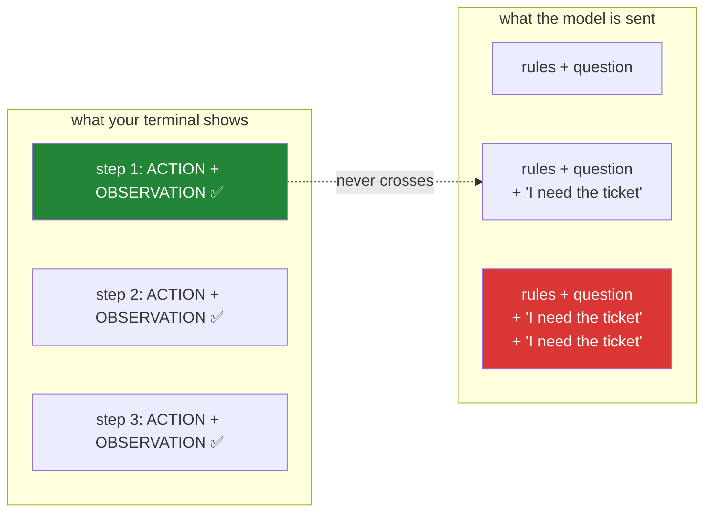

# 6.1 — 💥 The goldfish loop: delete one line and watch the agent forget forever

## One-line answer

Remove the line that writes the tool's result back into the transcript and the agent repeats the
same action until the step budget stops it — and the reason this is today's most valuable failure is
that the model's behaviour is *correct at every step*, so every instinct you have will point at the
wrong component.

---

## The story

A man wakes each morning with no memory of the day before. He has built a system to live with it:
notes. Anything that matters goes on a note by the door.

One morning he reads: *call the bank about the missing payment.* So he calls. A patient person on
the other end checks, finds the payment, explains that it was resolved a week ago, and wishes him a
good day. He puts the phone down, satisfied. The problem is solved.

He does not write that down. Writing it down was not on the note.

The next morning he wakes with no memory, walks to the door, and reads: *call the bank about the
missing payment.*

By the second week the bank has flagged the account. Someone in a back office writes *repeated
contact, possibly vexatious* in a system he will never see. He has never once behaved
unreasonably — each call is the first call he has ever made, and the thing he is doing is exactly
what a sensible person would do with the information in front of him.

The failure is not in the calling. It is in the note that was never written.

---

## The idea in plain language

You are about to break the loop on purpose, in one specific place, and the choice of place is the
whole point.

[4.1](../04-running-the-loop/4.1-assembling-the-loop.md) ends each pass with two lines: the model's
own reply goes into the transcript, and the observation goes in after it. Comment out the second one.
Nothing else changes. The tool still runs. The result still prints on your screen. Your terminal
looks *more* correct than ever, because the observation is right there in front of you.

But the model never sees it. And on the next pass, the model is handed a transcript that says: *here
are the rules, here is the question* — the identical input it received last time — and so it produces
the identical output. It asks for the ticket again. And again. Six times, until
[5.1](../05-containment/5.1-the-step-budget.md)'s brake stops the run.

Three things make this the failure worth staging rather than reading about:

- **The model is behaving perfectly.** At `temperature=0.0` the same input produces the same output
  (Day 2's [4.2](../../../day-02-llm-mechanics/parts/04-sampling-the-dial/4.2-turning-the-dial.md):
  greedy decoding). It is not stuck, not confused, and not "hallucinating a loop". It is answering an
  identical question identically, which is the most defensible thing it does all day.
- **Every instinct points at the model.** The observed symptom is "the AI keeps repeating itself",
  and the reflex is to rewrite the prompt, raise the temperature, or try a bigger model. All three
  will change the *shape* of the repetition and none will fix it, and you can lose an afternoon
  proving that.
- **The evidence is somewhere nobody looks.** Your terminal shows the observation. The *payload* does
  not contain it. Those are two different things and the difference is invisible unless you go and
  look at the payload.

The diagnostic habit this installs is the one to take away from the entire day:

> When an agent ignores a tool result, do not re-read the prompt. **Print the exact input of the very
> next call** and check whether the result is actually in it. It usually is not.

---

## Why Sutra needs it

- **Today**, it is proof that [1.2](../01-loop-anatomy/1.2-the-transcript-is-the-world.md) was not a
  metaphor. The transcript *is* the world, and here is what the world looks like with a page missing.
- **Day 8 (ADK-06, ADK-07)** hands the transcript to a session service. The same bug becomes "the
  session was not saved" or "the wrong session id was loaded", and it presents identically — a model
  that seems to have forgotten. Recognising the shape is what makes that day's debugging fast.
- **Days 19–20 (AG-08..10)** compact and summarise the transcript. Every one of those techniques is a
  deliberate, controlled version of exactly this deletion, which is why doing it accidentally first is
  useful.
- **Day 31 (OPS-08)** is the quality gate. The test you write at the end of this part —
  *two appends, always* — is the kind of structural assertion that keeps a refactor from re-breaking a
  bug you have already paid for once.

---

## The mechanism

One line, commented out. Do this in `sutra/loop.py` and change nothing else:

```python
        # OBSERVE: both halves of the exchange go back into the world model.
        history.append(_model_turn(reply))
        # history.append(_user_turn(f"OBSERVATION: {observation}"))   # 💥 the failure lab
```

**Line by line:**

- The **first** append stays. The model's own reply still enters the transcript, so this is not a
  transcript that has stopped growing entirely — it grows by one turn per step, full of the model's
  own decisions, with no answers to any of them. That is a more realistic bug than deleting both,
  and it is more confusing to read, which is the point.
- The **second** append is the ruined page. `_dispatch` still ran; `observation` still holds the real
  result; `print` still shows it. Nothing errored, nothing was skipped, and nothing about the
  program's own behaviour is wrong.
- `# 💥 the failure lab` — **mark it.** You are about to run this several times and then restore it,
  and a commented-out line with no note is how a deliberate experiment becomes a mystery bug six
  weeks later. The marker is also what you will `grep` for when restoring.

Run it:

```bash
uv run python -m sutra.loop "Ticket 4521 says the user keeps getting logged out. What should we tell them?"
```

**Line by line:**

- The same question as [4.2](../04-running-the-loop/4.2-the-first-real-run.md), deliberately — you
  want to compare against a run you have already read, so the only variable is the deleted line.
- **This costs six model calls**, not three: the run will use its entire step budget. Budget it, and
  do not run the experiment five times in a row on a free tier.

What you will see:

```text
--- step 1 ---
THOUGHT: I need the contents of ticket 4521 before I can diagnose anything.
ACTION: lookup_ticket 4521
OBSERVATION: Title: Keeps getting logged out. Body: I keep getting logged out of the
dashboard every few minutes. Started yesterday. Plan: Pro.

--- step 2 ---
THOUGHT: I need the contents of ticket 4521 before I can diagnose anything.
ACTION: lookup_ticket 4521
OBSERVATION: Title: Keeps getting logged out. Body: I keep getting logged out of the
dashboard every few minutes. Started yesterday. Plan: Pro.

--- step 3 ---
THOUGHT: I have already requested this ticket. I will request it once more to be sure.
ACTION: lookup_ticket 4521
OBSERVATION: Title: Keeps getting logged out. Body: I keep getting logged out of the
dashboard every few minutes. Started yesterday. Plan: Pro.
...
=== ANSWER ===
Stopped after 6 steps without an answer. Last observation: Title: Keeps getting
logged out. Body: I keep getting logged out of the dashboard every few minutes.
Started yesterday. Plan: Pro.
```

Now look at the two most instructive details, neither of which is the repetition itself.

**First: the `OBSERVATION:` lines are still there.** They print on every step, correct and complete.
Your terminal is showing you a system that is working. If you were reading this trace to debug it,
those lines would actively mislead you — they are evidence that the tool ran, and you would reasonably
conclude that the problem is downstream of the tool. The problem is that this text never left your
screen.

**Second: read step 3's thought.** *"I have already requested this ticket."* The model can see its own
earlier replies — the first append is still in place — so it knows it has asked before. It just has no
idea whether anything came back. That is a far stranger transcript than total amnesia, and it is
exactly what a partially-broken session produces in a real system.

The two worlds, side by side:



Now prove it rather than believing it. Add one line, temporarily, immediately before the model call:

```python
        print(f"[payload] {len(history)} turns: {history}")
```

**Line by line:**

- `len(history)` first, because the count alone diagnoses this. A healthy run prints `1`, `3`, `5`.
  The broken run prints `1`, `2`, `3` — growing, but at half the rate, which is a far better clue
  than any amount of reading the code.
- `{history}` — the **whole list**, ugly and unreadable, and that is fine. You are not formatting it
  for a human; you are answering one question: is the ticket text in there? Search the output for
  `Keeps getting logged out` and find it absent from every payload.
- `[payload]` as a prefix so it can be filtered: `| grep '^\[payload\]'`. Two seconds of work that
  makes the noisiest debugging print in your program usable.
- **This is the habit, not the line.** The line gets deleted in ten minutes. The instinct — *print
  what was actually sent, not what you think was sent* — is what you keep for the rest of your career.

Then put the append back, and write the test that stops this from ever being a surprise again:

```python
def test_the_loop_appends_both_halves_of_every_exchange() -> None:
    """Two appends per pass: the model's reply, and the observation."""
    source = inspect.getsource(run_loop)
    assert source.count("history.append") == 2
```

**Line by line:**

- `inspect.getsource(run_loop)` — reads the function's **own source text** at runtime. This is a
  blunt instrument and it is chosen deliberately: the alternative is a behavioural test with a fake
  client that inspects the payload of the second call, which is a better test and about twenty lines
  longer. Start with the crude structural assertion; upgrade it when the loop earns the complexity.
- `assert source.count("history.append") == 2` — `==`, so it fails in **both** directions: a deleted
  append and a third accidental one. A `>= 2` would pass the exact bug this test exists for.
- What this test cannot catch: an append that runs but appends the *wrong thing* — a truncated
  observation, a badly-serialised turn, the model's reply appended twice. Those are real and this test
  is blind to all of them. **Know what your test does not cover**; the honest answer here is "it
  catches the deletion, which is the failure that actually happened."
- It is also a small piece of evidence for Principle 11: the check exists because you *watched* the
  failure, not because a checklist asked for a test.

---

## When it breaks

**The other half of the same bug**, which is more confusing and worth staging too. Restore the
observation append and delete the model-reply append instead:

```text
--- step 2 ---
THOUGHT: An observation about ticket 4521 has appeared, but I do not recall requesting
it. I will request the ticket so I can be sure of what I am looking at.
ACTION: lookup_ticket 4521
OBSERVATION: Title: Keeps getting logged out. Body: I keep getting logged out...

--- step 3 ---
THOUGHT: Another observation has appeared without a request. Something is inconsistent,
so I will state what I can see.
FINAL: Ticket 4521 reports repeated logouts from the dashboard, starting yesterday, on
a Pro plan. I do not have a matching known-issue article.
```

**What it means.** The model now sees results with no record of having asked for them — a transcript
where the world keeps volunteering answers to unasked questions. Notice that it **recovers**: by step
three it stops fighting the strangeness and answers from what it can see. That recovery is the
dangerous part, because the run *completes*, produces a plausible answer, and never uses the knowledge
base. **A broken loop that finishes is much harder to notice than one that spins.**

**The version with no step budget**, joining today's two containment ideas:

```text
--- step 47 ---
THOUGHT: I need the contents of ticket 4521 before I can diagnose anything.
ACTION: lookup_ticket 4521
...
google.genai.errors.ClientError: 429 RESOURCE_EXHAUSTED ... 'quotaId':
'GenerateRequestsPerDayPerProjectPerModel-FreeTier', 'quotaValue': '250'
```

**What it means.** With [5.1](../05-containment/5.1-the-step-budget.md)'s `for` replaced by a
`while`, the goldfish loop runs until the daily quota is gone. The two failures compose: a bug that
prevents progress plus a loop with no bound is not two problems, it is an outage. **This is why the
brake ships with the engine** rather than being added after the first incident.

**The subtle version you will meet in a framework**, where nothing is commented out at all:

```text
--- step 2 ---
THOUGHT: I need the contents of ticket 4521 before I can diagnose anything.
ACTION: lookup_ticket 4521
```

**What it means.** Identical symptom, and this time the appends are both present and correct. The
observation *was* added — to a different session, or to a copy of the list, or after the payload was
already assembled. Every managed-memory system has a version of this: the wrong session id, a
transcript loaded before the write committed, a list passed by value where a reference was assumed.
The symptom is always this trace. **The diagnostic is always the same too** — print the payload of the
next call — which is precisely why staging the crude version today is worth six model calls.

---

## In production

**What a professional does instead of debugging this by eye is assert on the payload.** In a real
system the check is not "does the source contain two appends" but "did the input to call N+1 contain
the output of tool call N" — a property that survives refactors, framework migrations and someone
replacing your list with a session service. It is one of the few genuinely durable invariants in an
agent, and it costs a fake client and a dozen lines. Sutra gets there on Day 8, when there is a
session service to distrust.

**What degrades at scale is that this bug stops being visible as repetition.** On one run you see the
same step three times and it is obvious. In a service, the affected runs are a small percentage —
usually correlated with something structural like a session-store failover or a specific tenant's
long conversations — and they do not error. They hit the step budget and return a stop message,
which every dashboard records as a completed request. The counter that surfaces it is the one
[5.1](../05-containment/5.1-the-step-budget.md) asked for: **stop reason, as a labelled metric.** A
rise in budget-exhausted runs is this bug's only signature.

**The failure that only appears with real traffic is the partially-written transcript.** The
observation is appended, but the write to the session store times out and is retried on the *next*
request, so the model sees step three's observation during step four. Conversations become subtly
incoherent: the agent answers the previous question, cites the previous article, apologises for
confusion it cannot account for. Nothing crashes; ordering is simply not guaranteed, because nobody
promised it. The defence is to treat the transcript as an **append-only log with a sequence number**
rather than a list you mutate, so an out-of-order write is detectable instead of merely wrong. That
is a Day 17–18 idea, and the fact that today's version is a plain Python list — where ordering is
free and guaranteed — is exactly why the problem is invisible here.

**The review comment a senior engineer leaves:** *"Where's the test that the tool result actually
reaches the next model call? Right now this is enforced by two adjacent lines and the reviewer's
attention. Assert it against the payload with a fake client — that's the one invariant that survives
us swapping this list for a session store, and it's the bug that will cost us the most to find in
production because it returns 200 the whole way down."*

**The interview question:** *"an agent calls a tool and then behaves as if it never did. Walk me
through it."* The answer that shows you have actually debugged one: "I don't read the prompt and I
don't touch the model. I print the exact payload of the *next* model call and look for the tool
result in it — nine times out of ten it isn't there, and then it's my append, my session write, or my
ordering, not the model. The reason I go there first is that the model's behaviour in this failure is
correct: at temperature zero it's being asked an identical question and giving an identical answer,
so 'the model is stuck' is a category error that sends people to prompt-tune for an afternoon. The
tell that makes me confident before I even look is the *identical* thought text — a confused model
paraphrases itself, a model that's genuinely receiving the same input repeats itself byte for byte."

---

## Check yourself

```bash
grep -n "the failure lab" sutra/loop.py
uv run python -m pytest tests/test_loop.py -q -k appends
```

The first command must print **nothing** — the commented-out line is restored and the marker is gone.
The second must be green. If you skipped restoring it, the test is what tells you, which is the
smallest possible demonstration of why the test exists.

**Answer out loud, without scrolling up:**

> Your agent repeats the same tool call until the step budget stops it. Say why the model's behaviour
> is correct, name the exact thing you would print first, and say what the trace on your screen is
> showing you that the model never saw. Then say which single metric would tell you this is happening
> across a thousand runs you will never read.

---

**Next:** [7.1 — 🅿️ What a schema would have caught](../07-the-text-protocol-ceiling/7.1-what-a-schema-would-have-caught.md)
