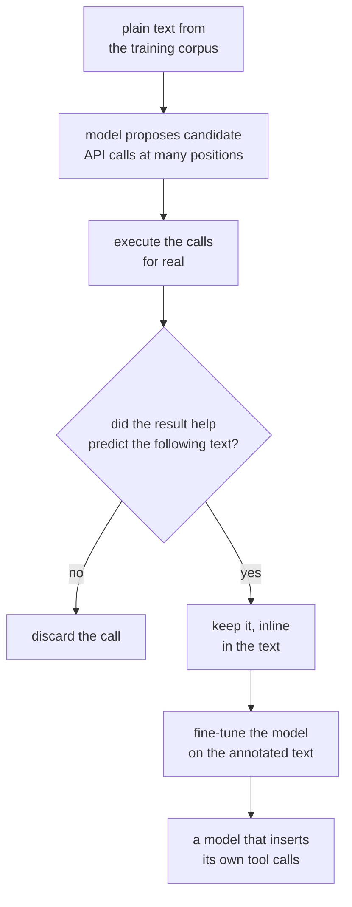

# *Toolformer: Language Models Can Teach Themselves to Use Tools* — the premise, not the method

## One-line answer

This is the paper that made "the model decides when to call a tool" a normal thing to say — and it
is worth reading precisely because **the half you built today is its premise, while its actual
method was abandoned**, which makes it the clearest case in this curriculum of a paper winning an
argument and losing its technique.

---

## The story

A language model in 2022 can write a competent paragraph about compound interest and cannot compute
it.

This is not a small embarrassment, and it is not the kind that goes away with scale. The model has
absorbed an enormous amount of text about arithmetic, so it has learned what arithmetic *looks
like* — the shape of the sentences, the form of the answers, which numbers are plausible. It has
not learned to compute, because computing is not a thing text does. Ask for 17.3% of 4,820 and you
get a number of roughly the right size, confidently.

The same hole appears everywhere. It does not know today's date, because the text it learned from
was written on many different days. It cannot look up a fact that changed after training. It cannot
check anything.

And the frustrating part is that all of these are **solved problems** — a calculator, a calendar, a
search index — solved decades ago, by programs vastly smaller and more reliable than the model.

So the question is not *can we build the tools*. It is: **how does the model know when to reach for
one?** A model that calls a calculator on every sentence is useless. A model that never calls one is
what you already have. The decision has to happen at exactly the right token, in the middle of
generation, and nobody has to be there to press a button.

The paper's answer is startling and, in hindsight, is the part that did not last: **let the model
work it out for itself, from its own training data, with almost no human labelling.**

---

## The idea in plain language

Two ideas are stacked here, and separating them is the whole value of reading this in 2026.

**The premise:** a language model should be able to decide, *while it is generating text*, that it
needs an external tool — then call it, read the result, and carry on with that result in hand. Tools
are not a wrapper around the model; the call happens inside the generation.

**The method:** the way the paper achieves this is **self-supervised**. Very roughly:

1. Take ordinary text and, at many positions, have the model propose API calls that *could* go
   there.
2. Actually execute those calls and get their results.
3. Keep a call only if having its result made the model **better at predicting the text that
   actually followed**. Discard the rest.
4. Fine-tune the model on the surviving, annotated text.

Step 3 is the clever part and deserves a moment. It is a filter with no human in it: the paper does
not need anyone to label "a calculator would help here". Usefulness is measured directly, as *did
this result reduce the model's surprise at what came next*. If yes, the call earned its place.

The result is a model that inserts tool calls into its own output where they help, having been
taught by a process that required only a handful of demonstrations per tool.

> **Jargon check.** *Self-supervised* means the training signal is extracted from the data itself
> rather than from human labels. Here the signal is "did this API result help predict the next
> words" — a question the text can answer on its own.

---

## Why Sutra needs it

You spent today building the premise and **none** of the method, and knowing which is which is the
point of this document.

What you built today is the premise, made concrete:

- [Part 1.2](../parts/01-the-schema/1.2-declaring-a-tool.md) — declaring a tool so the model knows
  it exists.
- [Part 2.1](../parts/02-the-round-trip/2.1-two-channels-not-one.md) — the model emitting a *call*
  rather than prose, on its own channel.
- [Part 2.3](../parts/02-the-round-trip/2.3-the-tool-result-turn.md) — handing the result back so
  generation continues with it.

What you did **not** build is any of the method: no fine-tuning, no self-supervised filtering, no
training at all. Your tools work because the model was *already* trained to use declared tools, and
because you described them well —
[part 1.3](../parts/01-the-schema/1.3-the-description-is-the-prompt.md) is the whole of your
"training".

That distinction matters more than it looks:

- It explains why [part 4.2](../parts/04-the-limits/4.2-the-tool-that-is-never-called.md) is a real
  problem for you and was not one for the paper. Your only lever over *when* a tool gets called is
  its description. The paper's lever was fine-tuning.
- It is the honest reading of [part 4.1](../parts/04-the-limits/4.1-validated-is-not-correct.md): a
  schema checks *shape*, and nothing in your stack checks *whether the call was a good idea*. The
  paper's filter was at least an attempt at that question.
- It sets up **Day 32**, where MCP makes tools discoverable at runtime — tools the model was never
  trained on and nobody described in advance.

---

## The mechanism

The paper's method, as a pipeline. Note that every stage happens **before** the model is deployed —
this is a training procedure, not a runtime one:



Concretely, a sentence in the corpus:

```text
The population of the town has grown to 4,820, which is 17.3% higher than a decade ago.
```

becomes a candidate annotation:

```text
The population of the town has grown to 4,820, which is
[Calculator(4820 / 1.173) -> 4109] 17.3% higher than a decade ago.
```

**Line by line:** the bracketed span is inserted *into the text itself* — the call and its result
live inline, as tokens, which is why fine-tuning on this teaches the model to produce calls in the
same stream as prose. The filter then asks whether having `-> 4109` present made the words after it
easier to predict. If it did, the annotation survives into the training set.

Now compare that with what you built today:

| | Toolformer | Day 4, and production in 2026 |
| --- | --- | --- |
| **When the model learns the tool** | during fine-tuning | at inference, from a declaration in the request |
| **How a tool is described** | a few demonstrations | a JSON Schema plus a description |
| **Where the call appears** | inline in the generated text | a separate structured channel |
| **Who validates it** | nothing — it is text | the runtime, against the schema |
| **Adding a tool** | retrain | add it to the next request |

Read the last row twice. **Toolformer's method cannot add a tool without retraining**, and that
single property is why the industry went the other way — and why MCP, on Day 32, is even
conceivable.

---

## The paper in one demo

Two files. The demo implements the **filter** — step 3, the paper's actual idea — and nothing else.
No fine-tuning, no model: just the question the paper asks of every candidate call.

```text
lab/papers/toolformer/
├── corpus.py   sentences, each with a candidate tool call and what follows
└── run.py      score whether the result helped, and the switch
```

**Line by line:** the paper's contribution that can be honestly demonstrated on a laptop is the
**usefulness filter**, not the fine-tuning — retraining a model is not a demo. So this reduces the
filter to its logic: score how well the following text is predicted with the tool result present
versus absent, and keep the call only if the result helped. A stand-in scorer replaces the language
model, which is stated plainly here rather than dressed up as one. Request budget: **zero**.

```python
"""Sentences with a candidate tool call, and the words that actually followed."""

CANDIDATES = [
    {
        "text": "The town has 4,820 residents, which is",
        "call": "Calculator(4820 / 1.173)",
        "result": "4109",
        "following": "4109 in the year before the last census",
    },
    {
        "text": "The conference is being held in",
        "call": "Calculator(2 + 2)",
        "result": "4",
        "following": "Lisbon this spring, near the river",
    },
    {
        "text": "Their revenue grew from 1.2M to",
        "call": "Calculator(1.2 * 1.45)",
        "result": "1.74",
        "following": "1.74 million over the same period",
    },
]
```

**Line by line:**

- Each entry is one **candidate annotation**: text up to a point, a call that might belong there,
  the result of running it, and the words that genuinely came next.
- `"following"` is the ground truth, and it is the only thing the filter is allowed to consult. This
  is what "self-supervised" means in one field: the label is the text itself.
- The **first and third** entries are calls whose results appear in what follows — `4109`, `1.74`.
  These should survive. Note `"1.74 million"` rather than `"1.74M"`: the scorer below compares whole
  words, so `1.74M` would be a different token from `1.74` and the call would be discarded for a
  reason that has nothing to do with usefulness. That is not a detail of this toy — **tokenisation
  deciding a measurement's outcome** is the same trap [Day 2's subword paper](../../day-02-llm-mechanics/papers/01-subword-units.md)
  describes, arriving here uninvited.
- The **second** is the control: `Calculator(2 + 2)` is a perfectly valid call, executes fine,
  returns `4`, and has nothing to do with a conference in Lisbon. **A valid call is not a useful
  call**, and a filter that cannot reject this one is not a filter. This is the same distinction
  [part 4.1](../parts/04-the-limits/4.1-validated-is-not-correct.md) draws between *validated* and
  *correct*.

```python
"""The Toolformer filter: keep a call only if its result helped predict what came next."""

from corpus import CANDIDATES

FILTERING = True
THRESHOLD = 1


def surprise(following: str, context: str) -> int:
    """Stand-in for a language model's loss: how many words of `following` the context misses.

    A real implementation scores the model's negative log-likelihood of `following`. The paper's
    filter only needs the *comparison* between two contexts, so a word-overlap count reproduces the
    decision it makes without pretending to be a language model.
    """
    known = set(context.lower().split())
    return sum(1 for word in following.lower().split() if word not in known)


def main() -> None:
    print(f"FILTERING = {FILTERING}   threshold = {THRESHOLD}")
    kept = 0
    for item in CANDIDATES:
        without = surprise(item["following"], item["text"])
        with_result = surprise(item["following"], item["text"] + " " + item["result"])
        gain = without - with_result
        keep = gain >= THRESHOLD if FILTERING else True
        kept += keep
        verdict = "KEEP" if keep else "discard"
        print(f"{item['call']:>22}  gain {gain:>2}  ->  {verdict}")
    print(f"\ncalls kept for training: {kept} of {len(CANDIDATES)}")


if __name__ == "__main__":
    main()
```

**Line by line:**

- `FILTERING = True` — **the ablation switch.** `False` keeps every syntactically valid call, which
  is the naive version the paper's whole contribution is aimed at.
- `def surprise(...)` — the stand-in, and the docstring says so **in the code**, not only in the
  prose. A real filter scores the model's loss on `following`; the paper's decision depends only on
  whether that loss *dropped*, so a word-overlap count preserves the comparison. Anything that
  claimed to be a language model here would be the fabrication this curriculum exists to avoid.
- `known = set(context.lower().split())` — words the context already supplies. Lowercased so
  `4,820` and `4820` are not separated by capitalisation, and a `set` because we care about presence
  and not counts.
- `without` versus `with_result` — the two scorings that **are** the filter. The only difference
  between the two contexts is whether the tool's result is present.
- `gain = without - with_result` — how much the result helped, in words no longer missing. Positive
  means the call earned its place.
- `THRESHOLD = 1` — the paper uses a tuned margin; one is the smallest value that means "helped at
  all". Raising it makes the filter stricter and keeps fewer calls, which is the dial the paper
  actually turns.
- `keep = gain >= THRESHOLD if FILTERING else True` — the ablation in one line. Note that with
  `FILTERING = False` the call is still *executed* and still *valid*; nothing errors. It is simply
  kept regardless of whether it helped.

Run it:

```bash
cd lab/papers/toolformer && uv run python run.py
```

**Line by line:** `uv run` for the pinned interpreter, and `cd` first so `run.py` imports `corpus`
as a sibling module.

```text
FILTERING = True   threshold = 1
Calculator(4820 / 1.173)  gain  1  ->  KEEP
     Calculator(2 + 2)  gain  0  ->  discard
Calculator(1.2 * 1.45)  gain  1  ->  KEEP

calls kept for training: 2 of 3
```

Now the ablation — `FILTERING = False`, nothing else changed:

```text
FILTERING = False   threshold = 1
Calculator(4820 / 1.173)  gain  1  ->  KEEP
     Calculator(2 + 2)  gain  0  ->  KEEP
Calculator(1.2 * 1.45)  gain  1  ->  KEEP

calls kept for training: 3 of 3
```

The useless call has a gain of **0** — its result appears nowhere in what followed, so having it
made no difference to predicting the text. Under the filter it is discarded; without the filter it
goes into the training set alongside the good ones.

That is the paper's contribution in one number. Fine-tuning on the unfiltered set teaches the model
that calling a calculator before discussing a conference venue is normal behaviour, because that is
what it was shown. **The filter is the only thing standing between "the model can call tools" and
"the model calls tools constantly and pointlessly"** — and that problem did not go away when the
method did. It is [part 4.2](../parts/04-the-limits/4.2-the-tool-that-is-never-called.md), inverted,
and it is why tool descriptions are written as carefully as they are.

---

## When it breaks

**1 — Every tool must exist at training time.** This is the limitation that ended the method. A
Toolformer model knows the tools it was fine-tuned on, and adding one means another training run.
Today's expectation — declare a tool in a request and the model uses it immediately — is
incompatible with that, and MCP's runtime discovery on **Day 32** is unthinkable under it.

**2 — The filter measures the wrong thing, slightly.** "Did this result help predict the following
text" is a proxy for usefulness, not usefulness. A call can be genuinely helpful and score badly
because the text moved on; a call can score well by coincidence. The paper is upfront that this is a
heuristic, and it is a good one — but it is the ancestor of every eval problem this curriculum meets
from **Day 79**, where "did this help" turns out to be the hard question in the whole field.

**3 — The calls are text, so nothing validates them.** Toolformer's calls live inline in the
generated stream, exactly like [Day 3's text protocol](../../day-03-loop-hand-rolled/parts/03-the-protocol/3.2-parsing-a-reply-you-did-not-write.md).
Every failure in Day 3's parsing part applies. Today's schema channel exists because of this, and
the difference is the whole subject of
[part 2.1](../parts/02-the-round-trip/2.1-two-channels-not-one.md).

**4 — The demo's own edge.** Raise `THRESHOLD` to `2` and re-run:

```text
FILTERING = True   threshold = 2
Calculator(4820 / 1.173)  gain  1  ->  discard
     Calculator(2 + 2)  gain  0  ->  discard
Calculator(1.2 * 1.45)  gain  1  ->  discard

calls kept for training: 0 of 3
```

Every call is now rejected, including the two that were genuinely useful. **The filter's strictness
is a hyperparameter, and there is no principled value for it** — too low and useless calls train the
model to be trigger-happy, too high and it learns that tools are rarely worth reaching for. That
trade has no clean answer here and it has no clean answer in 2026 either; it just moved from a
training threshold into the wording of your tool descriptions.

---

## In production

**What survived: the premise, completely. The name, partly. The method, not at all.**

This is the cleanest example in the curriculum of that split, which is why it is worth a document.

The premise — *a model can decide mid-generation that it needs an external tool, call it, and
continue with the result* — is now so ordinary that it has stopped sounding like a claim. It is what
you built today, it is what every provider's function-calling API does, and it is the assumption
underneath MCP and the entire agent ecosystem.

The method is gone. Nobody self-supervises tool-call annotations into a corpus and fine-tunes per
tool. What replaced it:

- **Instruction-tuned tool use.** Models are trained once, generally, to follow declared tool
  schemas — not to use one specific calculator. The generality is the point: a model trained this
  way can use a tool that did not exist when it was trained.
- **The schema channel.** Calls are structured and validated before execution rather than parsed out
  of prose. That is today's [part 2.2](../parts/02-the-round-trip/2.2-the-call-comes-back-parsed.md).
- **The description as the lever.** Where Toolformer fine-tuned to teach *when* to call, production
  writes a better description — which is a far weaker instrument, and
  [part 1.3](../parts/01-the-schema/1.3-the-description-is-the-prompt.md) is honest about that.

**What changes at scale.** Three things you will actually hit:

- **Tool count degrades selection.** With five tools a model chooses well; with eighty it chooses
  badly, and no amount of description rewriting fixes it. Production systems filter the tool list
  per request — which is a runtime version of Toolformer's filter, moved from training to serving.
- **Nobody measures whether a call was worth making.** Systems log that a tool was called, not
  whether it helped. The paper at least asked. Reconstructing that question is real eval work, and
  it starts on Day 79.
- **A tool that is never called looks identical to a tool that is broken.** Both produce silence,
  and [part 4.2](../parts/04-the-limits/4.2-the-tool-that-is-never-called.md) is where you first
  meet it.

**The review comment a senior engineer leaves:** *"we added a twelfth tool — did anyone check the
other eleven still get called?"* Adding a tool changes selection behaviour for every existing tool,
and nothing in the type system will tell you.

**The interview question:** *"how does the model know when to call a tool?"* The weak answer is "it's
trained to". The strong answer separates the two halves: **it was trained, generally, to follow
declared tool schemas — but *when* to call any particular one is driven almost entirely by that
tool's description and the surrounding context, which is why the description is a prompt and not
documentation.** Then the sentence that shows you have read past the headline: *the paper that made
this normal actually solved it by fine-tuning per tool, and that is precisely the part we
abandoned — because it cannot add a tool without retraining.*

---

## Check yourself

Run the ablation, then set `THRESHOLD` to `0` and to `2` and watch how many calls survive:

```bash
cd lab/papers/toolformer && uv run python run.py
```

Then, without scrolling up, answer out loud:

1. **What did this paper actually claim?** State the premise and the method as two separate
   sentences — and say which one you implemented today.
2. **What do we do differently now?** Name the single property of the paper's method that made it
   unusable in production, and the day of this curriculum that would be impossible under it.
3. `Calculator(2 + 2)` executed correctly and was discarded. Say in one sentence what that
   distinguishes, and name today's part that draws the same line.
